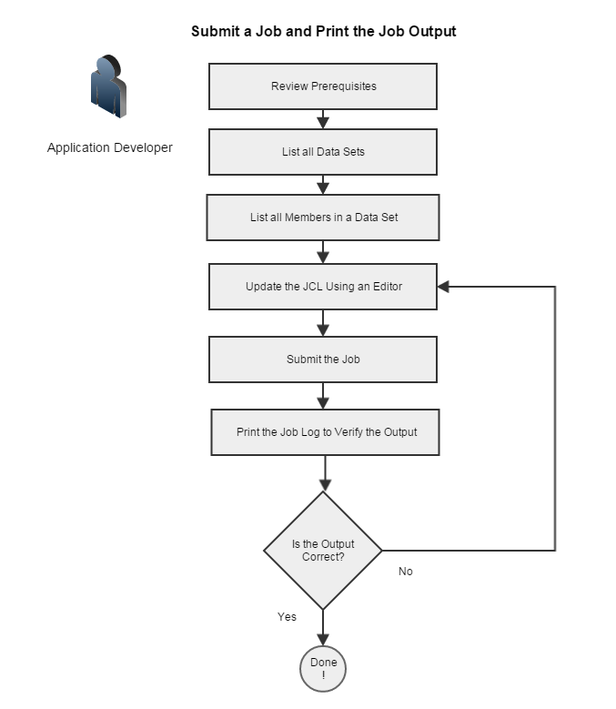
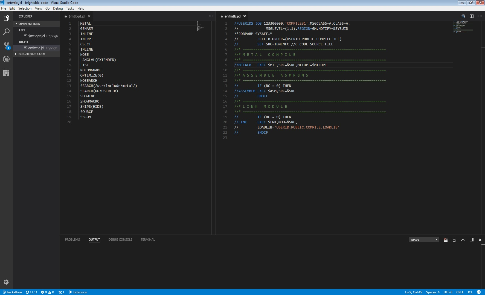
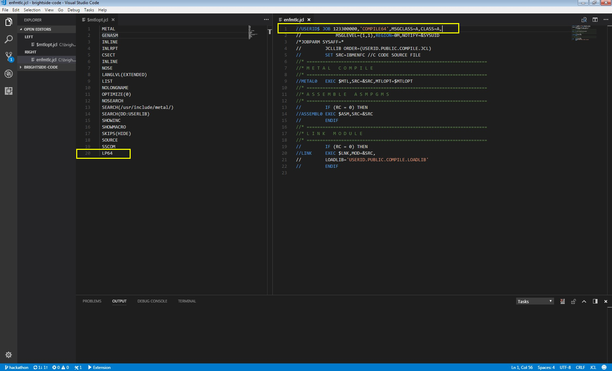

# Brightside CLI scenarios

This section contains sample scenarios that can help you learn how to use Brightside CLI. In each use case, we walk you through the process of issuing Brightside CLI commands so that you can use various Brightside CLI features to accomplish common mainframe tasks.

  - [Submit a Job and Print Job Output](#submit-a-job-and-print-job-output)

## Prerequisites

The following prerequisites apply to all of the scenarios that are contained in this section. When a scenario contains prerequisites that are unique to the scenario, we note them directly in the article.

  - z/OSMF is installed and configured on the IBM z/OS system that you want to access.

  - Brightside CLI is installed on your PC.

  - An editor or integrated development environment (IDE) is installed on your computer (for example, Visual Studio Code). A JCL/COBOL syntax highlighting plug-in is recommended.

  - You have a Brightside CLI profile that can communicate with the z/OS system that you want to access. The commands that you use target the system that is specified in your Brightside CLI profile. You can switch profiles to target different systems.
    
    **Tip:** The syntax examples shown in these scenarios use a small subset of the commands and options that Brightside CLI includes. We encourage you to explore the Brightside CLI help to learn about the available Brightside CLI commands and options.
    
    Issue the `--help` command after any Brightside CLI command to see more available options. For more information about getting help, see [How to Display Brightside CLI Help](cli-howtodisplaybrightsidehelp.md).

# Submitting a job and printing job output
As an application developer, you want to change a compile/build job (for
example, change it to compile in 64-bit mode), submit the job to build
your source, and verify that the job output is
correct.

In this scenario, you will list your data sets, specify data set members to edit, make changes using your preferred editor or integrated development environment (IDE), and submit the job from the modified mainframe data set.

The following diagram illustrates the tasks to perform in this scenario:



**Prerequisites**

To complete this scenario, review the items that are described in [Prerequisities](#prerequisites).

In addition to the prerequisites described in [Prerequisities](#prerequisites), this scenario requires that you have a compile job, compiler options, and source code that resides in a mainframe data set.

**Tip:**  The commands that are used in this scenario target the system
that is specified in your Brightside CLI profile. You can switch
profiles to target different systems.

**Follow these steps:**

1.  Review the prerequisites.

2.  Open a command line window and issue the following command to list all data sets on a system:   
    ```
    bright zos-files list data-sets "USERID.*"
    ```    
    **Tip:** Use an asterisk * to view all data sets under the specified HLQ (High-Level Qualifier).
    
    A list of data sets displays in Brightside CLI.

3.  Issue the following command to list all members in a specified data set:
    
    ```
    bright zos-files list members "USERID.public.compile.jcl"
    ```
    A list of data set members displays after you issue the command. Identify the members that contain JCL and compiler options that you want to edit.

4.  Issue the following commands to launch the members that contain the JCL and the compiler options in your IDE to edit the code.
    
    a.  Issue the following command to edit the compiler
        options:   
    ```
    bright zos-files edit data-set "USERID.public.compile.jcl($mtlopt)" --ec code --kw -e jcl
    ```

     **Tip:** This example shows the command with the following command options: 
        
    - Use the **--ec** option to launch the code in your IDE. For example, **--ec code** launches Visual Studio Code. Refer to your IDE documentation to learn the command line syntax to launch your IDE.
    - The **--kw** option allows Brightside CLI to watch the local files on your personal computer and reflect your changes in the mainframe data set.
    - The **-e** option specifies the file extension that you want to store the data in locally. For example, `.jcl`.
        
        Issue the `--help ` command after any Brightside CLI command to see more available options. For more information about getting help, see [How to Display Brightside CLI Help](cli-howtodisplaybrightsidehelp.md).
          
    b.  Issue the following command to edit the job:   
    ```
    bright zos-files edit data-set "USERID.public.compile.jcl(enfmtlc)" --ec code --kw -e jcl
    ```            
    The files open in your IDE automatically, as illustrated by the following screen:
             
    
  

5.  In your IDE, edit the compiler options file (for example, change to 64-bit) and edit the job file (for example, add a comment to say that the job is a 64-bit
    compile). Save your changes in the IDE. Changes are automatically
    reflected in the mainframe data set when you save the files.
    
    The following screen illustrates changes to the compile options and JCL that enable the job to
    compile source code in 64-bit mode:
    
    
    
6.  Issue the following command to submit the job that contains the modified JCL:  
    
    ```
    bright zos-jobs submit ds "USERID.public.compile.jcl(enfmtlc)" -P
    ```   
    
    **Tip:** This example shows the **-P** command option, which prints all spool output after the job completes.
       
    Review the job status and spool output. If the job compiles your source code successfully, you completed the scenario! If the job did not complete successfully, repeat Steps 4 through 6 to edit and resubmit the job. 
    

    

    