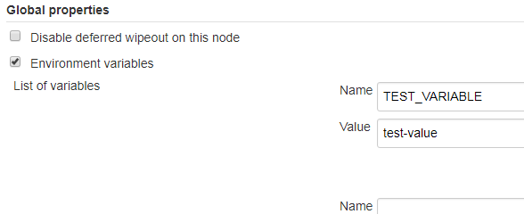

# Completing advanced tasks

 This section describes how to use Zowe CLI using its advanced capabilities.

## Using environment variables

You can define environment variables to execute commands more efficiently. Store a value such as your password in an environment variable, then issue commands without specifying your password every time. The term environment can refer to your operating system, container environment, or automation server such as Jenkins.
You might want to assign a variable in the following scenarios:

* **Store a value that is commonly used.**

    For example, you might want to specify your mainframe username as an environment variable. Now you can issue commands and omit the `--user` option, and Zowe CLI automatically uses the value that you defined in the environment variable.
* **Override a value in existing profiles.**

    For example, you might want to override a value that you previously defined in multiple profiles to avoid recreating each profile. Specify the new value as a variable to override the value in profiles.
* **Secure credentials in an automation server or container**
    You can set environment variables for use in scripts that run in your CI/CD pipeline. For example, can define environment variables in Jenkins so that your password is not seen in plaintext in logs. You can also define sensitive information in the Jenkins secure credential store.

## Formatting environment variables

Transform an option into the proper format for a Zowe CLI environment variable, then define a value to the variable. Transform option names according to the following rules:

* Prefix environment variables with `ZOWE_OPT_`.
* Convert lowercase letters in arguments/options to uppercase letters.
* Convert hyphens in arguments/options to underscores.

**Tip:** Refer to your operating system documentation for information about how to set and get environment variables. The procedure varies between Windows, Mac, and various versions of Linux.

**Examples:**

The following table provides examples of CLI options and the corresponding environment variable to which you can define a value:

| Command Option          | Environment Variable           | Use Case   |
| ----------------------- | ------------------------------ | ------------------------------------------------------------------------------------------------------------------------------------------------------ |
| `--user`                | `ZOWE_OPT_USER`                | Define your mainframe username to an environment variable to avoid specifying it on all commands or profiles.                           |
| `--reject-unauthorized` | `ZOWE_OPT_REJECT_UNAUTHORIZED` | Define a value of `true` to the `--reject-unauthorized` flag when you always require the flag and do not want to specify it on all commands or profiles. |

## Setting environment variables in an automation server

You can use environment variables in an automation server, such as Jenkins, to write more efficient scripts and make use of secure credential storage. Automation tools such as Jenkins automation server usually provide a mechanism for securely storing configuration (for example, credentials). In Jenkins, you can use withCredentials to expose credentials as an environment variable (ENV) or Groovy variable.

You can either set environment variables using the `SET` command within your scripts, or navigate to **Manage Jenkins \> Configure System \> Global Properties** and define an environment variable in the Jenkins GUI. For example:


## Using the prompt feature

Zowe CLI has a command-line "prompt" feature that asks you to provide required option values. The CLI always prompts for host, port, username, and password if you do not supply them in commands or profile configuration.

You can also manually enable the prompt for any option. This is helpful to mask sensitive information on the screen while you type. You can enable a one-time prompt, or choose to always prompt for a particular option.

### Enable prompt

Enable one-time prompting as needed.

1. Begin typing a command.
2. For the option(s) that you want to mask, insert the value `"PROMPT*"`. For example, prompt for your password:

    ```
    zowe zos-files list data-set "MY.DATASET.*" --host my.company.com --port 123 --user myusername123 --password "PROMPT*"
    ```

   The CLI prompts you to enter a value for the `--password` field.
3. Enter a value to complete the command.

    **Tip:** Enter the value carefully. The backspace key does not work in prompt mode.

### Always prompt

You can configure your environment so that the CLI *always* prompts for a particular option, such as `--password`.

To enable the feature, set an environment variable named `ZOWE_OPT_PASSWORD` with the value
`"PROMPT*"`. With the environment variable set, the CLI automatically enables the prompt when you omit a required `--password` value.

**Tip** The procedure for setting environment variables is dependent on your operating systems. Refer to documentation for your OS to learn about setting environment variables.

### Change the keyword for prompt

The default keyword that enables prompting is `"PROMPT*"`. You might want to change the keyword if there is a chance that `"PROMPT*"` could exist as a valid value for the field. For example, if you mask the `data-set` argument and are working with real mainframe data sets that begin with the characters `"PROMPT*"`.

To configure the keyword, choose a new value. Then define the value to to the environment variable on your computer named `ZOWE_PROMPT_PHRASE`.

## Writing scripts

You can combine multiple Zowe CLI commands in bash or shell scripts to automate actions on z/OS. Implement scripts to enhance your development workflow, automate repetitive test or build tasks, and orchestrate mainframe actions from continuous integration/continuous deployment (CI/CD) tools such as Jenkins or TravisCI.

**Note:** The type of script that you write depends on the programming languages that you use and the environment where the script is executed. The following is a general guide to Zowe CLI scripts. Refer to third-party documentation to learn more about scripting in general.

**Follow these steps:**

1. Create a new file on your computer with the extension .sh. For example, `testScript.sh`.

    **Note:** On Mac and Linux, an extension is not required. To make the file executable, issue the command `chmod u+x testScript`.
2. **(Mac and Linux only)** At the top of the file, specify the interpreter that your script requires. For example, type `#!/bin/sh` or `#!/bin/bash`.

    **Note:** The command terminal that you use to execute the script depends on what you specify at the top of your script. Bash scripts require a bash interpreter (bash terminal), while shell scripts can be run from any terminal.
3. Write a script using a series of Zowe CLI commands.

    **Tip:** You can incorporate commands from other command-line tools in the same script. You might choose to "pipe" the output of one command into another command.
4. From the appropriate command terminal, issue a command to execute the script. The command you use to execute script varies by operating system.

The script runs and prints the output in your terminal. You can run scripts manually, or include them in your automated testing and delivery pipelines.

### Sample script library

Refer to the [Zowe CLI Sample Scripts repository](https://github.com/zowe/zowe-cli-sample-scripts) for examples that cover a wide range of scripting languages and use cases.

### <span id="exampleOne">Example: Clean up Temporary Data Sets</span>

The script in this example lists specified data sets, then loops through the list of data sets and deletes each file. You can use a similar script to clean up temporary data sets after use.

**Note:** Run this script from a bash terminal.

```
#!/bin/bash
set -e
# Project cleanup script - deletes temporary project data sets
# Obtain the list of temporary project data sets
dslist=$(zowe files ls ds "my.project.ds*")
# Delete each data set in the list
IFS=$'\n'
for ds in $dslist
do
     echo "Deleting Temporary Project Dataset: $ds"
     zowe files delete ds "$ds" -f
done
```

### <span id="exampleTwo">Example: Submit Jobs and Save Spool Output</span>

The script in this example submits a job, waits for the job to enter output status, and saves the spool files to local files on your computer.

**Note:** Run this script from a bash terminal.

```
#! /bin/env bash
#submit our job
jobid=$(zowe zos-jobs submit data-set "boech02.public.cntl(iefbr14)" --rff jobid --rft string)
echo "Submitted our job, JOB ID is $jobid"
#wait for job to go to output
status="UNKNOWN"
while [[ "$status" != "OUTPUT"]]; do
    echo "Checking
    status of job $jobid" status=$(zowe zos-jobs view job-status-by-jobid "$jobid" --rff status --rft string)
    echo "Current status is $status"
    sleep 5s
done;
echo "Job completed in OUTPUT status. Final result of job: "
zowe zos-jobs view job-status-by-jobid "$jobid"
# get a list of all of the spool files for our job now that it's in output
spool_ids=$(zowe zos-jobs list spool-files-by-jobid "$jobid" --rff id --rft table)
# save each spool ID to a custom file name
while read -r id; do
     zowe zos-jobs view spool-file-by-id "$jobid" "$id" > ./${jobid}_spool_${id}.txt
     echo "Saved spool DD to ./${jobid}_spool_${id}.txt"
done <<< "$spool_ids"
```
