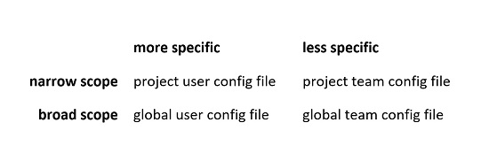

# How Zowe CLI uses configurations

When you run a command, Zowe CLI needs specific information, or *properties*, in order to perform the command action.

There are two common ways that properties and their values can be provided to Zowe CLI. One method is to manually include this information with each command when it is issued, as in the example command below:

```
zowe zos-files list data-set "SYS1.PARMLIB*" --host YourHostName --port 1234 --user YourUserName --password YourPassword
```

Including properties with every command can be tedious, because a lot of information can be required. This can lead to typos and mistakes.

Another way of specifying these properties &mdash; using configuration files &mdash; can make things easier. A configuration file contains profiles with properties that Zowe CLI can use when you run a command.

If configuration files were used in the example above, the user would have needed to issue only the command:

`zowe zos-files list data-set "SYS1.PARMLIB*"`

## Learning the terminology

As of Zowe V2, Zowe CLI relies on the profiles stored in configuration files to obtain connection information.

Both *user* and *team* profiles are stored in configuration files, and these configuration files can either be *project* configuration files or *global* configuration files. It is helpful to understand how these differ.

- A **user configuration file** stores *user profiles* and is used for one person who needs their own unique properties to run commands.

- A **team configuration file** stores *team profiles* and is used by a group of people who need the same properties to run commands.

- A **global configuration file** resides in the `ZOWE_CLI_HOME` directory (YourUserHomeDirectory/.zowe, by default). It contains global *user profiles* and global *team profiles*.

- A **project configuration file** resides in a directory of your choice. It contains project *user profiles* and project *team profiles*.

All configuration files are saved in `.json` format.

## How configuration files and profiles work together

There may be instances where a user has all four types of files in their system, and all four configurations are referred to simultaneously by Zowe CLI for a particular command.

This can mean working with files that have conflicting configurations. One file can specify that a certain profile property has a value of `ABC`, while another file uses `XYZ` as a value.

When the same properties have different values across multiple configuration files, Zowe CLI follows a two-step check to determine which configurations apply:

1. Does the configuration file have a *more narrow* or a *more broad* scope?
2. Is the configuration file *more specific* or *less specific*?

Zowe CLI considers a user configuration file to have a more specific use than a team configuration file, and a project configuration file have a narrower scope than a global configuration file, which has a broader scope.

When checking all possible configuration file types, Zowe CLI categorizes files in the manner below:



This order is applied no matter the directory in which you issue a Zowe CLI command. As a user, it can be easy to trace this logic when configuration files are all either in your ZOWE_CLI_HOME directory (broad scope) or your project directory (narrow scope).

But when there are configuration files across directories (meaning, in a project directory *and* a home directory), tracking how these files work together can seem more complicated.

Read on to go over some examples.

## Using a profile found in multiple configuration files

Consider a user that has all configuration file types, as in the following scenario:

| specificity type | file type | profile | property | value |
|----------- | ----------- | ----------- | ----------- | ----------- |
| narrow scope/more specific | project user config file | One | ABC | red |
| narrow scope/less specific | project team config file | Two | XYZ | yellow |
| broad scope/more specific | global user config file | Three | MNO | green |
| broad scope/less specific | global team config file | Two | XYZ | blue |

In the case above, if Zowe CLI needs the `MNO` property to carry out a command, it refers to the global user configuration file to apply the `green` value because it is the only configuration file that has this particular property. No need to compare the specificity of files here.

On the other hand, if a Zowe CLI command needs the information in the `Two` profile, it can seem like there are two possible values, `yellow` and `blue`. In this case Zowe CLI knows to use `yellow` by following the rules of specificity: The project team file has a narrower scope than the global team file.

Zowe CLI takes the following steps:

1. Finds the `XYZ` property in both `Two` profiles.

2. Ignores the `blue` value for the `XYZ` property because the global configuration file has a broad scope.

3. Uses the `yellow` value for the `XYZ` property because the project configuration file has a narrow scope.

## Using multiple properties found in multiple profiles

Consider a more layered scenario. Again, assume you have all four configuration file types, but the following conditions apply:

- There are multiple profiles across all four configuration file types.
- Some profiles appear in multiple configurations. Other profiles show up in only one file.
- There are multiple properties shared across several profiles.
- Some properties are found in only one profile.

In this scenario, the following profiles, properties, and values exist, displayed in the format **profile:** *property:* value:

| Project User <br/> Configuration File |  Project Team <br/> Configuration File | Global User <br/> Configuration File |  Global Team <br/> Configuration File |
| :----------------------  | :------------------------ | :---------------------- | :----------------------- |
| **abc:** *direction:* north  | **abc:** *direction:* east      | **abc:** *direction:*  south | **abc:** *direction:* west  <br/> **abc:** *numbers*: 123    |
| **def:** *shape:* triangle     | **def:** *shape:* square        | **def:** *shape:* circle     |                                |
|                                |                                 |                              | **ghi:** *texture:* bumpy <br/>|
| **jkl:** *temperature:* cold   |                                 |                              |                                |
|                                | **mno:** *fruit:* banana        |                              |                                |
|                                |                                 | **pqr:** *distance:* near    |                                |

The table below shows how Zowe CLI determines which profiles, properties, and values to use in a command.

| Configuration files in use &nbsp; &nbsp; &nbsp; &nbsp; &nbsp; &nbsp; &nbsp; &nbsp; &nbsp; &nbsp; &nbsp; &nbsp; &nbsp;&nbsp; &nbsp; &nbsp; &nbsp; &nbsp; &nbsp; &nbsp; &nbsp; &nbsp; &nbsp; &nbsp; &nbsp; &nbsp; | Specificity rules | Profiles, properties <br/> and values used &nbsp; &nbsp; &nbsp; &nbsp; &nbsp; &nbsp; &nbsp; &nbsp; &nbsp; &nbsp; &nbsp; &nbsp; &nbsp; &nbsp; &nbsp; &nbsp; &nbsp; &nbsp; |
| :--------- | :------------ |:------------ |
| <ul><li> global user profile </li> <li> global team profile </li></ul> | <ul><li> When the same property exists within the same profile in both config files, the property value from the global user config is used. </li> <li> When the same profile exists in both config files, but a property of that profile exists in only one file, that property is used. </li> <li> If a profile exists in only one config file, that profile is used in its entirety.</li> </ul> | **abc:** *direction:* south <br/> **abc:** *numbers:* 123 <br/> **def:** *shape:* circle <br/> **ghi:** *texture:* bumpy <br/> **pqr:** *distance:* near |
| <ul><li> project team profile </li> <li> global user profile </li> <li> global team profile </li> </ul>| <ul><li> When a profile exists in all three config files, the project team profile is used.<sup>*</sup> </li> <li> If a profile exists in only one config file, that profile is used in its entirety. </li> </ul> | **abc:** *direction:* east <br/> **def:** *shape:* square <br/> **ghi:** *texture:* bumpy <br/> **mno:** *fruit:* banana <br/> **pqr:** *distance:* near |
| <ul><li> project user profile </li> <li> project team profile </li> <li> global user profile </li> <li> global team profile </li> </ul> | <ul><li> When the same profile with the same properties exists in all four config files, the property values from the project user config is used. </li> <li> When the same profile exists in all four config files, the project files override the global files. If a property of the profile exists in only one of the two project configurations, that property is used.<sup>*</sup> </li> <li> If a profile exists in only one config file, that profile is used in its entirety. </li> </ul> |  **abc:** *direction:* north <br/> **def:** *shape:* triangle <br/> **ghi:** *texture:* bumpy <br/> **jkl:** *temperature:* cold <br/> **mno:** *fruit:* banana <br/> **pqr:** *distance:* near |

<b>*</b> If the same profile exists in both a global configuration file and a project configuration file, the project configuration profile completely replaces the global profile. This is true even when the project profile has fewer properties in the same profile found in the global file.<br/>

The preceding rules apply when profiles have the same name. To maintain the same set of properties in two different profiles, give each profile a different name so that Zowe CLI uses a specific profile, if needed.

For more information on how configuration files work together, see [How Zowe CLI team configuration files are merged together](https://github.com/zowe/zowe-cli/blob/master/docs/How_config_files_are_merged.md).
