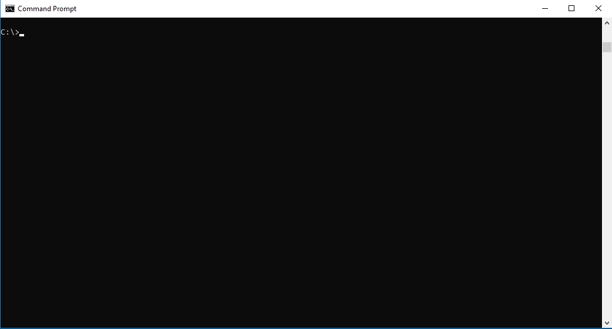

# Using Zowe CLI

This section explains how to connect Zowe CLI to the mainframe with Zowe&trade; CLI, manage profiles, integrate with API Mediation Layer, and more.

Zowe&trade; command-line interface (CLI) can be used interactively from a command window on any computer on which it is installed.

**Tip:** If you want to use the CLI together with a screen reader to provide accessibility, we recommend using the Mac™ Terminal application enabled for Accessibility through [System Preferences > Accessibility](https://support.apple.com/zh-sg/guide/terminal/trml1020/mac). On Windows™, adjust the Properties settings in Command Prompt. For other operating systems, or for alternative terminals, check the specification for the terminal to ensure that it meets accessibility requirements.

## Displaying help

Zowe CLI has a command-line help system that helps you to learn about the commands, actions, and options available in the product.

- [Top-level help](#top-level-help)
- [Group, action, and object help](#group-action-and-object-help)
- [Launch local web help](#launch-local-web-help)

#### Top-level help

To view top-level help, open a command-line and issue the following command:

```
zowe --help
```



Alternatively, issue the following command to display a full list of all available commands:

```
zowe --ac
```

**Tip:** All Zowe CLI commands begin with `zowe.`

#### Group, action, and object help

You can append `--help` to learn about a specific command group, action, or object.

For example, issue the following command to learn more about the `create` action in the `zos-files` group:

```
zowe zos-files create --help
```

#### Launch local web help

You can launch an interactive form of help in your web browser. Web help is custom-generated to include commands for all currently installed plug-ins. Issue the following command:

```
zowe --help-web
```

**Tip:** Append `--help-web` to a specific command or action to launch directly into the appropriate Web help page.

## Viewing web help

Web help is available for download in three formats: interactive web help, downloadable Zip file that contains the HTML web help, and PDF:

- <a href="../web_help/index.html" target="_blank">Browse Online</a>
- <a href="../zowe_web_help.zip">Download (ZIP)</a>
- <a href="../CLIReference_Zowe.pdf">Download (PDF)</a>

## How command precedence works

You can provide your mainframe connection details (username, password, etc...) to Zowe CLI in several ways. Zowe CLI abides by a "command option order of precedence" that provides flexibility when issuing commands and writing scripts.

When you issue a command, the CLI *searches* for your command arguments in the following order:

1. **Options** that you specify on individual commands.
2. **Environment variables** that you define in the computer's operating system. For more information, see [Using environment variables](#using-environment-variables)
3. **Service profiles** that you create (i.e. z/OSMF profile or another MF service).
4. **Base profiles** that you create (can contain credentials for use with multiple services and/or an API ML login token).
5. The **default value**.

If you omit an option from the command line, Zowe CLI searches for an environment variable that contains a value for the option. If no environment variable exists, the CLI checks your service profiles for the value. Base profiles provide values to other service profles so that you do not need to specify the same options (i.e. username and password) in multiple service profiles.

**Note:** If you do not provide a value using one of these methods, the default value is used. If a required option or argument value is not located, you receive a syntax error message that states `Missing Positional Argument` or `Missing Option`.

## Issuing commands

You can provide all connection options directly on each command. For example, issue the following command to list all data sets under the name `ibmuser` on the specified system:

```
zowe zos-files list data-set "ibmuser.*" --host host123 --port port123 --user ibmuser --password pass123
```

## Testing connection to z/OSMF

You can issue a command at any time to receive diagnostic information from the server and confirm that Zowe CLI can communicate with z/OSMF or other mainframe APIs.

**Important!** By default, the server certificate is verified against a list of Certificate Authorities (CAs) trusted by Mozilla. This handshake ensures that the CLI can trust the server. You can append the flag `--ru false` to the following commands to bypass the certificate verification against CAs. If you use the `--ru false` flag, ensure that you understand the potential security risks of bypassing the certificate requirement at your site. For the most secure environment, system administrators configure a server keyring with a server certificate signed by a Certificate Authority (CA). For more information, see [Working with certificates](#working-with-certificates).

#### Without a profile

Verify that your CLI instance can communicate with z/OSMF.

```
zowe zosmf check status --host <host> --port <port> --user <username> --pass <password>
```

#### Default profile

After you [create a profile](#using-profiles), verify that you can use your *default profile* to communicate with z/OSMF:

```
zowe zosmf check status
```

#### Specific profile

After you [create a profile](#using), verify that you can use *a specific profile* to communicate with z/OSMF:

```
zowe zosmf check status --zosmf-profile <profile_name>
```

The commands return a success or failure message and display information about your z/OSMF server, such as the z/OSMF version number. Report failures to your systems administrator and use the information for diagnostic purposes.

## Using profiles

Profiles let you store configuration details for reuse. Create a profile that contains your username, password, and connection details for a mainframe service, then reuse that profile to avoid typing the information on every command. Switch between profiles to quickly target different mainframe subsystems. There are two main types of profiles:

- **Service profiles:** Store connection information for specific mainframe service, such as IBM z/OSMF. Plug-ins can introduce other service profile types, such as the `cics` profile to connect to IBM CICS.

- **Base profiles:** Store connection information for use with one or more services. Your service profiles can pull information from base profiles as needed, so that you can specify your username and password once. The base profile can optionally store tokens to connect to Zowe API Mediation Layer, which improves security by enabling Multi-Factor Authentication (MFA) and Single Sign-on (SSO).

**Tips:**
- You can have multiple service profiles and multiple base profiles.
- Profiles are **not** required. You can choose to specify all connection details for every command.
- Profile values are stored on your computer in plaintext by default, in the `C:\Users\<yourUsername>\.zowe\profiles` folder.

### Displaying help

Use the CLI help to learn about the  options for creating profiles. For example, for a `zosmf` profile, issue the following command:

```
zowe profiles create zosmf-profile --help
```

### Service profiles

Create a profile that targets a specific mainframe service, then use the profile to issue a command. For example, issue the following command (substituting your connection details) to create a `zosmf` service profile named `myprofile123`:

```
zowe profiles create zosmf-profile myprofile123 --host host123 --port port123 --user ibmuser --password pass123
```

Use the profile. For example, issue the following command to list all data sets under the name `ibmuser` on the system that you specified in your profile:

```
zowe zos-files list data-set "ibmuser.*" --zosmf-profile myprofile123
```

**Note:** If you do not specify a profile, your default profile is used.

### Base profiles

Create a base profile, which can store option values and provide them to multiple service profiles. The base profile can also contain tokens to connect to services securely through API ML.

For example, create a base profile that contains your username and password. After the base profile is created, you can omit the `--username` and `--password` options when creating a service profile such as `zosmf`. The service profile will use values provided by the base profile. <!-- I feel like I may be missing the real use case here... -->

When you log in to Zowe API Mediation Layer, a base profile is created for you to store your username, password, and token.

<!--
Insert example syntax here for creating and then using base profile.

Questions:
- When you issue a command, do you have use a base-profile and service-profile option in combination or does your service profile know where to "look" for username, pass, etc in your default base profile?
- Can you create a base profile w/ everything needed for a service profile, such as zosmf, and not actually create any service profiles? Is there a use case for that?
- -->

### Profile best practices

<!-- We already described the most basic way of creating a service profile and base profile, and how to use them independently. Can we add any tips here about using them efficiently together? Or examples?

If you could give someone 2-3 general tips about profile management, what would they be?
 -->

## Integrating with API Mediation Layer

Zowe API ML provides a single point of access to a defined set of mainframe services. The layer provides API management features such as high-availability, consistent security, and a single sign-on (SSO) and multi-factor authentication (MFA) experience.

You can access API ML through Zowe CLI, which initiates a secure session and lets you access to multiple registered services through your base CLI profile. When you issue commands using the base profile, the layer routes requests to an appropriate instance of the API based on system load and available API instances.

### How token management works

When you log in with the CLI, a token is supplied by API ML and stored on your computer. The token initiates a secure session with API ML and is used on future commands.

Tokens expire after a period of time defined by your security administrator. When a token expires, you must log in again to initiate a new session.

**Note:** Zowe CLI also supports other token implementations, such as Java Web Tokens (JWT) and Lightweight Third-Party Authentication (LTPA).

### Logging in

To request a token and initiate a session with API ML, issue the following command:

```
zowe auth login apiml
```

The CLI prompts you to enter your username and password (where password can be a PIN concatenated with a second factor for MFA). A local base profile is created that contains your token, username, and password.

The profile is now your default base profile. When you issue a command, you do not need to specify username and password. For example:

```
zowe zos-files list data-set "ibmuser.*" --host host123 --port port123
```

The request will be routed through API ML to access the appropriate instance of z/OSMF.

<!-- Is that example correct? Does that base profile have a name you have to specify as an option if you have multiple base profiles? -->


**Tips:**
- When your JWT token expires, you must request another token with the `zowe auth login apiml` command.
- If you omit connection details from a service profile, such as `zosmf` profile, the CLI uses the information from your base profile.
- You can choose to specify all connection details on a service profile and connect directly to the service. Routing through API ML is not required.

### Targeting a specific LPAR

If there are multiple instances of API ML at your site and want to target a specific LPAR, or if you want to connect to a specific instance of a service that is registered to API ML, use the `--base-path` option.

The following is an example of a base path for a REST request directly to z/OSMF (not through API ML):

```
https://mymainframehost:port/zosmf/restjobs/jobs
```

The following is an example of a base path for an API ML instance named `api/v1/zosmf1)`):

```
https://myapilayerhost:port/api/v1/zosmf1/zosmf/restjobs/jobs
```

When you create a profile or issue a command, you can specify the base path of the instance that you want to access. The following example illustrates creating a profile that connects to z/OSMF through API ML with the base path `my/api/layer`:

```
zowe profiles create zosmf myprofile123 --host host123 --port port123 --user ibmuser --password pass123 --base-path my/api/layer
```

### Accessing all services through APIML SSO

<!-- you have a base profile, token, etc... and 2 services (zosmf and other) registered to apiml. You log in once and can immediately issue commands to either service using your session. -->

### Accessing services through APIML SSO + one service through APIML but not SSO

<!-- You log in and are connected w/ a session to zosmf + perhaps another service through APIML, but then also issue separate commands to a service registered to apiml-->

### Accessing services through APIML SSO + one service not through APIML

<!-- You log in and are connected w/ a session to zosmf + maybe another service through APIML, but then also issue separate commands directly to a service. -->

### Accessing services not through APIML

<!-- I think this is already covered by our Issuing Commands, and Creating and Using Base Profiles sections. We also previously described that APIML integration is not required. Plan to delete this heading.  -->

## Working with certificates

Certificates authorize communication between a server and client, such as z/OSMF and Zowe CLI. The client CLI must "trust" the server to successfully issue commands. Use one of the following methods to let the CLI communicate with the server:

- [Configure certificates signed by a Certificate Authority (CA)](#configure-certificates-signed-by-a-certificate-authority-ca)
- [Extend trusted certificates on client](#extend-trusted-certificates-on-client)
- [Bypass certificate requirement with CLI flag](#bypass-certificate-requirement)

### Configure certificates signed by a Certificate Authority (CA)

System Administrators can configure the server with a certificate signed by a Certificate Authority (CA) trusted by Mozilla. When a CA trusted by Mozilla exists in the certificate chain, the CLI automatically recognizes the server and authorizes the connection.

**Related information:**

- [Using certificates with z/OS client/server applications](https://www.ibm.com/support/knowledgecenter/en/SSLTBW_2.3.0/com.ibm.zos.v2r3.icha700/icha700_Using_certificates_with_z_OS_client_server_applications.htm) in the IBM Knowledge Center.
- [Configuring the z/OSMF key ring and certificate](https://www.ibm.com/support/knowledgecenter/en/SSLTBW_2.3.0/com.ibm.zos.v2r3.izua300/izuconfig_KeyringAndCertificate.htm) in the IBM Knowledge Center.
- [Certificate management in Zowe API Mediation Layer](../extend/extend-apiml/api-mediation-security.md#certificate-management-in-zowe-api-mediation-layer)
- [Mozilla Included CA Certificate List](https://wiki.mozilla.org/CA/Included_Certificates)

### Extend trusted certificates on client

If your organization uses self-signed certificates in the certificate chain (rather than a CA trusted by Mozilla), you can download the certificate to your computer add it to the local list of trusted certificates. Provide the certificate locally using the `NODE_EXTRA_CERTS` environment variable. Organizations might want to configure all client computers to trust the self-signed certificate.

[This blog post](https://medium.com/@dkelosky/zowe-cli-providing-node-extra-ca-certs-117727d936e5) outlines the process for using environment variables to trust the self-signed certificate.

### Bypass certificate requirement

If you do not have server certificates configured at your site, or you want to trust a known self-signed certificate, you can append the `--reject-unauthorized false` flag to your CLI commands. Setting the `--reject-unauthorized` flag to `false` rejects self-signed certificates and essentially bypasses the certificate requirement.

**Important!** Understand the security implications of accepting self-signed certificates at your site before you use this command.

**Example:**

```
zowe zosmf check status --host <host> --port <port> --user <username> --pass <password> --reject-unauthorized false
```

## Using environment variables

You can define environment variables to execute commands more efficiently. Store a value such as your password in an environment variable, then issue commands without specifying your password every time. The term environment can refer to your operating system, container environment, or automation server such as Jenkins.

You might want to assign a variable in the following scenarios:

  - **Store a value that is commonly used.**

    For example, you might want to specify your mainframe username as an
    environment variable. Now you can issue commands and omit the `--username` option, and Zowe CLI automatically uses the value that you defined in the environment variable.

  - **Override a value in existing profiles.**

    For example, you might want to override a value that you previously defined in multiple profiles to avoid recreating each profile. Specify the new value as a variable to override the value in profiles.

  - **Secure credentials in an automation server or container**

    You can set environment variables for use in scripts that run in your CI/CD pipeline. For example, can define environment variables in Jenkins so that your password is not seen in plaintext in logs. You can also define sensitive information in the Jenkins secure credential store.

#### Formatting environment variables

Transform an option into the proper format for a Zowe CLI environment variable, then define a value to the variable. Transform option names according to the following rules:

  - Prefix environment variables with `ZOWE_OPT_`.
  - Convert lowercase letters in arguments/options to uppercase letters.
  - Convert hyphens in arguments/options to underscores.

**Tip:** Refer to your operating system documentation for information about how to set and get environment variables. The procedure varies between Windows, Mac, and various versions of Linux.

**Examples:**

The following table provides examples of CLI options and the corresponding environment variable to which you can define a value:

| Command Option          | Environment Variable           | Use Case   |
| ----------------------- | ------------------------------ | ------------------------------------------------------------------------------------------------------------------------------------------------------ |
| `--user`                | `ZOWE_OPT_USER`                | Define your mainframe username to an environment variable to avoid specifying it on all commands or profiles.                           |
| `--reject-unauthorized` | `ZOWE_OPT_REJECT_UNAUTHORIZED` | Define a value of `true` to the `--reject-unathorized` flag when you always require the flag and do not want to specify it on all commands or profiles. |

#### Setting environment variables in an automation server

You can use environment variables in an automation server, such as Jenkins, to write more efficient scripts and make use of secure credential storage. Automation tools such as Jenkins automation server usually provide a mechanism for securely storing configuration (for example, credentials). In Jenkins, you can use withCredentials to expose credentials as an environment variable (ENV) or Groovy variable.

You can either set environment variables using the `SET` command within your scripts, or navigate to **Manage Jenkins \> Configure System \> Global Properties** and define an environment variable in the Jenkins GUI. For example:


## Using the prompt feature

Zowe CLI lets you enable a command-line "prompt" feature, which masks values on the screen as you type. You might choose to enable the prompt for sensitive credentials such as mainframe username or password.

You can enable the prompt on-demand, or choose to always prompt for a particular option.

#### Enable prompt

Enable on-demand prompting for arguments and options.

**Follow these steps:**

1. Begin typing a Zowe CLI command.

2. For the option(s) that you want to mask, insert the value `"PROMPT*"`. For example, prompt for your password:

    ```
    zowe zos-files list data-set "MY.DATASET.*" --host my.company.com --port 123 --user myusername123 --password "PROMPT*"
    ```

   The CLI prompts you to enter a value for the `--password` field.

3. Enter a value to complete the command.

    **Tip:** Enter the value carefully. The backspace key does not work in prompt mode.

#### Always prompt

You can configure your environment so that the CLI *always* prompts for a particular option, such as `--password`.

To enable the feature, set an environment variable named `ZOWE_OPT_PASSWORD` with the value
`"PROMPT*"`. With the environment variable set, the CLI automatically enables the prompt when you omit a required `--password` value.

**Tip** The procedure for setting environment variables is dependent on your operating systems. Refer to documentation for your OS to learn about setting environment variables.

#### Change the keyword for prompt

The default keyword that enables prompting in Zowe CLI is `"PROMPT*"`. You might want to change the keyword if there is a chance that `"PROMPT*"` could exist as a valid value for the field. For example, if you mask the `data-set` argument and are working with real mainframe data sets that begin with the characters `"PROMPT*"`.

To configure the keyword, choose a new value. Then define the value to to the environment variable on your computer named `ZOWE_PROMPT_PHRASE`.

## Writing scripts

You can combine multiple Zowe CLI commands in bash or shell scripts to automate actions on z/OS. You can implement scripts to enhance your development workflow, automate repetitive test or build tasks, and orchestrate mainframe actions from continuous integration/continuous deployment (CI/CD) tools such as Jenkins or TravisCI.

- [Example: Clean up Temporary Data Sets](#exampleOne)
- [Example: Submit Jobs and Save Spool Output](#exampleTwo)

**Note:** The type of script that you write depends on the programming languages that you use and the environment where the script is executed. The following procedure is a general guide to Zowe CLI scripts, but you might need to refer to third-party documentation to learn more about scripting in general.

**Follow these steps:**

1. Create a new file on your computer with the extension .sh. For example, `testScript.sh`.

    **Note:** On Linux, an extension is not required. You make the file executable by issuing the command `chmod u+x testScript`.

2. At the top of the file, specify the interpreter that your script requires. For example, type `#!/bin/sh` or `#!/bin/sh`.

    **Note:** The command terminal that you use to execute the script depends on what you specify at the top of your script. Bash scripts require a bash interpreter (bash terminal), while shell scripts can be run from any terminal.

3. Write a script using a series of Zowe CLI commands.

    **Tip:** You can incorporate commands from other command-line tools in the same script. You might choose to "pipe" the output of one command into another command.

4. From the appropriate command terminal, issue a command to execute the script. The command you use to execute script varies by operating system.

The script runs and prints the output in your terminal. You can run scripts manually, or include them in your automated testing and delivery pipelines.

#### <span id="exampleOne">Example: Clean up Temporary Data Sets</span>

The script in this example lists specified data sets, then loops through the list of data sets and deletes each file. You can use a similar script to clean up temporary data sets after use.

**Note:** This script must be run from a bash terminal.

```
#!/bin/bash
set -e
# Project cleanup script - deletes temporary project data sets
# Obtain the list of temporary project data sets
dslist=$(zowe files ls ds "my.project.ds*")
# Delete each data set in the list
IFS=$'\n'
for ds in $dslist
do
     echo "Deleting Temporary Project Dataset: $ds"
     zowe files delete ds "$ds" -f
done
```

#### <span id="exampleTwo">Example: Submit Jobs and Save Spool Output</span>

The script in this example submits a job, waits for the job to enter output status, and saves the spool files to local files on your computer.

**Note:** This script must be run from a bash terminal.

```
#! /bin/env bash
#submit our job
jobid=$(zowe zos-jobs submit data-set "boech02.public.cntl(iefbr14)" --rff jobid --rft string)
echo "Submitted our job, JOB ID is $jobid"
#wait for job to go to output
status="UNKNOWN"
while [[ "$status" != "OUTPUT"]]; do
    echo "Checking
    status of job $jobid" status=$(zowe zos-jobs view job-status-by-jobid "$jobid" --rff status --rft string)
    echo "Current status is $status"
    sleep 5s
done;
echo "Job completed in OUTPUT status. Final result of job: "
zowe zos-jobs view job-status-by-jobid "$jobid"
# get a list of all of the spool files for our job now that it's in output
spool_ids=$(zowe zos-jobs list spool-files-by-jobid "$jobid" --rff id --rft table)
# save each spool ID to a custom file name
while read -r id; do
     zowe zos-jobs view spool-file-by-id "$jobid" "$id" > ./${jobid}_spool_${id}.txt
     echo "Saved spool DD to ./${jobid}_spool_${id}.txt"
done <<< "$spool_ids"
```


## Understanding core command groups

Zowe CLI contains command groups that focus on specific business processes. For example, the `zos-files` command group lets you interact with mainframe data sets. This article provides a brief synopsis of the tasks that you can perform with each group. For more information, see [Display Zowe CLI Help](#displaying-help).

The commands available in the product are organized in a hierarchical structure. Command groups (for example, `zos-files`) contain actions (for example, `create`) that let you perform actions on specific objects (for example, a specific type of data set). For each action that you perform on an object, you can specify options that affect the operation of the command.

Zowe CLI contains the following command groups:

#### plugins

The plugins command group lets you install and manage third-party
plug-ins for the product. Plug-ins extend the functionality of Zowe CLI in the form of new commands.

With the plugins command group, you can perform the following tasks:

- Install or uninstall third-party plug-ins.
- Display a list of installed plug-ins.
- Validate that a plug-in integrates with the base product
properly.

**Note:** For more information about `plugins` syntax, actions, and options, open Zowe CLI and issue the following
command:

```
zowe plugins -h
```

#### profiles
The profiles command group lets you create and manage profiles for use with other Zowe CLI command groups. Profiles allow you to issue commands to different mainframe systems quickly, without specifying your connection details with every command.

With the profiles command group, you can perform the following tasks:

- Create, update, and delete profiles for any Zowe CLI command group that supports profiles.
- Set the default profile to be used within any command group.
- List profile names and details for any command group, including the default active profile.

**Note:** For more information about `profiles` syntax, actions, and options, open Zowe CLI, and issue the following command:
```
zowe profiles -h
```

#### provisioning

The provisioning command group lets you perform IBM z/OSMF provisioning tasks with templates and provisioned instances from Zowe CLI.

With the provisioning command group, you can perform the following
tasks:

- Provision cloud instances using z/OSMF Software Services templates.
- List information about the available z/OSMF Service Catalog published templates and the templates that you used to publish cloud instances.
- List summary information about the templates that you used to provision cloud instances. You can filter the information by
application (for example, DB2 and CICS) and by the external name of the provisioned instances.
- List detail information about the variables used (and their corresponding values) on named, published cloud instances.

**Note:** For more information about provisioning syntax, actions, and options, open Zowe CLI and issue the following command:

```
zowe provisioning -h
```

#### zos-console

The zos-console command group lets you issue commands to the z/OS console by establishing an extended Multiple Console Support (MCS) console.

With the zos-console command group, you can perform the following
tasks:
**Important\!** Before you issue z/OS console commands with Zowe CLI, security administrators should ensure that
they provide access to commands that are appropriate for your
organization.
- Issue commands to the z/OS console.
- Collect command responses and continue to collect solicited command responses on-demand.

**Note:** For more information about `zos-console` syntax, actions, and options, open Zowe CLI and issue the following command:
```
zowe zos-console -h
```

#### zos-files

The zos-files command group lets you interact with data sets on z/OS systems.

With the zos-files command group, you can perform the following tasks:

- Create partitioned data sets (PDS) with members, physical sequential data sets (PS), and other types of data sets from templates. You can specify options to customize the data sets you create.
- Download mainframe data sets and edit them locally in your preferred Integrated Development Environment (IDE).
- Upload local files to mainframe data sets.
- List available mainframe data sets.
- Interact with VSAM data sets directly, or invoke Access Methods Services (IDCAMS) to work with VSAM data sets.

**Note:** For more information about `zos-files` syntax, actions, and options, open Zowe CLI and issue the following command:
```
zowe zos-files -h
```

#### zos-jobs

The zos-jobs command group lets you submit jobs and interact with jobs on z/OS systems.

With the zos-jobs command group, you can perform the following tasks:

- Submit jobs from JCL that resides on the mainframe or a local file.
- List jobs and spool files for a job.
- View the status of a job or view a spool file from a job.

**Note:** For more information about `zos-jobs` syntax, actions, and options, open Zowe CLI and issue the following command:

```
zowe zos-jobs -h
```

#### zos-uss

The zos-uss command group lets you issue Unix System Services shell commands by establishing an SSH connection to an SSH server.

With the zos-uss command group, you can perform the following task:
**Important\!** Before you issue z/OS UNIX System Services commands with Zowe CLI, security administrators must provide access for your user ID to login via SSH.
- Issue z/OS UNIX System Services shell commands over an SSH connection and stream back the response.

**Note:** For more information about `zos-uss` syntax, actions, and options, open Zowe CLI and issue the following command:
```
zowe zos-uss -h
```

#### zos-workflows

The zos-workflows command group lets you create and manage z/OSMF workflows on a z/OS system.

With the zos-workflows command group, you can perform the following tasks:

- Create or register a z/OSMF workflow based on the properties on a z/OS system
- Start a z/OSMF workflow on a z/OS system.
- Delete or remove a z/OSMF workflow from a z/OS system.
- List the z/OSMF workflows for a system or sysplex.

**Note:** For more information about `zos-workflows` syntax, actions, and options, open Zowe CLI and issue the following command:

```
zowe zos-workflows -h
```

#### zos-tso

The zos-tso command group lets you issue TSO commands and interact with TSO address spaces on z/OS systems.

With the zos-tso command group, you can perform the following tasks:

- Excecute REXX scripts
- Create a TSO address space and issue TSO commands to the address space.
- Review TSO command response data in Zowe CLI.

**Note:** For more information about `zos-tso` syntax, actions, and options, open Zowe CLI and issue the following
command:
```
zowe zos-tso -h
```

#### zosmf

The zosmf command group lets you work with Zowe CLI profiles and get general information about z/OSMF.

With the zosmf command group, you can perform the following tasks:

- Create and manage your Zowe CLI `zosmf` profiles. Profiles let you store configuration information for use on multiple commands. You can create a profile that contains your username, password, and connection details for a particular mainframe system, then reuse that profile to avoid typing it again on every command. You can switch between profiles to quickly target different mainframe subsystems. For more information, see [Using profiles](#using-profiles).
- Verify that your profiles are set up correctly to communicate with z/OSMF on your system. For more information, see [Test Connection to z/OSMF](#testing-connection-to-z-osmf).
- Get information about the current z/OSMF version, host, port, and plug-ins installed on your system.

**Note:** For more information about `zosmf` syntax, actions, and options, open Zowe CLI and issue the following command:

```
zowe zosmf -h
```
