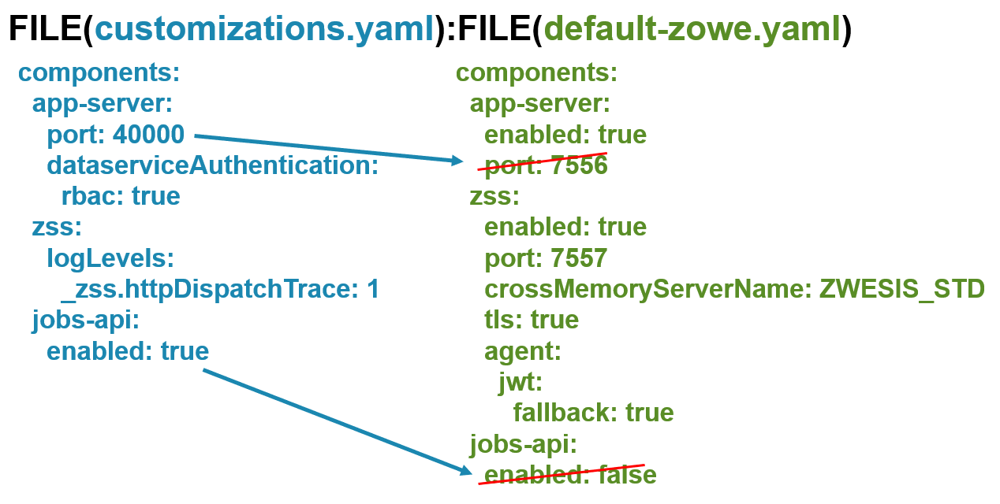
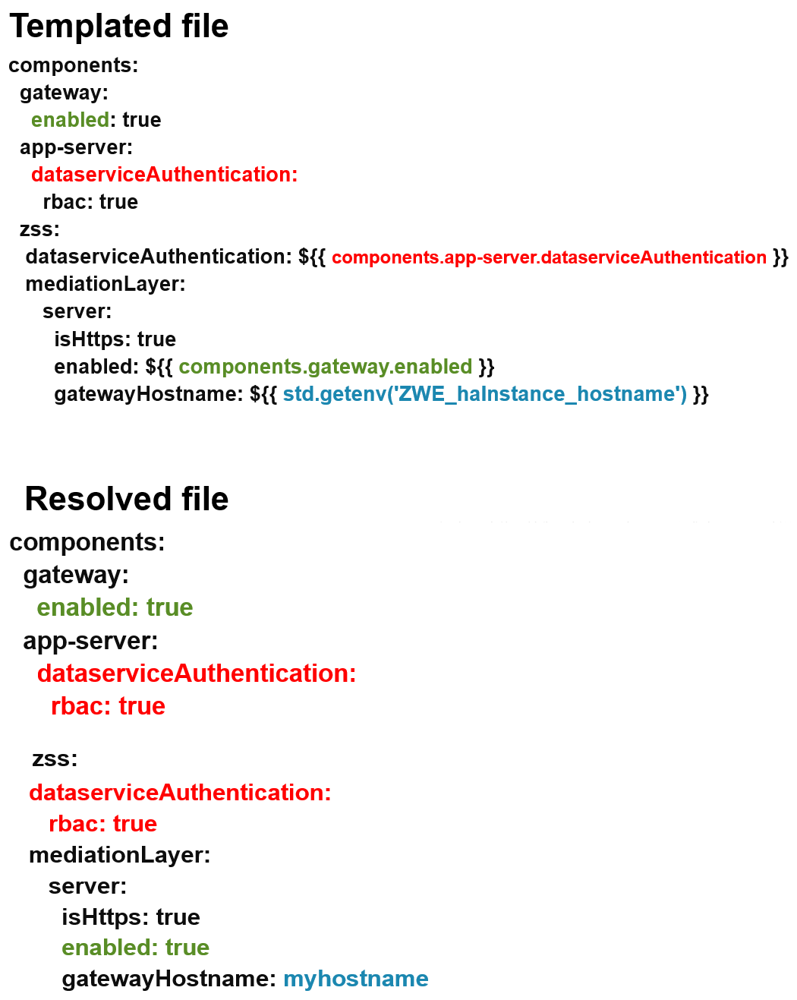

# Zowe Configuration Manager

When you install the Zowe&trade; server components on z/OS, a utility called `configmgr` or "Configuration Manager" is bundled within. It can be used directly in a few ways, or leveraged by the `zwe` command to empower it with several abilities and even performance enhancements.

The purpose of Configuration Manager is to deliver unified, validated configuration data to programs without requiring the programs to know where the configuration is stored or prove that the configuration is valid. This reduces the burden on each Zowe component to support different data storage types such as both datasets AND files and also ensures that all Zowe components have sufficient configuration validation to avoid silent or hard-to-troubleshoot errors.

## Validation error reporting

Configuration Manager will not let Zowe servers start unless the configuration passes validation when checking it against the Zowe configuration schema.
This gives a degree of assurance that the servers will not encounter issues due to typographical errors or missing required fields. It also avoids silent errors where a field might be an integer rather than a string.

When a validation error occurs, the command you ran will end with output that shows what and where the error was. 

### Example

Consider the following Zowe configuration section about certificates:

```
zowe:
  runtimeDirectory: /my/zowe/runtime
  certificates:
    type: PCKS12
    file: /global/zowe/keystore/localhost/localhost.keystore.p12
    alias: localhost
```

In the example, the certificate type `PCKS12` does not exist. It is a typo. Without schema validation, the servers might start and then crash due to the typo.

With the schema file, you can see that there are listed choices for certificate types:

```
    "certificate": {
      "type": "object",
      "additionalProperties": false,
      "required": ["keystore", "truststore", "pem"],
      "properties": {
        "keystore": {
          "type": "object",
          "additionalProperties": false,
          "description": "Certificate keystore.",
          "required": ["type", "file", "alias"],
          "properties": {
            "type": {
              "type": "string",
              "description": "Keystore type.",
              "enum": ["PKCS12", "JCEKS", "JCECCAKS", "JCERACFKS", "JCECCARACFKS", "JCEHYBRIDRACFKS"]
            },
```

The type can only be one from the `enum` list. This allows you to not only detect this error but also see the options available.

When `zwe` runs and fails schema validation due to the "PCKS12" typo, it will print out the following message:

```
Error: Validation of FILE(/home/user/my-zowe.yaml)
against schema https://zowe.org/schemas/v2/server-base found invalid JSON Schema data
Validity Exception(s) with object at
  Validity Exception(s) with object at /zowe
    Validity Exception(s) with object at /zowe/certificate
      Validity Exception(s) with object at /zowe/certificate/keystore
        no matching enum value at /zowe/certificate/keystore/type
```

This output shows that `type` has an issue. You can read the `enum` to see the choices before restarting Zowe.

## JSON-Schema validation

Configuration Manager uses [JSON Schema](https://json-schema.org/) to validate a configuration. As a result, Zowe itself and all components and extensions must have schema files for Configuration Manager to perform validation. Developers should read [how to add schemas to components](../extend/server-schemas) as it is required in v2. 

Zowe now publishes these schema files so that you can see all the configuration properties that are possible in Zowe, see how they have changed between versions, and see what values are valid for them. Below is a list of some of these schemas:

| Component | Name | Purpose | Github Link |
|-----------|------|---------|-------------|
| Base | server-base | Validates zowe.yaml except `components` section | [link](https://github.com/zowe/zowe-install-packaging/blob/v3.x/staging/schemas/zowe-yaml-schema.json) |
| Base | server-common | Common structures reusable by other schemas | [link](https://github.com/zowe/zowe-install-packaging/blob/v3.x/staging/schemas/server-common.json) |
| Base | server-component-manifest | Validates each components' manifest.yaml | [link](https://github.com/zowe/zowe-install-packaging/blob/v3.x/staging/schemas/manifest-schema.json) |
| Base | trivial-component-schema | For copying as a starting point for developers | [link](https://github.com/zowe/zowe-install-packaging/blob/v3.x/staging/schemas/trivial-component-schema.json) |
| app-server | appfw-plugin-definition | Validates any components' pluginDefinition.json for `zwe components install` | [link](https://github.com/zowe/zlux-app-server/blob/v3.x/staging/schemas/plugindefinition-schema.json) |
| app-server | component | Validates `components.app-server` | [link](https://github.com/zowe/zlux-app-server/blob/v3.x/staging/schemas/app-server-config.json) |
| discovery | component | Validates `components.discovery` | [link](https://github.com/zowe/api-layer/blob/v3.x.x/schemas/discovery-schema.json) |
| gateway | component | Validates `components.gateway` | [link](https://github.com/zowe/api-layer/blob/v3.x.x/schemas/gateway-schema.json) |
| zss | component | Validates `components.zss` | [link](https://github.com/zowe/zss/blob/v3.x/staging/schemas/zowe-schema.json) |
| explorer-ip | component | Trivially validates `components.explorer-ip` | [link](https://github.com/zowe/explorer-ip/blob/v3.x/master/schemas/trivial-schema.json) |

From the GitHub links above, if you want to see changes between versions, you can compare by the GitHub tags.

## Splitting configuration into multiple storage types

When `zwe` is using Configuration Manager, the `CONFIG=` parameter in the z/OS ZWESLSTC JCL and the `--config` parameter in any `zwe` command that supports `--configmgr` can take a list of YAML locations as an alternative to the backward-compatible single YAML file used in prior Zowe versions.


When using a single Unix file, the syntax is just the path to the file, such as `CONFIG=/my/zowe.yaml`. However, when using multiple storage types, you must use the syntax `FILE(file1):PARMLIB(DSN(MEMBER)):...` where each storage types is surrounded with `FILE()` or `PARMLIB()` and storage types are separated by the colon `:` character. An example of using multiple configuration storage types would be as follows:  

```
CONFIG=FILE(/home/me/zowe-customizations.yaml):FILE(/global/zowe/example-zowe.yaml):PARMLIB(MYORG.ZOWE.PARMLIB(YAML))
```

**Note:** All `PARMLIB()` entries must have the same member name:
```
CONFIG=PARMLIB(MYORG.ZOWE.PARM1(YAML)):PARMLIB(MYORG.ZOWE.PARM2(YAML))
```
**Note:** Characters `=`, `:`, `(` and `)` are considered as reserved. It is highly recommended to avoid using of these characters in the name of zowe.yaml file.

Each storage type in the list you provide must adhere to the same Zowe configuration schema, but the contents can be any subset you want per storage types. Zowe will merge together the contents of all the storage types into one unified configuration, so the collection of storage types must result in a configuration which is valid against the Zowe schema.

Schema validation occurs upon the merged result, not the individual storage type.
There are a few reasons you may want to split your Zowe configuration into multiple storage types, such as:

- Having a Zowe configuration file that is very small and containing only what is not the default configuration of Zowe, and then running Zowe with 2 configuration files: Your customizations, and the Zowe default such as `CONFIG=FILE(/home/me/zowe-customizations.yaml):FILE(/global/zowe/example-zowe.yaml)`
- Splitting the Zowe configuration among administrators with certain responsibilities. You could have a file about the z/OSMF configuration, a file about the Java configuration, and so on. An example of this could look like `CONFIG=FILE(/home/me/zowe-customizations.yaml):FILE(/global/org/zosmf-zowe.yaml):FILE(/global/org/java-zowe.yaml):FILE(/global/zowe/example-zowe.yaml)`
   

**Note:** When specifying many storage types, you may reach the line length limit in your STC JCL. The default JCL contains `_CEE_ENVFILE_CONTINUATION=\` to allow you to continue the `CONFIG` parameter to multiple lines. An example of this is as follows:

```
CONFIG=FILE(/home/me/zowe-customizations.yaml)\
:FILE(/global/org/zosmf-zowe.yaml)\
:FILE(/global/org/java-zowe.yaml)\
:FILE(/global/zowe/example-zowe.yaml)
```

When you use multiple storage types, Zowe constructs the unified configuration by having the storage types listed on the left override the values of storage types to their right in the list. This means the left-most storage type's values take priority, and the right-most storage type should be treated as a set of defaults. Here is an example of splitting configuration into multiple files:



## Parmlib support

Zowe YAML content can be stored in PARMLIB as well. The structure is the same as in the unix files, so be sure to have sufficient record length to fit the YAML content within the member. The syntax is `PARMLIB(datasetname(member))`, and although you can have multiple `PARMLIB` entries, each must have the same member name.
In the previous section, there was an example of using multiple files to split configuration into parts. This ability can be done with PARMLIB, FILE, or any mix of the two. An example of using PARMLIB with Zowe configuration may look like this in your STC JCL:

```
CONFIG=PARMLIB(LPAR.PARMLIB(ZWECFG))\
:PARMLIB(SYSPLEX.PARMLIB(ZWECFG))\
:FILE(/global/zowe/example-zowe.yaml)
```

## Configuration templates

Each Zowe configuration provided to Zowe when using Configuration Manager can contain values which are templates. These templates are not the literal values of a parameter, but will be substituted for a real value by Configuration Manager. This allows you to simplify complex or tedious configuration such as:
  
- Replacing occurrences of the same path in the configuration with templates that reference that path. Instead of needing to update every occurrence of a path when it changes, you would only need to update it once.
- Having a value that is linked to another, such as that you may only want the gateway component to be enabled when the discovery component is enabled.
- Having a value that is derived from multiple other values, such as a URL that has many parts.
- Having a value that is a set of multiple conditions, having many fallback behaviors so that your configuration is valid for many environments.

Templates are resolved after merging files, but before schema validation occurs, so you can split up your configuration into multiple files and template them however you'd like if the merged, resolved result is valid against the Zowe configuration schema.

To make a template, you use the syntax `${{ assignment }}` in which there must be a space after `${{` and before `}}`. The _assignment_ can be a ECMAScript 2020 statement, such as a JSON path or a conditional.
Here are some examples of templates that you can use to simplify your configuration:



### Template functions

## Configuration Manager Unix executable

`configmgr` is a file located within `<zowe.runtimeDirectory>/bin/utils` in the Zowe server component runtime for z/OS. If you run it with no arguments, it prints a help command that details what you can do with it. `configmgr` commands focus on providing input files and schemas, and then providing output such as validation success or printing the configuration.

The `configmgr` executable needs the following as input:

- A list of configuration locations. Each location can be a different type such as a Unix file or parmlib from a dataset, but each must be YAML format. Every configuration object in the list must only contain data from the same schema because the list will be merged together into a single configuration object during processing. 
- A list of json-schema Unix files separated by a colon `:`, with the top-level schema being the left-most in the list. The unified configuration will be validated against this top-level schema and any references in the other schema files in the list.
   
The `configmgr` executable can do the following with the input:

- Report whether the configuration is valid against the schema. If invalid, a reason will be printed to help pinpoint issues.
- Validate and then output a list of environment variables in the syntax used by Zowe components that use environment variables to consume Zowe configuration.
- Validate and then output a specific property of the configuration when given a JSON path to the property desired.
   
The `configmgr` binary does not need to be used for Zowe configuration and Zowe schemas alone. It can validate any YAML against any json-schema. However, its environment variable output list is in the Zowe format.


