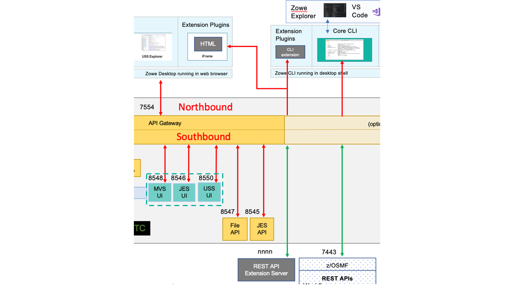

# Configuring Zowe certificates 

Zowe uses a certificate to encrypt data for communication across secure sockets. An instance of Zowe references a USS directory referred to as a KEYSTORE_DIRECTORY which contains information about where the certificate is located.

Learn more about the key concepts of Zowe certificates in the following sections.
 
## Northbound Certificate

The Zowe certificate is used by the API Mediation Layer on its northbound edge when identifying itself and encrypting `https://` traffic to web browsers or REST client applications.  If the Zowe Command Line Interface (CLI) has been configured to use the Zowe API Mediation Layer then the CLI is a client of the Zowe certificate. For more information, see [Using the Zowe Command Line Interface, Integrating with the API Mediation Layer](./cli-usingcli.md#integrating-with-api-mediation-layer).

## Southbound Certificate

As well as being a server, Zowe itself is a client to services on the southbound edge of its API Mediation Layer that it communicates to over secure sockets.  These southbound services use certificates to encrypt their data, and Zowe uses a trust store to store its relationship to these certificates.  The southbound services that are started by Zowe itself and run as address spaces under its `ZWESVSTC` started task   (such as the API discovery service, the explorer JES REST API server) re-use the same Zowe certificate used by the API Mediation Layer on its northbound client edge.  

## Trust store

In addition to Zowe using the intra-address space of certificates to encrypt messages between its servers, Zowe uses external services on z/OS (such as z/OSMF or Zowe conformant extensions that have registered themselves with the API Mediation Layer). These services present their own certificates to the API Mediation Layer. In this scenario, the trust store is used to capture the relationship between Zowe's southbound edge and these external certificates.  

To disable the trust store validation of southbound certificates, you can set the value of `VERIFY_CERTIFICATES=true` to `false` in the `zowe-setup-certificates.env` file in the `KEYSTORE_DIRECTORY`.  This setting is recommended if the certificate presented to the API Mediation Layer is self-signed such as from an unknown certificate authority.  For example, the z/OSMF certificate may be self-signed in which case the Zowe API Mediation Layer cannot recognize the signing authority.  

## Certificates in the Zowe architecture

The [Zowe architecture diagram](../getting-started/zowe-architecture.md) shows the Zowe API Mediation Layer positioned on the client-server boundary between applications such as web browsers or the Zowe CLI accessing z/OS services. The following diagram is a section of the architecture annotated to describe the role of certificates and trust stores.  

 

The arrows shown in red represent the communication over a TCP/IP connection that is encrypted with the Zowe certificate.  
- On the northbound edge of the API Gateway, the certificate is used between client applications such as web browsers, Zowe CLI, or any other application attempting to access Zowe REST APIs.  
- On the southbound edge of the API Gateway are a number of Zowe micro-services providing HTML GUIs for the Zowe desktop or REST APIs for the API Catalog.  These micro-services also use the Zowe certificate for data encryption.

The arrows shown in green represent external certificates for servers that are not managed by Zowe, such as z/OSMF itself or any Zowe conformant REST API or App Framework servers that are registered with the API Mediation Layer.  For the API Mediation Layer to be able to accept these certificates, they either need to be signed by a recognized certificate authority, or the API Mediation Layer needs to be configured to accept unverified certificates.  

**Note:** Even if the API Mediation Layer is configured to accept certificates signed by unverified CAs on its southbound edge, client applications on the northbound edge of the API Gateway are presented with the Zowe certificate.  

## Keystore versus key ring

Zowe supports certificates that are stored in a USS directory **Java KeyStore** format.  

Beginning with release 1.15, Zowe makes it possible to work with certificates held in a **z/OS Keyring**.  If you have problems using keyrings, we recommend you create an issue in the [zowe-install-packaging repo](https://github.com/zowe/zowe-install-packaging/issues).

<!--
Zowe supports certificates that are stored either in a USS directory **Java KeyStore** format or else held in a **z/OS Keyring**.  z/OS keystore are the preferred choice for storing certificates where system programmers are already familiar with their operation and usage.  The user ID setting up a keystore and connecting it with certificates requires elevated permissions, and in scenarios where you need to create a Zowe sandbox environment or for testing purposes and your TSO user ID doesn't have authority to manipulate key rings, USS keystores are a good alternative.  
-->

<!--

If you are using a USS keystore, then the script `zowe-setup-certificates.env` is the only configuration step required.  This is described in detail in [Configuring Zowe certificates in a USS KeyStore](./configure-certificates-keystore.md).

If you are using a key ring, the sample JCL member `ZWEKRING` provided in the PDS library `SZWESAMP` contains the security commands to create a key ring and manage its associated certificates. This is described in [Configuring Zowe certificates in a key ring](./configure-certificates-keyring.md).  

For both scenarios, where the certificate is held in a USS Java Keystore or a z/OS key ring, the USS `KEYSTORE_DIRECTORY` is still required which is created with the script `zowe-setup-certificates.sh`.  

-->

## Keystore directory creation

The `KEYSTORE_DIRECTORY` is created by running the script `<RUNTIME_DIR>/bin/zowe-setup-certificates.sh`.  This script has a number of input parameters that are specified in a configuration file whose location is passed as an argument to the `-p` parameter.  

The configuration file `<RUNTIME_DIR>/bin/zowe-setup-certificates.env` is provided for setting up a Keystore directory that contains the Zowe certificate in JavaKeystore format.  The configuration file `<RUNTIME_DIR>/bin/zowe-setup-certificates-keyring.env` is provided for setting up a Keystore directory that references the Zowe certificate held in a z/OS keyring.  

The `.env` configuration file requires customization based on security rules and practices for the z/OS environment.  Once the script is successfully executed and the `KEYSTORE_DIRECTORY` is created successfully, it is referenced by a Zowe launch `instance.env` file. A `KEYSTORE_DIRECTORY` can be used by more than one instance of Zowe. For more information, see [Creating and configuring the Zowe instance directory](../user-guide/configure-instance-directory.md#keystore-configuration). 

The Zowe launch diagram shows the relationship between a Zowe instance directory, a Zowe runtime directory, the Zowe keystore directory, and (if used to store the Zowe certificate) the z/OS keyring.  

 

You create a `KEYSTORE_DIRECTORY` in USS by using the script `zowe-setup-certificates.sh` (1) with a `-p` argument that specifies a `.env` configuration file.  
- If the `-p` argument file `zowe-setup-certificates.env` (2) is used, the `KEYSTORE_DIRECTORY` will contain the certificate, the certificate authority, the trust store, and the JWT Secret.  
- If the `-p` argument file `zowe-setup-keyring-certificates.env` (3) is used, the `KEYSTORE_DIRECTORY` contains no certificates and is a pass-through to configure a Zowe instance to use a z/OS keyring.

The JCL member `ZWEKRING` (4) is used to create a z/OS Keyring to hold the Zowe certificate and its signing certificate authority.  

At launch time, a Zowe instance is started using the script `<INSTANCE_DIR>/bin/zowe-start.sh` which takes configuration arguments from `<INSTANCE_DIR>/instance.env`.  The argument (5)  `KEYSTORE_DIRECTORY=<KEYSTORE_DIRECTORY>` specifies the path to the keystore directory that Zowe will use.  

For more information on the Zowe launch topology, see [Topology of the Zowe z/OS launch process](./installandconfig.md#topology-of-the-zowe-z-os-launch-process).
