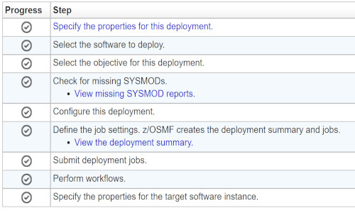

# Configuring Zowe with z/OSMF Workflows

After you install Zowe, you can register and execute the z/OSMF workflows in the web interface to perform a range of
Zowe configuration tasks. z/OSMF helps to simplify the Zowe configuration tasks and does not require the level of
expertise that is needed to perform manual Zowe configuration. This configuration method also runs the `zwe init`
command to initialize Zowe z/OS runtime.

:::info Required role: system programmer
:::

Ensure that you meet the following requirements before you start your Zowe configuration:

- Install and configure z/OSMF
- Install Zowe with an SMP/E build, PSWI, or a convenience build

You can complete the following tasks with the z/OSMF workflow:

- Configure the Zowe instance directory
- Enable the API ML Gateway
- Enable the metrics service
- Enable the API catalog
- Enable automatic discovery
- Enable a caching service
- Enable an application server
- Enable the ZSS component
- Enable the jobs API
- Enable the files API
- Enable JES Explorer
- Enable MVS Explorer
- Enable USS Explorer

You can execute the Zowe configuration workflow either from a PSWI during deployment or later from a created software
instance in z/OSMF. Alternatively, you can execute the configuration workflow z/OSMF during the workflow registration
process.

The configuration workflow described in this article is executed directly from a fresh deployment of the Zowe PSWI.

## Execute Zowe 2.0 Configuration Workflow from PSWI

In the PSWI deployment phase, you are presented with the checklist that helps guide you during the deployment process.



The **Perform Workflows** step enables you to run either all attached workflows or just the mandatory one — the
post-deployment workflow for mounting.

After you successfully performed the Zowe Mount workflow you can start the Zowe 2.0 configuration workflow.
When you select it from the list of Workflow Definition Files you should see a screen like the one shown below:


[TODO]: # (I used screenshot from apimlpc_zowe-218-pswi-test2 deployment; we might need a better screenshot)

You can see the workflow details by expanding the Workflow details panel.
This workflow has three main steps:

1. **Define variables**

This workflow step includes the list of instance configuration and the Zowe variables. It contains many child sub-steps.
When you expand this step you should see a screen like below:


The only mandatory child step is to define the main variables. It is intended as a general configuration variables
form. The other child steps are optional and depending on your answers, may be enabled or disabled.

When you select the step you can see general information, details and more.

In the Perform tab you can enter the variable values based on your mainframe environment. You need to fill all required
variables that are marked by a red asterisk. Some of them are pre-populated by their default values, and some of them
are empty. You can continue to the next page only after filling in all required variable values.

In the next pages you can input variables for certificates, java, nodejs, and z/OSMF variables. A basic validation is
supported in many of these fields like a proper path structure, dataset name conventions, or numeric size. However,
please note that the workflow does not check on the fly whether a target dataset exists, or a directory has enough
space, for example.

In the components page you can select the components that you wish to enable. The below image shows how this page looks
like:


All the components that you enabled need to be configured in the next child steps of Define variables step.

When you are done with all variables, click Finish and the first step "Define the main variables" should be marked with
a green check and in the Complete state. Note, that substeps for configuring the components you enabled are in the Ready
state, and all the rest in the Skipped state.

For each of the substeps with the Ready state, go sequentially and follow the screen flow in the same way as you did
previously.

2. **Create configuration**

Execute the step to create a configuration zowe.yaml file with the variable setup that was defined in the previous
step. In this step you can review your configurations and if needed you can make further changes in the JCL. When you
are done, click Finish and the zowe.yaml file will be ready. z/OSMF will mark the step as Complete.

:::note
This step is mandatory.
:::

3. **Zowe Installation**

This step consumes the zowe.yaml configuration file you created in the previous step. It contains three child steps.
The first one for running Zowe install is needed only for convenience build.

The other two steps are for running Zowe init. Both steps are very simple, and you don't need to fill in any
variables, however, if you wish you may review the JCL.

If you execute the Zowe init step again, perform one of the following steps:

* Manually delete failed artifacts that are created from previous `init` steps.
* Edit the step by adding the `--allow-overwritten` tag to the `init` command.

**Example: Command that re-runs init**

   ```
   zwe init -c '/path/zowe.yaml' --allow-overwritten
   ```

The workflow strictly follows the new Zowe v2 install and configuration schema. So it generates the zowe.yaml file
and runs the new Zowe zwe CLI tool.
After completing the workflow execution, you can return to the Deployment checklist for the Zowe PSWI. When done there,
you are ready to start your Zowe instance and connect to the services you just enabled and configured.


