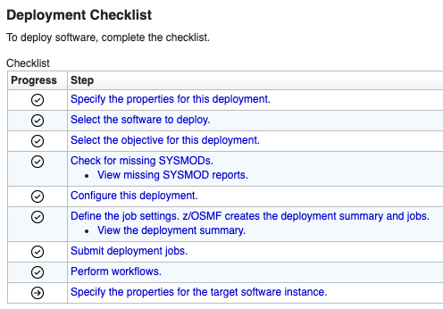

# Configuring Zowe with z/OSMF Workflows

After you install Zowe, you can register and execute the z/OSMF workflows in the web interface to perform a range of
Zowe configuration tasks. z/OSMF helps to simplify the Zowe configuration tasks and does not require the level of
expertise that is needed to perform manual Zowe configuration. This configuration method also runs the `zwe init`
command to initialize Zowe z/OS runtime.

:::info Required role: system programmer
:::

Ensure that you meet the following requirements before you start your Zowe configuration:

- Install and configure z/OSMF
- Install Zowe with an SMP/E build, PSWI, or a convenience build

You can complete the following tasks with the **Configuration of Zowe 3.0** workflow:

- Configure the Zowe instance
- Enable the Gateway service
- Enable the API Catalog
- Enable the Discovery service
- Enable the Caching service
- Enable the Application server
- Enable ZSS component
- Enable JES Explorer
- Enable MVS Explorer
- Enable USS Explorer

You can execute the Zowe configuration workflow either from a PSWI during deployment or later from a created software
instance in z/OSMF. Alternatively, you can execute the configuration workflow z/OSMF during the workflow registration
process.

The configuration workflow described in this article is executed directly from a deployment of the Zowe PSWI.

## Execute Configuration of Zowe 3.0 workflow from PSWI

In the PSWI deployment phase, you are presented with the checklist that helps guide you during the deployment process.

The **Perform Workflows** step enables you to run either all attached workflows or just the mandatory one — the
post-deployment workflow for mounting.

After you successfully performed the Zowe Mount workflow you can start the **Configuration of Zowe 3.0** workflow.
When you select it from the list of Workflow Definition Files you should see a screen like the one shown below:

[TODO]: # (I used screenshot from apimlpc_zowe-218-pswi-test2 deployment; we might need a better screenshot)

You can see the workflow details by expanding the Workflow details panel.
This workflow has three main steps.

### 1. **Define variables**

This workflow step includes the list of Zowe variables. It contains many child sub-steps.
When you expand this step you should see a screen like below:

[TODO]: # (need to update this image to correspond to V3, becasue the list of components has changed)

First you need to define the main variables, it is intended as a general configuration variables form. 
The other sub-steps are optional and depending on what the components you will choose to enable.

Perform the following steps to execute each sub-step individually:

1. Click the title of the sub-step.
2. Select the Perform tab.
3. Review the step contents and update the variables that are marked by a red asterisk based on your mainframe environment.

   On the components page of **Define the main variables** sub-step you can select the components that you wish to enable. 
   The below image shows how this page looks like:

    

   [TODO]: # (need to update this image to correspond to V3, becasue the list of components has changed)

   :::note
   All the components that you enabled need to be configured in the next sub-steps of **Define variables** step. 
   The sub-steps for configuring components will be in the Ready state, and all the rest in the Skipped state.
   :::

4. Select Next. 
5. Repeat the previous two steps to complete all items until the Finish option is available.

:::note
A basic validation is supported in many of the fields like a proper path structure, dataset name conventions, or numeric size.
But the workflow does not check whether a target dataset exists, or a directory has enough space, for example.
:::

After all sub-steps are completed the step **Define variables** will be marked as Complete.

### 2. **Create configuration**

Execute the step to create a configuration zowe.yaml file with the variable setup that was defined in the previous step. 
In this step you can review your configurations and if needed you can make further changes directly in the JCL. 
When you are done, click Finish and the zowe.yaml file will be ready, and the step will be marked as Complete.

:::note
This step is mandatory. The valid zowe.yaml is required to execute **Zowe installation** step.
:::

### 3. **Zowe Installation**

This step consumes the zowe.yaml configuration file you created in the previous step. It contains three sub-steps.

1. **(Optional) Run the Zowe install (only for convenience build)** is needed only for convenience build. It will run `zwe install` command.
2. **Run the Zowe init** will run `zwe init mvs` and `zwe init stc` commands.
3. **Run the Zowe init security** is optional, and requires Security Administrator permissions. It will run `zwe init apfauth` and `zwe init security` commands.

See, following articles for more information about `zwe install` and `zwe init` commands:
* [zwe install command](../appendix/zwe_server_command_reference/zwe/zwe-install.md)
* [Configuring Zowe with zwe init](initialize-zos-system.md)

:::note
Alternative to executing sub-step 3 is to submit `ZWESECUR` JCL. See, [Configuring security](configuring-security.md) article for more details.
:::

The **Configuration of Zowe 3.0** workflow strictly follows Zowe v3 install and configuration schema. It generates the zowe.yaml file and runs Zowe's zwe CLI tool.
After completing the workflow execution, you can return to the **Deployment Checklist** for the Zowe PSWI. 
When done there, you are ready to start your Zowe instance.
