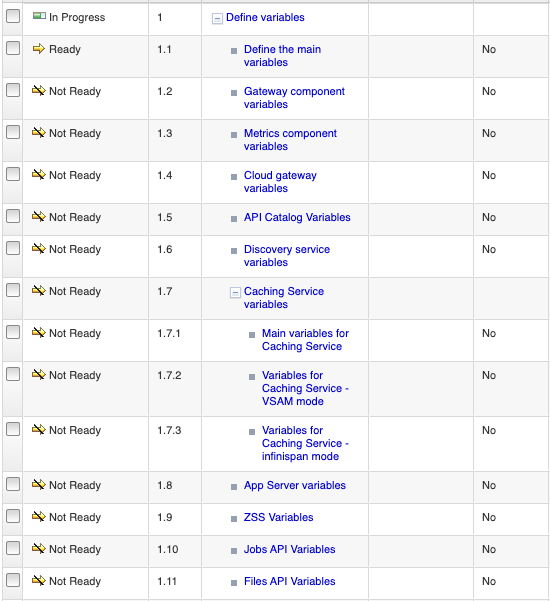
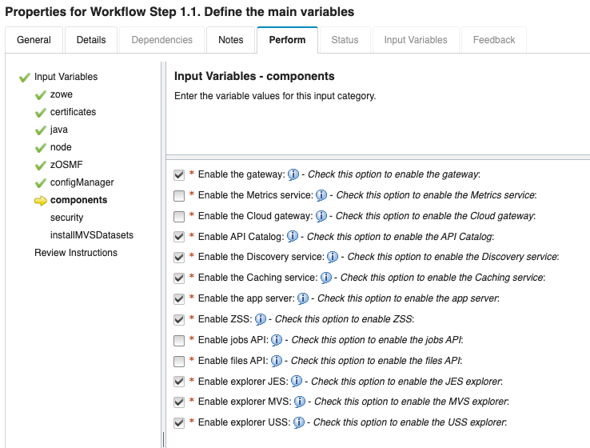

# Configuring Zowe with z/OSMF Workflows

After you install Zowe, you can register and execute the z/OSMF workflows in the web interface to perform a range of
Zowe configuration tasks. z/OSMF helps to simplify the Zowe configuration tasks and does not require the level of
expertise that is needed to perform manual Zowe configuration. This configuration method also runs the `zwe init`
command to initialize Zowe z/OS runtime.

:::info Required role: system programmer
:::

## Prerequisites

Ensure that you meet the following requirements before you start your Zowe configuration:

- Install and configure z/OSMF
- Install Zowe with an SMP/E build, PSWI, or a convenience build

## Overview of Full Zowe server-side configuration for Zowe 2.0 workflow

You can complete the following tasks with the **Full Zowe server-side configuration for Zowe 2.0** workflow:

- Configure the Zowe instance
- Enable the Gateway service
- Enable the API Catalog
- Enable the Discovery service
- Enable the Caching service
- Enable the Cloud gateway service
- Enable the Metrics service
- Enable the Application server
- Enable ZSS component
- Enable the jobs API
- Enable the files API
- Enable JES Explorer
- Enable MVS Explorer
- Enable USS Explorer

You can execute the Full Zowe server-side configuration for Zowe 2.0 workflow either from a PSWI during deployment or later from a created software
instance in z/OSMF. Alternatively, you can execute the configuration workflow in z/OSMF during the workflow registration process.

The configuration workflow described in this article is executed directly from a deployment of the Zowe PSWI.

## Executing Full Zowe server-side configuration workflow for Zowe 2.0  from PSWI

In Software Management panel, click Actions and add from z/OSMF Sytem. Specify your system name and file lactation path (UNIX file)
Click Retrieve. Review the Deployment Jobs and click click Deployment Checklist.

In the PSWI deployment phase, follow each step outlined in the **Deployment Checklist**.
For more information, see [Installing Product Software Using z/OSMF Deployments](./install-zowe-pswi-deployment.md)

During your deployment, you have the option to perform workflows. To leverage the z/OSMF workflow configuration, click Perform workflows.

Each workflow appears in the panel. 

:::note
The **Perform Workflows** step enables you to run either all attached workflows or just the
post-deployment workflow for mounting, which is required.
:::

Ensure that you first perform the Zowe Mount workflow as described in the IBM documentation.

After you successfully perform the **Zowe Mount** workflow, you can start the **Full Zowe server-side configuration for Zowe 2.0** workflow.
When you select this workflow from the list of Workflow Definition Files, the following screen displays:

Expand the **Workflow Details** panel to see the workflow details and the state of each step.
This workflow has three main steps:

[1. Define variables](#1-define-variables)  
[2. Create configuration](#2-create-configuration)  
[3. Perform Zowe installation](#3-perform-zowe-installation)

### 1. **Define variables**

This workflow step includes the list of Zowe variables for configuration and contains many sub-steps.
When you expand **Define variables**, the following screen displays: 

**1.1.** Click **Define the main variables** of your configuration as presented in the list under **Input Variables**. CLick the **Perform** tab. The input variables are displayed by category. Customize the workflow variables by in the presented fields. 

**Example:**
 

**1.2.** Perform the applicable sub-steps that correspond to the components you choose to enable.

   Perform the following steps to execute each sub-step, when applicable, individually:

  1. Click the title of the sub-step.
  2. Select the **Perform** tab.
  3. Review the step contents and update the variables that are marked by a red asterisk based on your mainframe environment.

   

   :::note
   Ensure that all the components that you enabled are configured in the next sub-steps of the **Define variables** step.
   The sub-steps for configuring components will be in the **Ready** state, and the remainder of components in the **Skipped** state.
   :::

  4. Select **Next**.
  5. Repeat the previous two steps to complete all items until the **Finish** option is available.
   
      :::note Notes
      * You can click **Save**, to save your values and **Finish** to populate these values in subsequent steps.
   
      * Basic validation is supported in many of the fields including the proper path structure, dataset name conventions, or numeric size.
   The workflow, however, does not check, for example, if a target dataset exists, or if a directory has sufficient space.
   :::

Customize each item under Input Variables. When you complete this list of Input variables, click **Next** to view the components. Tick each component in this list that you want to enable. 

CLick **Finish** to populate the values. This action customizes your workflow according to the components.
You are then presented with enabled sub-steps according to the Zowe component you specified. Click each sub-step and customize compoent specific variables. Click **Next** until you complete your customization of the variables and click **Finish** to apply the values.
  

After all sub-steps are completed, the step **Define variables** is marked as Complete.

### 2. **Create configuration**

This step creates a configuration zowe.yaml file with the variable setup that was defined in step 1.

Review your configurations and, if necessary, make further changes directly in the JCL.
When you are done, click **Finish**. The zowe.yaml file is ready, and the step is marked as Complete.

:::note
The **Create configuration** step is mandatory. A valid zowe.yaml is required to execute the **Zowe installation** step.
:::

### 3. **Perform Zowe installation**

This step consumes the zowe.yaml configuration file you created in step 2 and contains three sub-steps.

1. **Run Zowe install** runs the `zwe install` command.
2. **Run Zowe init** runs `zwe init mvs` and `zwe init stc` commands.
3. **Run Zowe init security**.  
   This sub-step is optional if you already preformed security setup for Zowe. This sub-step requires Security Administrator permissions, which are required to run the `zwe init apfauth` and `zwe init security` commands. If security is not set up for Zowe, contact your Security Administrator to perform this setup. 

   :::note
   An alternative to executing **Run the Zowe init security** is to submit `ZWESECUR` JCL. For details, see [Configuring security](configuring-security.md).
   :::

For more information about `zwe install` and `zwe init` commands, see the following articles:

* [zwe install command](../appendix/zwe_server_command_reference/zwe/zwe-install.md)
* [Configuring Zowe with zwe init](initialize-zos-system.md)

The **Full Zowe server-side configuration for Zowe 2.0** workflow strictly follows Zowe v2 install and configuration schema. This workflow generates the zowe.yaml file and runs Zowe's zwe CLI tool.
After completing the workflow execution, you can return to the **Deployment Checklist** for the Zowe PSWI.
After you complete the steps in the checklist you are ready to start your Zowe instance.
