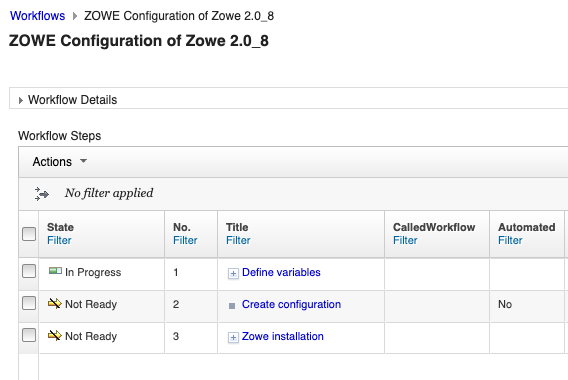

# Configuring Zowe with z/OSMF Workflows

After you install Zowe, you can register and execute the z/OSMF workflows in the web interface to perform a range of
Zowe configuration tasks. z/OSMF helps to simplify the Zowe configuration tasks and does not require the level of
expertise that is needed to perform manual Zowe configuration. This configuration method also runs the `zwe init`
command to initialize Zowe z/OS runtime.

:::info Required role: system programmer
:::

Ensure that you meet the following requirements before you start your Zowe configuration:

- Install and configure z/OSMF
- Install Zowe with an SMP/E build, PSWI, or a convenience build

You can complete the following tasks with the **Configuration of Zowe 3.0** workflow:

- Configure the Zowe instance
- Enable the API Gateway
- Enable ZAAS
- Enable the API Catalog
- Enable the Discovery service
- Enable a Caching service
- Enable an Application server
- Enable the ZSS component
- Enable JES Explorer
- Enable MVS Explorer
- Enable USS Explorer

You can execute the Zowe configuration workflow either from a PSWI during deployment or later from a created software
instance in z/OSMF. Alternatively, you can execute the configuration workflow z/OSMF during the workflow registration
process.

The configuration workflow described in this article is executed directly from a deployment of the Zowe PSWI.

## Execute Configuration of Zowe 3.0 workflow from PSWI

In the PSWI deployment phase, you are presented with a checklist that helps guide you during the deployment process.

The **Perform Workflows** step enables you to run either all attached workflows or just the
post-deployment workflow for mounting, which is required.

After you successfully performed the Zowe Mount workflow, you can start the **Configuration of Zowe 3.0** workflow.
When you select this workflow from the list of Workflow Definition Files, the following screen displays: 

You can see the workflow details by expanding the Workflow details panel.
This workflow has three main steps:

### 1. **Define variables**

This workflow step includes the list of Zowe variables and contains many child sub-steps.
When you expand this step, the following screen displays: 

First, define the main variables for your configuration.   
The other sub-steps are optional depending on which components you choose to enable.

Perform the following steps to execute each sub-step individually:

1. Click the title of the sub-step.
2. Select the **Perform** tab.
3. Review the step contents and update the variables that are marked by a red asterisk based on your mainframe environment.

   On the components page of the sub-step **Define the main variables**, select the components that you wish to enable. 

    

   :::note
   Ensure that all components you enabled are  configured in the sub-steps presented in the **Define variables** step. 
   The sub-steps for configuring components will be in the Ready state, and the remainder of components in the Skipped state.
   :::

4. Select **Next**. 
5. Repeat the previous two steps to complete all items until the **Finish** option is available.

:::note
A basic validation is supported in many of the fields like a proper path structure, dataset name conventions, or numeric size.
The workflow, however, does not check, for example, whether a target dataset exists, or a directory has sufficient space.
:::

After all sub-steps are completed, the step **Define variables** is marked as Complete.

### 2. **Create configuration**

Execute this step to create a configuration zowe.yaml file with the variable setup that was defined in the previous step. 
In this step you can review your configurations and, if necessary, make further changes directly in the JCL. 
When you are done, click **Finish**. The zowe.yaml file is ready, and the step is marked as Complete.

:::note
The **Create configuration** step is mandatory. A valid zowe.yaml is required to execute the **Zowe installation** step.
:::

### 3. **Zowe Installation**

This step consumes the zowe.yaml configuration file you created in the previous step. It contains three sub-steps:

1. **(Optional) Run the Zowe install (only for convenience build)**. This step is required only for the convenience build. It runs the `zwe install` command.
2. **Run the Zowe init** runs `zwe init mvs` and `zwe init stc` commands.
3. **Run the Zowe init security** is optional if you have already previously preformed security setup for Zowe. This sub-step requires Security Administrator permissions. It runs the `zwe init apfauth` and `zwe init security` commands. If security is not set up for Zowe, contact your Security Administrator to perform this setup.

:::note
An alternative to executing **Run the Zowe init security** is to submit `ZWESECUR` JCL. For details, see [Configuring security](configuring-security.md).
:::

For more information about `zwe install` and `zwe init` commands, see the following articles:
* [zwe install command](../appendix/zwe_server_command_reference/zwe/zwe-install.md)
* [Configuring Zowe with zwe init](initialize-zos-system.md)

The **Configuration of Zowe 3.0** workflow strictly follows the Zowe v3 install and configuration schema. This workflow generates the zowe.yaml file and runs the Zowe zwe CLI tool.
After completing the workflow execution, you can return to the **Deployment Checklist** for the Zowe PSWI. 
After you complete the steps in the checklist you are ready to start your Zowe instance.
