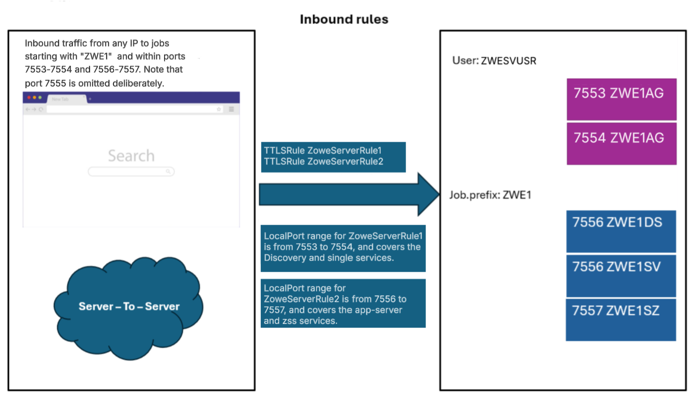
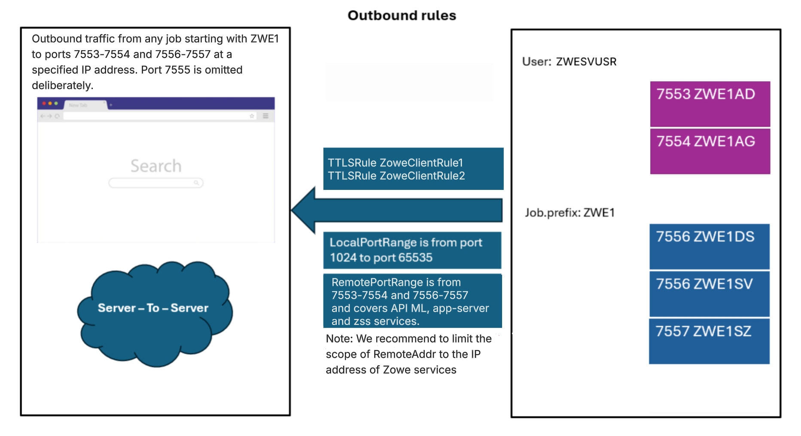
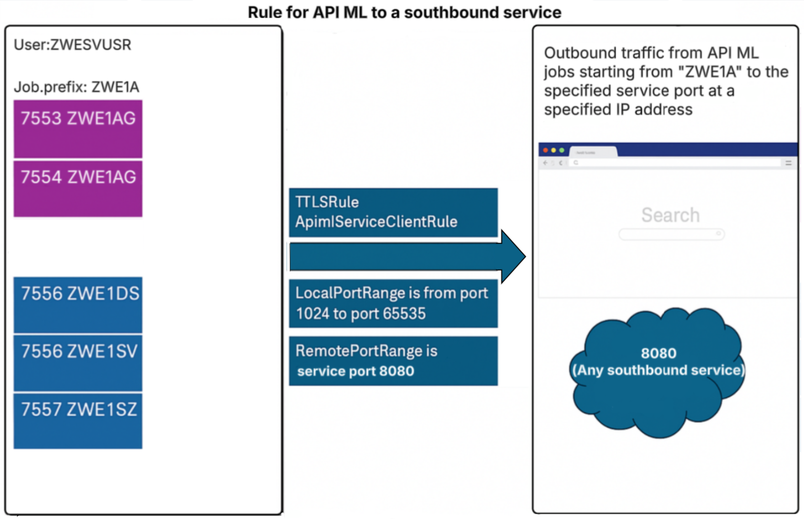
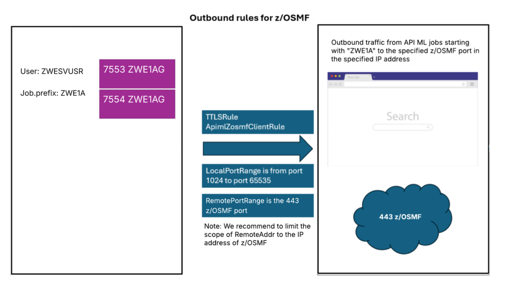

# Enabling AT-TLS for single-service deployment mode

Configuring AT-TLS allows Zowe to offload all TLS responsibilities to the z/OS Communications Server, simplifying security configuration and ensuring consistent encryption across the network.

:::info Role: security administrator
:::

This article explains how to enable AT-TLS for single-service deployment mode so your Zowe environment can benefit from this streamlined, system-driven approach to secure communications.

:::tip
Beginning with Zowe v3.4.0 and for later versions, we recommend the use of single-service deployment mode. For the benefits of running Zowe in this mode, see [Enabling Single-Service deployment of API Mediation Layer](api-mediation/api-mediation-modulith.md).
:::

:::note
The built-in TLS networking is enabled by default. For details about this built-in TLS support, see [Customizing Native TLS](./tls-configuration.md).

:::

As a security administrator, you can configure parameters in Zowe Server to switch from native TLS to AT-TLS. Review this article for information about AT-TLS inbound and outbound rules, and the required configuration to use AT-TLS in high availability. You can also find troubleshooting tips as well as security recommendations.

## AT-TLS configuration for Zowe

Configuration to support AT-TLS is set in the following section of the `zowe.yaml` file:

```yaml
zowe:
  network:
    # For inbound traffic rules:
    server:
      tls:
        attls: true
    # If outbound traffic rules will be configured:
    client:
      tls:
        attls: true
```

While TLS is not handled by the Zowe Server components with AT-TLS enabled, API Mediation Layer (API ML) requires information about the server certificate that is defined in the AT-TLS rule. Ensure that the server certificates provided by the AT-TLS layer are trusted in the configured Zowe keyring.

:::tip

* We strongly recommend that AT-TLS for inbound connections and outbound connections with X.509 Client Certificate authentication be configured with the same Zowe keyring as in `zowe.yaml`.
* For outbound connections without an X.509 Client Certificate authentication, make sure you use a keyring that contains only the trusted public CA certificates, but does not contain a private key.

:::

:::note Notes

* As the API Gateway is a core component of API ML, other components that need to interact with the API Gateway, such as Zowe App Server, also require AT-TLS configuration.
* Do not set `attls: true` together with `minTls` or `maxTls`. Zowe does not handle TLS in AT-TLS aware mode.

:::

:::caution Important security consideration

Configuring AT-TLS for Zowe requires careful consideration of security settings. These security settings apply to the X.509 Client Certificate authentication feature in Zowe API Mediation Layer components, as well as for onboarded services that support the X.509 Client Certificates authentication scheme.

Outbound AT-TLS rules (i.e. to make a transparent https call through http) that are configured to send the
server certificate should be limited to the services that __require__ service to service authentication.
:::

### Required Keyrings

To comply with security settings, Zowe AT-TLS setup requires two keyrings:

* [Keyring with a private key](#keyring-with-a-private-key)
* [Keyring without a private key](#keyring-without-a-private-key)

#### Keyring with a private key

This keyring is used for inbound connections and outbound connections that require X.509 Client Certificate
authentication. This keyring contains trusted public CA certificates and a Zowe server certificate with the
certificate's corresponding private key. When Zowe is running in single-service deployment mode, the keyring with a private key is used only for connections to another instance that is part of the High Availability (HA) setup.

* If the southbound service supports X.509 client certificate authentication, then AT-TLS cannot be used.
* No internal calls in non-HA single-service deployment mode require X.509 client certificate
authentication.

#### Keyring without a private key

This keyring is used for outbound connections that do not require nor prohibit X.509 Client Certificate authentication. This keyring contains only the trusted public CA certificates.
We recommend creating a new keyring, similar to the [above-mentioned keyring](./configuring-at-tls-for-zowe-server.md#keyring-with-a-private-key), but __without the private key__.

## AT-TLS rules

This section describes suggested AT-TLS settings, and serves as guidelines to set your AT-TLS rules.

**Note:** Comments are added inline to aid in filling the details, make sure to remove them in the resulting z/OS configuration as they may be read by the interpreter.

### Common configuration items

The following configuration blocks are reused in a number of rules, use these as reference.

```bash

TTLSGroupAction ServerGroupAction
{
  TTLSEnabled On
}

TTLSEnvironmentAction ZoweServerEnvironmentAction
{
  HandshakeRole ServerWithClientAuth
  EnvironmentUserInstance 0
  TTLSEnvironmentAdvancedParmsRef ServerEnvironmentAdvParms
  TTLSKeyringParmsRef ZoweKeyring
}

TTLSConnectionAction ZoweServerConnectionAction
{
  HandshakeRole ServerWithClientAuth
  TTLSCipherParmsRef CipherParms
  TTLSConnectionAdvancedParmsRef ZoweConnectionAdvParms
}

TTLSEnvironmentAdvancedParms ServerEnvironmentAdvParms
{
  ClientAuthType Full # Support optional X.509 Client Certificate authentication
  ApplicationControlled Off
  Renegotiation Disabled
  SSLv2 Off
  SSLv3 Off
  TLSv1 Off
  TLSv1.1 Off
  TLSv1.2 On
  TLSv1.3 On
}

TTLSConnectionAdvancedParms ZoweConnectionAdvParms
{
  ApplicationControlled Off
  ServerCertificateLabel apimlcert # Specify the personal server certificate used for the Zowe Server
  CertificateLabel apimlcert # Specify the personal server certificate used for the Zowe Server
  SecondaryMap Off
}

TTLSGroupAction ClientGroupAction
{
  TTLSEnabled On
}

TTLSEnvironmentAction ApimlX509ClientEnvAction
{
  HandshakeRole Client
  TTLSKeyringParmsRef ZoweKeyring
  TTLSEnvironmentAdvancedParmsRef ClientEnvironmentAdvParms
}

TTLSConnectionAction ApimlX509ClientConnAction
{
  HandshakeRole Client
  TTLSCipherParmsRef CipherParms
  TTLSConnectionAdvancedParmsRef ApimlClientX509ConnAdvParms
}

TTLSEnvironmentAdvancedParms ClientEnvironmentAdvParms
{
  Renegotiation Disabled
  3DesKeyCheck Off
  ClientEDHGroupSize Legacy
  ServerEDHGroupSize Legacy
  PeerMinCertVersion Any
  ServerScsv Off
  MiddleBoxCompatMode Off
  CertValidationMode Any
}

TTLSConnectionAdvancedParms ApimlClientX509ConnAdvParms
{
  CertificateLabel Zowe Server # Label of personal certificate in the ZoweKeyring
  ApplicationControlled Off
  SecondaryMap Off
}

TTLSGroupAction ClientGroupAction
{
  TTLSEnabled On
}

TTLSEnvironmentAction ApimlNoX509ClientEnvAction
{
  HandshakeRole Client
  TTLSKeyringParmsRef ZoweNoX509Keyring
  TTLSEnvironmentAdvancedParmsRef ClientEnvironmentAdvParms
}

TTLSConnectionAction ApimlNoX509ClientConnAction
{
  HandshakeRole Client
  TTLSCipherParmsRef CipherParms
  TTLSConnectionAdvancedParmsRef ApimlClientNoX509ConnAdvParms
}

TTLSEnvironmentAdvancedParms ClientEnvironmentAdvParms
{
  Renegotiation Disabled
  3DesKeyCheck Off
  ClientEDHGroupSize Legacy
  ServerEDHGroupSize Legacy
  PeerMinCertVersion Any
  ServerScsv Off
  MiddleBoxCompatMode Off
  CertValidationMode Any
}

TTLSConnectionAdvancedParms ApimlClientNoX509ConnAdvParms
{
# No CertificateLabel; Keyring contains no X.509 Client Certificate
  ApplicationControlled Off
  SecondaryMap Off
}

```

### Keyring configuration

```bash
# Keyring with trusted CA certificates and Zowe server certificate with its private key
TTLSKeyringParms ZoweKeyring
{
  Keyring ZWEKRNG
}

# Keyring without a default personal certificate and its private key; contains only trusted CA certificates
TTLSKeyringParms ZoweNoX509Keyring
{
  Keyring ZoweAttlsKeyring
}

* __`ZoweNoX509Keyring`__  
This parameter is used for outbound rules that do not require or prohibit X.509 Client Certificate authentication, is distinct from `ZoweKeyring`. Refer to the complete PAGENT rules in the [Full example of AT-TLS configuration](#full-example-of-at-tls-configuration).

```

### Inbound rules

The following diagram illustrates inbound rules when Zowe is deployed in single-service mode:



1. Define a generic inbound rule that can be set for all Zowe services. Note that port 7555 is excluded intentionally in order to allow for compatibility with multi-service deployment mode. As such, the configuration is split into two inbound rules as presented in the following rules section:

Note: Rules can be unified into one if they are using contiguous ports.

```bash
TTLSRule ZoweServerRule1
{
  LocalAddr All
  RemoteAddr All
  LocalPortRange 7553-7554 # Discovery and gateway services
  Jobname ZWE1* # Jobname according to zowe.job.prefix in zowe.yaml
  Direction Inbound
  TTLSGroupActionRef ServerGroupAction
  TTLSEnvironmentActionRef ZoweServerEnvironmentAction
  TTLSConnectionActionRef ZoweServerConnectionAction
}

TTLSRule ZoweServerRule2
{
  LocalAddr All
  RemoteAddr All
  LocalPortRange 7556-7557 # App server and ZSS
  Jobname ZWE1* # Jobname according to zowe.job.prefix in zowe.yaml
  Direction Inbound
  TTLSGroupActionRef ServerGroupAction
  TTLSEnvironmentActionRef ZoweServerEnvironmentAction
  TTLSConnectionActionRef ZoweServerConnectionAction
}

TTLSRule ZoweServerRule3
{
  LocalAddr All
  RemoteAddr All
  LocalPortRange 7600-7601 # Caching-service infinispan ports
  Jobname ZWE1* # Jobname according to zowe.job.prefix in zowe.yaml
  Direction Inbound
  TTLSGroupActionRef ServerGroupAction
  TTLSEnvironmentActionRef ZoweServerEnvironmentAction
  TTLSConnectionActionRef ZoweServerConnectionAction
}

```

1. Verify port ranges.

    | Port number | Category | Component  | Default Jobname         |
    |------|------|------------|-------------------------|
    | 7553 | API Mediation Layer | discovery  | ZWE1**AG**              |
    | 7554 | API Mediation Layer | gateway    | ZWE1**AG**              |
    | 7556 | App Framework | app-server | ZWE1**DS** & ZWE1**SV** |
    | 7557 | App Framework | zss        | ZWE1**SZ**              |
    | 7600 | API Mediation Layer | caching-service        | ZWE1**AG**              |
    | 7601 | API Mediation Layer | caching-service        | ZWE1**AG**              |

    For more information on each component's networking requirements, see [Addressing network requirements](./address-network-requirements.md).

2. Apply your keyring and configure the handshake role.

    i. In the following keyring configuration, replace `ZWEKRNG` to reference your environment's keyring with a private key.

    ```bash
    TTLSKeyringParms ZoweKeyring
    {
       Keyring ZWEKRNG
    }
    ```

    For additional details, see [Keyring with a private key](configuring-at-tls-for-zowe-server-single-service.md#keyring-with-a-private-key).

    ii. Verify the `HandshakeRole` setting.

    Ensure `HandshakeRole` is set to `ServerWithClientAuth` for core Zowe services. This setting enables the API Gateway to accept X.509 Client Certificates from API Clients.

    iii.  (Optional) Separate rules by certificate requirements.  

    * For services that __require__ X.509 client certificate authentication (e.g., Discovery Service, API Gateway Service), keep `HandshakeRole` as `ServerWithClientAuth`.
    * For services that __do not require__ X.509 client certificates (e.g., API Catalog), create separate TTLS rules with `HandshakeRole` as `Server`.

  :::note
  For more information about the use of SAF keyrings with API ML, see [API ML SAF Keyring](../extend/extend-apiml/certificate-management-in-zowe-apiml.md#api-ml-saf-keyring) in the article _Managing certificates in Zowe API Mediation Layer_.
  :::

1. Refresh PAGENT and verify the contents.

* Refresh the policy configuration by issuing the MVS command: `F PAGENT,REFRESH`.
* Test connectivity for all inbound services.
* Ensure services that require client certificate authentication are successfully receiving X.509 Client Certificates.

:::tip
We recommend that you restart Zowe services after refreshing PAGENT to avoid issues with open connections.
:::

### Outbound rules

Outbound rules in this section allow Zowe services to communicate with each other and to other southbound services using HTTP.

:::caution Important:

Careful consideration needs to be made regarding which rules are to be configured to send X.509 Client Certificate. Since configuration cannot be performed on a per-request basis, it is essential not to configure the rule to send the Zowe Server certificate to the API Gateway or to a southbound service that supports X.509 Client Certificate authentication. Doing so will result in unintentionally authenticating as the Zowe Server user ID. Make sure to use a [Keyring without a private key](./configuring-at-tls-for-zowe-server.md#keyring-without-a-private-key) in such rules.

:::

### Outbound rules for communication between Zowe core components

Use the example in this section as a template for internal connections between Zowe core services.

The following diagram illustrates outbound rules between Zowe core components for single-service deployment mode:



This example rule covers the connection between the API Gateway and the z/OSMF instance, which are required for user authentication on z/OS systems when using z/OSMF as the authentication provider.

```bash
TTLSRule ZoweClientRule1
{
  LocalAddr All
  LocalPortRange 1024-65535
  RemoteAddr All
  RemotePortRange 7553-7554 # Discovery and gateway services
  Jobname ZWE1* # Set according to zowe.job.prefix in zowe.yaml - this covers all servers within Zowe core.
  Direction Outbound
  TTLSGroupActionRef ClientGroupAction
  TTLSEnvironmentActionRef ApimlX509ClientEnvAction
  TTLSConnectionActionRef ApimlX509ClientConnAction # X.509 Client Certificate Authentication is required in cross-service API ML communication
}

TTLSRule ZoweClientRule2
{
  LocalAddr All
  LocalPortRange 1024-65535
  RemoteAddr All
  RemotePortRange 7556-7557 # App server and ZSS
  Jobname ZWE1* # Set according to zowe.job.prefix in zowe.yaml - this covers all servers within Zowe core.
  Direction Outbound
  TTLSGroupActionRef ClientGroupAction
  TTLSEnvironmentActionRef ApimlX509ClientEnvAction
  TTLSConnectionActionRef ApimlX509ClientConnAction # X.509 Client Certificate Authentication is required in cross-service API ML communication
}

TTLSRule ZoweClientRule3
{
  LocalAddr All
  LocalPortRange 1024-65535
  RemoteAddr All
  RemotePortRange 7600-7601 # Caching service infinispan storage
  Jobname ZWE1* # Set according to zowe.job.prefix in zowe.yaml - this covers all servers within Zowe core.
  Direction Outbound
  TTLSGroupActionRef ClientGroupAction
  TTLSEnvironmentActionRef ApimlX509ClientEnvAction
  TTLSConnectionActionRef ApimlX509ClientConnAction # X.509 Client Certificate Authentication is required in cross-service API ML communication
}

```

Note the following conditions:

* If `zowe.network.client.tls.attls` is `true`, AT-TLS performs encryption even when requests are issued as `http`.
* If `zowe.network.client.tls.attls` is `true` and the z/OSMF rule is not configured in the PAGENT, specify `zOSMF.scheme: https` in your `zowe.yaml`.

* __`Jobname`__  
  This parameter is defined explicitly for the API Gateway and is formed with the `zowe.job.prefix` setting from `zowe.yaml` plus `AG` (API Gateway) suffix.

#### Outbound rule for communication between API Gateway and southbound services

The following diagram illustrates the rule for the API ML to a southbound service in single-service deployment mode.



In this example, the rule covers all outbound connections originating from the API Gateway to a server which is not part of Zowe, such as an extension's server, listening on port `8080`.
Such a rule can apply to any remote destination, as seen in the `ZoweClientRule1` and `ZoweClientRule2` for Zowe core servers in the section [Outbound rules for z/OSMF](./configuring-at-tls-for-zowe-server-single-service.md#outbound-rule-for-zosmf).

<details>
<summary>Click to view an example of a rule covering API Gateway to extension servers.</summary>

This example covers routing scenarios.

```bash
TTLSRule ApimlServiceClientRule
{
  LocalAddr All
  LocalPortRange 1024-65535
  RemoteAddr All
  RemotePortRange 8080 # Set to range of ports where services are listening
  Jobname ZWE1A* # Generate according to zowe.job.prefix in zowe.yaml
  Direction Outbound
  TTLSGroupActionRef ClientGroupAction
  TTLSEnvironmentActionRef ApimlNoX509ClientEnvAction
  TTLSConnectionActionRef ApimlNoX509ClientConnAction # Do not send X.509 Client Certificate
}

```

:::caution Important

If a southbound service, including an onboarded service, supports X.509 client certificate authentication, the API Gateway must __not__ send the Zowe server certificate unless intended. Sending the certificate results in the server authenticating the certificate user.

:::

</details>

#### Outbound rule for services that validate tokens against the API Mediation Layer

Services validating authentication tokens through the API Gateway require an outbound rule to the API Gateway and an onboarding rule to the Discovery Service.

This scenario includes the following services:

* Services that set `zoweJwt` as the authentication scheme
* Services that require an Open ID Connect (OIDC) token
* Forwarded X.509 certificates

For a full AT-TLS setup we strongly recommend the following conditions:

* Include an Outbound rule from the service to the API Gateway.
* Include an Outbound rule set for the onboarding process against the Discovery Service.

Ensure that the following rules are followed:

* Outbound rule to the API Gateway: __Do not__ send X.509 Client Certificate.
* Outbound rule to the Discovery Service: Sends an X.509 Client Certificate to authenticate during onboarding.

:::note
Services running off-host cannot use AT-TLS to make transparent https calls though http. As such, no Outbound rules apply from such services to the API Gateway and the Discovery Service.
:::

#### Outbound rule for z/OSMF

The following diagram illustrates outbound rules for z/OSMF in single-service deployment mode:



This example rule covers the connection between the API Gateway and the z/OSMF instance. This connection is made to authenticate users in z/OS.

* If `zowe.network.client.tls.attls` is `true`, this rule is assumed set. The requests to z/OSMF are issued using `http`.  
* If `zowe.network.client.tls.attls` is `true` and z/OSMF rule is not set in the PAGENT, then it is necessary to specify `zOSMF.scheme: https` in your `zowe.yaml`.

```bash

TTLSRule ApimlZosmfClientRule
{
  LocalAddr All
  LocalPortRange 1024-65535 # Using any outbound port
  RemoteAddr All
  RemotePortRange 443 # Set to z/OSMF port
  Jobname ZWE1A* # Set according to zowe.job.prefix in zowe.yaml. Zowe components *AG and *AZ are needed in this rule.
  Direction Outbound
  TTLSGroupActionRef ClientGroupAction
  TTLSEnvironmentActionRef ApimlNoX509ClientEnvAction
  TTLSConnectionActionRef ApimlNoX509ClientConnAction # No X.509 Client Certificate required
}

```

* __`Jobname`__
 This parameter is defined explicitly for the API Gateway and is formed with the `zowe.job.prefix` setting from `zowe.yaml` plus `AG` (API Gateway) suffix. Choosing `ZWE1A*` as a jobname pattern captures both servers.

### Ciphers

:::note
This list of ciphers is provided as an example only. Actual ciphers should be customized according to your specific configuration.
:::

The list of supported ciphers should be constructed according to the TLS supported versions.
Ensure that the cipher list has matches with non-AT-TLS-aware clients.

<details>
<summary>Click to view an example of Cipher parameters.</summary>

```bash
TTLSCipherParms CipherParms
{
  V2CipherSuites TLS_RC4_128_WITH_MD5
  V2CipherSuites TLS_RC4_128_EXPORT40_WITH_MD5
  V2CipherSuites TLS_RC2_CBC_128_CBC_WITH_MD5
  V2CipherSuites TLS_RC2_CBC_128_CBC_EXPORT40_WITH_MD5
  V2CipherSuites TLS_RC2_CBC_128_CBC_EXPORT40_WITH_MD5
  V2CipherSuites TLS_DES_192_EDE3_CBC_WITH_MD5
  V3CipherSuites TLS_ECDHE_ECDSA_WITH_AES_128_CBC_SHA256
  V3CipherSuites TLS_ECDHE_ECDSA_WITH_AES_256_CBC_SHA384
  V3CipherSuites TLS_ECDHE_ECDSA_WITH_AES_128_GCM_SHA256
  V3CipherSuites TLS_ECDHE_ECDSA_WITH_AES_256_GCM_SHA384
  V3CipherSuites TLS_ECDHE_RSA_WITH_AES_256_GCM_SHA384
  V3CipherSuites TLS_AES_128_GCM_SHA256
  V3CipherSuites TLS_AES_256_GCM_SHA384
  V3CipherSuites TLS_CHACHA20_POLY1305_SHA256
}
```

</details>

## Using AT-TLS for API ML in High Availability

When Zowe is configured in High Availability mode, AT-TLS configuration is mostly the same as in a single-instance deployment. The primary difference is that the AT-TLS rules must allow communication across multiple LPARs.

Ensure that the `RemoteAddr` setting in the rules accounts for the following connections:

* Discovery Service to Discovery Service. This is the replica request.
* API Gateway Service to southbound services (including app-server and ZSS) running in another LPAR.
* Southbound services to the Discovery Service on this LPAR, or another LPAR. This applies during onboarding.
* All outbound connections need to include the IP range for all LPARs. Make sure to allow traffic not only to other LPARs but also to the LPAR where the rules are defined, as outbound requests continue to go through AT-TLS.

## Multi-tenancy deployment

:::note

Most installations do not need this feature

:::

When the Central API ML runs on z/OS with AT-TLS enabled, you must override the external URL protocol so that it matches the outbound AT-TLS behavior. The Central API ML uses this external URL to call the domain API ML and needs to reflect the outbound AT-TLS rule.

In this scenario, update your domain API ML configuration:

```yaml
zowe:
  components:
    gateway:
      apiml:
        gateway:
          externalProtocol: http
```

## AT-TLS Troubleshooting

This section describes some common issues when using AT-TLS with Zowe and how to resolve these issues.

### The message `This combination of port requires SSL` is thrown when accessing an API ML service through a Browser

Make sure the URL starts with `https://`. This message indicates that AT-TLS rules are in place and that it is trying to connect on an unsecured port to the API Gateway, however the latter is still only listening on an application-controlled secured port.

__Solution:__
Review settings in the API Gateway. Ensure that the changes described in [AT-TLS configuration for Zowe](#at-tls-configuration-for-zowe) are applied.

### AT-TLS rules are not applied

If the application is responding in http, the application may not be properly configured to support http-only calls. AT-TLS is not correctly configured.

__Solution:__

Ensure the rules are active and that the filters on port range and job names are properly set.

### Non matching ciphers / protocols

An error can occur if the [list of ciphers](#ciphers) or the TLS protocol does not match between the ones configured in the AT-TLS rules and the ones used by non AT-TLS-aware clients.

__Solution:__
Review the supported TLS versions and ciphers used in both the client and the server.

### Zowe Desktop IP Explorer or Editor does not work

If the Zowe Desktop IP Explorer or Editor are not working correctly, either by failing to load or showing no data, it means there is a problem accessing the ZSS server.

__Solution:__

Ensure the `components.zss.agent.http.ipAddresses` includes a reachable address. If this field unset, it defaults to `127.0.0.1`, while other Zowe servers default to `0.0.0.0`.

__Sample configuration:__

```yaml
components:
  zss:
    enabled: true
    port: 7557
    crossMemoryServerName: ZWESIS_STD
    agent:
      64bit: true
    http:
      ipAddresses: 
        - "0.0.0.0"
```

### Additional troubleshooting

When asking for support, make sure to follow IBM guides for troubleshooting AT-TLS problems. For details, see _Diagnosing Application Transparent Transport Layer Security (AT-TLS)_ in the IBM documentation.

Ensure you collect the logs and current configurations when contacting support.

## Full example of AT-TLS configuration

Review a full working example of an AT-TLS configuration file on z/OS, specifically used for defining secure communication between different services in a mainframe environment. All port values are examples.
The example has comments for readability.
<details>

<summary>Click here to review the full AT-TLS configuration file for single-service deployment mode.</summary>

```bash
########################################################
#                      ZOWE RULES                      #
########################################################

# Main inbound rules, all Zowe services have them defined.
TTLSRule ZoweServerRule1
{
  LocalAddr All
  RemoteAddr All
  LocalPortRange 7553-7554 # Discovery and gateway services
  Jobname ZWE1* # Jobname according to zowe.job.prefix in zowe.yaml
  Direction Inbound
  TTLSGroupActionRef ServerGroupAction
  TTLSEnvironmentActionRef ZoweServerEnvironmentAction
  TTLSConnectionActionRef ZoweServerConnectionAction
}

TTLSRule ZoweServerRule2
{
  LocalAddr All
  RemoteAddr All
  LocalPortRange 7556-7557 # App server and ZSS
  Jobname ZWE1* # Jobname according to zowe.job.prefix in zowe.yaml
  Direction Inbound
  TTLSGroupActionRef ServerGroupAction
  TTLSEnvironmentActionRef ZoweServerEnvironmentAction
  TTLSConnectionActionRef ZoweServerConnectionAction
}

# Example outbound TTLS rules for a Zowe client calling a Zowe server
# In this scenario this client (a southbound service) presents X.509 Client Certificate to authenticate (for example during onboarding)
TLSRule ZoweClientRule1
{
  LocalAddr All
  LocalPortRange 1024-65535
  RemoteAddr All
  RemotePortRange 7553-7554 # Discovery and gateway services
  Jobname ZWE1* # Set according to zowe.job.prefix in zowe.yaml - this covers all servers within Zowe core.
  Direction Outbound
  TTLSGroupActionRef ClientGroupAction
  TTLSEnvironmentActionRef ApimlX509ClientEnvAction
  TTLSConnectionActionRef ApimlX509ClientConnAction # X.509 Client Certificate Authentication is required in cross-service API ML communication
}

TTLSRule ZoweClientRule2
{
  LocalAddr All
  LocalPortRange 1024-65535
  RemoteAddr All
  RemotePortRange 7556-7557 # App server and ZSS
  Jobname ZWE1* # Set according to zowe.job.prefix in zowe.yaml - this covers all servers within Zowe core.
  Direction Outbound
  TTLSGroupActionRef ClientGroupAction
  TTLSEnvironmentActionRef ApimlX509ClientEnvAction
  TTLSConnectionActionRef ApimlX509ClientConnAction # X.509 Client Certificate Authentication is required in cross-service API ML communication
}

# Optional. Can configure the outbound connection from API Gateway to work with AT-TLS while connecting to z/OSMF.
TTLSRule ApimlZosmfClientRule
{
  LocalAddr All
  LocalPortRange 1024-65535
  RemoteAddr All
  RemotePortRange 443 # z/OSMF Port
  Jobname ZWE1A*
  Direction Outbound
  TTLSGroupActionRef ClientGroupAction
  TTLSEnvironmentActionRef ApimlNoX509ClientEnvAction
  TTLSConnectionActionRef ApimlNoX509ClientConnAction
}

# Example outbound rule from API Gateway to app server and zss.
TTLSRule ApimlZLUXClientRule
{
  LocalAddr All
  LocalPortRange 1024-65535
  RemoteAddr All
  RemotePortRange 7556-7557 
  Jobname ZWE1AG*
  Direction Outbound
  TTLSGroupActionRef ClientGroupAction
  TTLSEnvironmentActionRef ApimlNoX509ClientEnvAction
  TTLSConnectionActionRef ApimlNoX509ClientConnAction
}

########################################################
#            SAMPLE ONBOARDED SERVICE RULES            #
########################################################

# Example southbound service inbound rule
TTLSRule ApimlDCServerRule
{
  LocalAddr All
  RemoteAddr All
  LocalPortRange 8080-8090 # Example service ports
  Jobname ZWE1DC* # Jobname prefix (optional)
  Direction Inbound
  TTLSGroupActionRef ServerGroupAction
  TTLSEnvironmentActionRef ZoweDCServerEnvironmentAction
  TTLSConnectionActionRef ZoweDCServerConnectionAction
}

# Example outbound rule for connections from Catalog and API ML Gateway (during request routing) to a southbound service running in port 40030 
# Note EnvironmentAction defines a Keyring that does not contain X.509 Client Certificate with its private key
# Note ConnectionAction doesn't configure X.509 Client Certificate.
TTLSRule ApimlServiceClientRule
{
  LocalAddr All
  LocalPortRange 1024-65535
  RemoteAddr All
  RemotePortRange 40030 # Service ports
  Jobname ZWE1A*
  Direction Outbound
  TTLSGroupActionRef ClientGroupAction
  TTLSEnvironmentActionRef ApimlNoX509ClientEnvAction
  TTLSConnectionActionRef ApimlNoX509ClientConnAction
}

# Environment action for sample southbound service
TTLSEnvironmentAction ZoweDCServerEnvironmentAction
{
  HandshakeRole Server
  EnvironmentUserInstance 0
  TTLSEnvironmentAdvancedParmsRef ZoweServerEnvironmentAdvParms
  TTLSKeyringParmsRef ZoweKeyring
}

# Server Connection Action for DC Service.
TTLSConnectionAction ZoweDCServerConnectionAction
{
  HandshakeRole Server 
  TTLSCipherParmsRef CipherParms
  TTLSConnectionAdvancedParmsRef ZoweDCServerConnectionAdvParms
}

# Service advanced server connection action.
TTLSConnectionAdvancedParms ZoweDCServerConnectionAdvParms
{
  ApplicationControlled Off
  ServerCertificateLabel apimlcert
  SecondaryMap Off
}

########################################################
#                COMMON CONFIGURATION                  #
########################################################

# Keyring with trusted CA certificates and personal certificate with its private key
TTLSKeyringParms ZoweKeyring
{
  Keyring ZWEKRNG
}

# Keyring without a default personal certificate and its private key; contains only trusted CA certificates
TTLSKeyringParms ZoweNoX509Keyring
{
  Keyring ZoweAttlsKeyring
}

TTLSEnvironmentAction ApimlX509ClientEnvAction
{
  HandshakeRole Client
  TTLSKeyringParmsRef ZoweKeyring # Keyring contains personal X.509 certificate and its private key
  TTLSEnvironmentAdvancedParmsRef ClientEnvironmentAdvParms
  EnvironmentUserInstance 0
}

TTLSEnvironmentAction ApimlNoX509ClientEnvAction
{
  HandshakeRole Client
  TTLSKeyringParmsRef NoKeyKeyring # Keyring does not contain personal X.509 certificate and its private key
  TTLSEnvironmentAdvancedParmsRef ClientEnvironmentAdvParms
  EnvironmentUserInstance 0
}

# Environment action for all Zowe services
TTLSEnvironmentAction ZoweServerEnvironmentAction
{
  HandshakeRole ServerWithClientAuth # Zowe Servers can optionally support X.509 Client Certificate authentication
  EnvironmentUserInstance 0
  TTLSEnvironmentAdvancedParmsRef ZoweServerEnvironmentAdvParms
  TTLSKeyringParmsRef ZoweKeyring
}

# Advanced TLS settings, choose TLS versions supported.
TTLSEnvironmentAdvancedParms ZoweServerEnvironmentAdvParms
{
  ClientAuthType Full # Support optional X.509 Client Certificate authentication
  ApplicationControlled Off
  Renegotiation Disabled
  SSLv2 Off
  SSLv3 Off
  TLSv1 Off
  TLSv1.1 Off
  TLSv1.2 On
  TLSv1.3 On
}

# Server Connection Action for API ML core services.
TTLSConnectionAction ZoweServerConnectionAction
{
  HandshakeRole ServerWithClientAuth # API ML Core Services use X.509 Client Certificate authentication
  TTLSCipherParmsRef CipherParms
  TTLSConnectionAdvancedParmsRef ZoweServerConnectionAdvParms
}

# API ML Server connection action.
# ServerCertificateLabel indicates which certificate is used on server-side for establishing TLs connections.
TTLSConnectionAdvancedParms ZoweServerConnectionAdvParms
{
  ApplicationControlled Off
  ServerCertificateLabel apimlcert
  SecondaryMap Off
}

TTLSEnvironmentAdvancedParms ClientEnvironmentAdvParms
{
  Renegotiation Disabled
  3DesKeyCheck Off
  ClientEDHGroupSize Legacy
  ServerEDHGroupSize Legacy
  PeerMinCertVersion Any
  ServerScsv Off
  MiddleBoxCompatMode Off
  CertValidationMode Any
}

TTLSConnectionAction ApimlX509ClientConnAction
{
  HandshakeRole Client
  TTLSCipherParmsRef CipherParms
  TTLSConnectionAdvancedParmsRef ZoweClientX509ConnAdvParms
}

TTLSConnectionAction ApimlNoX509ClientConnAction
{
  HandshakeRole Client
  TTLSCipherParmsRef CipherParms
  TTLSConnectionAdvancedParmsRef ZoweClientNoX509ConnAdvParms
}

# In case the connection needs/requires X.509 Client Certificate authentication, this is where the label is set for outbound connections.
TTLSConnectionAdvancedParms ZoweClientX509ConnAdvParms
{
  CertificateLabel apimlcert
  SecondaryMap Off
  SSLv3 Off
  TLSv1 Off
  TLSv1.1 Off
  TLSv1.2 On
  TLSv1.3 On
}

# ConnectionAdvanced parameters for connections not requiring X.509 Client Certificate authentication
# Note: If the set Keyring has a default certificate this will not prevent sending it
TTLSConnectionAdvancedParms ZoweClientNoX509ConnAdvParms
{
# No CertificateLabel; Keyring contains no X.509 Client Certificate
  ApplicationControlled Off
  SecondaryMap Off
  SSLv3 Off
  TLSv1 Off
  TLSv1.1 Off
  TLSv1.2 On
  TLSv1.3 On
}

TTLSGroupAction ServerGroupAction
{
  TTLSEnabled On
}

TTLSGroupAction ClientGroupAction
{
  TTLSEnabled On
}

# Example list of supported ciphers in handshake. Validate and filter this list based on local setup
TTLSCipherParms                   CipherParms
{
  V3CipherSuites                  TLS_AES_128_GCM_SHA256
  V3CipherSuites                  TLS_AES_256_GCM_SHA384
  V3CipherSuites                  TLS_CHACHA20_POLY1305_SHA256
  V3CipherSuites                  TLS_ECDHE_ECDSA_WITH_AES_256_GCM_SHA384
  V3CipherSuites                  TLS_ECDHE_ECDSA_WITH_AES_128_GCM_SHA256
  V3CipherSuites                  TLS_ECDHE_RSA_WITH_AES_256_GCM_SHA384
  V3CipherSuites                  TLS_ECDHE_ECDSA_WITH_AES_256_CBC_SHA
  V3CipherSuites                  TLS_ECDHE_ECDSA_WITH_AES_128_CBC_SHA256
  V3CipherSuites                  TLS_ECDH_RSA_WITH_AES_256_GCM_SHA384
  V3CipherSuites                  TLS_ECDHE_ECDSA_WITH_AES_256_CBC_SHA384
  V3CipherSuites                  TLS_ECDHE_RSA_WITH_AES_256_CBC_SHA384
  V3CipherSuites                  TLS_ECDH_RSA_WITH_AES_256_CBC_SHA384
  V3CipherSuites                  TLS_DHE_RSA_WITH_AES_256_CBC_SHA
  V3CipherSuites                  TLS_ECDHE_RSA_WITH_AES_128_GCM_SHA256
  V3CipherSuites                  TLS_ECDH_ECDSA_WITH_AES_128_GCM_SHA256
  V3CipherSuites                  TLS_ECDH_RSA_WITH_AES_128_GCM_SHA256
  V3CipherSuites                  TLS_ECDHE_RSA_WITH_AES_128_CBC_SHA256
  V3CipherSuites                  TLS_ECDH_ECDSA_WITH_AES_128_CBC_SHA256
  V3CipherSuites                  TLS_ECDH_RSA_WITH_AES_128_CBC_SHA256
  V3CipherSuites                  TLS_RSA_WITH_AES_128_CBC_SHA
  V3CipherSuites                  TLS_ECDH_ECDSA_WITH_AES_256_GCM_SHA384
  V3CipherSuites                  TLS_ECDH_ECDSA_WITH_AES_256_CBC_SHA384
  V3CipherSuites                  TLS_RSA_WITH_AES_256_GCM_SHA384
  V3CipherSuites                  TLS_DHE_DSS_WITH_AES_256_GCM_SHA384
  V3CipherSuites                  TLS_DHE_RSA_WITH_AES_256_GCM_SHA384
  V3CipherSuites                  TLS_DH_DSS_WITH_AES_256_GCM_SHA384
  V3CipherSuites                  TLS_DH_RSA_WITH_AES_256_GCM_SHA384
  V3CipherSuites                  TLS_RSA_WITH_AES_256_CBC_SHA256
  V3CipherSuites                  TLS_DHE_DSS_WITH_AES_256_CBC_SHA256
  V3CipherSuites                  TLS_DHE_RSA_WITH_AES_256_CBC_SHA256
  V3CipherSuites                  TLS_DH_DSS_WITH_AES_256_CBC_SHA256
  V3CipherSuites                  TLS_DH_RSA_WITH_AES_256_CBC_SHA256
  V3CipherSuites                  TLS_RSA_WITH_AES_256_CBC_SHA
  V3CipherSuites                  TLS_ECDHE_RSA_WITH_AES_256_CBC_SHA
  V3CipherSuites                  TLS_ECDH_ECDSA_WITH_AES_256_CBC_SHA
  V3CipherSuites                  TLS_ECDH_RSA_WITH_AES_256_CBC_SHA
  V3CipherSuites                  TLS_DHE_DSS_WITH_AES_256_CBC_SHA
  V3CipherSuites                  TLS_DH_DSS_WITH_AES_256_CBC_SHA
  V3CipherSuites                  TLS_DH_RSA_WITH_AES_256_CBC_SHA
  V3CipherSuites                  TLS_RSA_WITH_AES_128_GCM_SHA256
  V3CipherSuites                  TLS_DHE_DSS_WITH_AES_128_GCM_SHA256
  V3CipherSuites                  TLS_DHE_RSA_WITH_AES_128_GCM_SHA256
  V3CipherSuites                  TLS_DH_DSS_WITH_AES_128_GCM_SHA256
  V3CipherSuites                  TLS_DH_RSA_WITH_AES_128_GCM_SHA256
  V3CipherSuites                  TLS_RSA_WITH_AES_128_CBC_SHA256
  V3CipherSuites                  TLS_DHE_DSS_WITH_AES_128_CBC_SHA256
  V3CipherSuites                  TLS_DHE_RSA_WITH_AES_128_CBC_SHA256
  V3CipherSuites                  TLS_DH_DSS_WITH_AES_128_CBC_SHA256
  V3CipherSuites                  TLS_DH_RSA_WITH_AES_128_CBC_SHA256
  V3CipherSuites                  TLS_ECDHE_ECDSA_WITH_AES_128_CBC_SHA
  V3CipherSuites                  TLS_ECDHE_RSA_WITH_AES_128_CBC_SHA
  V3CipherSuites                  TLS_ECDH_ECDSA_WITH_AES_128_CBC_SHA
  V3CipherSuites                  TLS_ECDH_RSA_WITH_AES_128_CBC_SHA
  V3CipherSuites                  TLS_DHE_DSS_WITH_AES_128_CBC_SHA
  V3CipherSuites                  TLS_DHE_RSA_WITH_AES_128_CBC_SHA
  V3CipherSuites                  TLS_DH_DSS_WITH_AES_128_CBC_SHA
  V3CipherSuites                  TLS_DH_RSA_WITH_AES_128_CBC_SHA
}

```

</details>
