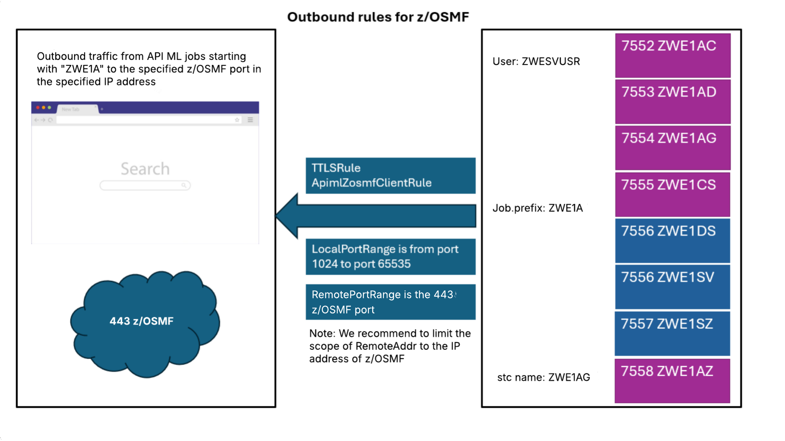

# Enabling AT-TLS

Zowe's core components use TLS networking as well as support AT-TLS as an alternative.
The built-in TLS networking is enabled by default. For details about this built-in TLS support, see [Customizing Native TLS](./tls-configuration.md).

:::info Role: security administrator
:::

As a security administrator, you can configure parameters in Zowe servers to switch to AT-TLS. Review this article for information about AT-TLS inbound and outbound rules, and the required configuration to use AT-TLS in high availability. You can also find troubleshooting tips as well as security recommendations.

## AT-TLS configuration for Zowe

Configuration to support AT-TLS is set in the following section of the `zowe.yaml` file:

```yaml
zowe:
  network:
    # For inbound traffic rules:
    server:
      tls:
        attls: true
    # If outbound traffic rules will be configured:
    client:
      tls:
        attls: true
```

While TLS is not handled by the Zowe Server components with AT-TLS enabled on their own, API Mediation Layer (API ML) requires information about the server certificate that is defined in the AT-TLS rule. Ensure that the server certificates provided by the AT-TLS layer are trusted in the configured Zowe keyring.

:::tip

* We strongly recommend that AT-TLS for inbound connections and outbound connections with X.509 Client Certificate authentication be configured with the same Zowe keyring as in `zowe.yaml`.
* For outbound connections without an X.509 Client Certificate authentication, make sure you use a keyring that contains only the trusted public CA certificates, but does not contain a private key.

:::

:::note Notes

* As the API ML Gateway is a core component of API ML, other components that need to interact with the Gateway, such as Zowe App Server, also require AT-TLS configuration.
* Do not set `attls: true` together with `minTls` or `maxTls`. Zowe does not handle TLS in AT-TLS aware mode.

:::

:::caution Important security consideration

Configuring AT-TLS for Zowe requires careful consideration of security settings. These security settings apply to the X.509 Client Certificate authentication feature in Zowe API Mediation Layer components, as well as for onboarded services that support the X.509 Client Certificates authentication scheme.

Outbound AT-TLS rules (i.e. to make a transparent https call through http) that are configured to send the server certificate should be limited to the services that __require__ service to service authentication. If an API ML-onboarded southbound service needs to support X.509 Client Certificate authentication, we recommend to use the integrated TLS handshake capabilities of API ML. Do not configure an outbound AT-TLS rule for these services.

The Discovery Service endpoints are not reachable by standard API Gateway routing by default.

Zowe v3 includes a new component named ZAAS (Zowe Authentication and Authorization Service). In AT-TLS-aware mode with multi-service deployment mode enabled, calls to this service are all internal between API ML components. These internal calls between the API Gateway and ZAAS must include the X.509 Client Certificate. With the recommended single-service deployment mode enabled, these calls are internal to Zowe, and require no configuration in AT-TLS.
:::

### Required Keyrings

To comply with security settings, Zowe AT-TLS setup requires two keyrings:

* [Keyring with a private key](#keyring-with-a-private-key)
* [Keyring without a private key](#keyring-without-a-private-key)

#### Keyring with a private key

This keyring is used for inbound connections and outbound connections that require X.509 Client Certificate authentication. This keyring contains trusted public CA certificates and a Zowe server certificate with its corresponding private key.
We strongly recommend that you use the same Zowe keyring as in `zowe.yaml`.

#### Keyring without a private key

This keyring is used for outbound connections that do not require nor prohibit X.509 Client Certificate authentication. This keyring contains only the trusted public CA certificates.
We recommend to create a new keyring, similar to the [above-mentioned keyring](./configuring-at-tls-for-zowe-server.md#keyring-with-a-private-key), but __without the private key__.

## AT-TLS rules

This section describes suggested AT-TLS settings, and serves as guidelines to set your AT-TLS rules.

### Inbound rules

The following diagram illustrates inbound rules for single-service deployment mode:


1. Define a generic inbound rule that can be set for all Zowe services. This is done slightly differently between single-service deployment mode and multi-service deployment mode. The following example is for single-service deployment mode. The omission of port 7555 is deliberate for compatibility with multi-service deployment mode, and means that there is a need for two separate rules below.

```bash
TTLSRule ZoweServerRule1
{
  LocalAddr All
  RemoteAddr All
  LocalPortRange 7553-7554 # Discovery and single service
  Jobname ZWE1* # Jobname according to zowe.job.prefix in zowe.yaml
  Direction Inbound
  TTLSGroupActionRef ServerGroupAction
  TTLSEnvironmentActionRef ZoweServerEnvironmentAction
  TTLSConnectionActionRef ZoweServerConnectionAction
}

TTLSRule ZoweServerRule2
{
  LocalAddr All
  RemoteAddr All
  LocalPortRange 7556-7557 # App server and ZSS
  Jobname ZWE1* # Jobname according to zowe.job.prefix in zowe.yaml
  Direction Inbound
  TTLSGroupActionRef ServerGroupAction
  TTLSEnvironmentActionRef ZoweServerEnvironmentAction
  TTLSConnectionActionRef ZoweServerConnectionAction
}

TTLSGroupAction ServerGroupAction
{
  TTLSEnabled On
}

# Keyring with trusted CA certificates and Zowe server certificate with its private key
TTLSKeyringParms ZoweKeyring
{
  Keyring ZWEKRNG
}

TTLSEnvironmentAction ZoweServerEnvironmentAction
{
  HandshakeRole ServerWithClientAuth
  EnvironmentUserInstance 0
  TTLSEnvironmentAdvancedParmsRef ServerEnvironmentAdvParms
  TTLSKeyringParmsRef ZoweKeyring
}

TTLSConnectionAction ZoweServerConnectionAction
{
  HandshakeRole ServerWithClientAuth
  TTLSCipherParmsRef CipherParms
  TTLSConnectionAdvancedParmsRef ZoweConnectionAdvParms
}

TTLSEnvironmentAdvancedParms ServerEnvironmentAdvParms
{
  ClientAuthType Full # Support optional X.509 Client Certificate authentication
  ApplicationControlled Off
  Renegotiation Disabled
  SSLv2 Off
  SSLv3 Off
  TLSv1 Off
  TLSv1.1 Off
  TLSv1.2 On
  TLSv1.3 On
}

TTLSConnectionAdvancedParms ZoweConnectionAdvParms
{
  ApplicationControlled Off
  ServerCertificateLabel apimlcert # Specify the personal server certificate used for the Zowe Server
  CertificateLabel apimlcert # Specify the personal server certificate used for the Zowe Server
  SecondaryMap Off
}
```

<details>

<summary>Click here to see the diagram and example for multi-service deployment mode.</summary>


The following example is for multi-service deployment mode:

```bash
TTLSRule ZoweServerRule
{
  LocalAddr All
  RemoteAddr All
  LocalPortRange 7552-7558 # Range covers all Zowe services
  Jobname ZWE1* # Jobname according to zowe.job.prefix in zowe.yaml
  Direction Inbound
  TTLSGroupActionRef ServerGroupAction
  TTLSEnvironmentActionRef ZoweServerEnvironmentAction
  TTLSConnectionActionRef ZoweServerConnectionAction
}

TTLSGroupAction ServerGroupAction
{
  TTLSEnabled On
}

# Keyring with trusted CA certificates and Zowe server certificate with its private key
TTLSKeyringParms ZoweKeyring
{
  Keyring ZWEKRNG
}

TTLSEnvironmentAction ZoweServerEnvironmentAction
{
  HandshakeRole ServerWithClientAuth
  EnvironmentUserInstance 0
  TTLSEnvironmentAdvancedParmsRef ServerEnvironmentAdvParms
  TTLSKeyringParmsRef ZoweKeyring
}

TTLSConnectionAction ZoweServerConnectionAction
{
  HandshakeRole ServerWithClientAuth
  TTLSCipherParmsRef CipherParms
  TTLSConnectionAdvancedParmsRef ZoweConnectionAdvParms
}

TTLSEnvironmentAdvancedParms ServerEnvironmentAdvParms
{
  ClientAuthType Full # Support optional X.509 Client Certificate authentication
  ApplicationControlled Off
  Renegotiation Disabled
  SSLv2 Off
  SSLv3 Off
  TLSv1 Off
  TLSv1.1 Off
  TLSv1.2 On
  TLSv1.3 On
}

TTLSConnectionAdvancedParms ZoweConnectionAdvParms
{
  ApplicationControlled Off
  ServerCertificateLabel apimlcert # Specify the personal server certificate used for the Zowe Server
  CertificateLabel apimlcert # Specify the personal server certificate used for the Zowe Server
  SecondaryMap Off
}
```  

</details>

2. Verify port ranges.
   
    The `PortRange` of this inbound rule is taken from the list of API Mediation Layer components in the `zowe.yaml` file. The `PortRange` requirement is different between single-service and multi-service deployment. For single-service deployment, the following ports need to be included:
    
    | Port number | Category | Component | Default Jobname |
    |------|------|------|------|
    | 7553 | API Mediation Layer | discovery | ZWE1**AD** |
    | 7554 | API Mediation Layer | Single Service | ZWE1**AG** |
    | 7556 | App Framework | app-server | ZWE1**DS** & ZWE1SV |
    | 7557 | App Framework | zss | ZWE1**SZ** |

    For more information on each component's networking requirements, see [Addressing network requirements](./address-network-requirements.md).

3. Apply your keyring and configuring handshake role.

    i. Replace `ZoweKeyring` in the TTLS configuration with the keyring name configured for your environment (for example, a SAF keyring on z/OS or a file-based keystore).

    __Example:__

    ```
    TTLSKeyringParms ZoweKeyring
    {
      Keyring YOUR_KEYRING_NAME
    }

    ```

    ii. Verify the `HandshakeRole` setting.  
  Ensure `HandshakeRole` is set to `ServerWithClientAuth` for core Zowe services. This setting enables the API Gateway to accept X.509 Client Certificates from API Clients.

    iii.  (Optional) Separate rules by certificate requirement.  
  For services that require X.509 client certificate authentication (e.g., Discovery Service, Gateway Service, ZAAS), keep `HandshakeRole` as `ServerWithClientAuth`.  
  For services that do not require X.509 client certificates (e.g., API Catalog), create separate TTLS rules with `HandshakeRole` as `Server`.

  :::note
  For more information about the use of SAF keyrings with API ML, see [API ML SAF Keyring](../extend/extend-apiml/certificate-management-in-zowe-apiml.md#api-ml-saf-keyring) in the article _Managing certificates in Zowe API Mediation Layer_.
  :::

4. Refresh PAGENT and verify the contents.

* Refresh the policy configuration by issuing the MVS command `F PAGENT,REFRESH`.
* Test connectivity for all inbound services.
* Ensure services that require client certificate authentication are successfully receiving X.509 Client Certificates.

:::tip
We recommend you restart Zowe services after refreshing PAGENT to avoid issues with open connections.
:::

### Outbound rules

Outbound rules in this section allow Zowe services to communicate with each other and to other southbound services using HTTP.

:::caution Important:

Careful consideration needs to be made regarding which rules are to be configured to send X.509 Client Certificate. Since configuration cannot be performed on a per-request basis, it is essential not to configure the rule to send the Zowe Server certificate to the API Gateway or to a southbound service that supports X.509 Client Certificate authentication. Doing so will result in unintentionally authenticating the server ACID (server user ID). Make sure to use [Keyring without a private key](./configuring-at-tls-for-zowe-server.md#keyring-without-a-private-key) in such rules.

:::

#### Outbound rules for communication between Zowe core components

Use the example in this section as a template for internal connections between Zowe core services.

:::caution Important
#### Outbound rule for z/OSMF

Routing to the Discovery Service is disabled by default. Ensure this routing remains disabled in AT-TLS setup to avoid sending the Zowe server certificate during routing from Gateway to the Discovery Service.

The following diagram illustrates outbound rules between Zowe core components for single-service deployment mode:


The rules are slightly different between single-service deployment mode and multi-service deployment mode. The following example is for single-service deployment mode.

:::
This example rule covers the connection between the API Gateway and ZAAS and the z/OSMF instance. This connection is made to authenticate users in z/OS.  

Note the following conditions:

* If `zowe.network.client.tls.attls` is `true`, this rule is assumed set. The requests to z/OSMF are issued using `http`.  
* If `zowe.network.client.tls.attls` is `true` and z/OSMF rule is not set in the PAGENT then you need to specify `zOSMF.scheme: https` in your `zowe.yaml`.

```bash
TTLSRule ZoweClientRule1
{
  LocalAddr All
  LocalPortRange 1024-65535
  RemoteAddr All
  RemotePortRange 7553-7554 # Discovery and single service
  Jobname ZWE1* # Set according to zowe.job.prefix in zowe.yaml - this covers all servers within Zowe core.
  Direction Outbound
  TTLSGroupActionRef ClientGroupAction
  TTLSEnvironmentActionRef ApimlX509ClientEnvAction
  TTLSConnectionActionRef ApimlX509ClientConnAction # X.509 Client Certificate Authentication is required in cross-service API ML communication
}

TTLSRule ZoweClientRule2
{
  LocalAddr All
  LocalPortRange 1024-65535
  RemoteAddr All
  RemotePortRange 7556-7557 # App server and ZSS
  Jobname ZWE1* # Set according to zowe.job.prefix in zowe.yaml - this covers all servers within Zowe core.
  Direction Outbound
  TTLSGroupActionRef ClientGroupAction
  TTLSEnvironmentActionRef ApimlX509ClientEnvAction
  TTLSConnectionActionRef ApimlX509ClientConnAction # X.509 Client Certificate Authentication is required in cross-service API ML communication
}

TTLSGroupAction ClientGroupAction
{
  TTLSEnabled On
}

# Keyring with trusted CA certificates and personal certificate with its private key
TTLSKeyringParms ZoweKeyring
{
  Keyring ZWEKRNG
}

TTLSEnvironmentAction ApimlX509ClientEnvAction
{
  HandshakeRole Client
  TTLSKeyringParmsRef ZoweKeyring
  TTLSEnvironmentAdvancedParmsRef ClientEnvironmentAdvParms
}

TTLSConnectionAction ApimlX509ClientConnAction
{
  HandshakeRole Client
  TTLSCipherParmsRef CipherParms
  TTLSConnectionAdvancedParmsRef ApimlClientX509ConnAdvParms
}

TTLSEnvironmentAdvancedParms ClientEnvironmentAdvParms
{
  Renegotiation Disabled
  3DesKeyCheck Off
  ClientEDHGroupSize Legacy
  ServerEDHGroupSize Legacy
  PeerMinCertVersion Any
  ServerScsv Off
  MiddleBoxCompatMode Off
  CertValidationMode Any
}

TTLSConnectionAdvancedParms ApimlClientX509ConnAdvParms
{
  CertificateLabel Zowe Server # Label of personal certificate in the ZoweKeyring
  ApplicationControlled Off
  SecondaryMap Off
}
```

:::tip Tips:

* `Jobname` is defined explicitly for the API Gateway and ZAAS component and is formed with the `zowe.job.prefix` setting from `zowe.yaml` plus `AG` (Gateway) and `AZ` (ZAAS) suffixes. Choosing `ZWE1A*` as a jobname pattern captures both servers.

* Note that `ZoweNoX509Keyring`, used for outbound rules that do not require or prohibit X.509 Client Certificate authentication, is distinct from `ZoweKeyring`. Refer to the complete PAGENT rules provided later in this article.
  
:::

#### Outbound rule for communication between Zowe core components

<details>
<summary>Click here to see the diagram and example for multi-service deployment mode.</summary>

The following diagram illustrates outbound rules between Zowe core components for multi-service deployment mode:


The following example is for multi-service deployment mode.

```bash
TTLSRule ZoweClientRule
{
  LocalAddr All
  LocalPortRange 1024-65535
  RemoteAddr All
  RemotePortRange 7552-7558 # Range covers API ML, app-server, and zss services
  Jobname ZWE1* # Set according to zowe.job.prefix in zowe.yaml - this covers all servers within Zowe core.
  Direction Outbound
  TTLSGroupActionRef ClientGroupAction
  TTLSEnvironmentActionRef ApimlX509ClientEnvAction
  TTLSConnectionActionRef ApimlX509ClientConnAction # X.509 Client Certificate Authentication is required in cross-service API ML communication
}

TTLSGroupAction ClientGroupAction
{
  TTLSEnabled On
}

# Keyring with trusted CA certificates and personal certificate with its private key
TTLSKeyringParms ZoweKeyring
{
  Keyring ZWEKRNG
}

TTLSEnvironmentAction ApimlX509ClientEnvAction
{
  HandshakeRole Client
  TTLSKeyringParmsRef ZoweKeyring
  TTLSEnvironmentAdvancedParmsRef ClientEnvironmentAdvParms
}

TTLSConnectionAction ApimlX509ClientConnAction
{
  HandshakeRole Client
  TTLSCipherParmsRef CipherParms
  TTLSConnectionAdvancedParmsRef ApimlClientX509ConnAdvParms
}

TTLSEnvironmentAdvancedParms ClientEnvironmentAdvParms
{
  Renegotiation Disabled
  3DesKeyCheck Off
  ClientEDHGroupSize Legacy
  ServerEDHGroupSize Legacy
  PeerMinCertVersion Any
  ServerScsv Off
  MiddleBoxCompatMode Off
  CertValidationMode Any
}

TTLSConnectionAdvancedParms ApimlClientX509ConnAdvParms
{
  CertificateLabel Zowe Server # Label of personal certificate in the ZoweKeyring
  ApplicationControlled Off
  SecondaryMap Off
}
```
</details>

#### Outbound rule for communication between API Gateway and southbound services

The following diagram illustrates the rule for the API ML to a southbound service in single-service deployment mode.

TODO: Andrew's diagram goes here.

<details>
<summary>Click here to see the diagram for multi-service deployment mode.</summary>


</details>

In this example, the rule covers all outbound connections originating from the API Gateway to a server that is not part of Zowe, such as an extension's server, listening on port `8080`.
Such a rule can apply to any remote destination, as seen in the `ZoweClientRule` for Zowe core servers in the section [Outbound rule for communication between Zowe core components](./configuring-at-tls-for-zowe-server.md#outbound-rule-for-communication-between-zowe-core-components).

<details>
<summary>Click here for an example of a rule covering API Gateway to extension servers.</summary>

This example covers routing scenarios.

```bash
TTLSRule ApimlServiceClientRule
{
  LocalAddr All
  LocalPortRange 1024-65535
  RemoteAddr All
  RemotePortRange 8080 # Set to range of ports where services are listening
  Jobname ZWE1A* # Generate according to zowe.job.prefix in zowe.yaml
  Direction Outbound
  TTLSGroupActionRef ClientGroupAction
  TTLSEnvironmentActionRef ApimlNoX509ClientEnvAction
  TTLSConnectionActionRef ApimlNoX509ClientConnAction # Do not send X.509 Client Certificate
}

TTLSGroupAction ClientGroupAction
{
  TTLSEnabled On
}

# Keyring without a default personal certificate and its private key; contains only trusted CA certificates
TTLSKeyringParms ZoweNoX509Keyring
{
  Keyring ZoweAttlsKeyring
}

TTLSEnvironmentAction ApimlNoX509ClientEnvAction
{
  HandshakeRole Client
  TTLSKeyringParmsRef ZoweNoX509Keyring
  TTLSEnvironmentAdvancedParmsRef ClientEnvironmentAdvParms
}

TTLSConnectionAction ApimlNoX509ClientConnAction
{
  HandshakeRole Client
  TTLSCipherParmsRef CipherParms
  TTLSConnectionAdvancedParmsRef ApimlClientNoX509ConnAdvParms
}

TTLSEnvironmentAdvancedParms ClientEnvironmentAdvParms
{
  Renegotiation Disabled
  3DesKeyCheck Off
  ClientEDHGroupSize Legacy
  ServerEDHGroupSize Legacy
  PeerMinCertVersion Any
  ServerScsv Off
  MiddleBoxCompatMode Off
  CertValidationMode Any
}

TTLSConnectionAdvancedParms ApimlClientNoX509ConnAdvParms
{
# No CertificateLabel; Keyring contains no X.509 Client Certificate
  ApplicationControlled Off
  SecondaryMap Off
}
```

:::caution Important

Outbound connections from the Gateway to southbound services (onboarded services) must not send the Zowe server certificate if the service accepts X.509 Client Certificate authentication. If the server certificate is sent, the server user is subsequently authenticated.

:::

</details>

#### Outbound rule for services that validate tokens against the API Mediation Layer

In this scenario, the services issue a request against the API Gateway to validate the received authentication token.

This scenario includes the following services:

* Services that set `zoweJwt` as the authentication scheme
* Services that require an Open ID Connect (OIDC) token
* Forwarded X.509 certificates

For a full AT-TLS setup we strongly recommend the following conditions:

* To have an Outbound rule from the service to the API Gateway.
* To have an Outbound rule set for the onboarding process against the Discovery Service.

Ensure that these rules are followed:

* Outbound rule to the API Gateway: __Do not__ set X.509 Client Certificate.
* Outbound rule to the Discovery Service: Sends X.509 Client Certificate to authenticate during onboarding.

:::note
Services running outside of z/OS cannot use AT-TLS to make transparent https calls though http, hence there are no Outbound rules from such services to the API Gateway and the Discovery Service.
:::

#### Outbound rule for z/OSMF

The following diagram illustrates outbound rules for z/OSMF in single-service deployment mode:


<details>

<summary>Click here to see the diagram with outbound rules for z/OSMF in multi-service deployment mode.</summary>




</details>

This example rule covers the connection between the API Gateway (and ZAAS in multi-server deployment mode) and the z/OSMF instance. This connection is made to authenticate users in z/OS. The example rule is the same for single-service and multi-service deployment mode.

If `zowe.network.client.tls.attls` is `true`, this rule is assumed set. The requests to z/OSMF are issued using `http`.
If `zowe.network.client.tls.attls` is `true` and z/OSMF rule is not set in the PAGENT then you need to specify `zOSMF.scheme: https` in your `zowe.yaml`.

```bash
TTLSRule ApimlZosmfClientRule
{
  LocalAddr All
  LocalPortRange 1024-65535 # Using any outbound port
  RemoteAddr All
  RemotePortRange 443 # Set to z/OSMF port
  Jobname ZWE1A* # Set according to zowe.job.prefix in zowe.yaml. Zowe components *AG and *AZ are needed in this rule.
  Direction Outbound
  TTLSGroupActionRef ClientGroupAction
  TTLSEnvironmentActionRef ApimlNoX509ClientEnvAction
  TTLSConnectionActionRef ApimlNoX509ClientConnAction # No X.509 Client Certificate required
}

TTLSGroupAction ClientGroupAction
{
  TTLSEnabled On
}

# Keyring without a default personal certificate and private key; contains only trusted CA certificates
TTLSKeyringParms ZoweNoX509Keyring
{
  Keyring ZoweAttlsKeyring
}

TTLSEnvironmentAction ApimlNoX509ClientEnvAction
{
  HandshakeRole Client
  TTLSKeyringParmsRef ZoweNoX509Keyring
  TTLSEnvironmentAdvancedParmsRef ClientEnvironmentAdvParms
}

TTLSConnectionAction ApimlNoX509ClientConnAction
{
  HandshakeRole Client
  TTLSCipherParmsRef CipherParms
  TTLSConnectionAdvancedParmsRef ZoweClientNoX509ConnAdvParms
}

TTLSEnvironmentAdvancedParms ClientEnvironmentAdvParms
{
  Renegotiation Disabled
  3DesKeyCheck Off
  ClientEDHGroupSize Legacy
  ServerEDHGroupSize Legacy
  PeerMinCertVersion Any
  ServerScsv Off
  MiddleBoxCompatMode Off
  CertValidationMode Any
}

TTLSConnectionAdvancedParms ZoweClientNoX509ConnAdvParms
{
# No CertificateLabel; Keyring contains no X.509 Client Certificate
  ApplicationControlled Off
  SecondaryMap Off
  SSLv3 Off
  TLSv1 Off
  TLSv1.1 Off
  TLSv1.2 On
  TLSv1.3 On
}
```

:::tip Tips:
* `Jobname` is defined explicitly for the API Gateway and ZAAS component and is formed with the `zowe.job.prefix` setting from `zowe.yaml` plus `AG` (Gateway) and `AZ` (ZAAS) suffixes. Choosing `ZWE1A*` as a jobname pattern captures both servers.

* Note that `ZoweNoX509Keyring`, used for outbound rules that do not require or prohibit X.509 Client Certificate authentication, is distinct from `ZoweKeyring`. Refer to the complete PAGENT rules provided later in this article.
  
:::

### Ciphers

:::note
This list of ciphers is provided as an example only. Actual ciphers should be customized according to your specific configuration.
:::

The list of supported ciphers should be constructed according to the TLS supported versions.
Ensure that the cipher list has matches with non-AT-TLS-aware clients.

<details>
<summary>Click here for an example of Cipher parameters.</summary>

```bash
TTLSCipherParms CipherParms
{
  V2CipherSuites TLS_RC4_128_WITH_MD5
  V2CipherSuites TLS_RC4_128_EXPORT40_WITH_MD5
  V2CipherSuites TLS_RC2_CBC_128_CBC_WITH_MD5
  V2CipherSuites TLS_RC2_CBC_128_CBC_EXPORT40_WITH_MD5
  V2CipherSuites TLS_RC2_CBC_128_CBC_EXPORT40_WITH_MD5
  V2CipherSuites TLS_DES_192_EDE3_CBC_WITH_MD5
  V3CipherSuites TLS_ECDHE_ECDSA_WITH_AES_128_CBC_SHA256
  V3CipherSuites TLS_ECDHE_ECDSA_WITH_AES_256_CBC_SHA384
  V3CipherSuites TLS_ECDHE_ECDSA_WITH_AES_128_GCM_SHA256
  V3CipherSuites TLS_ECDHE_ECDSA_WITH_AES_256_GCM_SHA384
  V3CipherSuites TLS_ECDHE_RSA_WITH_AES_256_GCM_SHA384
  V3CipherSuites TLS_AES_128_GCM_SHA256
  V3CipherSuites TLS_AES_256_GCM_SHA384
  V3CipherSuites TLS_CHACHA20_POLY1305_SHA256
}
```

</details>

## Using AT-TLS for API ML in High Availability

AT-TLS settings for a Zowe installation configured in High Availability mode do not differ extensively. Changes need to be made to the previously described rules to allow for cross-lpar communication:

Ensure that the `RemoteAddr` setting in the rules accounts for the following connections:

* Discovery Service to Discovery Service. This is the replica request.
* Gateway Service to southbound services (including app-server and ZSS) running in another LPAR.
* Gateway Service to ZAAS running in another LPAR.
* Southbound services to the Discovery Service. This applies during onboarding.
* All outbound connections need to account for all LPARs including the same where the rules are applied.

## Multi-tenancy deployment

For a specific scenario when Central API ML is running on z/OS with AT-TLS enabled, it is important to override the protocol for the external URL. This information is used by the Central API ML to call domain API ML and needs to reflect the outbound AT-TLS rule. In this case, update your domain API ML configuration:

```yaml
zowe:
  components:
    gateway:
      apiml:
        gateway:
          externalProtocol: http
```

## AT-TLS Troubleshooting

This section describes some common issues when using AT-TLS with Zowe and how to resolve these issues.

### The message `This combination of port requires SSL` is thrown when accessing an API ML service through a Browser

Make sure the URL starts with `https://`. This message indicates that AT-TLS rules are in place and it is trying to connect on an unsecured port to the API Gateway, however the latter is still only listening on a application-controlled secured port.

__Solution:__
Review settings in the API Gateway. Ensure that the changes described in [AT-TLS configuration for Zowe](#at-tls-configuration-for-zowe) are applied.

### AT-TLS rules are not applied

If the application is responding in http, the application may not be properly configured to support http-only calls. AT-TLS is not correctly configured.

__Solution:__

Ensure the rules are active and that the filters on port range and job names are properly set.

### Non matching ciphers / protocols

An error can occur if the [list of ciphers](#ciphers) or the TLS protocol does not match between the ones configured in the AT-TLS rules and the ones used by non AT-TLS-aware clients.

__Solution:__
Review the supported TLS versions and ciphers used in both the client and the server.

### Zowe Desktop IP Explorer or Editor does not work

If the Zowe Desktop IP Explorer or Editor are not working correctly, either by failing to load or showing no data, it means there is a problem accessing the ZSS server.

__Solution:__

Ensure the `components.zss.agent.http.ipAddresses` includes a reachable address. If this field unset, it defaults to `127.0.0.1`, while other Zowe servers default to `0.0.0.0`.

__Sample configuration:__

```yaml
components:
  zss:
    enabled: true
    port: 7557
    crossMemoryServerName: ZWESIS_STD
    agent:
      64bit: true
    http:
      ipAddresses: 
        - "0.0.0.0"
```

### Zowe Desktop TN3270 or VT-Terminal Websocket 1006 Errors

If the Zowe Desktop TN3270 Application or VT Terminal Application are displaying a websocket error 1006, there is an issue with CORS configuration. This will be fixed in Zowe 3.4.0, and can be fixed manually in earlier releases.

__Solution:__

We recommend contacting your conformant support provider for assistance applying this fix.

Add required metadata manually to the ZLUX app in the API ML Discovery service. The metadata will need to be added after any restart of Zowe.

Add the following metadata to the ZLUX eureka app:
* `apiml.corsEnabled`: `true`
* `apiml.corsAllowedOrigins` : `https://<your_zowe_host>:<catalog_port>,https://<your_zowe_host>:<gateway_port>`

<details>

<summary>Click here for complete instructions to apply the above fix.</summary>

To apply the required metadata to the Discovery service, ensure that you satisfy the following conditions: 

* X.509 Client Certificate for authentication. Other forms of authentication are _not supported_.
* Network access to the host where the API ML Discovery Service is running.
* The API ML Gateway port value. This can be found in the zowe.yaml property `components.gateway.port`.
* The Discovery Service port value. This can be found in the zowe.yaml property `components.discovery.port`.
* The App Server port value. This can be found in the zowe.yaml property `components.app-server.port`.
* The API Catalog port value. This can be found in the zowe.yaml property `components.api-catalog.port`.
6. A REST client or command line tool.

To see the current list of metadata for the ZLUX service, make the following `GET` request to the Zowe API Deiscovery service endpoint: 

`GET https://<your_zowe_host>:<your_discovery_port>/eureka/v2/apps/ZLUX`

You should get an HTTP 200 response with a JSON response body containing the service metadata. Verify that `apiml.corsEnabled` and `apiml.corsAllowedOrigins` are set correctly.

```json
// ... other fields before
     ,
     "metadata": {
          "apiml.service.description": "This list includes core APIs for management of plugins, management of the server itself, and APIs brought by plugins and the app server agent, ZSS. Plugins that do not bring their own API documentation are shown here as stubs.",
          "apiml.catalog.tile.version": "3.3.0",    
      // ...more metadata fields
 }
```

To update the ZLUX service metadata, make the following `PUT` request once for each metadata field as described in the solution above. This request requires an additional URL-encoded field `<your_host>:zlux:<your_app_server_port>`, and `metadata_value` should also be URL-encoded.  

`PUT https://<your_zowe_host>:<your_discovery_port>/eureka/v2/apps/ZLUX/<your_host>%3Azlux%3A<your_app_server_port>/metadata?<metadata_key>=<metadata_value>`
</details>

<details>
<summary>Click here to review sample requests using cURL.</summary>

Component ports use the following values:

* host `localhost`
* APIML Catalog port `7552`
* APIML Discovery Service port `7553`
* APIML Gateway port `7554`
* App Server port `7556`

Use the following command to see the current metadata:

```curl
curl --request GET \
  --cert <path_to_your_client_cert> \
  --key <path_to_your_client_cert_key> \
  --url https://localost:7553/eureka/v2/apps/ZLUX
```

Use the following commands to update the metadata in 2 requests:

```curl
curl --request PUT \
  --cert <path_to_your_client_cert> \
  --key <path_to_your_client_cert_key> \
  --url 'https://localhost:7553/eureka/v2/apps/ZLUX/localhost%3Azlux%3A7556/metadata?apiml.corsEnabled=true'
```

```curl
curl --request PUT \
  --cert <path_to_your_client_cert> \
  --key <path_to_your_client_cert_key> \
  --url 'https://localhost:7553/eureka/v2/apps/ZLUX/localhost%3Azlux%3A7556/metadata?apiml.corsAllowedOrigins=https%3A%2F%2Flocalhost%3A7552%2Chttps%3A%2F%2Flocalhost%3A7554'
```

</details>

### Additional troubleshooting

When asking for support, make sure to follow IBM guides for troubleshooting AT-TLS problems. Dor details, see _Diagnosing Application Transparent Transport Layer Security (AT-TLS)_ in the IBM documentation.

Ensure you collect the logs and current configurations when contacting support.

## Full example of AT-TLS configuration

Review full working example of an AT-TLS configuration file on z/OS bor both single-service and multi-service deployment mode, specifically used for defining secure communication between different services in a mainframe environment. All port values are examples.
The examples are commented for convenience.
<details>

<summary>Click here to review the full AT-TLS configuration file for single-service deployment mode.</summary>

```bash
# Main inbound rules, all Zowe services have them defined.
TTLSRule ZoweServerRule1
{
  LocalAddr All
  RemoteAddr All
  LocalPortRange 7553-7554 # Discovery and single service
  Jobname ZWE1* # Jobname according to zowe.job.prefix in zowe.yaml
  Direction Inbound
  TTLSGroupActionRef ServerGroupAction
  TTLSEnvironmentActionRef ZoweServerEnvironmentAction
  TTLSConnectionActionRef ZoweServerConnectionAction
}

TTLSRule ZoweServerRule2
{
  LocalAddr All
  RemoteAddr All
  LocalPortRange 7556-7557 # App server and ZSS
  Jobname ZWE1* # Jobname according to zowe.job.prefix in zowe.yaml
  Direction Inbound
  TTLSGroupActionRef ServerGroupAction
  TTLSEnvironmentActionRef ZoweServerEnvironmentAction
  TTLSConnectionActionRef ZoweServerConnectionAction
}
# Example southbound service inbound rule
TTLSRule ApimlDCServerRule
{
  LocalAddr All
  RemoteAddr All
  LocalPortRange 8080-8090 # Example service ports
  Jobname ZWE1DC* # Jobname prefix (optional)
  Direction Inbound
  TTLSGroupActionRef ServerGroupAction
  TTLSEnvironmentActionRef ZoweDCServerEnvironmentAction
  TTLSConnectionActionRef ZoweDCServerConnectionAction
}

TTLSGroupAction ServerGroupAction
{
  TTLSEnabled On
}

# Environment action for all Zowe service
TTLSEnvironmentAction ZoweServerEnvironmentAction
{
  HandshakeRole ServerWithClientAuth # Zowe Servers can optionally support X.509 Client Certificate authentication
  EnvironmentUserInstance 0
  TTLSEnvironmentAdvancedParmsRef ZoweServerEnvironmentAdvParms
  TTLSKeyringParmsRef ZoweKeyring
}

# Environment action for sample southbound service
TTLSEnvironmentAction ZoweDCServerEnvironmentAction
{
  HandshakeRole Server
  EnvironmentUserInstance 0
  TTLSEnvironmentAdvancedParmsRef ZoweDCServerEnvironmentAdvParms
  TTLSKeyringParmsRef ZoweKeyring
}

# Keyring with trusted CA certificates and personal certificate with its private key
TTLSKeyringParms ZoweKeyring
{
  Keyring ZWEKRNG
}

# Keyring without a default personal certificate and its private key; contains only trusted CA certificates
TTLSKeyringParms ZoweNoX509Keyring
{
  Keyring ZoweAttlsKeyring
}

# Advanced TLS settings, choose TLS versions supported.
TTLSEnvironmentAdvancedParms ZoweServerEnvironmentAdvParms
{
  ClientAuthType Full # Support optional X.509 Client Certificate authentication
  ApplicationControlled Off
  Renegotiation Disabled
  SSLv2 Off
  SSLv3 Off
  TLSv1 Off
  TLSv1.1 Off
  TLSv1.2 On
  TLSv1.3 On
}

# Advanced TLS settings, choose TLS versions supported.
TTLSEnvironmentAdvancedParms ZoweDCServerEnvironmentAdvParms
{
  ApplicationControlled Off
  Renegotiation Disabled
  SSLv2 Off
  SSLv3 Off
  TLSv1 Off
  TLSv1.1 Off
  TLSv1.2 On
  TLSv1.3 On
}

# Server Connection Action for API ML core services.
TTLSConnectionAction ZoweServerConnectionAction
{
  HandshakeRole ServerWithClientAuth # API ML Core Services use X.509 Client Certificate authentication
  TTLSCipherParmsRef CipherParms
  TTLSConnectionAdvancedParmsRef ZoweServerConnectionAdvParms
}

# Server Connection Action for DC Service.
TTLSConnectionAction ZoweDCServerConnectionAction
{
  HandshakeRole Server 
  TTLSCipherParmsRef CipherParms
  TTLSConnectionAdvancedParmsRef ZoweDCServerConnectionAdvParms
}

# API ML Server connection action.
# ServerCertificateLabel indicates which certificate is used on server-side for establishing TLs connections.
TTLSConnectionAdvancedParms ZoweServerConnectionAdvParms
{
  ApplicationControlled Off
  ServerCertificateLabel apimlcert
  SecondaryMap Off
}

# Service advanced server connection action.
TTLSConnectionAdvancedParms ZoweDCServerConnectionAdvParms
{
  ApplicationControlled Off
  ServerCertificateLabel apimlcert
  SecondaryMap Off
}

# Example outbound TTLS rules for a Zowe client calling a Zowe server
# In this scenario this client (a southbound service) presents X.509 Client Certificate to authenticate (for example during onboarding)
TLSRule ZoweClientRule1
{
  LocalAddr All
  LocalPortRange 1024-65535
  RemoteAddr All
  RemotePortRange 7553-7554 # Discovery and single service
  Jobname ZWE1* # Set according to zowe.job.prefix in zowe.yaml - this covers all servers within Zowe core.
  Direction Outbound
  TTLSGroupActionRef ClientGroupAction
  TTLSEnvironmentActionRef ApimlX509ClientEnvAction
  TTLSConnectionActionRef ApimlX509ClientConnAction # X.509 Client Certificate Authentication is required in cross-service API ML communication
}

TTLSRule ZoweClientRule2
{
  LocalAddr All
  LocalPortRange 1024-65535
  RemoteAddr All
  RemotePortRange 7556-7557 # App server and ZSS
  Jobname ZWE1* # Set according to zowe.job.prefix in zowe.yaml - this covers all servers within Zowe core.
  Direction Outbound
  TTLSGroupActionRef ClientGroupAction
  TTLSEnvironmentActionRef ApimlX509ClientEnvAction
  TTLSConnectionActionRef ApimlX509ClientConnAction # X.509 Client Certificate Authentication is required in cross-service API ML communication
}

# Example outbound rule for connections from Catalog and API ML Gateway (during request routing) to a southbound service running in port 40030 
# Note EnvironmentAction defines a Keyring that does not contain X.509 Client Certificate with its private key
# Note ConnectionAction doesn't configure X.509 Client Certificate.
TTLSRule ApimlServiceClientRule
{
  LocalAddr All
  LocalPortRange 1024-65535
  RemoteAddr All
  RemotePortRange 40030 # Service ports
  Jobname ZWE1A*
  Direction Outbound
  TTLSGroupActionRef ClientGroupAction
  TTLSEnvironmentActionRef ApimlNoX509ClientEnvAction
  TTLSConnectionActionRef ApimlNoX509ClientConnAction
}

# Optional. Can configure the outbound connection from API Gateway and ZAAS to work with AT-TLS while connecting to z/OSMF.
TTLSRule ApimlZosmfClientRule
{
  LocalAddr All
  LocalPortRange 1024-65535
  RemoteAddr All
  RemotePortRange 443 # z/OSMF Port
  Jobname ZWE1A*
  Direction Outbound
  TTLSGroupActionRef ClientGroupAction
  TTLSEnvironmentActionRef ApimlNoX509ClientEnvAction
  TTLSConnectionActionRef ApimlNoX509ClientConnAction
}

# Example outbound rule from API Gateway to app server and zss.
TTLSRule ApimlZLUXClientRule
{
  LocalAddr All
  LocalPortRange 1024-65535
  RemoteAddr All
  RemotePortRange 7556-7557 
  Jobname ZWE1AG*
  Direction Outbound
  TTLSGroupActionRef ClientGroupAction
  TTLSEnvironmentActionRef ApimlNoX509ClientEnvAction
  TTLSConnectionActionRef ApimlNoX509ClientConnAction
}

TTLSGroupAction ClientGroupAction
{
  TTLSEnabled On
}

TTLSEnvironmentAction ApimlX509ClientEnvAction
{
  HandshakeRole Client
  TTLSKeyringParmsRef ZoweKeyring # Keyring contains personal X.509 certificate and its private key
  TTLSEnvironmentAdvancedParmsRef ClientEnvironmentAdvParms
  EnvironmentUserInstance 0
}

TTLSEnvironmentAction ApimlNoX509ClientEnvAction
{
  HandshakeRole Client
  TTLSKeyringParmsRef NoKeyKeyring # Keyring does not contain personal X.509 certificate and its private key
  TTLSEnvironmentAdvancedParmsRef ClientEnvironmentAdvParms
  EnvironmentUserInstance 0
}

TTLSEnvironmentAdvancedParms ClientEnvironmentAdvParms
{
  Renegotiation Disabled
  3DesKeyCheck Off
  ClientEDHGroupSize Legacy
  ServerEDHGroupSize Legacy
  PeerMinCertVersion Any
  ServerScsv Off
  MiddleBoxCompatMode Off
  CertValidationMode Any
}

TTLSConnectionAction ApimlX509ClientConnAction
{
  HandshakeRole Client
  TTLSCipherParmsRef CipherParms
  TTLSConnectionAdvancedParmsRef ZoweClientX509ConnAdvParms
}

TTLSConnectionAction ApimlNoX509ClientConnAction
{
  HandshakeRole Client
  TTLSCipherParmsRef CipherParms
  TTLSConnectionAdvancedParmsRef ZoweClientNoX509ConnAdvParms
}

# In case the connection needs/requires X.509 Client Certificate authentication, this is where the label is set for outbound connections.
TTLSConnectionAdvancedParms ZoweClientX509ConnAdvParms
{
  CertificateLabel apimlcert
  SecondaryMap Off
  SSLv3 Off
  TLSv1 Off
  TLSv1.1 Off
  TLSv1.2 On
  TLSv1.3 On
}

# ConnectionAdvanced parameters for connections not requiring X.509 Client Certificate authentication
# Note: If the set Keyring has a default certificate this will not prevent sending it
TTLSConnectionAdvancedParms ZoweClientNoX509ConnAdvParms
{
# No CertificateLabel; Keyring contains no X.509 Client Certificate
  ApplicationControlled Off
  SecondaryMap Off
  SSLv3 Off
  TLSv1 Off
  TLSv1.1 Off
  TLSv1.2 On
  TLSv1.3 On
}

# Example list of supported ciphers in handshake. Validate and filter this list based on local setup
TTLSCipherParms                   CipherParms
{
  V3CipherSuites                  TLS_AES_128_GCM_SHA256
  V3CipherSuites                  TLS_AES_256_GCM_SHA384
  V3CipherSuites                  TLS_CHACHA20_POLY1305_SHA256
  V3CipherSuites                  TLS_ECDHE_ECDSA_WITH_AES_256_GCM_SHA384
  V3CipherSuites                  TLS_ECDHE_ECDSA_WITH_AES_128_GCM_SHA256
  V3CipherSuites                  TLS_ECDHE_RSA_WITH_AES_256_GCM_SHA384
  V3CipherSuites                  TLS_ECDHE_ECDSA_WITH_AES_256_CBC_SHA
  V3CipherSuites                  TLS_ECDHE_ECDSA_WITH_AES_128_CBC_SHA256
  V3CipherSuites                  TLS_ECDH_RSA_WITH_AES_256_GCM_SHA384
  V3CipherSuites                  TLS_ECDHE_ECDSA_WITH_AES_256_CBC_SHA384
  V3CipherSuites                  TLS_ECDHE_RSA_WITH_AES_256_CBC_SHA384
  V3CipherSuites                  TLS_ECDH_RSA_WITH_AES_256_CBC_SHA384
  V3CipherSuites                  TLS_DHE_RSA_WITH_AES_256_CBC_SHA
  V3CipherSuites                  TLS_ECDHE_RSA_WITH_AES_128_GCM_SHA256
  V3CipherSuites                  TLS_ECDH_ECDSA_WITH_AES_128_GCM_SHA256
  V3CipherSuites                  TLS_ECDH_RSA_WITH_AES_128_GCM_SHA256
  V3CipherSuites                  TLS_ECDHE_RSA_WITH_AES_128_CBC_SHA256
  V3CipherSuites                  TLS_ECDH_ECDSA_WITH_AES_128_CBC_SHA256
  V3CipherSuites                  TLS_ECDH_RSA_WITH_AES_128_CBC_SHA256
  V3CipherSuites                  TLS_RSA_WITH_AES_128_CBC_SHA
  V3CipherSuites                  TLS_ECDH_ECDSA_WITH_AES_256_GCM_SHA384
  V3CipherSuites                  TLS_ECDH_ECDSA_WITH_AES_256_CBC_SHA384
  V3CipherSuites                  TLS_RSA_WITH_AES_256_GCM_SHA384
  V3CipherSuites                  TLS_DHE_DSS_WITH_AES_256_GCM_SHA384
  V3CipherSuites                  TLS_DHE_RSA_WITH_AES_256_GCM_SHA384
  V3CipherSuites                  TLS_DH_DSS_WITH_AES_256_GCM_SHA384
  V3CipherSuites                  TLS_DH_RSA_WITH_AES_256_GCM_SHA384
  V3CipherSuites                  TLS_RSA_WITH_AES_256_CBC_SHA256
  V3CipherSuites                  TLS_DHE_DSS_WITH_AES_256_CBC_SHA256
  V3CipherSuites                  TLS_DHE_RSA_WITH_AES_256_CBC_SHA256
  V3CipherSuites                  TLS_DH_DSS_WITH_AES_256_CBC_SHA256
  V3CipherSuites                  TLS_DH_RSA_WITH_AES_256_CBC_SHA256
  V3CipherSuites                  TLS_RSA_WITH_AES_256_CBC_SHA
  V3CipherSuites                  TLS_ECDHE_RSA_WITH_AES_256_CBC_SHA
  V3CipherSuites                  TLS_ECDH_ECDSA_WITH_AES_256_CBC_SHA
  V3CipherSuites                  TLS_ECDH_RSA_WITH_AES_256_CBC_SHA
  V3CipherSuites                  TLS_DHE_DSS_WITH_AES_256_CBC_SHA
  V3CipherSuites                  TLS_DH_DSS_WITH_AES_256_CBC_SHA
  V3CipherSuites                  TLS_DH_RSA_WITH_AES_256_CBC_SHA
  V3CipherSuites                  TLS_RSA_WITH_AES_128_GCM_SHA256
  V3CipherSuites                  TLS_DHE_DSS_WITH_AES_128_GCM_SHA256
  V3CipherSuites                  TLS_DHE_RSA_WITH_AES_128_GCM_SHA256
  V3CipherSuites                  TLS_DH_DSS_WITH_AES_128_GCM_SHA256
  V3CipherSuites                  TLS_DH_RSA_WITH_AES_128_GCM_SHA256
  V3CipherSuites                  TLS_RSA_WITH_AES_128_CBC_SHA256
  V3CipherSuites                  TLS_DHE_DSS_WITH_AES_128_CBC_SHA256
  V3CipherSuites                  TLS_DHE_RSA_WITH_AES_128_CBC_SHA256
  V3CipherSuites                  TLS_DH_DSS_WITH_AES_128_CBC_SHA256
  V3CipherSuites                  TLS_DH_RSA_WITH_AES_128_CBC_SHA256
  V3CipherSuites                  TLS_ECDHE_ECDSA_WITH_AES_128_CBC_SHA
  V3CipherSuites                  TLS_ECDHE_RSA_WITH_AES_128_CBC_SHA
  V3CipherSuites                  TLS_ECDH_ECDSA_WITH_AES_128_CBC_SHA
  V3CipherSuites                  TLS_ECDH_RSA_WITH_AES_128_CBC_SHA
  V3CipherSuites                  TLS_DHE_DSS_WITH_AES_128_CBC_SHA
  V3CipherSuites                  TLS_DHE_RSA_WITH_AES_128_CBC_SHA
  V3CipherSuites                  TLS_DH_DSS_WITH_AES_128_CBC_SHA
  V3CipherSuites                  TLS_DH_RSA_WITH_AES_128_CBC_SHA
}
```

</details>
<details>

<summary>Click here to review the full AT-TLS configuration file for multi-service deployment mode.</summary>

```bash
# Main inbound rule, all Zowe services have it defined.
TTLSRule ZoweServerRule
{
  LocalAddr All
  RemoteAddr All
  LocalPortRange 7552-7558 # Range covers all possible Zowe services
  Jobname ZWE1*
  Direction Inbound
  TTLSGroupActionRef ServerGroupAction
  TTLSEnvironmentActionRef ZoweServerEnvironmentAction
  TTLSConnectionActionRef ZoweServerConnectionAction
}

# Example southbound service inbound rule
TTLSRule ApimlDCServerRule
{
  LocalAddr All
  RemoteAddr All
  LocalPortRange 8080-8090 # Example service ports
  Jobname ZWE1DC* # Jobname prefix (optional)
  Direction Inbound
  TTLSGroupActionRef ServerGroupAction
  TTLSEnvironmentActionRef ZoweDCServerEnvironmentAction
  TTLSConnectionActionRef ZoweDCServerConnectionAction
}

TTLSGroupAction ServerGroupAction
{
  TTLSEnabled On
}

# Environment action for all Zowe service
TTLSEnvironmentAction ZoweServerEnvironmentAction
{
  HandshakeRole ServerWithClientAuth # Zowe Servers can optionally support X.509 Client Certificate authentication
  EnvironmentUserInstance 0
  TTLSEnvironmentAdvancedParmsRef ZoweServerEnvironmentAdvParms
  TTLSKeyringParmsRef ZoweKeyring
}

# Environment action for sample southbound service
TTLSEnvironmentAction ZoweDCServerEnvironmentAction
{
  HandshakeRole Server
  EnvironmentUserInstance 0
  TTLSEnvironmentAdvancedParmsRef ZoweDCServerEnvironmentAdvParms
  TTLSKeyringParmsRef ZoweKeyring
}

# Keyring with trusted CA certificates and personal certificate with its private key
TTLSKeyringParms ZoweKeyring
{
  Keyring ZWEKRNG
}

# Keyring without a default personal certificate and its private key; contains only trusted CA certificates
TTLSKeyringParms ZoweNoX509Keyring
{
  Keyring ZoweAttlsKeyring
}

# Advanced TLS settings, choose TLS versions supported.
TTLSEnvironmentAdvancedParms ZoweServerEnvironmentAdvParms
{
  ClientAuthType Full # Support optional X.509 Client Certificate authentication
  ApplicationControlled Off
  Renegotiation Disabled
  SSLv2 Off
  SSLv3 Off
  TLSv1 Off
  TLSv1.1 Off
  TLSv1.2 On
  TLSv1.3 On
}

# Advanced TLS settings, choose TLS versions supported.
TTLSEnvironmentAdvancedParms ZoweDCServerEnvironmentAdvParms
{
  ApplicationControlled Off
  Renegotiation Disabled
  SSLv2 Off
  SSLv3 Off
  TLSv1 Off
  TLSv1.1 Off
  TLSv1.2 On
  TLSv1.3 On
}

# Server Connection Action for API ML core services.
TTLSConnectionAction ZoweServerConnectionAction
{
  HandshakeRole ServerWithClientAuth # API ML Core Services use X.509 Client Certificate authentication
  TTLSCipherParmsRef CipherParms
  TTLSConnectionAdvancedParmsRef ZoweServerConnectionAdvParms
}

# Server Connection Action for DC Service.
TTLSConnectionAction ZoweDCServerConnectionAction
{
  HandshakeRole Server 
  TTLSCipherParmsRef CipherParms
  TTLSConnectionAdvancedParmsRef ZoweDCServerConnectionAdvParms
}

# API ML Server connection action.
# ServerCertificateLabel indicates which certificate is used on server-side for establishing TLs connections.
TTLSConnectionAdvancedParms ZoweServerConnectionAdvParms
{
  ApplicationControlled Off
  ServerCertificateLabel apimlcert
  SecondaryMap Off
}

# Service advanced server connection action.
TTLSConnectionAdvancedParms ZoweDCServerConnectionAdvParms
{
  ApplicationControlled Off
  ServerCertificateLabel apimlcert
  SecondaryMap Off
}

# Example outbound TTLS rule for a Zowe client calling a Zowe server
# In this scenario this client (a southbound service) presents X.509 Client Certificate to authenticate (for example during onboarding)
TTLSRule ZoweClientRule
{
  LocalAddr All
  LocalPortRange 1024-65535
  RemoteAddr All
  RemotePortRange 7552-7558 # API ML, app-server, and zss Zowe core services
  Jobname ZWE1*
  Direction Outbound
  TTLSGroupActionRef ClientGroupAction
  TTLSEnvironmentActionRef ApimlX509ClientEnvAction
  TTLSConnectionActionRef ApimlX509ClientConnAction
}

# Example outbound rule for connections from Catalog and API ML Gateway (during request routing) to a southbound service running in port 40030 
# Note EnvironmentAction defines a Keyring that does not contain X.509 Client Certificate with its private key
# Note ConnectionAction doesn't configure X.509 Client Certificate.
TTLSRule ApimlServiceClientRule
{
  LocalAddr All
  LocalPortRange 1024-65535
  RemoteAddr All
  RemotePortRange 40030 # Service ports
  Jobname ZWE1A*
  Direction Outbound
  TTLSGroupActionRef ClientGroupAction
  TTLSEnvironmentActionRef ApimlNoX509ClientEnvAction
  TTLSConnectionActionRef ApimlNoX509ClientConnAction
}

# Optional. Can configure the outbound connection from API Gateway and ZAAS to work with AT-TLS while connecting to z/OSMF.
TTLSRule ApimlZosmfClientRule
{
  LocalAddr All
  LocalPortRange 1024-65535
  RemoteAddr All
  RemotePortRange 443 # z/OSMF Port
  Jobname ZWE1A*
  Direction Outbound
  TTLSGroupActionRef ClientGroupAction
  TTLSEnvironmentActionRef ApimlNoX509ClientEnvAction
  TTLSConnectionActionRef ApimlNoX509ClientConnAction
}

# Example outbound rule from API Gateway to app server and zss.
TTLSRule ApimlZLUXClientRule
{
  LocalAddr All
  LocalPortRange 1024-65535
  RemoteAddr All
  RemotePortRange 7556-7557 
  Jobname ZWE1AG*
  Direction Outbound
  TTLSGroupActionRef ClientGroupAction
  TTLSEnvironmentActionRef ApimlNoX509ClientEnvAction
  TTLSConnectionActionRef ApimlNoX509ClientConnAction
}

TTLSGroupAction ClientGroupAction
{
  TTLSEnabled On
}

TTLSEnvironmentAction ApimlX509ClientEnvAction
{
  HandshakeRole Client
  TTLSKeyringParmsRef ZoweKeyring # Keyring contains personal X.509 certificate and its private key
  TTLSEnvironmentAdvancedParmsRef ClientEnvironmentAdvParms
  EnvironmentUserInstance 0
}

TTLSEnvironmentAction ApimlNoX509ClientEnvAction
{
  HandshakeRole Client
  TTLSKeyringParmsRef NoKeyKeyring # Keyring does not contain personal X.509 certificate and its private key
  TTLSEnvironmentAdvancedParmsRef ClientEnvironmentAdvParms
  EnvironmentUserInstance 0
}

TTLSEnvironmentAdvancedParms ClientEnvironmentAdvParms
{
  Renegotiation Disabled
  3DesKeyCheck Off
  ClientEDHGroupSize Legacy
  ServerEDHGroupSize Legacy
  PeerMinCertVersion Any
  ServerScsv Off
  MiddleBoxCompatMode Off
  CertValidationMode Any
}

TTLSConnectionAction ApimlX509ClientConnAction
{
  HandshakeRole Client
  TTLSCipherParmsRef CipherParms
  TTLSConnectionAdvancedParmsRef ZoweClientX509ConnAdvParms
}

TTLSConnectionAction ApimlNoX509ClientConnAction
{
  HandshakeRole Client
  TTLSCipherParmsRef CipherParms
  TTLSConnectionAdvancedParmsRef ZoweClientNoX509ConnAdvParms
}

# In case the connection needs/requires X.509 Client Certificate authentication, this is where the label is set for outbound connections.
TTLSConnectionAdvancedParms ZoweClientX509ConnAdvParms
{
  CertificateLabel apimlcert
  SecondaryMap Off
  SSLv3 Off
  TLSv1 Off
  TLSv1.1 Off
  TLSv1.2 On
  TLSv1.3 On
}

# ConnectionAdvanced parameters for connections not requiring X.509 Client Certificate authentication
# Note: If the set Keyring has a default certificate this will not prevent sending it
TTLSConnectionAdvancedParms ZoweClientNoX509ConnAdvParms
{
# No CertificateLabel; Keyring contains no X.509 Client Certificate
  ApplicationControlled Off
  SecondaryMap Off
  SSLv3 Off
  TLSv1 Off
  TLSv1.1 Off
  TLSv1.2 On
  TLSv1.3 On
}

# Example list of supported ciphers in handshake. Validate and filter this list based on local setup
TTLSCipherParms                   CipherParms
{
  V3CipherSuites                  TLS_AES_128_GCM_SHA256
  V3CipherSuites                  TLS_AES_256_GCM_SHA384
  V3CipherSuites                  TLS_CHACHA20_POLY1305_SHA256
  V3CipherSuites                  TLS_ECDHE_ECDSA_WITH_AES_256_GCM_SHA384
  V3CipherSuites                  TLS_ECDHE_ECDSA_WITH_AES_128_GCM_SHA256
  V3CipherSuites                  TLS_ECDHE_RSA_WITH_AES_256_GCM_SHA384
  V3CipherSuites                  TLS_ECDHE_ECDSA_WITH_AES_256_CBC_SHA
  V3CipherSuites                  TLS_ECDHE_ECDSA_WITH_AES_128_CBC_SHA256
  V3CipherSuites                  TLS_ECDH_RSA_WITH_AES_256_GCM_SHA384
  V3CipherSuites                  TLS_ECDHE_ECDSA_WITH_AES_256_CBC_SHA384
  V3CipherSuites                  TLS_ECDHE_RSA_WITH_AES_256_CBC_SHA384
  V3CipherSuites                  TLS_ECDH_RSA_WITH_AES_256_CBC_SHA384
  V3CipherSuites                  TLS_DHE_RSA_WITH_AES_256_CBC_SHA
  V3CipherSuites                  TLS_ECDHE_RSA_WITH_AES_128_GCM_SHA256
  V3CipherSuites                  TLS_ECDH_ECDSA_WITH_AES_128_GCM_SHA256
  V3CipherSuites                  TLS_ECDH_RSA_WITH_AES_128_GCM_SHA256
  V3CipherSuites                  TLS_ECDHE_RSA_WITH_AES_128_CBC_SHA256
  V3CipherSuites                  TLS_ECDH_ECDSA_WITH_AES_128_CBC_SHA256
  V3CipherSuites                  TLS_ECDH_RSA_WITH_AES_128_CBC_SHA256
  V3CipherSuites                  TLS_RSA_WITH_AES_128_CBC_SHA
  V3CipherSuites                  TLS_ECDH_ECDSA_WITH_AES_256_GCM_SHA384
  V3CipherSuites                  TLS_ECDH_ECDSA_WITH_AES_256_CBC_SHA384
  V3CipherSuites                  TLS_RSA_WITH_AES_256_GCM_SHA384
  V3CipherSuites                  TLS_DHE_DSS_WITH_AES_256_GCM_SHA384
  V3CipherSuites                  TLS_DHE_RSA_WITH_AES_256_GCM_SHA384
  V3CipherSuites                  TLS_DH_DSS_WITH_AES_256_GCM_SHA384
  V3CipherSuites                  TLS_DH_RSA_WITH_AES_256_GCM_SHA384
  V3CipherSuites                  TLS_RSA_WITH_AES_256_CBC_SHA256
  V3CipherSuites                  TLS_DHE_DSS_WITH_AES_256_CBC_SHA256
  V3CipherSuites                  TLS_DHE_RSA_WITH_AES_256_CBC_SHA256
  V3CipherSuites                  TLS_DH_DSS_WITH_AES_256_CBC_SHA256
  V3CipherSuites                  TLS_DH_RSA_WITH_AES_256_CBC_SHA256
  V3CipherSuites                  TLS_RSA_WITH_AES_256_CBC_SHA
  V3CipherSuites                  TLS_ECDHE_RSA_WITH_AES_256_CBC_SHA
  V3CipherSuites                  TLS_ECDH_ECDSA_WITH_AES_256_CBC_SHA
  V3CipherSuites                  TLS_ECDH_RSA_WITH_AES_256_CBC_SHA
  V3CipherSuites                  TLS_DHE_DSS_WITH_AES_256_CBC_SHA
  V3CipherSuites                  TLS_DH_DSS_WITH_AES_256_CBC_SHA
  V3CipherSuites                  TLS_DH_RSA_WITH_AES_256_CBC_SHA
  V3CipherSuites                  TLS_RSA_WITH_AES_128_GCM_SHA256
  V3CipherSuites                  TLS_DHE_DSS_WITH_AES_128_GCM_SHA256
  V3CipherSuites                  TLS_DHE_RSA_WITH_AES_128_GCM_SHA256
  V3CipherSuites                  TLS_DH_DSS_WITH_AES_128_GCM_SHA256
  V3CipherSuites                  TLS_DH_RSA_WITH_AES_128_GCM_SHA256
  V3CipherSuites                  TLS_RSA_WITH_AES_128_CBC_SHA256
  V3CipherSuites                  TLS_DHE_DSS_WITH_AES_128_CBC_SHA256
  V3CipherSuites                  TLS_DHE_RSA_WITH_AES_128_CBC_SHA256
  V3CipherSuites                  TLS_DH_DSS_WITH_AES_128_CBC_SHA256
  V3CipherSuites                  TLS_DH_RSA_WITH_AES_128_CBC_SHA256
  V3CipherSuites                  TLS_ECDHE_ECDSA_WITH_AES_128_CBC_SHA
  V3CipherSuites                  TLS_ECDHE_RSA_WITH_AES_128_CBC_SHA
  V3CipherSuites                  TLS_ECDH_ECDSA_WITH_AES_128_CBC_SHA
  V3CipherSuites                  TLS_ECDH_RSA_WITH_AES_128_CBC_SHA
  V3CipherSuites                  TLS_DHE_DSS_WITH_AES_128_CBC_SHA
  V3CipherSuites                  TLS_DHE_RSA_WITH_AES_128_CBC_SHA
  V3CipherSuites                  TLS_DH_DSS_WITH_AES_128_CBC_SHA
  V3CipherSuites                  TLS_DH_RSA_WITH_AES_128_CBC_SHA
}
```

</details>