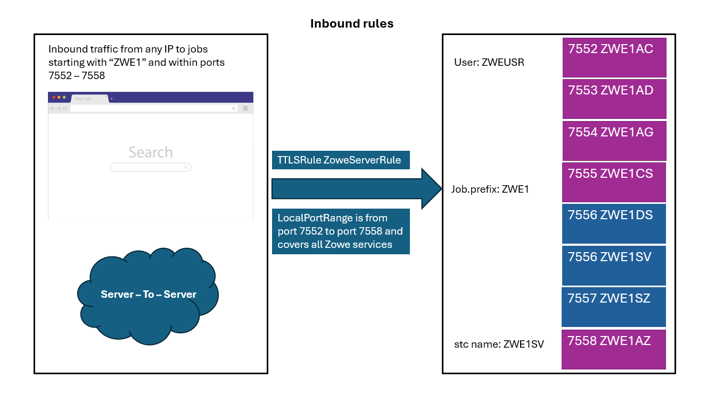
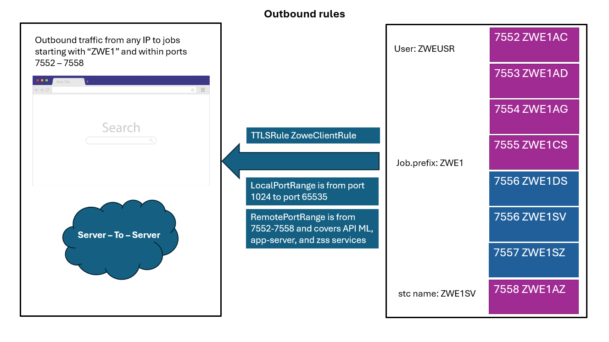

# Enabling AT-TLS

Zowe's core components use TLS networking as well as support AT-TLS as an alternative.
The built-in TLS networking is enabled by default. To learn more, see [Customizing Native TLS](./tls-configuration.md).

You can configure parameters in Zowe servers to switch to AT-TLS. Review this article for information about AT-TLS inbound and outbound rules, and the required configuration to use AT-TLS in high availability. You can also find troubleshooting tips as well as security recommendations.

:::info Role: security administrator
:::

## AT-TLS configuration for Zowe

Configuration to support AT-TLS is set in the following section of the `zowe.yaml` file: 

```yaml
zowe:
  network:
    # For inbound traffic rules:
    server:
      tls:
        attls: true
    # If outbound traffic rules will be configured:
    client:
      tls:
        attls: true
```

While TLS is not handled by the Zowe Server components with AT-TLS enabled on their own, API Mediation Layer (API ML) requires information about the server certificate that is defined in the AT-TLS rule. Ensure that the server certificates provided by the AT-TLS layer are trusted in the configured Zowe keyring. 

:::tip
We strongly recommend that AT-TLS be configured with the same Zowe keyring.
:::

:::note Notes

- As the API ML Gateway is a core component of API ML, other components that need to interact with the Gateway, such as Zowe App Server, also require AT-TLS configuration.

- Do not set `attls: true` together with `minTls` or `maxTls`. Zowe does not handle TLS in AT-TLS aware mode.

:::

:::caution Important security consideration

Configuring AT-TLS for Zowe requires careful consideration of security settings. These security settings apply to the Client Certificate authentication feature in Zowe API Mediation Layer components, as well as for onboarded services that support the x.509 client certificates authentication scheme.

Outbound AT-TLS rules (i.e. to make a transparent https call through http) that are configured to send the server certificate should be limited to the services that __require__ service to service authentication. If an API ML-onboarded southbound service needs to support X.509 client certificate authentication, we recommend to use the integrated TLS handshake capabilities of API ML. Do not configure an outbound AT-TLS rule for these services.

The Discovery Service endpoints are not reachable by standard API Gateway routing by default.

Zowe v3 includes a new component named ZAAS (Zowe Authentication and Authorization Service). In AT-TLS-aware mode, calls to this service are all internal between API ML components. These must include the X.509 Client Certificate.
:::

### Limitations when using AT-TLS with ICSF Hardware keyring

 API ML cannot currently read private keys if they reside in a hardware module. When using AT-TLS with a z/OS Keyring with private keys stored or managed by ICSF, use one of the following options:

* [Prevent API Mediation Layer from reading the private key](#prevent-api-ml-from-reading-the-private-key)
* [Use an alternative non-hardware keyring](#use-an-alternative-non-hardware-keyring)

#### Prevent API ML from reading the private key

Set `environments.APIML_ATTLS_LOAD_KEYRING: true` in `zowe.yaml` to prevent API ML from loading the keyring.
The only supported configuration is Zowe with the z/OSMF authentication provider in JWT mode.
This mode requires both server and client AT-TLS enabled in the `zowe.yaml` with full coverage of Inbound and Outbound rules.

:::note  
The z/OSMF LTPA token, SAF native authentication provider, and Personal Access Tokens (PAT) cannot be used in this configuration as there is not a private key.

:::

#### Use an alternative non-hardware keyring

Since handshakes are handled by AT-TLS, API ML only requires access to the private key to sign API ML's own tokens when the configuration requires it. The following scenarios require a private key so that API ML is able to sign API ML's own tokens:
- Personal Access Tokens
- SAF native provider (API ML signs its own JWT in this scenario)
- z/OSMF in LTPA mode: in this scenario z/OSMF does not issue a JWT. API ML signs the JWT that contains the LTPA token.

## AT-TLS rules

This section describes suggested AT-TLS settings, and serves as guidelines to set your AT-TLS rules.

### Inbound rules

The following diagram illustrates inbound rules:



A generic inbound rule can be set for all Zowe services:

```bash
TTLSRule ZoweServerRule
{
  LocalAddr All
  RemoteAddr All
  LocalPortRange 7552-7558 # Range covers all Zowe services
  Jobname ZWE1* # Jobname according to zowe.job.prefix in zowe.yaml
  Direction Inbound
  TTLSGroupActionRef ServerGroupAction
  TTLSEnvironmentActionRef ZoweServerEnvironmentAction
  TTLSConnectionActionRef ZoweServerConnectionAction
}

TTLSGroupAction ServerGroupAction
{
  TTLSEnabled On
}

TTLSEnvironmentAction ZoweServerEnvironmentAction
{
  HandshakeRole ServerWithClientAuth
  EnvironmentUserInstance 0
  TTLSEnvironmentAdvancedParmsRef ServerEnvironmentAdvParms
  TTLSKeyringParmsRef ZoweKeyring
}

TTLSConnectionAction ZoweServerConnectionAction
{
  HandshakeRole ServerWithClientAuth
  TTLSCipherParmsRef CipherParms
  TTLSConnectionAdvancedParmsRef ZoweConnectionAdvParms
}

TTLSConnectionAdvancedParms ZoweConnectionAdvParms
{
  ApplicationControlled Off
  ServerCertificateLabel apimlcert # Specify the personal server certificate used for the Zowe Server
  CertificateLabel apimlcert # Specify the personal server certificate used for the Zowe Server
  SecondaryMap Off
}

# Keyring, used for TLS, will be used also to load trusted certificates
TTLSKeyringParms ZoweKeyring
{
  Keyring ZWEKRNG
}
```

The `PortRange` of this inbound rule is taken from the list of API Mediation Layer components in the `zowe.yaml` file. The `PortRange` should cover the following components:

| Port number | Category | Component | Default Jobname |
|------|------|------|------|
| 7552 | API Mediation Layer | api-catalog | ZWE1**AC** |
| 7553 | API Mediation Layer | discovery | ZWE1**AD** |
| 7554 | API Mediation Layer | gateway | ZWE1**AG** |
| 7555 | API Mediation Layer | Caching Service | ZWE1**CS** |
| 7556 | App Framework | app-server | ZWE1**DS** & ZWE1SV |
| 7557 | App Framework | zss | ZWE1**SZ** |
| 7558 | API Mediation Layer | zaas | ZWE1**AZ** | 

More information on each component's networking requirements can be found at [Addressing network requirements](./address-network-requirements.md).


**Follow this step:**

Replace `ZoweKeyring` with the keyring configured for your installation. Follow [the SAF keyring instructions](../getting-started/zowe-certificates-overview.md#saf-keyring) in the article _Zowe Certificates overview_ to configure keyrings for your Zowe instance.

Note the setting `HandshakeRole`. This setting applies to core services which authenticate through certificates with each other. This setting allows the API Gateway to receive and accept X.509 client certificates from API Clients.

For more granularity in the AT-TLS rules, separate the rules that need to support Client Certificate authentication (Discovery Service, Gateway Service) from the rules that do not need to support Client Certificate authentication (for example a rule covering API Gateway to an onboarded service).

### Outbound rules

The following diagram illustrates outbound rules:



Outbound rules in this section allow Zowe services to communicate with each other and to other southbound services using HTTP.

:::caution Important:

Careful consideration needs to be made regarding which rules are to be configured to send a Client Certificate. Since configuration cannot be performed on a per-request basis, it is essential not to configure the rule to send the Zowe Server certificate to the API Gateway or to a southbound service that supports X.509 Client Certificate authentication. Doing so will result in unintentionally authenticating the server ACID.

:::

**Example:**

```yaml
TTLSConnectionAction ClientConnectionAction  
{  
  HandshakeRole Client  
  TTLSCipherParmsRef CipherParms  
  TTLSConnectionAdvancedParmsRef ConnectionAdvancedParms
}
```

#### Outbound rule for z/OSMF

The following diagram illustrates outbound rules for z/OSMF:


This example rule covers the connection between the API Gateway and ZAAS and the z/OSMF instance. This connection is made to authenticate users in z/OS.

If `zowe.network.client.tls.attls` is `true`, this rule is assumed set. The requests to z/OSMF are issued using `http`.

```bash
TTLSRule ApimlZosmfClientRule
{
  LocalAddr All
  LocalPortRange 1024-65535 # Using any outbound port
  RemoteAddr All
  RemotePortRange 449 # Set to z/OSMF port
  Jobname ZWE1A* # Set according to zowe.job.prefix in zowe.yaml. Zowe components *AG and *AZ are needed in this rule.
  Direction Outbound
  TTLSGroupActionRef ClientGroupAction
  TTLSEnvironmentActionRef ApimlClientEnvironmentAction
  TTLSConnectionActionRef ApimlNoX509ClientConnAction # No X.509 Client Certificate required
}

TTLSGroupAction ClientGroupAction
{
  TTLSEnabled ON
}

TTLSEnvironmentAction ApimlClientEnvironmentAction
{
  HandshakeRole Client
  TTLSKeyringParmsRef ZoweKeyring
  TTLSCipherParmsRef CipherParms
  TTLSEnvironmentAdvancedParmsRef ClientEnvironmentAdvParms
}
```

:::note
`Jobname` is defined explicitly for the API Gateway and ZAAS component and is formed with the `zowe.job.prefix` setting from `zowe.yaml` plus `AG` (Gateway) and `AZ` (ZAAS) suffixes. Choosing `ZWE1A*` as a jobname pattern captures both servers.
:::

#### Outbound rule for communication between Zowe core components

Use the example in this section as a template for internal connections between Zowe core services.

:::caution Important

The outbound connection from the Gateway Service to the Discovery Service must be configured without a `CertificateLabel`. Ensure that the certificate label is not included (but keep the `CertificateLabel` field) to avoid sending the certificate in case routing would be possible to the Discovery Service. Note that this route is disabled by default.

:::

```bash
TTLSRule ZoweClientRule
{
  LocalAddr All
  LocalPortRange 1024-65535
  RemoteAddr All
  RemotePortRange 7552-7558 # Range covers API ML, app-server, and zss services
  Jobname ZWE1* # Set according to zowe.job.prefix in zowe.yaml - this covers all servers within Zowe core.
  Direction Outbound
  TTLSGroupActionRef ClientGroupAction
  TTLSEnvironmentActionRef ApimlClientEnvironmentAction
  TTLSConnectionActionRef ApimlX509ClientConnAction # X.509 Authentication is required in cross-service API ML communication
}

TTLSConnectionAction ApimlX509ClientConnAction
{
  HandshakeRole Client
  TTLSCipherParmsRef CipherParms
  TTLSConnectionAdvancedParmsRef ApimlClientX509ConnAdvParms
}

TTLSConnectionAdvancedParms ApimlClientX509ConnAdvParms
{
  ApplicationControlled Off
  CertificateLabel Zowe Server
  SecondaryMap Off
}
```

#### Outbound rule for communication between API Gateway and extensions' servers

<details>
<summary>Click here to see a diagram that illustrates the rules for API Gateway to extension servers to integrate the Db2 DevOps systems</summary>


</details>

In this example, the rule covers all outbound connections originating from the API Gateway to a server that is not part of Zowe, such as an extension's server, listening on port 8080.
Such a rule can apply to any remote destination, as seen in the `ApimlClientRule` for Zowe core servers in the section [Outbound rule for communication between Zowe core components](./configuring-at-tls-for-zowe-server.md#outbound-rule-for-communication-between-zowe-core-components).

<details>
<summary>Click here for the example of a rule covering API Gateway to extension servers.</summary>

This example covers routing scenarios.

```bash
TTLSRule ApimlServiceClientRule
{
  LocalAddr All
  LocalPortRange 1024-65535
  RemoteAddr All
  RemotePortRange 8080 # Set to range of ports where services are listening
  Jobname ZWE1AG # Generate according to zowe.job.prefix in zowe.yaml
  Direction Outbound
  TTLSGroupActionRef ClientGroupAction
  TTLSEnvironmentActionRef ApimlClientEnvironmentAction
  TTLSConnectionActionRef ApimlNoX509ClientConnAction # Do not send X.509 Client Certificates
}

TTLSConnectionAction ApimlNoX509ClientConnAction
{
  HandshakeRole Client
  TTLSCipherParmsRef CipherParms
  TTLSConnectionAdvancedParmsRef ApimlClientNoX509ConnAdvParms
}

TTLSConnectionAdvancedParms ApimlClientNoX509ConnAdvParms
{
  ApplicationControlled Off
  CertificateLabel # Leave empty to avoid sending a client certificate (i.e. if the keyring has a default certificate)
  SecondaryMap Off
}
```

:::caution Important

Outbound connections from the Gateway to southbound services (onboarded services) must not send the server certificate if the service accepts X.509 Client Certificate authentication. If the server certificate is sent, the server user is subsequently authenticated.

:::

</details>


#### Outbound rule for services that validate tokens against the API Mediation Layer

In this scenario, the services issue a request against the API Gateway to validate the received authentication token.

This scenario includes the following services:

* Services that set `zoweJwt` as the authentication scheme
* Services that require an Open ID Connect (OIDC) token
* Forwarded X.509 certificates

In this case, it is necessary to have an Outbound rule from the service to the API Gateway.

These services also already have an Outbound rule set for the onboarding process against the Discovery Service.

Ensure that these rules are followed:

- Outbound rule to Discovery Service: Sends X.509 Client Certificate to authorize the onboarding.
- Outbound rule to API Gateway: __Do not__ set a Client Certificate.

### Ciphers

:::note
This list of ciphers is provided as an example only. Actual ciphers should be customized according to your specific configuration.
:::

The list of supported ciphers should be constructed according to the TLS supported versions.
Ensure that the cipher list has matches with non-AT-TLS-aware clients.

<details>
<summary>Click here for an example of Cipher parameters.</summary>

```bash
TTLSCipherParms CipherParms
{
  V2CipherSuites TLS_RC4_128_WITH_MD5
  V2CipherSuites TLS_RC4_128_EXPORT40_WITH_MD5
  V2CipherSuites TLS_RC2_CBC_128_CBC_WITH_MD5
  V2CipherSuites TLS_RC2_CBC_128_CBC_EXPORT40_WITH_MD5
  V2CipherSuites TLS_RC2_CBC_128_CBC_EXPORT40_WITH_MD5
  V2CipherSuites TLS_DES_192_EDE3_CBC_WITH_MD5
  V3CipherSuites TLS_ECDHE_ECDSA_WITH_AES_128_CBC_SHA256
  V3CipherSuites TLS_ECDHE_ECDSA_WITH_AES_256_CBC_SHA384
  V3CipherSuites TLS_ECDHE_ECDSA_WITH_AES_128_GCM_SHA256
  V3CipherSuites TLS_ECDHE_ECDSA_WITH_AES_256_GCM_SHA384
  V3CipherSuites TLS_ECDHE_RSA_WITH_AES_256_GCM_SHA384
  V3CipherSuites TLS_AES_128_GCM_SHA256
  V3CipherSuites TLS_AES_256_GCM_SHA384
  V3CipherSuites TLS_CHACHA20_POLY1305_SHA256
}
```

</details>

## Using AT-TLS for API ML in High Availability

AT-TLS settings for a Zowe installation configured in High Availability mode do not differ extensively. Changes need to be made to the previously described rules to allow for cross-lpar communication:

Ensure that the `RemoteAddr` setting in the rules accounts for the following connections:

- Discovery Service to Discovery Service. This is the replica request.
- Gateway Service to southbound services (including app-server and ZSS) running in another LPAR.
- Gateway Service to ZAAS running in another LPAR.
- Southbound services to Discovery Service. This applies during onboarding.
- All outbound connections need to account for all LPARs including the same where the rules are applied.

## Multi-tenancy deployment

For a specific scenario when Central API ML is running on z/OS with AT-TLS enabled, it is important to override the protocol for the external URL. This information is used by the Central API ML to call domain API ML and needs to reflect the outbound AT-TLS rule. In this case, update your domain API ML configuration:

```yaml
zowe:
  components:
    gateway:
      apiml:
        gateway:
          externalProtocol: http
```

## AT-TLS Troubleshooting

This section describes some common issues when using AT-TLS with Zowe and how to resolve these issues.

### The message `This combination of port requires SSL` is thrown when accessing an API ML service through a Browser

Make sure the URL starts with `https://`. This message indicates that AT-TLS rules are in place and it is trying to connect on an unsecured port to the API Gateway, however the latter is still only listening on a application-controlled secured port.

**Solution:**
Review settings in the API Gateway. Ensure that the changes described in [AT-TLS configuration for Zowe](#at-tls-configuration-for-zowe) are applied.

### AT-TLS rules are not applied

If the application is responding in http, the application may not be properly configured to support http-only calls. AT-TLS is not correctly configured.

**Solution:**

Ensure the rules are active and that the filters on port range and job names are properly set.

### Non matching ciphers / protocols

An error can occur if the [list of ciphers](#ciphers) or the TLS protocol does not match between the ones configured in the AT-TLS rules and the ones used by non AT-TLS-aware clients.

**Solution:**
Review the supported TLS versions and ciphers used in both the client and the server.

### Zowe Desktop IP Explorer or Editor does not work

If the Zowe Desktop IP Explorer or Editor are not working correctly, either by failing to load or showing no data, it means there is a problem accessing the ZSS server. 

**Solution:**

Ensure the `components.zss.agent.http.ipAddresses` includes a reachable address. If this field unset, it defaults to `127.0.0.1`, while other Zowe servers default to `0.0.0.0`. 

**Sample configuration:**

```yaml
components:
  zss:
    enabled: true
    port: 7557
    crossMemoryServerName: ZWESIS_STD
    agent:
      64bit: true
    http:
      ipAddresses: 
        - "0.0.0.0"
```

### Zowe Desktop TN3270 or VT-Terminal Websocket 1006 Errors

If the Zowe Desktop TN3270 Application or VT Terminal Application are displaying a websocket error 1006, there is an issue with CORS configuration. This will be fixed in Zowe 3.4.0, and can be fixed manually in earlier releases.

**Solution:**

We recommend contacting your conformant support provider for assistance applying this fix. 

Add required metadata manually to the ZLUX app in the APIML Discovery service. The metadata will need to be added after any restart of Zowe. 

The metadata that should be added to the ZLUX eureka app:
- `apiml.corsEnabled`: `true`
- `apiml.corsAllowedOrigins` : `https://<your_zowe_host>:<catalog_port>,https://<your_zowe_host>:<gateway_port>`

<details>

<summary>Click here for complete instructions applying the above fix</summary>

To apply the required metadata to the discovery service, you must have:

1. A client certificate for authentication. Other forms of authentication are _not supported_.
2. Network access to the host where the APIML Discovery Service is running.
3. The APIML Gateway port value. This can be found in the zowe.yaml property `components.gateway.port`.
4. The Discovery Service port value. This can be found in the zowe.yaml property `components.discovery.port`.
5. The App Server port value. This can be found in the zowe.yaml property `comopnents.app-server.port`.
6. The API Catalog port value. This can be found in the zowe.yaml property `components.api-catalog.port`.
7. A REST client or command line tool.

To see the current list of metadata for the ZLUX service, run:

`GET https://<your_zowe_host>:<your_discovery_port>/eureka/v2/apps/ZLUX`

You should get an HTTP 200 response with a JSON response body containing service metadata. You can check this to verify `apiml.corsEnabled` and `apiml.corsAllowedOrigins` are set correctly.
```json
// ... other fields before
     ,
     "metadata": {
          "apiml.service.description": "This list includes core APIs for management of plugins, management of the server itself, and APIs brought by plugins and the app server agent, ZSS. Plugins that do not bring their own API documentation are shown here as stubs.",
          "apiml.catalog.tile.version": "3.3.0",    
      // ...more metadata fields
 }
```

To update the ZLUX service metadata, run the below request once for each metadata field as described in the solution above. This request requires an additional URL-encoded field `<your_host>:zlux:<your_app_server_port>`, and `metadata_value` should also be URL-encoded.  

`PUT https://<your_zowe_host>:<your_discovery_port>/eureka/v2/apps/ZLUX/<your_host>%3Azlux%3A<your_app_server_port>/metadata?<metadata_key>=<metadata_value>`
</details>


<details>
<summary>Sample requests using curl</summary>

Given:
* host `localhost`
* APIML Catalog port `7552`
* APIML Discovery Service port `7553`
* APIML Gateway port `7554`
* App Server port `7556`

To see the current metadata:

```curl
curl --request GET \
  --cert <path_to_your_client_cert> \
  --key <path_to_your_client_cert_key> \
  --url https://localost:7553/eureka/v2/apps/ZLUX
```

To update the metadata in 2 requests:

```curl
curl --request PUT \
  --cert <path_to_your_client_cert> \
  --key <path_to_your_client_cert_key> \
  --url 'https://localhost:7553/eureka/v2/apps/ZLUX/localhost%3Azlux%3A7556/metadata?apiml.corsEnabled=true'
```

```curl
curl --request PUT \
  --cert <path_to_your_client_cert> \
  --key <path_to_your_client_cert_key> \
  --url 'https://localhost:7553/eureka/v2/apps/ZLUX/localhost%3Azlux%3A7556/metadata?apiml.corsAllowedOrigins=https%3A%2F%2Flocalhost%3A7552%2Chttps%3A%2F%2Flocalhost%3A7554'
```
</details>

### Additional troubleshooting

When asking for support make sure to follow IBM guides for troubleshooting AT-TLS problems. This is covered in the "Diagnosing Application Transparent Transport Layer Security (AT-TLS)" article on IBM documentation.

Ensure you collect the logs and current configurations when contacting support.

## Full example of AT-TLS configuration

Review a full working example of an AT-TLS configuration file on z/OS, specifically used for defining secure communication between different services in a mainframe environment. All port values are examples.
The example is commented for convenience.
<details>

<summary>Click here to display the full AT-TLS configuration file.</summary>

```bash
# Main inbound rule, all Zowe services have it defined.
TTLSRule ZoweServerRule
{
  LocalAddr All
  RemoteAddr All
  LocalPortRange 7552-7558 # Range covers all possible Zowe services
  Jobname ZWE1*
  Direction Inbound
  TTLSGroupActionRef ServerGroupAction
  TTLSEnvironmentActionRef ZoweServerEnvironmentAction
  TTLSConnectionActionRef ZoweServerConnectionAction
}

# Example southbound service inbound rule
TTLSRule ApimlDCServerRule
{
  LocalAddr All
  RemoteAddr All
  LocalPortRange 8080-8090 # Example service ports
  Jobname ZWE1DC* # Jobname prefix (optional)
  Direction Inbound
  TTLSGroupActionRef ServerGroupAction
  TTLSEnvironmentActionRef ZoweDCServerEnvironmentAction
  TTLSConnectionActionRef ZoweServerConnectionAction
}

TTLSGroupAction ServerGroupAction
{
  TTLSEnabled On
}

# Environment action for all Zowe service
TTLSEnvironmentAction ZoweServerEnvironmentAction
{
  HandshakeRole ServerWithClientAuth # Zowe Servers can optionally support Client Certificate authentication
  EnvironmentUserInstance 0
  TTLSEnvironmentAdvancedParmsRef ServerEnvironmentAdvParms
  TTLSKeyringParmsRef ZoweKeyring
}

# Environment action for sample southbound service
TTLSEnvironmentAction ZoweDCServerEnvironmentAction
{
  HandshakeRole Server
  EnvironmentUserInstance 0
  TTLSEnvironmentAdvancedParmsRef ServerEnvironmentAdvParms
  TTLSKeyringParmsRef ZoweKeyring
}

# Keyring, used for TLS, will be used also to load trusted certificates
TTLSKeyringParms ZoweKeyring
{
  Keyring ZWEKRNG
}

# Advanced TLS settings, choose TLS versions supported.
TTLSEnvironmentAdvancedParms ServerEnvironmentAdvParms
{
  ClientAuthType Full # Support optional Client Certificate authentication
  ApplicationControlled Off
  Renegotiation Disabled
  SSLv2 Off
  SSLv3 Off
  TLSv1 Off
  TLSv1.1 Off
  TLSv1.2 On
  TLSv1.3 On
}

# Server Connection Action for API ML core services.
TTLSConnectionAction ZoweServerConnectionAction
{
  HandshakeRole ServerWithClientAuth # API ML Core Services use Client Certificate authentication
  TTLSCipherParmsRef CipherParms
  TTLSConnectionAdvancedParmsRef ZoweConnectionAdvParms
}

# API ML Server connection action.
# Certificate label indicates which certificate is used in the client certificate authentication process between core services.
TTLSConnectionAdvancedParms ZoweConnectionAdvParms
{
  ApplicationControlled Off
  ServerCertificateLabel apimlcert
  CertificateLabel apimlcert
  SecondaryMap Off
}

# Example outbound TTLS rule for a Zowe client calling a Zowe server
# In this scenario this client (a southbound service) presents client certificate to authenticate (for example during onboarding)
TTLSRule ZoweClientRule
{
  LocalAddr All
  LocalPortRange 1024-65535
  RemoteAddr All
  RemotePortRange 7552-7558 # API ML, app-server, and zss Zowe core services
  Jobname ZWE1*
  Direction Outbound
  TTLSGroupActionRef ClientGroupAction
  TTLSEnvironmentActionRef ApimlClientEnvironmentAction
  TTLSConnectionActionRef ApimlX509ClientConnAction
}

# Example outbound rule for connections from API ML Gateway to a southbound service running in port 40030 (during request routing)
# Note ConnectionAction doesn't configure a client certificate.
TTLSRule ApimlServiceClientRule
{
  LocalAddr All
  LocalPortRange 1024-65535
  RemoteAddr All
  RemotePortRange 40030 # Service ports
  Jobname ZWE1AG
  Direction Outbound
  TTLSGroupActionRef ClientGroupAction
  TTLSEnvironmentActionRef ApimlClientEnvironmentAction
  TTLSConnectionActionRef ApimlNoX509ClientConnAction
}

# Optional. Can configure the outbound connection from API Gateway and ZAAS to work with AT-TLS while connecting to z/OSMF.
TTLSRule ApimlZosmfClientRule
{
  LocalAddr All
  LocalPortRange 1024-65535
  RemoteAddr All
  RemotePortRange 449 # z/OSMF Port
  Jobname ZWE1A*
  Direction Outbound
  TTLSGroupActionRef ClientGroupAction
  TTLSEnvironmentActionRef ApimlClientEnvironmentAction
  TTLSConnectionActionRef ApimlNoX509ClientConnAction
}

TTLSEnvironmentAction ApimlClientEnvironmentAction
{
  HandshakeRole Client
  TTLSKeyringParmsRef ZoweKeyring
  TTLSEnvironmentAdvancedParmsRef ClientEnvironmentAdvParms
  EnvironmentUserInstance 0
}

TTLSEnvironmentAdvancedParms ClientEnvironmentAdvParms
{
  Renegotiation Disabled
  3DESKEYCHECK OFF
  CLIENTEDHGROUPSIZE legacy
  SERVEREDHGROUPSIZE legacy
  PEERMINCERTVERSION any
  SERVERSCSV OFF
  MIDDLEBOXCOMPATMODE Off
  CertValidationMode Any
}

TTLSGroupAction ClientGroupAction
{
  TTLSEnabled ON
}

TTLSConnectionAction ApimlX509ClientConnAction
{
  HandshakeRole Client
  TTLSCipherParmsRef CipherParms
  TTLSConnectionAdvancedParmsRef ZoweClientX509ConnAdvParms
}

TTLSConnectionAction ApimlNoX509ClientConnAction
{
  HandshakeRole Client
  TTLSCipherParmsRef CipherParms
  TTLSConnectionAdvancedParmsRef ZoweClientNoX509ConnAdvParms
}

# ConnectionAdvanced parameters for connections not requiring x.509 Client Certificate authentication
# If the set Keyring has a default certificate this will not prevent sending it
TTLSConnectionAdvancedParms ZoweClientNoX509ConnAdvParms
{
  SSLv3 Off
  TLSv1 Off
  TLSv1.1 Off
  ApplicationControlled Off
  CertificateLabel # Keep the Label empty to ensure a default certificate will not be picked from the keyring
  SecondaryMap Off
  TLSv1.2 On
  TLSv1.3 On
}

# In case the connection requires a client certificate authentication, this is where the label is set for outbound connections.
TTLSConnectionAdvancedParms ZoweClientX509ConnAdvParms
{
  SSLv3 Off
  TLSv1 Off
  TLSv1.1 Off
  CertificateLabel apimlcert
  SecondaryMap Off
  TLSv1.2 On
  TLSv1.3 On
}

# Example list of supported ciphers in handshake. Validate and filter this list based on local setup
TTLSCipherParms                   CipherParms
{
  V3CipherSuites                  TLS_AES_128_GCM_SHA256
  V3CipherSuites                  TLS_AES_256_GCM_SHA384
  V3CipherSuites                  TLS_CHACHA20_POLY1305_SHA256
  V3CipherSuites                  TLS_ECDHE_ECDSA_WITH_AES_256_GCM_SHA384
  V3CipherSuites                  TLS_ECDHE_ECDSA_WITH_AES_128_GCM_SHA256
  V3CipherSuites                  TLS_ECDHE_RSA_WITH_AES_256_GCM_SHA384
  V3CipherSuites                  TLS_ECDHE_ECDSA_WITH_AES_256_CBC_SHA
  V3CipherSuites                  TLS_ECDHE_ECDSA_WITH_AES_128_CBC_SHA256
  V3CipherSuites                  TLS_ECDH_RSA_WITH_AES_256_GCM_SHA384
  V3CipherSuites                  TLS_ECDHE_ECDSA_WITH_AES_256_CBC_SHA384
  V3CipherSuites                  TLS_ECDHE_RSA_WITH_AES_256_CBC_SHA384
  V3CipherSuites                  TLS_ECDH_RSA_WITH_AES_256_CBC_SHA384
  V3CipherSuites                  TLS_DHE_RSA_WITH_AES_256_CBC_SHA
  V3CipherSuites                  TLS_ECDHE_RSA_WITH_AES_128_GCM_SHA256
  V3CipherSuites                  TLS_ECDH_ECDSA_WITH_AES_128_GCM_SHA256
  V3CipherSuites                  TLS_ECDH_RSA_WITH_AES_128_GCM_SHA256
  V3CipherSuites                  TLS_ECDHE_RSA_WITH_AES_128_CBC_SHA256
  V3CipherSuites                  TLS_ECDH_ECDSA_WITH_AES_128_CBC_SHA256
  V3CipherSuites                  TLS_ECDH_RSA_WITH_AES_128_CBC_SHA256
  V3CipherSuites                  TLS_RSA_WITH_AES_128_CBC_SHA
  V3CipherSuites                  TLS_ECDH_ECDSA_WITH_AES_256_GCM_SHA384
  V3CipherSuites                  TLS_ECDH_ECDSA_WITH_AES_256_CBC_SHA384
  V3CipherSuites                  TLS_RSA_WITH_AES_256_GCM_SHA384
  V3CipherSuites                  TLS_DHE_DSS_WITH_AES_256_GCM_SHA384
  V3CipherSuites                  TLS_DHE_RSA_WITH_AES_256_GCM_SHA384
  V3CipherSuites                  TLS_DH_DSS_WITH_AES_256_GCM_SHA384
  V3CipherSuites                  TLS_DH_RSA_WITH_AES_256_GCM_SHA384
  V3CipherSuites                  TLS_RSA_WITH_AES_256_CBC_SHA256
  V3CipherSuites                  TLS_DHE_DSS_WITH_AES_256_CBC_SHA256
  V3CipherSuites                  TLS_DHE_RSA_WITH_AES_256_CBC_SHA256
  V3CipherSuites                  TLS_DH_DSS_WITH_AES_256_CBC_SHA256
  V3CipherSuites                  TLS_DH_RSA_WITH_AES_256_CBC_SHA256
  V3CipherSuites                  TLS_RSA_WITH_AES_256_CBC_SHA
  V3CipherSuites                  TLS_ECDHE_RSA_WITH_AES_256_CBC_SHA
  V3CipherSuites                  TLS_ECDH_ECDSA_WITH_AES_256_CBC_SHA
  V3CipherSuites                  TLS_ECDH_RSA_WITH_AES_256_CBC_SHA
  V3CipherSuites                  TLS_DHE_DSS_WITH_AES_256_CBC_SHA
  V3CipherSuites                  TLS_DH_DSS_WITH_AES_256_CBC_SHA
  V3CipherSuites                  TLS_DH_RSA_WITH_AES_256_CBC_SHA
  V3CipherSuites                  TLS_RSA_WITH_AES_128_GCM_SHA256
  V3CipherSuites                  TLS_DHE_DSS_WITH_AES_128_GCM_SHA256
  V3CipherSuites                  TLS_DHE_RSA_WITH_AES_128_GCM_SHA256
  V3CipherSuites                  TLS_DH_DSS_WITH_AES_128_GCM_SHA256
  V3CipherSuites                  TLS_DH_RSA_WITH_AES_128_GCM_SHA256
  V3CipherSuites                  TLS_RSA_WITH_AES_128_CBC_SHA256
  V3CipherSuites                  TLS_DHE_DSS_WITH_AES_128_CBC_SHA256
  V3CipherSuites                  TLS_DHE_RSA_WITH_AES_128_CBC_SHA256
  V3CipherSuites                  TLS_DH_DSS_WITH_AES_128_CBC_SHA256
  V3CipherSuites                  TLS_DH_RSA_WITH_AES_128_CBC_SHA256
  V3CipherSuites                  TLS_ECDHE_ECDSA_WITH_AES_128_CBC_SHA
  V3CipherSuites                  TLS_ECDHE_RSA_WITH_AES_128_CBC_SHA
  V3CipherSuites                  TLS_ECDH_ECDSA_WITH_AES_128_CBC_SHA
  V3CipherSuites                  TLS_ECDH_RSA_WITH_AES_128_CBC_SHA
  V3CipherSuites                  TLS_DHE_DSS_WITH_AES_128_CBC_SHA
  V3CipherSuites                  TLS_DHE_RSA_WITH_AES_128_CBC_SHA
  V3CipherSuites                  TLS_DH_DSS_WITH_AES_128_CBC_SHA
  V3CipherSuites                  TLS_DH_RSA_WITH_AES_128_CBC_SHA
}
```

</details>
