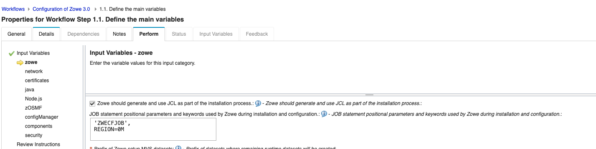

 # Configuring Zowe with JCL

:::note
Configuring Zowe with JCL is currently in *technical preview*. In a later release, this will become the default method of configuration.
:::

Zowe can be configured on your system with JCL using the `zwe` commands, or by customizing and running JCL entirely manually. Both of these configuration methods require a [`zowe.yaml` configuration file](./installandconfig.md#zowe-configuration-file-zoweyaml). Between these two options, we recommend sticking with `zwe` commands rather than manually submitting JCL from scratch, as there's additional validation we can perform on your configuration prior to creating and submitting JCL.

- [Getting started with `zwe` and JCL](#getting-started-with-zwe-and-jcl)
  - [Generating JCL](#generating-jcl)
  - [Adding Job Parameters to generated JCL](#adding-job-parameters-to-generated-jcl)
  - [Reviewing JCL before submission](#reviewing-jcl-before-submission)
  - [Following existing `zwe` command documentation](#following-existing-zwe-command-documentation)
  - [Following existing z/OSMF workflows](#following-existing-zosmf-workflow-documentation)
- [Getting started with manual JCL submission](#getting-started-with-manual-jcl-submission)
  - [Preparing the JCL](#preparing-the-jcl)
  - [Manual JCL Core Tasks](#manual-jcl-core-tasks)
  - [Manual JCL Keyring Tasks](#manual-jcl-keyring-tasks)
  - [Manual JCL Caching Service VSAM Task (Deprecated)](#manual-jcl-caching-service-vsam-task-deprecated)

## Getting started with `zwe` and JCL

By default, `zwe` will not submit solely JCL to configure Zowe, instead relying on a mix of unix services and JCL. To enable `zwe` to rely **solely** on JCL, you can either add `--jcl` to the end of every `zwe install` or `zwe init` command, or set `zowe.setup.jcl.enable` in your zowe.yaml file. 

Example zowe.yaml:
```yaml
zowe:
  setup:
    jcl:
      enable: true
```

Example commands:
```shell
zwe install -c /path/to/your/zowe.yaml --jcl
zwe init mvs -c /path/to/your/zowe.yaml --jcl
```

### Generating JCL

`zwe init` commands using JCL require you to first generate the JCL using values present in your `zowe.yaml` file. To do this, run:

```shell
zwe init generate -c /path/to/your/zowe.yaml`
``` 

This takes the configuration values present in your `zowe.yaml` file, uses them to populate JCL templates in `SZWESAMP`, and creates a `JCLLIB` dataset with the final generated JCL. The `JCLLIB` will be created using the prefix `zowe.setup.dataset.jcllib`. 

For example, `zwe init generate` with the below zowe.yaml creates the dataset `MY.DS.PREFIX.JCLLIB`. If this dataset already exists, you must add `--allow-overwrite` to the `init generate` command.
```yaml
zowe:
  setup:
    dataset:
      # ... other fields
      jcllib: MY.DS.PREFIX.JCLLIB
```

:::important
If you make any changes to values starting with `zowe.setup` in your zowe.yaml file, you must re-run `zwe init generate` to create fresh JCL. Optionally, `zwe init` commands provide a `--generate` flag which will run `init generate` on-the-fly as well. For example, `zwe init mvs --generate` will run `init generate` before the `init mvs`.
:::

### Adding Job Parameters to generated JCL

If you require specific job parameters to run JCL on your system, you can add them via the `zowe.setup.jcl.header` field in your zowe.yaml file. The `zwe` _will not_ validate the syntax of the supplied parameters, you should always review the generated JCL to ensure the headers are correct.

This header field can be supplied as either a single or multi-line string. Line 1 requires no formatting, while lines 2 onward require you to supply `//  ` before the job parameters. If using a single line for the header field, use `\n` to indicate new lines. If using multi-line strings, ensure your indentation remains aligned with each new line.

Example zowe.yaml, with header as a single line. Double quotes are required around the entire string:
```yaml
zowe:
  setup:
    jcl: 
      enable: true
      header: "'ZWECFJOB'\n//   REGION=0M\n//* atestcomment"
    dataset: # ...the rest of your zowe.yaml
```

Example zowe.yaml, with header as a single line:
```yaml
zowe:
  setup:
    jcl: 
      enable: true
      header: |
        'ZWECFJOB',
        //   REGION=0M
        //* atestcomment
    dataset: # ...the rest of your zowe.yaml
```

Both zowe.yaml files create the below job card:
```
//ZWEGENER JOB 'SOMEJOB',
//   REGION=0M
//* atestcomment
//* secondtestcomment 
```

### Reviewing JCL before submission

One advantage to JCL is the ability to review all the actions it will take on your system before submitting it. There are a few ways to review JCL used by `zwe` before submission. All `zwe init` and `zwe install` commands support the `--dry-run` command line parameter, which will print the command's final JCL to the console and won't submit it. When running `zwe init generate` specifically, this is the only way to review the final JCL prior to submission. For other `zwe init` commands and the `zwe install` command, you can choose to run them with `--dry-run` and review the console outputs, or you can review them in the `JCLLIB` dataset created by `init generate`. 

### Following existing `zwe` command documentation

To configure Zowe successfully with JCL, you can follow the existing documentation for `zwe install` and `zwe init` with minor modifications:

1. Setup JCL enablement and JCL job parameters as described in this guide first. 
2. Run `zwe init generate` before any other init command, and after any change to a `zowe.setup` field in the zowe.yaml file.

That's it!

### Following existing z/OSMF workflow documentation

Both the [Zowe Configuration Workflow](https://docs.zowe.org/stable/user-guide/configure-apiml-zosmf-workflow) and the [Stand-alone APIML Workflow](https://docs.zowe.org/stable/user-guide/configure-apiml-zosmf-workflow) support JCL enablement. When you start your configuration, you will see the option to enable JCL and a `Job statement positionial parameters...` text field where you can fill out job statement information. **Note:** unlike when editing the zowe.yaml file directly, do not enter a start-of-line `// ` for lines 2 or more in the workflow text field. This field can be left blank if you do not need to add any job statement parameters. Once you have reviewed and set these fields, follow the workflow instructions normally.



## Getting started with manual JCL submission

If you do not wish to use the `zwe` command-line interface, you can submit the same set of JCL yourself directly through MVS datasets. Do note that you will still need a zowe.yaml file.

### Preparing the JCL

The Zowe Runtime Dataset `SZWESAMP` contains JCL samples that have templates referencing Zowe YAML parameters. These samples should not be submitted without modification. Samples that are submitted without modification will end unsuccessfully with a JCL ERROR status.

Edit and submit the job `SZWESAMP(ZWEGENER)` to validate the contents of your `zowe.yaml` before resolving the `JCL templates` and placing the resulting JCL into a separate data set created by the job `ZWEGENER`. The location is specified in `zowe.setup.dataset.jcllib`.

:::note

`zowe.setup.dataset.jcllib` is deleted and created each time the job `SZWESAMP(ZWEGENER)` is submitted.

:::

When the JCL is prepared, the following jobs can be submitted to perform the following instance configuration actions.
In addition to core JCL samples, you can also customize JCL samples for various keyring setup options according to your security manager. 

* For sample JCLs corresponding to core tasks, see the table [Core Tasks](#core-tasks). 
* For sample JCLs corresponding to keyring tasks, see the section [Keyring Tasks](#keyring-tasks) later in this article. 
* For JCL samples if you are using VSAM as your storage solution for the Caching service, see the table corresponding to [(Deprecated) Caching Service VSAM Task](#deprecated-caching-service-vsam-task).

## Manual JCL Core Tasks 

| Task | Description | Sample JCL|
|------|-------------|-----------|
|Create Instance Datasets | <br />**Purpose:**<br /> Create datasets for Zowe's PARMLIB content and non-ZFS extension content for a given Zowe Instance <br /> **Action:**<br /> 1) Allocate the PDSE FB80 dataset with at least 15 tracks named from Zowe parameter `zowe.setup.dataset.parmlib`<br/>2) Allocate the PDSE FB80 dataset with at least 30 tracks named from Zowe parameter `zowe.setup.dataset.authPluginLib`<br/>3) Copy the member `ZWESIP00` from `zowe.setup.dataset.prefix.SZWESAMP` into `zowe.setup.dataset.parmlib` | [ZWEIMVS](https://github.com/zowe/zowe-install-packaging/tree/v3.x/master/files/SZWESAMP/ZWEIMVS)
|APF Authorize privileged content | <br />**Purpose:**<br /> The majority of Zowe is unprivileged code running in Key 8. Zowe relies on a single component called ZIS to own all of the privileged code logic. The load library for the ZIS component and its extension library must be set as APF authorized and run in Key 4 to use ZIS and components that depend upon it. <br /> **Action:**<br />1) APF authorize the datasets defined at `zowe.setup.dataset.authLoadlib` and `zowe.setup.dataset.authPluginLib`. <br />2) Define PPT entries for the members `ZWESIS01` and `ZWESAUX` as Key 4, NOSWAP in the `SCHEDxx` member of the system PARMLIB. | [ZWEIAPF](https://github.com/zowe/zowe-install-packaging/tree/v3.x/master/files/SZWESAMP/ZWEIAPF) <br /> 
 Grant SAF premissions | <br />**Purpose:**<br /> The STC accounts for Zowe need permissions for operating servers, and users need permissions for interacting with the servers. <br />**Action:**<br /> [Set SAF permissions for accounts](https://docs.zowe.org/stable/user-guide/assign-security-permissions-to-users#security-permissions-reference-table) | RACF: [ZWEIRAC](https://github.com/zowe/zowe-install-packaging/tree/v3.x/master/files/SZWESAMP/ZWEIRAC) <br /> TSS: [ZWEITSS](https://github.com/zowe/zowe-install-packaging/tree/v3.x/master/files/SZWESAMP/ZWEITSS) <br /> ACF2: [ZWEIACF](https://github.com/zowe/zowe-install-packaging/tree/v3.x/master/files/SZWESAMP/ZWEIACF) <br /> 
 |(z/OS v2.4 ONLY) Create Zowe SAF Resource Class |  On z/OS v2.4, the SAF resource class for Zowe is not included, and must be created. This step is not needed on z/OS v2.5 and later versions. | RACF: [ZWEIRACZ](https://github.com/zowe/zowe-install-packaging/tree/v3.x/master/files/SZWESAMP/ZWEIRACZ) <br />TSS: [ZWEITSSZ](https://github.com/zowe/zowe-install-packaging/tree/v3.x/master/files/SZWESAMP/ZWEITSSZ) <br />ACF2: [ZWEIACFZ](https://github.com/zowe/zowe-install-packaging/tree/v3.x/master/files/SZWESAMP/ZWEIACFZ)
 Copy STC JCL to PROCLIB | <br />**Purpose:**<br /> The job ZWESLSTC runs Zowe's webservers. The job ZWESISTC runs the APF authorized cross-memory server. The job ZWESASTC is started by ZWESISTC on an as-needed basis. <br /> **Action:**<br /> Copy the members ZWESLSTC, ZWESISTC, and ZWESASTC into your desired PROCLIB. If the job names are customized, also modify the YAML values of them in `zowe.setup.security.stcs`. | [ZWEISTC](https://github.com/zowe/zowe-install-packaging/blob/v2.x/staging/files/SZWESAMP/ZWEISTC)

## Manual JCL Keyring Tasks
**Certificate requirements**  
Ensure that your Zowe keyring has the following elements:

* **Private key & certificate pair**  
The Zowe Servers will use this certificate. Ensure that the certificate either does not have the `Extended Key Usage` attribute, or alternatively, that the certificate does have `Extended Key Usage` with both `Server Authorization` and `Client Authorization` values. For more information about extended key usage, see [Extended key usage](./configure-certificates.md#extended-key-usage) heading in the article _Configuring certificates_.

* **Certificate Authorities**  
Every intermediate and root Certificate Authority (CA) that Zowe interacts with must be within the Keyring, unless the `zowe.yaml` value `zowe.verifyCertificates` is set to `DISABLED`. CAs that must be within the keyring include z/OSMF's CAs if using z/OSMF, and Zowe's own certificate's CAs as Zowe servers must be able to verify each other.

There are four options for setting up keyrings: Three scenarios presented in the following table include JCL samples where a keyring is created for you. If you already have a keyring, you can  configure Zowe to use this keyring by configuring `zowe.yaml` values within `zowe.certificate` according to the following example:

```
zowe:
  certificate:
    keystore:
      type: JCERACFKS
      file: "safkeyring://<STC Account Name>/<Ring Name>"
      alias: "<Name of your certificate>"
      password: "password" #literally "password". keyrings do not use passwords, so this is a placeholder.
    truststore:
      type: JCERACFKS
      file: "safkeyring://<STC Account Name>/<Ring Name>"
      password: "password" #literally "password". keyrings do not use passwords, so this is a placeholder.
```

<details>
<summary><b>If you would like Zowe to create a keyring instead, click here for options</b></summary>

|Keyring Setup Type|Description|Sample JCL|
|---|---|---|
|1|Zowe will create a keyring and populate it with a newly generated certificate and certificate authority. The certificate would be seen as "self-signed" by clients unless import of the CA to clients is performed|RACF: [ZWEIKRR1](https://github.com/zowe/zowe-install-packaging/tree/v3.x/master/files/SZWESAMP/ZWEIKRR1)<br /><br />TSS: [ZWEIKRT1](https://github.com/zowe/zowe-install-packaging/tree/v3.x/master/files/SZWESAMP/ZWEIKRT1)<br /><br />ACF2: [ZWEIKRA1](https://github.com/zowe/zowe-install-packaging/tree/v3.x/master/files/SZWESAMP/ZWEIKRA1)|
|2|Zowe will create a keyring and populate it by connecting pre-existing certificates and CAs that you specify.|RACF: [ZWEIKRR2]https://github.com/zowe/zowe-install-packaging/tree/v3.x/master/files/SZWESAMP/ZWEIKRR2)<br /><br />TSS: [ZWEIKRT2](https://github.com/zowe/zowe-install-packaging/tree/v3.x/master/files/SZWESAMP/ZWEIKRT2)<br /><br />ACF2: [ZWEIKRA2](https://github.com/zowe/zowe-install-packaging/tree/v3.x/master/files/SZWESAMP/ZWEIKRA2)|
|3|Zowe will create a keyring and populate it by importing PKCS12 content from a dataset that you specify.|RACF: [ZWEIKRR3](https://github.com/zowe/zowe-install-packaging/tree/v3.x/master/files/SZWESAMP/ZWEIKRR3)<br /><br />TSS: [ZWEIKRT3](https://github.com/zowe/zowe-install-packaging/tree/v3.x/master/files/SZWESAMP/ZWEIKRT3)<br /><br />ACF2: [ZWEIKRA3](https://github.com/zowe/zowe-install-packaging/tree/v3.x/master/files/SZWESAMP/ZWEIKRA3)|
</details>


## Manual JCL Caching Service VSAM Task (Deprecated)
The Caching Service is a server of Zowe that improves the high availability and fault tolerance of Zowe.
It is enabled by default and uses Infinispan for its backing storage by default.

Using VSAM instead of Infinispan is deprecated, but still possible. 

<details>
<summary>Click here to see how to set up a VSAM dataset for the Caching Service.</summary>

 | Task | Description | Sample JCL|
|------|-------------|-----------|
|Create VSAM Dataset for Caching Service | **Action**: Create a RLS or NONRLS dataset for the caching service, and set the name into the YAML value `components.caching-service.storage.vsam.name` | [ZWECSVSM](https://github.com/zowe/zowe-install-packaging/tree/v3.x/master/files/SZWESAMP/ZWECSVSM)
</details>

You can also use JCL samples for removing Zowe configuration:
|Action | Sample JCL |
|------|-----------|
|Remove Instance Datasets | [ZWERMVS](https://github.com/zowe/zowe-install-packaging/tree/v3.x/master/files/SZWESAMP/ZWERMVS)
|Remove SAF Permissions | [ZWENOSEC](https://github.com/zowe/zowe-install-packaging/tree/v3.x/master/files/SZWESAMP/ZWENOSEC)
|Remove Keyring | ACF2:<br /> [ZWENOKRA](https://github.com/zowe/zowe-install-packaging/tree/v3.x/master/files/SZWESAMP/ZWENOKRA)<br />RACF:<br /> [ZWENOKRR](https://github.com/zowe/zowe-install-packaging/tree/v3.x/master/files/SZWESAMP/ZWENOKRR)<br />TSS:<br />[ZWENOKRT](https://github.com/zowe/zowe-install-packaging/tree/v3.x/master/files/SZWESAMP/ZWENOKRT)|
|Remove Caching Service VSAM Dataset | [ZWECSRVS](https://github.com/zowe/zowe-install-packaging/tree/v3.x/master/files/SZWESAMP/ZWECSRVS)
