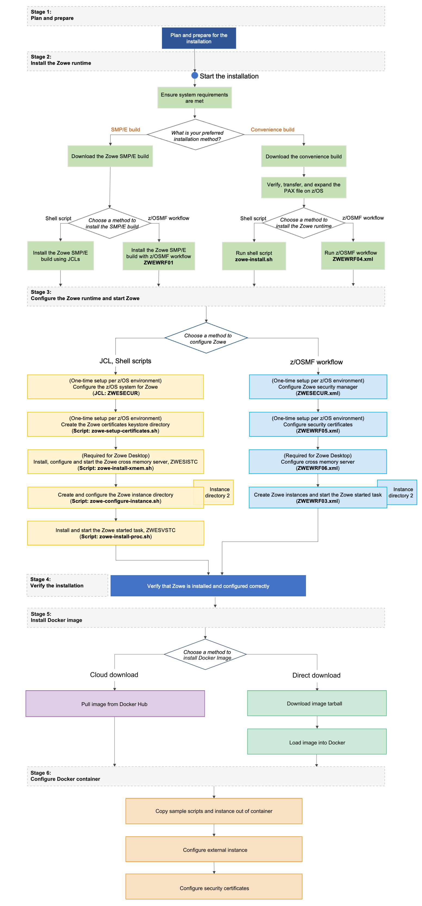

# Docker Installation Roadmap

There are three parts to using Docker to install Zowe&trade;.

- The Zowe z/OS runtime which contains the ZSS component.

- The Zowe Cross Memory Server. This is an authorized server application that provides privileged services to Zowe in a secure manner.

- The Zowe Docker image, which runs on a Linux or zLinux host. It consists of three components: Zowe Application Framework, z/OS Explorer Services, and Zowe API Mediation Layer. 

Using the Zowe Docker bundle first requires setting up your z/OS system for Zowe. The steps for z/OS setup are detailed on the page: [Installing Zowe Server Components on z/OS](install-zos.md)

**NOTE**: If you want to install all server components on z/OS instead of using Docker, completing the z/OS install instructions in the above document is all that is required.

Review the installation diagram and the introduction in this topic to see the general installation sequence and the most important tasks that are to be performed during installation and configuration.

**NOTE**: You can click each step on the diagram for detailed instructions.

<figure>
  
  <figcaption></figcaption>
</figure>
<map name="home_map1" id="home_map1">
  <area href="installandconfig.html#planning-the-installation-of-zowe-server-components" alt="Plan and prepare for the installation" title="Plan and prepare for the installation" shape="rect" coords="326, 63, 474, 105" />
  <area href="systemrequirements.html" alt="Configure system requirements" title="Configure system requirements" shape="rect" coords="318, 183, 467, 224" />

  <area href="https://www.zowe.org/download.html" alt="Download Zowe SMP/E build" title="Download the Zowe SMP/E build from zowe.org" shape="rect" coords="131, 308, 304, 348" />
  <area href="install-zowe-smpe.html" alt="Install the Zowe SMP/E build using JCLs" title="Install the Zowe SMP/E build using JCLs" shape="rect" coords="54, 498, 188, 555" />
  <area href="install-zowe-smpe-zosmf-workflow.html" alt="Install the Zowe SMP/E build with z/OSMF workflow" title="Install the Zowe SMP/E build with z/OSMF workflow" shape="rect" coords="250, 498, 391, 555" />

  <area href="https://www.zowe.org/download.html" alt="Download the Zowe convenience build" title="Download the Zowe convenience build from zowe.org" shape="rect" coords="527, 299, 694, 344" />
  <area href="install-zowe-zos-convenience-build.html#obtaining-and-preparing-the-convenience-build" alt="Verify, transfer, and expand the PAX file on z/OS" title="Verify, transfer, and expand the PAX file on z/OS" shape="rect" coords="526, 368, 696, 410" />
  <area href="install-zowe-zos-convenience-build.html#installing-the-zowe-runtime" alt="Install the Zowe runtime using shell script" title="Install the Zowe runtime using shell script" shape="rect" coords="450, 500, 574, 552" />
  <area href="install-zowe-zos-convenience-build.html#installing-the-zowe-runtime" alt="Install the Zowe runtime with z/OSMF workflow" title="Install the Zowe runtime with z/OSMF workflow" shape="rect" coords="647, 499, 774, 554" />

  <area href="configure-zos-system.html" alt="Configure the z/OS system for Zowe using ZWESECUR" title="Configure the z/OS system for Zowe using ZWESECUR" shape="rect" coords="121, 756, 426, 808" />
  <area href="configure-certificates.html" alt="Configure Zowe certificates using shell script" title="Create the Zowe certificates keystore directory using shell script" shape="rect" coords="124, 830, 426, 882" />
  <area href="configure-xmem-server.html" alt="Configure the Zowe cross memory server using shell script" title="Install and configure the Zowe cross memory server (ZWESISTC) using shell script" shape="rect" coords="123, 909, 426, 952" />
  <area href="configure-instance-directory.html" alt="Create and configure the Zowe instance directory using shell script" title="Create and configure the Zowe instance directory using shell script" shape="rect" coords="121, 976, 426, 1038" />
  <area href="configure-zowe-server.html" alt="Install and start the Zowe started task using shell script" title="Install and start the Zowe started task (ZWESVSTC) using shell script" shape="rect" coords="125, 1065, 426, 1117" />

  <area href="configure-zowe-zosmf-workflow.html#configure-z-os-security-manager" alt="Configure Zowe security manager with z/OSMF workflow" title="Configure Zowe security manager with z/OSMF workflow" shape="rect" coords="515, 759, 757, 805" />
  <area href="configure-zowe-zosmf-workflow.html#configure-zowe-certificates" alt="Configure Zowe certificates with z/OSMF workflow" title="Configure Zowe certificates with z/OSMF workflow" shape="rect" coords="515, 832, 754, 882" />
  <area href="configure-zowe-zosmf-workflow.html#configure-zowe-cross-memory-server" alt="Configure Zowe Cross Memory Server with z/OSMF workflow" title="Configure Zowe Cross Memory Server with z/OSMF workflow" shape="rect" coords="515, 905, 757, 960" />
  <area href="configure-zowe-zosmf-workflow.html#create-and-configure-the-zowe-instance-directory-and-start-the-zowe-started-task" alt="Create and configure the Zowe instance directory and start Zowe with z/OSMF workflow" title="Create and configure the Zowe instance directory and start Zowe with z/OSMF workflow" shape="rect" coords="513, 977, 757, 1042" />

  <area href="verify-zowe-runtime-install.html" alt="Verify Zowe installation on z/OS" title="Verify Zowe installation on z/OS" shape="rect" coords="224, 1154, 616, 1198" />

  <area href="install-docker-image.html#installing-via-docker-hub" alt="Pull image from Docker Hub" title="Pull image from Docker Hub" shape="rect" coords="46, 1390, 416, 1445" />
  <area href="install-docker-image.html#installing-via-direct-download" alt="Download image tarball" title="Download image tarball" shape="rect" coords="495, 1390, 780, 1445" />
  <area href="install-docker-image.html#loading-an-image-from-tarball" alt="Load image into Docker" title="Load image into Docker" shape="rect" coords="495, 1465, 780, 1515" />
  
  <area href="configuring-docker.html#quick-start-for-the-zowe-runtime-in-docker" alt="Copy sample scripts and instance out of container" title="Copy sample scripts and instance out of container" shape="rect" coords="250, 1605, 610, 1660" />
  <area href="configuring-docker.html#using-an-instance-directory-external-to-the-container" alt="Configure external instance" title="Configure external instance" shape="rect" coords="250, 1680, 610, 1735" />
  <area href="configuring-docker.html#using-external-certificates" alt="Configure security certificates" title="Configure security certificates" shape="rect" coords="250, 1755, 610, 1810" />

</map>

## Stage 1: Plan and prepare

Before you start the installation, review the information on hardware and software requirements and other considerations. See [Planning the installation](installandconfig.md) for details.

## Stage 2: Install the Zowe runtime on z/OS

Complete the tasks in **Stage 2** of [z/OS Installation Roadmap](install-zos.md#stage-2-install-the-zowe-z-os-runtime)

## Stage 3: Configure the Zowe z/OS runtime

First you must complete the tasks in **Stage 3** of [z/OS installation Roadmap](install-zos.md#stage-3-configure-the-zowe-z-os-runtime)

After, you should edit or review the chosen Component groups in the Zowe instance directory that was created. For use with Docker, only the Component group ZSS is required. This means that at minimum, the file `instance.env` will have the value `LAUNCH_OMPONENT_GROUPS=ZSS` set. See [Creating and configuring the Zowe instance directory](configure-instance-directory.md#component-groups)

## Stage 4: Verify the installation

Verify that Zowe is installed correctly on z/OS. See [Verifying Zowe installation on z/OS](verify-zowe-runtime-install.md).

## Stage 5: Install Docker image

Get the latest Docker Image for the Zowe Server Components. See [Installing Zowe runtime Docker Image](install-docker-image.md).

## Stage 6: Configure Docker container

Extract and customize the start script, instance directory, and keystore before running a Docker container. See [Configuring Zowe runtime Docker Container](configuring-docker.md)

## Looking for troubleshooting help?

If you encounter unexpected behavior when installing or verifying the Zowe runtime on z/OS, see the [Troubleshooting](../troubleshoot/troubleshooting.md) section for tips.
