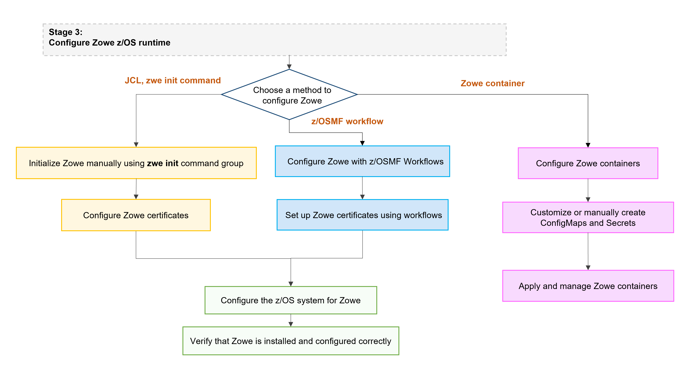

# Zowe server-side installation overview

Installation of Zowe&trade; server-side components on z/OS, consists of the following two parts: 

* [Zowe runtime](#zowe-runtime)
* [Zowe Cross Memory Server (ZIS)](#the-zowe-cross-memory-server-zis)

## Zowe runtime

The Zowe runtime consists of the following three components: 

- **Zowe Application Framework**  
Zowe Application Framework modernizes and simplifies working on the mainframe via a web visual interface. Functionality is provided through apps and a desktop user experience, which is referred to as the Zowe Desktop. Base functionality includes apps to work with JES, MVS Data Sets, Unix System Services, as well as a 3270 Terminal, Virtual Terminal, and an Editor. 

- **Zowe API Mediation Layer (API ML)**  
Zowe API ML provides a reverse proxy and enables REST APIs by providing a single point of access for mainframe service REST APIs like MVS Data Sets, JES, as well as working with z/OSMF. Zowe API ML has dynamic discovery capability for these services and Gateway is also responsible for generating the authentication token used to provide single sign-on (SSO) functionality.

- **Z System Services Server (ZSS)**  
ZSS serves as one of the primary, authenticated backends that communicates with z/OS and works closely with the Zowe Cross Memory Server (ZIS). ZSS provides Zowe with a number of APIs including z/OS Unix files and data sets, control of the plug-ins and services lifecycle, security management, and other APIs. The Zowe Desktop delegates a number of services to ZSS which can then be  accessed through the default http port `7557`. ZSS is written in C and uses native calls to z/OS to provide its services.

## The Zowe Cross Memory Server (ZIS)  

After the installation of Zowe runtime, install the Zowe Cross Memory Server (ZIS).

The Zowe Cross Memory Server, also referred to as Zowe Interprocess Services (ZIS) is an APF authorized server application that provides privileged services to Zowe in a secure manner. For security reasons, ZIS is not an HTTP server. Instead, this server has a trust relationship with ZSS.

Other Zowe components can work through ZSS to handle z/OS data that would otherwise be unavailable or where access to these data could be vulnerable to security breaches.

## Roles and responsibilities for server-side component installation

To avoid interuptions in the installation of Zowe&trade; server-side components, it is useful to be aware of the roles required to perform various tasks in the installation and configuration process.

### Security administrator

To configure Zowe security for production environments, it is likely that your organization's security administrator will be required to perform specific tasks. For more information, see [Addressing security requirements](./address-security-requirements.md#tasks-performed-by-your-security-administrator).

### Storage administrator

Before starting installation, notify your storage administrator to reserve the required space for USS, directory storage space, and any other storage requrements to install Zowe. For more information, see [Addressing storage requirements](./address-storage-requirements.md).

### Network administrator

Notify your organization's network administrator to assign port numbers, reserve these port numbers, and arrange them for you. For more information about network setup, see [Addressing network requirements](./address-network-requirements.md).

### System programmer

In most cases, the system programmer performs the Zowe installation and configuration, and starts Zowe. Ensure that your system programmers have general knowledge about SMP/E, z/OSMF workflows, and regular maintanance procedures. In many cases, the system programmer also prepares jobs for other administrators.

## End-to-end installation

The following diagram illustrates the full ecosystem for installing Zowe server-side components for z/OS.

## Stage 1: Prepare for installation

Begin the installation process by familiarizing yourself with the following topics which are covered in the section [Preparing for installation](./installandconfig.md):

- Zowe's hardware and software requirements
- The `zwe` utility used for installing, configuring, and managing Zowe
- The configuration file used for Zowe, `zowe.yaml`

## Stage 2: Installing the Zowe z/OS runtime

1. Ensure that the software requirements described in [Preparing for installation](systemrequirements-zos.md) are met.

2. Choose your method for installing Zowe on z/OS. 

   Each method to perform Zowe server-side component installation contains the same contents. Choose the method based on your needs. The Zowe z/OS binaries are distributed in the following formats: 

   - **Convenience build**  
   The Zowe z/OS binaries are packaged as a PAX file which is a full product install. Transfer these binaries to a USS directory and expand the contents. Use the [zwe](installandconfig.md#zwe-command) command `zwe install` to extract a number of PDS members which contain load modules, JCL scripts, and PARMLIB entries. 

   - **SMP/E build**  
   Zowe z/OS binaries are packaged as the following files that you can download. You install this build through SMP/E.  
     - A pax.Z file, which contains an archive (compressed copy) of the FMIDs to be installed.
     - A readme file, which contains a sample job to decompress the pax.Z file, transform this file into a format that SMP/E can process, and invoke SMP/E to extract and expand the compressed SMP/E input data sets.

   - **Portable Software Instance (PSWI)**  
   You can acquire and install the Zowe z/OS PAX file as a portable software instance (PSWI) using z/OSMF.

:::note
While the procedures to obtain and install the convenience build, SMP/E build or PSWI are different, the procedure to configure a Zowe runtime is the same, and does not depend on how the build is obtained and installed.
:::

1. Obtain and install the Zowe build.

   - For more information about how to obtain and install the convenience build, see [Installing Zowe runtime from a convenience build](./install-zowe-zos-convenience-build.md).
   - For more information about how to obtain and install the SMP/E build, see [Installing Zowe SMP/E overview](./install-zowe-smpe-overview.md).
   - For more information about how to obtain and install the PSWI, see [Installing Zowe from a Portable Software Instance](./install-zowe-pswi.md).

Successful installation of either a convenience build or an SMP/E build creates a zFS folder that contains the following artifacts:
* The unconfigured Zowe runtime directory
* The utility library `SZWEEXEC` that contains utilities
* The SAMPLIB library `SZWESAMP` that contains sample members
* The load library `SZWEAUTH` that contains load modules 

The steps to prepare the z/OS environment to launch Zowe are the same for all installation methods.

## Stage 3: Configuring the Zowe z/OS runtime

Choose from the following methods to configure the Zowe runtime: 
- [Use a combination of JCL and the zwe command `zwe init`](./initialize-zos-system.md)
- [Use Zowe z/OSMF Workflows](./configure-zowe-zosmf-workflow.md)
- [Use API ML optimized z/OSMF Workflows](./configure-apiml-zosmf-workflow.md)

:::tip
We recommend you open the links to this configuration procedure in new tabs.
:::

The steps to initialize the system are the same independent of whether you obtained Zowe from a .pax convenience build, or an SMP/E distribution.

:::note
The `zwe init` command runs the subcommands in sequence automatically. You can choose to run the subcommands one by one to define each step based on your need. If you encounter any failures with `zwe init` command, you can pick up the failed subcommands step specifically and rerun this subcommand.
:::

The following procedure outlines the steps to configure the Zowe z/OS runtime, and the corresponding `zwe init` subcommands.

1. [Prepare the zowe.yaml configuration file](../appendix/zowe-yaml-configuration.md) if the file does not already exist.
2. [Prepare the custom MVS data sets](initialize-mvs-datasets.md). Copy the data sets provided with Zowe to custom data sets.  
(Uses the command `zwe init mvs`)
3. [Initialize Zowe security configurations](./initialize-security-configuration.md). Create the user IDs and security manager settings.  
  (Uses the command `zwe init security`)  

:::note
If Zowe has already been launched on a z/OS system from a previous release of Zowe v2, you can skip this security configuration step unless told otherwise in the release documentation.
:::
4. [Perform APF authorization of load libraries](./apf-authorize-load-library.md). These load libraries contain the modules required to perform z/OS priviledged security calls.  
(Uses the command `zwe init apfauth`)
5. [Configure Zowe to use TLS certificates](./configure-certificates.md)  
(Uses the command `zwe init certificate`)
6. [Create the VSAM data sets used by the Zowe API Mediation Layer caching service](./initialize-vsam-dataset.md). Note that this step is only required if you are configuring Zowe for cross LPAR sysplex high availability.  
(Uses the command `zwe init vsam`)
7. [Install Zowe main started tasks](./zwe-init-subcommand-overview.md#installing-zowe-main-started-tasks-zwe-init-stc).  
(Uses command `zwe init stc`)

Once you complete the Zowe z/OS runtime, you can [verify the installation](./verify-zowe-runtime-install.md) to determine that Zowe is installed correctly on z/OS.

:::tip
* For testing purposes, it is not necessary to set up certificates when configuring the API Mediation Layer. You can configure Zowe without certificate setup and run Zowe with `verifyCertificates: DISABLED`.
* For production environments, certificates are required. Ensure that certificates for each of the following services are issued by the Certificate Authority (CA) and that all keyrings contain the public part of the certificate for the relevant CA.
   * z/OSMF
   * Zowe
   * The service that is onboarded to Zowe   
:::

## Stage 4: (Optional) Customizing the configuration

Now that you have the permissions, certificates, files, and datasets necessary to run Zowe, you may wish to customize your Zowe configuration. Customization can be performed to change various attributes including the following:

- Enabling or disabling components so you only run what you need
- Changing the network ports Zowe runs on to suit your environment
- Customizing the behavior of a component, such as turning on optional features or logging
- Splitting, templating, and placing your configuration into PARMLIBs with the [Zowe Configuration Manager](./configmgr-using.md)
   
:::tip
See the [Zowe YAML configuration file reference](../appendix/zowe-yaml-configuration.md) for other customization options.
:::

## Stage 5: (Optional) Installing and managing extensions

Before installing extensions, we recommend you [start zowe](./start-zowe-zos.md). 

After Zowe is customized according to your needs, you can leverage more Zowe functionalities by installing extensions. These extensions can be optional components from the Zowe project or from other vendors.

For more information about installing and managing extensions, see [Zowe server component and extension management](./install-configure-zos-extensions.md).

## How to troubleshoot problems with the installation

If you encounter unexpected behavior when installing or verifying the Zowe runtime on z/OS, see the [Troubleshooting](../troubleshoot/troubleshooting.md) section for tips.

For more information on `zwe`, refer to [the zwe appendix](../appendix/zwe_server_command_reference/zwe/zwe.md).

For more information on the server configuration file, see the [Zowe YAML configuration file reference](../appendix/zowe-yaml-configuration.md).

## Next step

Before starting the installation process, first review the article [Preparing for installation](./installandconfig.md) and the address the requirements outlined in the sub-articles in this section.
