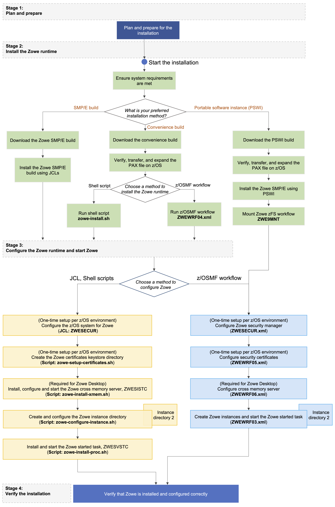

# Installation roadmap

To install Zowe&trade; on z/OS, there are two parts. The first part is the Zowe runtime that consists of three components: Zowe Application Framework, z/OS Explorer Services, and Zowe API Mediation Layer. The second part is the Zowe Cross Memory Server. This is an authorized server application that provides privileged services to Zowe in a secure manner.

Review the installation diagram and the introduction in this topic to see the general installation sequence and the most important tasks that are to be performed during installation and configuration. You can click each step on the diagram for detailed instructions.

<figure>
  
  <figcaption></figcaption>
</figure>
<map name="home_map1" id="home_map1">
  <area href="installandconfig.html#planning-the-installation-of-zowe-z-os-components" alt="Plan and prepare for the installation" title="Plan and prepare for the installation" shape="rect" coords="231, 40, 387, 80" />
  <area href="systemrequirements.html" alt="Configure system requirements" title="Configure system requirements" shape="rect" coords="230, 158, 388, 201" />
  <area href="https://www.zowe.org/#download" alt="Download Zowe SMP/E build" title="Download the Zowe SMP/E build from zowe.org" shape="rect" coords="143, 342, 324, 385" />
  <area href="install-zowe-smpe.html" alt="Install the Zowe SMP/E build" title="Install the Zowe SMP/E build" shape="rect" coords="141, 407, 322, 451" />

  <area href="https://www.zowe.org/#download" alt="Download the Zowe convenience build" title="Download the Zowe convenience build from zowe.org" shape="rect" coords="334, 343, 515, 386" />
  <area href="install-zowe-zos-convenience-build.html#obtaining-and-preparing-the-convenience-build" alt="Verify, transfer, and expand the PAX file on z/OS" title="Verify, transfer, and expand the PAX file on z/OS" shape="rect" coords="336, 407, 514, 450" />
  <area href="install-zowe-zos-convenience-build.html#installing-the-zowe-runtime" alt="Install the Zowe runtime" title="Install the Zowe runtime" shape="rect" coords="335, 469, 515, 513" />
  <area href="configure-zos-system.html" alt="Configure the z/OS system for Zowe" title="Configure the z/OS system for Zowe" shape="rect" coords="163, 565, 507, 610" />
  <area href="configure-certificates.html" alt="Configure Zowe certificates" title="Create the Zowe certificates keystore directory" shape="rect" coords="164, 638, 507, 683" />
  <area href="configure-instance-directory.html" alt="Create and configure the Zowe instance directory" title="Create and configure the Zowe instance directory" shape="rect" coords="163, 711, 508, 758" />
  <area href="configure-xmem-server.html" alt="Configure the Zowe cross memory server" title="Install and configure the Zowe cross memory server (ZWESISTC)" shape="rect" coords="162, 783, 507, 832" />
  <area href="configure-zowe-server.html" alt="Configure the Zowe started task" title="Install the Zowe started task (ZWESVSTC)" shape="rect" coords="163, 860, 507, 905" />
  <area href="verify-zowe-runtime-install.html" alt="Verify Zowe installation on z/OS" title="Verify Zowe installation on z/OS" shape="rect" coords="163, 948, 508, 993" />
</map>

## Stage 1: Plan and prepare

Before you start the installation, review the information on hardware and software requirements and other considerations. See [Planning the installation](installandconfig.md) for details.

## Stage 2: Install the Zowe runtime

1. Ensure that the software requirements are met. The prerequisites are described in [System requirements](systemrequirements.md).

1. Choose the method of installing Zowe on z/OS. 

   The Zowe z/OS binaries are distributed in the following formats. They contain the same contents but you install them by using different methods. You can choose which method to use depending on your needs.

   - **Convenience build**

     The Zowe z/OS binaries are packaged as a PAX file. You install this build by running shell script within a UNIX System Services (USS) shell.  Convenience builds are full product installs.

   - **SMP/E build**

     The Zowe z/OS binaries are packaged as the following files that you can download. You install this build through SMP/E.  
     - A pax.Z file, which contains an archive (compressed copy) of the FMIDs to be installed.
     - A readme file, which contains a sample job to decompress the pax.Z file, transform it into a format that SMP/E can process, and invoke SMP/E to extract and expand the compressed SMP/E input data sets.

   **Note:** The SMP/E build is currently in alpha, which means that it is available for early testing. You can provide any feedback about your experience with Zowe SMP/E as issues in the [zowe-install-packaging GitHub repo](https://github.com/zowe/zowe-install-packaging/issues/new).

   While the procedure to obtain and install the convenience build or SMP/E build are different, the procedure to configure a Zowe runtime are the same irrespective of how the build is obtained and installed.

1. Obtain and install the Zowe build.

   - For how to obtain the convenience build and install it, see [Installing Zowe runtime from a convenience build](install-zowe-zos-convenience-build.md).
   - For how to obtain the SMP/E build and install it, see [Installing Zowe SMP/E Alpha](install-zowe-smpe.md).
   
After successful installation of either a convenience build or an SMP/E build, there will be a zFS folder that contains the unconfigured Zowe runtime `<RUNTIME_DIR>`, a SAMPLIB library `SZWESAMP` that contains sample members, and a load library `SZWEAUTH` that contains load modules. The steps to prepare the z/OS environment to launch Zowe are the same irrespective of the installation method.

## Stage 3: Configure the Zowe runtime

1. Configure the z/OS security manager to prepare for launching the Zowe started tasks. For instructions, see [Configuring the z/OS system for Zowe](configure-zos-system.md).
   
   A SAMPLIB JCL member `ZWESECUR` is provided to assist with the configuration. You can submit the `ZWESECUR` JCL member as-is or customize it depending on site preferences.  
   
   If Zowe has already been launched on the z/OS system from a previous release of Version 1.8 or later, then you are applying a newer Zowe build. You can skip this security configuration step unless told otherwise in the release documentation. 

2. Configure the Zowe certificates keystore and truststore directory. For instructions, see [Configuring Zowe certificates](configure-certificates.md).  

   If you have already created a keystore directory from a previous release of Version 1.8 or later, then you may reuse the existing keystore directory.

   The Zowe keystore directory contains the key used by the Zowe desktop and the Zowe API mediation layer to secure its TLS communication with clients (such as web browsers or REST AI clients). The keystore directory also has a truststore where public keys of any servers that Zowe communicates to (such as z/OSMF) are held.
   
   A keystore directory needs to be created for a Zowe instance to be launched successfully, and a keystore directory can be shared between Zowe instances and between Zowe runtimes, including between different Zowe releases, unless specified otherwise in the release documentation.  

3. Create and customize an instance directory that contains configuration data required to launch a Zowe runtime and is where log files are stored. For instructions, see [Creating and configuring the Zowe instance directory](configure-instance-directory.md).

   A single Zowe runtime can be launched multiple times from different instance directories, each specifying different port ranges, applications to include at start-up, paths of associated runtimes (Java, Node, z/OSMF).

   Next, you will install and configure the Zowe started tasks. Zowe has two high level started tasks: `ZWESVSTC` that launches the Zowe desktop and API mediation layer address spaces, and `ZWESISTC` that is a cross memory server that runs all of the APF-authorized code.  The JCLs for the tasks are included in the PDS SAMPLIB `SZWESAMP` installed by Zowe and the load modules for the cross memory server are included in the PDS load library `SZWEAUTH`. 
   
   **Note** 
   By default, the API Mediation Layer rejects encoded slashes in the URL path of the request. Not allowing encoded slashes is the recommended configuration. If you are onboarding applications which expose endpoints expecting encoded slashes, you need to configure the API Mediation Layer to allow this pattern by performing the following steps:
   1. Open the file `<Zowe install directory>/components/api-mediation/bin/start.sh`.
   2. Find the line that contains the `-Dapiml.service.allowEncodedSlashes=false` parameter and set the value to `true`:
   3. Restart Zowe&trade;. Requests with encoded slashes will now be passed to onboarded services. 

4. (Only required for launching the Zowe desktop) Configure the `ZWESISTC` cross memory server and install the load libraries. For instructions, see [Installing and configuring the Zowe cross memory server (ZWESISTC)](configure-xmem-server.md).

   The cross memory server is only required if you want to use the Zowe desktop. The cross memory server is not used by API Mediation Layer. If you want to use Zowe API Mediation Layer only, you can skip this step. 
   
   Which components of Zowe are started is determined by the `LAUNCH_COMPONENT_GROUPS` value in the `instance.env` file in the Zowe instance directory, see [Creating and configuring the Zowe instance directory](configure-instance-directory.md#component-groups). 

5. Configure the `ZWESVSTC` started task. For instructions, see [Installing the Zowe started task (ZWESVSTC)](configure-zowe-server.md). 

## Stage 4: Verify the installation

Verify that Zowe is installed correctly on z/OS. See [Verifying Zowe installation on z/OS](verify-zowe-runtime-install.md).

## Looking for troubleshooting help?

If you encounter unexpected behavior when installing or verifying the Zowe runtime on z/OS, see the [Troubleshooting](../troubleshoot/troubleshooting.md) section for tips.
