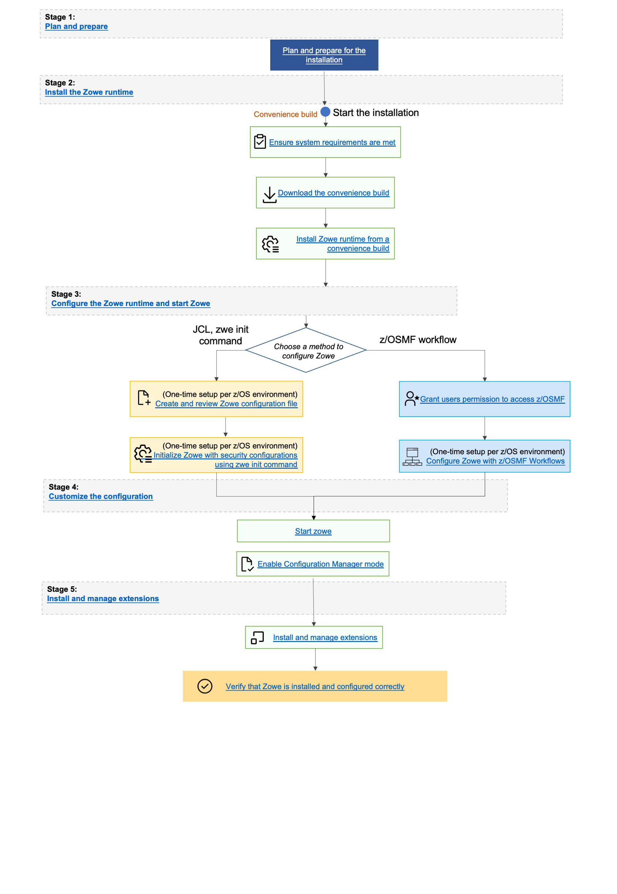

# Installing the z/OS Build via Convenience Build (PAX file)

You can install the Zowe&trade; convenience build by obtaining a PAX file which is used to create the Zowe runtime environment.

## Introduction

The Zowe installation file for Zowe z/OS components is distributed as a PAX file that contains the runtimes and the scripts to install and launch the z/OS runtime. You must obtain the PAX file and transfer it to z/OS first. Then, to install, configure, and start Zowe, you use the `zwe` command. This command defines help messages, logging options, and more. For details about how to use this command, see the [ZWE Server Command Reference](../appendix/zwe_server_command_reference/zwe/zwe.md).  

The configuration data that is read by the `zwe` command are stored in a YAML configuration file named `zowe.yaml`. You modify the `zowe.yaml` file based on your environment. 

Complete the following steps to install the Zowe runtime. 

## End-to-end installation diagram



## Step 1: Obtain the convenience build

1. To download the PAX file, open your web browser on the [Zowe Download](https://www.zowe.org/download.html) website.
2. Navigate to **Zowe V3** -> **Zowe 3.v.p z/OS Convenience build** section, and select the button to download the v3 convenience build.

## Step 2: Transfer the convenience build to USS and expand it

After you download the PAX file, you can transfer it to z/OS and expand its contents.

1. Open a terminal in Mac OS/Linux, or command prompt in Windows OS, and navigate to the directory where you downloaded the Zowe PAX file.

1. Connect to z/OS using SFTP. Issue the following command:

    ```
    sftp <userID@ip.of.zos.box>
    ```

    If SFTP is not available or if you prefer to use FTP, you can issue the following command instead:

    ```
    ftp <userID@ip.of.zos.box>
    bin
    ```

1. Navigate to the target directory that you want to transfer the Zowe PAX file into on z/OS.

    **Note:** After you connect to z/OS and enter your password, you enter the UNIX file system. The following commands are useful:

    - To see what directory you are in, type `pwd`.
    - To switch directory, type `cd`.
    - To list the contents of a directory, type `ls`.
    - To create a directory, type `mkdir`.

1. When you are in the directory you want to transfer the Zowe PAX file into, issue the following command:

    ```
    put <zowe-V.v.p>.pax
    ```
    where:

    * `zowe-V.v.p`  
    is a variable that indicates the name of the PAX file you downloaded.

    **Note:** When your terminal is connected to z/OS through FTP or SFTP, you can prepend commands with `l` to have them issued against your desktop.  To list the contents of a directory on your desktop, type `lls` where `ls` lists contents of a directory on z/OS.

    :::tip
    You can simplify `sftp` usage for existing directory:
    ```
    echo 'put <zowe-V.v.p>.pax' | sftp userID@ip.of.zos.box:/path/to/zowe/runtime
    ```
    :::

    After the PAX file has sucessfully transferred, exit your `sftp` or `ftp` session.

1. Open a USS shell to expand the PAX file. This can either be an ssh terminal, OMVS, iShell, or any other z/OS unix system services command environment. 

1. Expand the PAX file by issuing the following command in the USS shell. 

   ```
   pax -ppx -rf <zowe-V.v.p>.pax
   ```

   where:  
   *  `zowe-V.v.p`  
  is a variable that indicates the name of the PAX file you downloaded.  When extracting the Zowe convenience build, you must always include the `-ppx` argument that preserves extended attributes.  

  This command expands to a file structure similar to the following one:

   ```
      /bin
      /components
      /files
      ...
   ```
   
   This is the Zowe runtime directory and is referred to as `<RUNTIME_DIR>` throughout this documentation.  

   **Note:** In Zowe v2, and Zowe v3 the contents of the expanded Zowe PAX file are the Zowe runtime directory.

## Step 3: (Optional) Add the `zwe` command to your PATH

The `zwe` command is provided in the `<RUNTIME_DIR>/bin` directory. You can optionally add this Zowe bin directory to your `PATH` environment variable so you can execute the `zwe` command without having to fully qualify its location. To update your `PATH`, run the following command:

```
export PATH=${PATH}:<RUNTIME_DIR>/bin
```

`<RUNTIME_DIR>` should be replaced with your real Zowe runtime directory path. This will update the `PATH` for the current shell. To make this update persistent, you can add the line to your `~/.profile` file, or the `~/.bashProfile` file if you are using a bash shell. To make this update system wide, you can update the `/etc/.profile` file. Once the `PATH` is updated, you can execute the `zwe` command from any USS directory. For the remainder of the documentation when `zwe` command is referenced, it is assumed that it has been added to your `PATH`.

The `zwe` command has built in help that can be retrieved with the `-h` option. For example, type `zwe -h` to display all of the supported commands. These are broken down into a number of sub-commands:

```
zwe -h
 ...
Available sub-command(s):
  - certificate
  - components
  - config
  - diagnose
  - init
  - install
  - internal
  - migrate
  - sample
  - start
  - stop
  - support
  - version
```

## Step 4: Copy the zowe.yaml configuration file to preferred location

Copy the template file `<RUNTIME_DIR>/example-zowe.yaml` file to a new location, such as `/var/lpp/zowe/zowe.yaml` or your home directory `~/.zowe.yaml`. This will become your configuration file that contains data used by the `zwe` command at a number of parts of the lifecycle of configuring and starting Zowe. You will need to modify the `zowe.yaml` file based on your environment. 

When you execute the `zwe` command, the `-c` argument is used to pass the location of a `zowe.yaml` file.  

:::tip
To avoid passing `--config` or `-c` to every `zwe` commands, you can define `ZWE_CLI_PARAMETER_CONFIG` environment variable pointing to location of `zowe.yaml`.

For example, after defining

```
export ZWE_CLI_PARAMETER_CONFIG=/path/to/my/zowe.yaml
```

, you can simply type `zwe install` instead of full command `zwe install -c /path/to/my/zowe.yaml`.
:::

## Step 5: Install the MVS data sets

After you extract the Zowe convenience build, you can run the [`zwe install` command](../appendix/zwe_server_command_reference/zwe/zwe-install.md) to install MVS data sets.

### About the MVS data sets

Zowe includes a number of files that are stored in the various data sets. See the following table for the storage requirements.

Library DDNAME | Member Type | Target Volume | Type | Org | RECFM | LRECL | No. of 3390 Trks | No. of DIR Blks
---|---|---|---|---|---|---|---|---
SZWESAMP | Samples | ANY | U | PDSE | FB | 80 | 15 | 5
SZWEAUTH | Zowe APF Load Modules | ANY | U | PDSE | U | 0 | 15 | N/A
SZWEEXEC | CLIST copy utilities | ANY | U | PDSE | FB | 80 | 15 | 5
SZWELOAD | Executable utilities library | ANY | U | PDSE | U | 0 | 15 | N/A

The `SZWESAMP` data set contains the following members.

Member name | Type | Purpose
---|---|---
ZWECSRVS | JCL | Removes the VSAM data set for the Caching Service
ZWECSVSM | JCL | Creates the VSAM data set for the Caching Service
ZWEGENER | JCL | Generates JCL templates to configure Zowe
ZWEIACF | JCL | Defines security permits for ACF2
ZWEIACFZ | JCL | Creates the ACF2 Zowe resource class
ZWEIAPF | JCL | Set APF for the required datasets
ZWEIAPF2| JCL | Set APF for the required datasets
ZWEIKRA1 | JCL | Defines ACF2 key ring and certificates
ZWEIKRA2 | JCL | Defines ACF2 key ring and certificates
ZWEIKRA3 | JCL | Defines ACF2 key ring and certificates
ZWEIKRR1 | JCL | Defines RACF key ring and certificates
ZWEIKRR2 | JCL | Defines RACF key ring and certificates
ZWEIKRR3 | JCL | Defines RACF key ring and certificates
ZWEIKRT1 | JCL | Defines TSS key ring and certificates
ZWEIKRT2 | JCL | Defines TSS key ring and certificates
ZWEIKRT3 | JCL | Defines TSS key ring and certificates
ZWEIMVS | JCL | Creates datasets used by a Zowe instance
ZWEIMVS2 | JCL | Creates the load library (expected to be APF)
ZWEINSTL | JCL | Creates and copies basic installation datasets and members
ZWEIRAC  | JCL | Defines security permits for RACF
ZWEIRACZ | JCL | Creates the RACF Zowe resource class
ZWEISTC | JCL | Adds `PROCLIB` members
ZWEITSS | JCL | Defines security permits for TSS
ZWEITSSZ | JCL | Creates the TSS Zowe resource class
ZWEKRING | JCL | Defines key ring and certificates
ZWENOKRA | JCL | Removes key ring and certificates for ACF2
ZWENOKRR | JCL | Removes key ring and certificates for RACF
ZWENOKRT | JCL | Removes key ring and certificates for TSS
ZWENOKYR | JCL | Removes key ring and certificates
ZWENOSEC | JCL | Defines security permits
ZWERMVS | JCL | Removes datasets used by a Zowe instance
ZWERMVS2 | JCL | Removes the APF load library
ZWERSTC | JCL | Removes `PROCLIB` members
ZWESASTC | JCL | Starts the Zowe Auxiliary server used by Cross memory server
ZWESECKG | JCL | Sample program which generates a secret key for the PKCS#11 token
ZWESECUR | JCL | Defines security permits for Zowe
ZWESIPRG | Commands | Console commands to APF authorize the cross memory server load library
ZWESIP00 | PARMLIB | Member for the cross memory server
ZWESISCH | PPT | Defines entries required by Cross memory server and its Auxiliary address spaces to run in Key(4) 
ZWESISTC | JCL | Starts the Zowe Cross memory server
ZWESLSTC | JCL | Starts the Zowe

The `SZWEAUTH` data set is a load library containing the following members.

Member name | Purpose
---|---
ZWELNCH | The Zowe launcher that controls the startup, restart and shutdown of Zowe's address spaces
ZWESIS01 | Load module for the cross memory server
ZWESAUX  | Load module for the cross memory server's auxiliary address space
ZWESISDL | ZIS Dynamic Plug-in

The `SZWEEXEC` data set contains few utilities used by Zowe.

The `SZWELOAD` data set contains config manager for REXX.

### Procedure

The high level qualifer (or HLQ) for these data sets is specified in the `zowe.yaml` section below. Ensure that you update the `zowe.setup.dataset.prefix` value to match your system.  

```
zowe:
  setup:
    # MVS data set related configurations
    dataset:
      prefix: IBMUSER.ZWEV2
```

To create and install the MVS data sets, use the command `zwe install`.
1. In a USS shell, execute the command `zwe install -c /path/to/zowe.yaml`. This creates the data sets and copy across their content.
2. If the data sets already exist, specify `--allow-overwritten`.  
3. To see the full list of parameters, execute the command `zwe install -h`. 

A sample run of the command is shown below using default values.  

```
#>zwe install -c ./zowe.yaml
===============================================================================
>> INSTALL ZOWE MVS DATA SETS

Create MVS data sets if they are not exist
Creating Zowe sample library - IBMUSER.ZWEV2.SZWESAMP
Creating Zowe authorized load library - IBMUSER.ZWEV2.SZWEAUTH
Creating Zowe load library - IBMUSER.ZWEV2.SZWELOAD
Creating Zowe executable utilities library - IBMUSER.ZWEV2.SZWEEXEC

Copy files/SZWESAMP/ZWESIPRG to IBMUSER.ZWEV2.SZWESAMP
...
Copy components/launcher/samplib/ZWESLSTC to IBMUSER.ZWEV2.SZWESAMP
Copy components/launcher/bin/zowe_launcher to IBMUSER.ZWEV2.SZWEAUTH
...
Copy components/zss/SAMPLIB/ZWESISCH to IBMUSER.ZWEV2.SZWESAMP(ZWESISCH)
...
Copy components/zss/LOADLIB/ZWESAUX to IBMUSER.ZWEV2.SZWEAUTH

-------------------------------------------------------------------------------
>> Zowe MVS data sets are installed successfully.
#>
```

## Next steps

You successfully installed Zowe from the convenience build! However, before you start Zowe, you must complete several required configurations. The next step is [Initializing Zowe z/OS runtime](./configure-zowe-runtime.md). 
