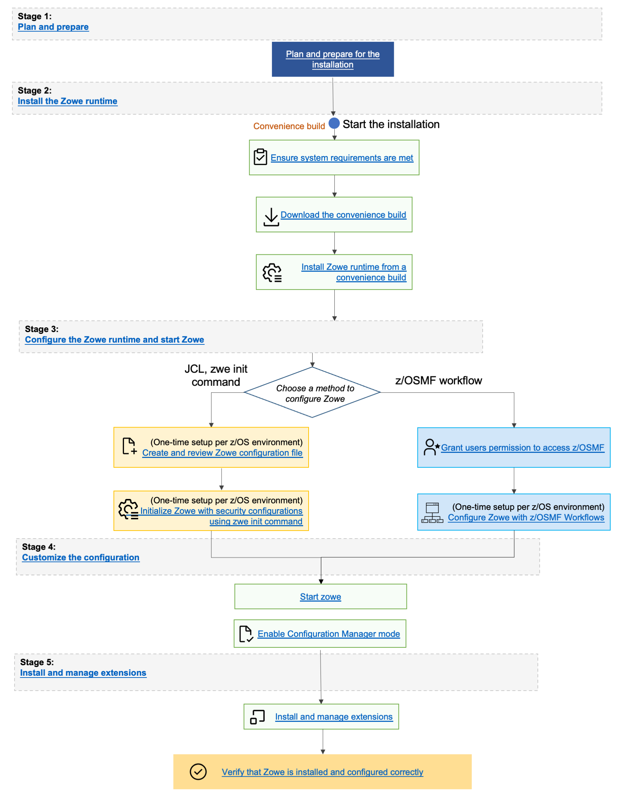

# Installing the z/OS Build via Convenience Build (PAX file)

You can install the Zowe&trade; convenience build by obtaining a PAX file which is used to create the Zowe runtime environment.

## Introduction

The Zowe installation file for Zowe z/OS components is distributed as a PAX file that contains the runtimes and the scripts to install and launch the z/OS runtime. You must first obtain the PAX file and transfer this file to z/OS. To install, configure, and start Zowe,  use the `zwe` command. This command defines help messages, logging options, and more. For details about how to use this command, see the [ZWE Server Command Reference](../appendix/zwe_server_command_reference/zwe/zwe.md).  

The configuration data that is read by the `zwe` command are stored in a YAML configuration file named `zowe.yaml`. Modify the `zowe.yaml` file based on your environment. 

Complete the following steps to install the Zowe runtime. 

## End-to-end installation diagram



## Step 1: Obtain the convenience build

1. To download the PAX file, open your web browser on the [Zowe Download](https://www.zowe.org/download.html) website.
2. Navigate to **Zowe V3** -> **Zowe 3.v.p z/OS Convenience build** section, and select download the v3 convenience build.

## Step 2: Transfer the convenience build to USS and expand it

After you download the PAX file, transfer the file to z/OS and expand the file contents.

1. Open a terminal in Mac OS or Linux, or command prompt in Windows OS, and navigate to the directory where you downloaded the Zowe PAX file.

2. Connect to z/OS using SFTP. Issue the following command:

    ```
    sftp <userID@ip.of.zos.box>
    ```

    If SFTP is not available or if you prefer to use FTP, you can issue the following command instead:

    ```
    ftp <userID@ip.of.zos.box>
    bin
    ```

3. Navigate to the target directory that you want to transfer the Zowe PAX file into on z/OS.

    **Note:** After you connect to z/OS and enter your password, enter the UNIX file system. The following commands are useful:

    - To see what directory you are in, type `pwd`.
    - To switch directory, type `cd`.
    - To list the contents of a directory, type `ls`.
    - To create a directory, type `mkdir`.

4. When you are in the directory you want to transfer the Zowe PAX file into, issue the following command:

    ```
    put <zowe-V.v.p>.pax
    ```

    * `zowe-V.v.p`  
    Specifies the name of the PAX file you downloaded.

    **Note:** When your terminal is connected to z/OS through FTP or SFTP, you can prepend commands with `l` to have them issued against your desktop.  To list the contents of a directory on your desktop, type `lls` where `ls` lists contents of a directory on z/OS.

    :::tip
    You can simplify `sftp` usage for the existing directory with the following command:
    ```
    echo 'put <zowe-V.v.p>.pax' | sftp userID@ip.of.zos.box:/path/to/zowe/runtime
    ```
    :::

    After the PAX file successfully transfers, exit your `sftp` or `ftp` session.

5. Use `cd` to move into the high level directory where you want the code to be installed. 

   **Note:** The directory may be `/usr/lpp/zowe`

6. Open a USS shell to expand the PAX file. THe command environment can be any of the following options:
* ssh terminal
* OMVS
* iShell
* Any other z/OS USS command environment. 

7. Expand the PAX file by issuing the following command in the USS shell. 

   ```
   pax -ppx -rf <zowe-V.v.p>.pax
   ```
 
   *  `zowe-V.v.p`  
  Specifies the name of the PAX file you downloaded. When extracting the Zowe convenience build, ensure that you include the `-ppx` argument that preserves the extended attributes.  

  This command expands to a file structure similar to the following example:

   ```
      /bin
      /components
      /files
      ...
   ```
   
   This directory is the Zowe runtime directory, and is referred to as `<RUNTIME_DIR>` throughout this documentation.  

   **Note:** In Zowe v2, and Zowe v3 the contents of the expanded Zowe PAX file are the Zowe runtime directory.

## Step 3: (Optional) Add the `zwe` command to your PATH

The `zwe` command is provided in the `<RUNTIME_DIR>/bin` directory. You can optionally add this Zowe bin directory to your `PATH` environment variable so you can execute the `zwe` command without having to fully qualify its location. To update your `PATH`, run the following command:

```
export PATH=${PATH}:<RUNTIME_DIR>/bin
```

Replace `<RUNTIME_DIR>` with your Zowe runtime directory path. This replacement updates the `PATH` for the current shell. To make this update persistent, add the line to your `~/.profile` file, or the `~/.bashProfile` file if you are using a bash shell. To make this update system wide, update the `/etc/.profile` file. Once the `PATH` is updated, you can execute the `zwe` command from any USS directory. 

**Note:**
For the remainder of the documentation, references to the `zwe` command assumes this update to your `PATH`.

:::tip
The `zwe` command has built-in help that can be retrieved with the `-h` option. For example, type `zwe -h` to display all of the supported commands. These are broken down into a number of sub-commands:

```
zwe -h
 ...
Available sub-command(s):
  - certificate
  - components
  - config
  - diagnose
  - init
  - install
  - internal
  - migrate
  - sample
  - start
  - stop
  - support
  - version
```
:::

## Step 4: Copy the zowe.yaml configuration file to preferred location

Copy the template file `<RUNTIME_DIR>/example-zowe.yaml` file to a new location, such as `/var/lpp/zowe/zowe.yaml` or your home directory `~/.zowe.yaml`. This file is your configuration file that contains data used by the `zwe` command throughout the lifecycle of configuring and starting Zowe. Modify the `zowe.yaml` file based on your environment. 

When you execute the `zwe` command, the `-c` argument is used to pass the location of the `zowe.yaml` file.  

:::tip
To avoid passing `--config` or `-c` to every `zwe` commands, you can define the `ZWE_CLI_PARAMETER_CONFIG` environment variable pointing to the location of `zowe.yaml`.

**Example of defining the path:**

```
export ZWE_CLI_PARAMETER_CONFIG=/path/to/my/zowe.yaml
```

Once the path is defined, it is possible to enter `zwe install` as a substitute for the full command `zwe install -c /path/to/my/zowe.yaml`.
:::

## Step 5: Install the MVS data sets

After you extract the Zowe convenience build, you can install MVS data sets by running the [`zwe install` command](../appendix/zwe_server_command_reference/zwe/zwe-install.md).

### About the MVS data sets

Review the list of datasets and members in a Zowe installation in the [Server Datasets Appendix](../appendix/server-datasets.md).


### Procedure

The high level qualifer (or HLQ) for these data sets is specified in the `zowe.yaml` section below. Ensure that you update the `zowe.setup.dataset.prefix` value to match your system.  

```
zowe:
  setup:
    # MVS data set related configurations
    dataset:
      prefix: IBMUSER.ZWEV3
```

To create and install the MVS data sets, use the command `zwe install`.
1. In a USS shell, execute the command `zwe install -c /path/to/zowe.yaml`. This creates the data sets and copies the data set content.
2. If the data sets already exist, specify `--allow-overwritten`.  
3. To see the full list of parameters, execute the command `zwe install -h`. 

The following example illustrates a sample run of the command  using default values.

**Example:**

```
#>zwe install -c ./zowe.yaml
===============================================================================
>> INSTALL ZOWE MVS DATA SETS

Create MVS data sets if they are not exist
Creating Zowe sample library - IBMUSER.ZWEV3.SZWESAMP
Creating Zowe authorized load library - IBMUSER.ZWEV3.SZWEAUTH
Creating Zowe load library - IBMUSER.ZWEV3.SZWELOAD
Creating Zowe executable utilities library - IBMUSER.ZWEV3.SZWEEXEC

Copy files/SZWESAMP/ZWESIPRG to IBMUSER.ZWEV3.SZWESAMP
...
Copy components/launcher/samplib/ZWESLSTC to IBMUSER.ZWEV3.SZWESAMP
Copy components/launcher/bin/zowe_launcher to IBMUSER.ZWEV3.SZWEAUTH
...
Copy components/zss/SAMPLIB/ZWESISCH to IBMUSER.ZWEV3.SZWESAMP(ZWESISCH)
...
Copy components/zss/LOADLIB/ZWESAUX to IBMUSER.ZWEV3.SZWEAUTH

-------------------------------------------------------------------------------
>> Zowe MVS data sets are installed successfully.
#>
```

## Next steps

You successfully installed Zowe from the convenience build. However, before you start Zowe, it is necessary to complete several required configurations. The next step is [Initializing Zowe z/OS runtime](./configure-zowe-runtime.md). 
