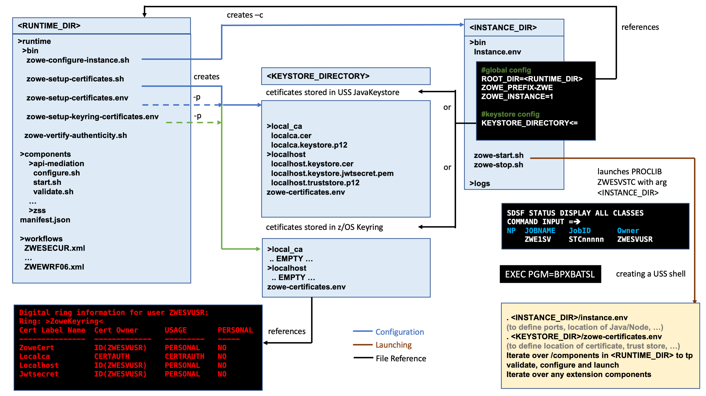

# Introduction

The installation of Zowe&trade; consists of two independent processes: installing the Zowe runtime on z/OS and installing Zowe CLI on a desktop computer.  

The Zowe z/OS runtime provides a web desktop that runs in a web browser providing a number of applications for z/OS users, together with an API mediation layer that provides capabilities useful for z/OS developers. 

Zowe CLI can connect to z/OS servers and allows tasks to be performed through a command line interface. 

- A desktop computer that accesses the Zowe z/OS runtime through a web browser or REST API client does not need to have Zowe CLI installed.
- The z/OS servers that Zowe CLI connects to does not require the Zowe z/OS components to be installed on those servers. 
- A desktop computer that uses Zowe CLI does not require the Zowe z/OS runtime to be installed on the z/OS server.

Before you start the installation, review the information on system requirements and other considerations.

## Planning the installation of Zowe z/OS components

The following information is required during the installation process of the Zowe z/OS components.

- The zFS directory where you will install the Zowe runtime files and folders.  For more details of setting up and configuring the UNIX Systems Services (USS) environment, see [UNIX System Services considerations for Zowe](configure-uss.md).

- A HLQ that the installation can create a load library and samplib containing load modules and JCL samples required to run Zowe.

- Multiple instances of Zowe can be started from the same Zowe z/OS runtime.  Each launch of Zowe has its own zFS directory that is known as an instance directory.  

- Zowe uses a zFS directory to contain its northbound certificate keys as well as a truststore for its southbound keys.  Northbound keys are one presented to clients of the Zowe desktop or Zowe API Gateway, and southbound keys are for servers that the Zowe API gateway connects to.  The certificate directory is not part of the Zowe runtime so that it can be shared between multiple Zowe runtimes and have its permissions secured independently. 

- Zowe has two started tasks. 
   - `ZWESVSTC` brings up the Zowe runtime containing the Zowe desktop, the API mediation layer and a number of Zowe applications.
   - `ZWESISTC` is a cross memory server that the Zowe desktop uses to perform APF-authorized code. More details on the cross memory server are described in [Configuring the Zowe cross memory server](configure-xmem-server.md). 
   
     In order for the two started tasks to run correctly, security manager configuration needs to be performed.  This is documented in [Configuring the z/OS system for Zowe](configure-zos-system.md) and a sample JCL member `ZWESECUR` is shipped with Zowe that contains commands for RACF, TopSecret, and ACF2 security managers.  

## Topology of the Zowe z/OS launch process

The following diagram depicts the high-level structure of a Zowe installation and runtime.  

 

### RUNTIME_DIR

The runtime directory `<RUNTIME_DIR>` contains the binaries and executable files. You can create a runtime directory in one of the following ways:
- Executing the `zowe-install.sh` script contained within the `install` directory of a Zowe convenience build.  
- Installing the Zowe SMP/E FMID AZWE001 using the JCL members in the REL4 member.
- Executing the z/OSMF worklow script `ZWERF01` contained in the SMP/E FMID AZWE001.

During execution of Zowe, the runtime directory contents are not modified.  Maintenance or APAR release for Zowe replaces the contents of the runtime directory and are rollup PTFs.  

### INSTANCE_DIR

The instance directory `<INSTANCE_DIR>` is required to launch Zowe.  It is created with the script `<RUNTIME_DIR>/bin/zowe-configure-instance.sh`.  More than one instance directory can be created and used to launch multiple instances of Zowe sharing the same runtime directory `<RUNTIME_DIR>`.

Zowe instances are started by running the script `<INSTANCE_DIR>/bin/zowe-start.sh`.  This creates a started task with the PROCLIB member `ZWESVSTC` that is provided with the samplib `SZWESAMP` created during the installation of Zowe.  The JCL member `ZWESVSTC` starts a USS shell under which it launches its address spaces.  

The instance directory file `instance.env` is used to configure a Zowe launchable.  The file is executed during the launch of Zowe and specifies shell variables such as ports and location of dependent directories and services on z/OS.  

The `instance.env` file sets the location of the `<RUNTIME_DIRECTORY>` as well as the `<KEYSTORE_DIRECTORY>`

### KEYSTORE_DIRECTORY

Zowe uses certificates to encrypt data as well as a truststore.  The keystore directory `<KEYSTORE_DIRECTORY>` controls where the certificates are located, either in a JavaKeystore or a z/OS keyring.  A `<KEYSTORE_DIRECTORY>` is created by using the script `<RUNTIME_DIR>/bin/zowe-setup-certificates.sh`.  

