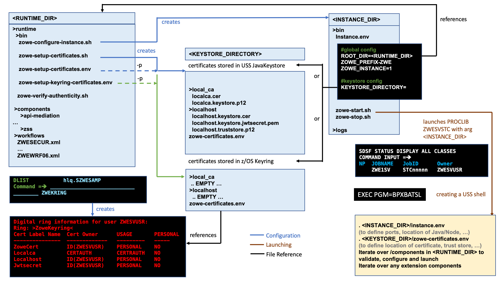

# Introduction

The installation of Zowe&trade; consists of two independent processes: installing the Zowe server components either entirely on z/OS or a combination of z/OS and Docker, and then installing Zowe CLI on a desktop computer.  

The Zowe server components provide a web desktop that runs in a web browser providing a number of applications for z/OS users, together with an API mediation layer provides single-sign on (SSO), organization of the multiple zowe servers under a single website, and other capabilities useful for z/OS developers. 

Zowe CLI can connect to z/OS servers and allows tasks to be performed through a command line interface.

Because Zowe is a set of components, before installing Zowe, first determine which components you want to install and where you want to install them. This guide provides documentation for all of the components and it is split into sections so you can install as much as you need.

Here are some scenarios to consider:

- If you will only be accessing the Zowe server components through a web browser or REST API client, then you do not need to install the Zowe CLI.
- If you will only be using the Zowe CLI, depending on the plugins used you may not need to install the Zowe server components.
- If you intend to use Docker for the server components, less components need to be installed on z/OS. If you are not using the Desktop or ZSS, then it's possible run the other Zowe components without installing any of Zowe onto z/OS.

Before you start the installation, review the information on system requirements and other considerations.

## Planning the installation of Zowe server components

All Zowe server components can be installed on z/OS, but some have the alternative option of being run inside of a Docker image on a Linux host.
Which option you choose effects the prerequisites, where they are installed, and the installation steps needed.

### Planning z/OS installation
If you are installing one or more server components onto z/OS, the following information is required during the installation process. Software and hardware prerequisites are covered in the next section.

- The zFS directory where you will install the Zowe runtime files and folders.  For more details of setting up and configuring the UNIX Systems Services (USS) environment, see [UNIX System Services considerations for Zowe](configure-uss.md).

- A HLQ that the installation can create a load library and samplib containing load modules and JCL samples required to run Zowe.

- Multiple instances of Zowe can be started from the same Zowe z/OS runtime.  Each launch of Zowe has its own zFS directory that is known as an instance directory.  

- (If not using Docker) Zowe uses a zFS directory to contain its northbound certificate keys as well as a truststore for its southbound keys.  Northbound keys are one presented to clients of the Zowe desktop or Zowe API Gateway, and southbound keys are for servers that the Zowe API gateway connects to.  The certificate directory is not part of the Zowe runtime so that it can be shared between multiple Zowe runtimes and have its permissions secured independently. 

- Zowe has two started tasks.
   - `ZWESISTC` is a cross memory server that the Zowe desktop uses to perform APF-authorized code. More details on the cross memory server are described in [Configuring the Zowe cross memory server](configure-xmem-server.md). 
   - `ZWESVSTC` brings up the every other other part of the Zowe runtime on z/OS that was requested. This may include Desktop, API mediation layer, ZSS, and more, but when using Docker likely only ZSS will be used here.
   
     In order for the two started tasks to run correctly, security manager configuration needs to be performed.  This is documented in [Configuring the z/OS system for Zowe](configure-zos-system.md) and a sample JCL member `ZWESECUR` is shipped with Zowe that contains commands for RACF, TopSecret, and ACF2 security managers.  

## Topology of the Zowe z/OS launch process

The following diagram depicts the high-level structure of a Zowe installation and runtime.  

 

### RUNTIME_DIR

The runtime directory `<RUNTIME_DIR>` contains the binaries and executable files. You can create a runtime directory in one of the following ways:
- Executing the `zowe-install.sh` script contained within the `install` directory of a Zowe convenience build.  
- Installing the Zowe SMP/E FMID AZWE001 using the JCL members in the REL4 member.
- Executing the z/OSMF worklow script `ZWERF01` contained in the SMP/E FMID AZWE001.

During execution of Zowe, the runtime directory contents are not modified.  Maintenance or APAR release for Zowe replaces the contents of the runtime directory and are rollup PTFs.  

### INSTANCE_DIR

The instance directory `<INSTANCE_DIR>` is required to launch Zowe.  It is created with the script `<RUNTIME_DIR>/bin/zowe-configure-instance.sh`.  More than one instance directory can be created and used to launch multiple instances of Zowe sharing the same runtime directory `<RUNTIME_DIR>`.

Zowe instances are started by running the script `<INSTANCE_DIR>/bin/zowe-start.sh`.  This creates a started task with the PROCLIB member `ZWESVSTC` that is provided with the samplib `SZWESAMP` created during the installation of Zowe.  The JCL member `ZWESVSTC` starts a USS shell under which it launches its address spaces.  

The instance directory file `instance.env` is used to configure a Zowe launchable.  The file is executed during the launch of Zowe and specifies shell variables such as ports and location of dependent directories and services on z/OS.  

The `instance.env` file sets the location of the `<RUNTIME_DIRECTORY>` as well as the `<KEYSTORE_DIRECTORY>`

### KEYSTORE_DIRECTORY

Zowe uses certificates to encrypt data as well as a truststore.  The keystore directory `<KEYSTORE_DIRECTORY>` controls where the certificates are located, either in a JavaKeystore or a z/OS keyring.  A `<KEYSTORE_DIRECTORY>` is created by using the script `<RUNTIME_DIR>/bin/zowe-setup-certificates.sh`.  

