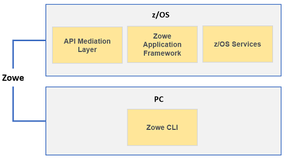

# Planning the installation

**Contents**

- [Installation roadmap](#installation-roadmap)
	- [Methods of installing Zowe runtime on z/OS](#methods-of-installing-zowe-runtime-on-zos)
- [Planning the installation of Zowe z/OS components](#planning-the-installation-of-zowe-zos-components)

The installation of Zowe consists of two independent processes: installing Zowe runtime on z/OS and installing Zowe CLI on your computer.

When you install Zowe runtime on z/OS, there are two parts:
- The first part is to install the Zowe Application Framework, the API Mediation Layer, and a number of micro services that provide capability to both.
- The second part is to install the Zowe Cross Memory Server. This is an authorized server application that provides privileged services to Zowe in a secure manner.

The Zowe CLI is not installed on z/OS and runs on a personal computer. The following diagram shows the installation location of Zowe components.

## Installation roadmap

Installing Zowe involves several steps that you must complete in the order listed. Review the following table that presents the task-flow for preparing your environment and installing and configuring Zowe before you begin the installation process.

| Tasks | Details
| --- | ---
| 1. Review the pre-installation planning information and prepare your environment to meet the installation prerequisites. | See [Planning the installation of Zowe z/OS components](#planning-the-installation-of-zowe-z-os-components) and [System requirements](systemrequirements.md).
| 2. Allocate enough space for the installation. |  The installation process requires approximately 1 GB of available space. Once installed on z/OS, API Mediation Layer requires approximately 150MB of space, and the Zowe Application Framework requires approximately 50 MB of space before configuration. Zowe CLI requires approximately 200 MB of space on your computer.
| 3. Install components of Zowe. | To install Zowe runtime on z/OS, see [Methods of installing Zowe runtime on z/OS](#methods-of-installing-zowe-runtime-on-zos).   To install Zowe CLI on a computer, see [Installing Zowe CLI](cli-installcli.md).
| 4. (Optional) Troubleshoot problems that occur during installation. | See [Troubleshooting](../troubleshoot/troubleshooting.md).

To uninstall Zowe, see [Uninstalling Zowe](uninstall.md).

### Methods of installing Zowe runtime on z/OS

You can install Zowe runtime on z/OS by using one of the following methods:

- Use a PAX file

  The Zowe installation file for Zowe z/OS components are distributed as a PAX file that contains the runtimes and the scripts to install and launch the z/OS runtime. To use this method, see [Installing the Zowe runtime on z/OS](install-zos.md).

- Use SMP/E

  Zowe z/OS components are packaged as two files that you can download and install through SMP/E.
  - A readme file, which contains a sample job to decompress the second file, transform it into a format that SMP/E can process, and invoke SMP/E to RECEIVE the file. This file must be downloaded as text.
  - A pax.Z file, which contains an archive (compressed copy) of the FMIDs to be installed. This file needs to be downloaded to a workstation and then uploaded to a host as a binary file.

  To use this method, see [Installing Zowe SMP/E](install-zowe-smpe.md).

## Planning the installation of Zowe z/OS components

The following information is required during the installation process of API Mediation Layer and Zowe Application Framework. Make the decisions before the installation.

- The HFS directory where you install Zowe.
- The HFS directory that contains a 64-bit Java™ 8 JRE.
- The z/OSMF installation directory, for example, `/usr/lpp/zosmf/lib`.
- The API Mediation Layer HTTP and HTTPS port numbers. You will be asked for 3 unique port numbers.
- The user ID that runs the Zowe started task.

    **Tip:** Use the same user ID that runs the z/OSMF `IZUSVR1` task, or a user ID with equivalent authorizations.

- The mainframe account under which the ZSS server runs must have UPDATE permission on the `BPX.DAEMON` and `BPX.SERVER` facility class profiles.
