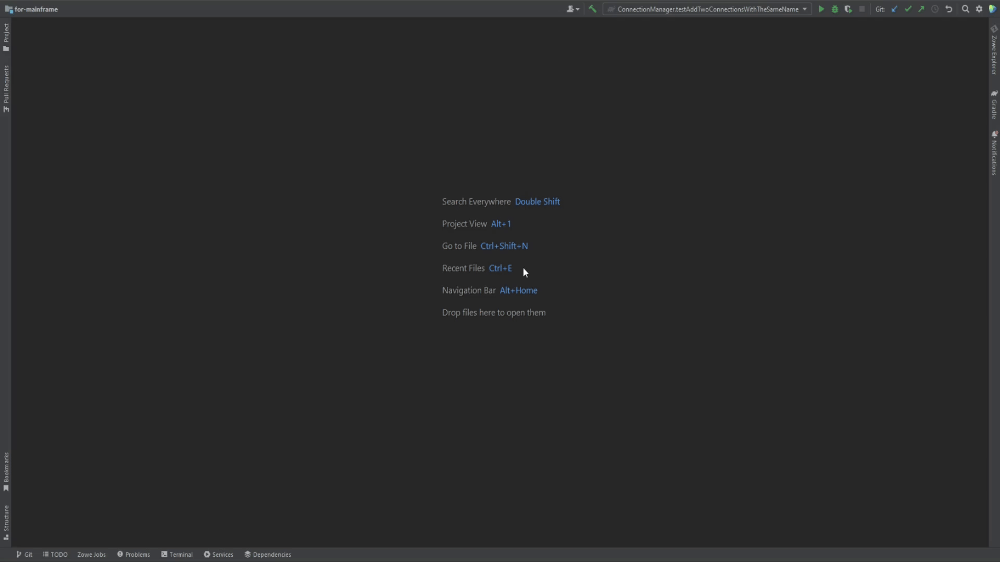

# Configuring the plug-in

After you install the Zowe Explorer plug-in for Intellij IDEA, you must create a z/OSMF connection to your mainframe and some working sets. 

:::note

z/OS v2.3 or later is required with a REST API z/OSMF configured properly. To use it, you need the user ID to be connected to the IZUUSER RACF group. Contact your RACF administrator to complete the setup process.

:::

## Creating z/OSMF connection 

There are two ways to create a z/OSMF connection: 
- using the in-built plug-in's connection configurations **(1)**
- using Zowe Team Config v2 **(2)**

### Creating the connection using the plug-in's connection configurations

You can create a connection to a z/OSMF REST API either by manually specifying all the needed information through the "Settings" tab **(1)**, or by clicking the "+" sign **(2)**.

&nbsp;&nbsp;&nbsp;&nbsp;&nbsp;

To create the connection:
1. In the Zowe Explorer click **+** button
2. Select **Connection**
3. Type in all the necessary information in the dialog
4. Wait until the connection test is finished and all the necessary information is fetched

### Creating the connection using Zowe Config v2

To create the z/OSMF connection with Zowe Config v2 there are two ways.

The first scenario - adding already existing Zowe Config v2 from a local opened project
1. Open the project with the **zowe.config.json**
2. *Zowe config file detected* notification should appear, click **Add Zowe Connection**
3. Wait until the connection is tested

The second scenario - creating a new Zowe Config v2 from scratch:
1. In the Zowe Explorer click **+** button
2. Select **Zowe Team Configuration**
3. Fill in all the necessary information in the dialog
4. Wait until the connection test is finished and all the necessary information is fetched

After the configuration is made, you will be able to use all the features of the plug-in.
