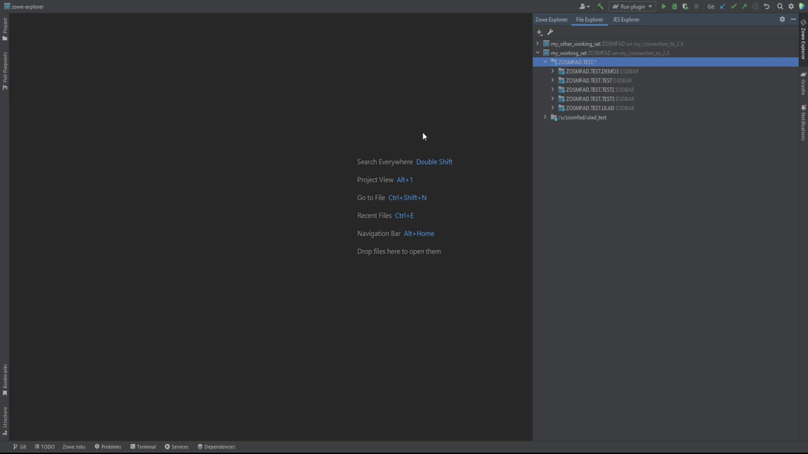
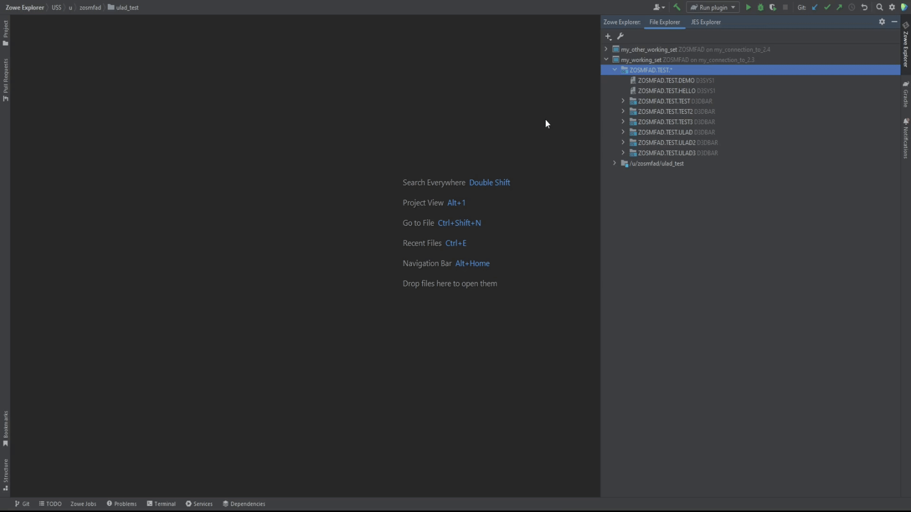

# Using Zowe IntelliJ plug-in

Learn how to work with the Zowe IntelliJ plug-in, including working with datasets, USS files, and jobs.

## Settings

Before you start to use the plug-in, there are some settings available. First one - synchronization option.

### Auto-sync option

It is possible to synchronize the file or dataset you are editing either manually or automatically. The method is controlled by **Enable auto-sync with mainframe** option. When it is checked, you don't need to manually synchronize the file/dataset whilst you are editing it, the IntelliJ platform decides by itself, when and how to synchronize it. The plug-in is using this feature and allows users to avoid additional sync action. In case you want to be sure that you control the process of syncing with the mainframe, or in case you have some limitations for calls to z/OSMF, or for some other reason, you can disable this option and continue with manual synchronization either by button, appearing if there are any changes in the file, or by pressing simultaneously **Ctrl + Shift + S (Cmd + Shift + S for MacOS)**.

### Batch size option

Mainframe z/OS and USS filesystems could have a lot of datasets/files under a specified mask. Sometimes the loading of datasets/files list could take a lot of time if there are a lot of entries. To eliminate this problem, the plug-in provides the ability to control the amount of items loading at one time. It is called **Batch amount to show per fetch** in **Settings**. By default, it is set to **100** entries. When the list contains more than the specified number, you can load next amount of entries, specified in this option, double-clicking by **load more** item in the **File Explorer** view.

## Working with Files Working Sets

To work with z/OS datasets or USS files, you need to [set up a Files Working Set](intellij-working-sets.md#files-working-set). The most of the functions are available under context menu in Files Working Set view.

Using the plug-in, you will be able to:
- create, rename, view, edit, delete PS, PDS, PDS/e datasets, as well as PDS and PDS/e members;
- use feature **Allocate Like** to create a dataset with parameters of another dataset;
- use feature **Migrate** for datasets;
- copy and move datasets and members between each other, as well as to USS filesystem and to another z/OS system;
- submit JCL jobs with **Submit Job**;

### Working with z/OS PS datasets

### Working with z/OS PDS datasets

### "Allocate Like" feature

To issue the **Allocate Like**, click right mouse button on any of datasets and select **Allocate Like**.

### "Submit Job" feature

To issue the **Submit Job**, click right mouse button on any of PS datasets or PDS members and select **Submit Job**.

<!-- CHANGEME -->
## Working with USS files

Using the context menu in Zowe IntelliJ plug-in, you can create, rename, and delete files and directories.

You can use the following functionalities when interacting with USS files:

- **View Unix System Services (USS) files**: You can view multiple USS files simultaneously.
- **Rename USS files and directories**: Use “Rename” menu item in the context menu for any directory or file. 
- **Edit USS files**: Use double-click to open and edit any file. 
- **Create USS files and directories**: Use “New” -> “Directory” or “File” menu item in the context menu for any directory or file. 
- **Delete USS files and directories**: Use “Delete” menu item in the context menu for any directory or file. 
- **Copy/move USS files and directories**: Use “Copy” / “Paste” / “Cut” menu item in the context menu for any directory or file. 

## Working with jobs

To operate with your JCL jobs, ensure you [create a JES Working Set](intellij-configure.md#creating-a-jes-working-set) first, which will hold all the filters for the JES Explorer. 

You can submit a job and see the output. 

