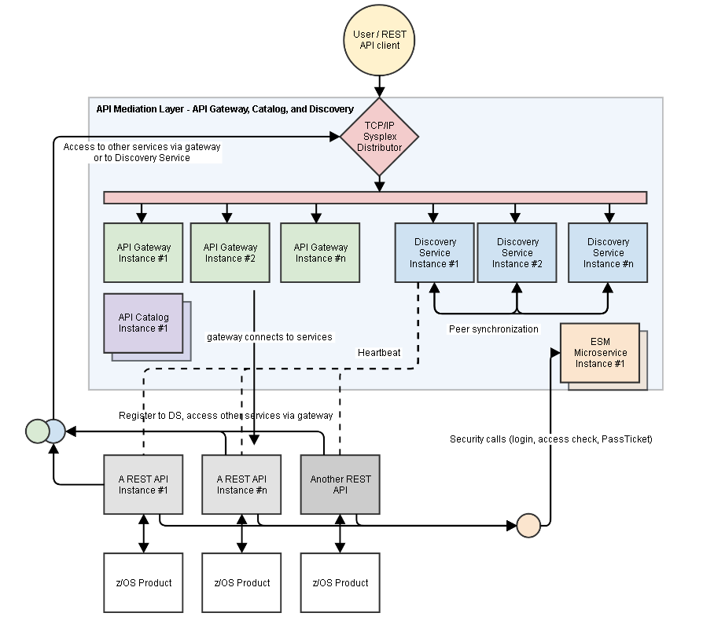

# Zowe overview

Zowe offers modern interfaces to interact with z/OS and allows you to work with z/OS in a way that is similar to what you experience on cloud platforms today. You can use these interfaces as delivered or through plug-ins and extensions that are created by clients or third-party vendors.

Zowe consists of the following main components.

- **zLUX**: Contains a Web user interface (UI) that provides a full screen interactive experience. The Web UI includes many interactions that exist in 3270 terminals and web interfaces such as IBM z/OSMF.

- **Explorer server**: Provides a range of APIs for the management of jobs, data sets, z/OS UNIX System Services files, and persistent data.

- **API Mediation Layer**: Provides an API abstraction layer through which APIs can be discovered, catalogued, and presented uniformly.

- **Zowe CLI**: Provides a command-line interface that lets you interact with the mainframe remotely and use common tools such as Integrated Development Environments (IDEs), shell commands, bash scripts, and build tools for mainframe development. It provides a set of utilities and services for application developers that want to become efficient in supporting and building z/OS applications quickly.

For details of each component, see the corresponding section.

## zLUX

zLUX modernizes and simplifies working on the mainframe. With zLUX, you can create applications to suit your specific needs. zLUX contains a web UI that has the following features:

- The web UI works with the underlying REST APIs for data, jobs, and subsystem, but presents the information in a full screen mode as compared to the command line interface.
- The web UI makes use of the leading-edge web presentation technology and is also extensible through web UI plug-ins to capture and present any variety of information.
- The web UI includes common z/OS developer or system programmer tasks such as an editor for common text-based files like REXX or JCL along with general purpose data set actions for both Unix System Services (USS) and Partitioned Data Sets (PDS) plus Job Entry System (JES) logs.

zLUX consists of the following components:

- **Mainframe Virtual Desktop (MVD)**

    The desktop, accessed through a browser.

- **Zowe Node Server**

    The Zowe Node Server runs zLUX. It consists of the Node.js server plus the Express.js as a webservices framework, and the proxy applications that communicate with the z/OS services and components.

- **ZSS Server**

    The ZSS Server provides secure REST services to support the Zowe Node Server.

- **Application plug-ins**

    Several application-type plug-ins are provided. For more information, see [Using zLUX application plug-ins](usingmvd.md#using-zlux-application-plug-ins).

## Explorer server

The explorer server is a z/OS® RESTful web service and deployment architecture for z/OS microservices. The server is implemented as a Liberty Profile web application that uses z/OSMF services to provide a range of APIs for the management of jobs, data sets, z/OS UNIX™ System Services (USS) files, and persistent data.

These APIs have the following features:

- These APIs are described by the Open API Specification allowing them to be incorporated to any standard-based REST API developer tool or API management process.
- These APIs can be exploited by off-platform applications with proper security controls.

Any client application that calls RESTful APIs directly can use the explorer server.

As a deployment architecture, the explorer server accommodates the installation of other z/Tool microservices into its Liberty instance. These microservices can be used by explorer server APIs and client applications.

## Zowe CLI
Zowe CLI is a command-line interface that lets application developers interact with the mainframe in a familiar format. Zowe CLI helps to increase overall productivity, reduce the learning curve for developing mainframe applications, and exploit the ease-of-use of off-platform tools. Zowe CLI lets application developers use common tools such as Integrated Development Environments (IDEs), shell commands, bash scripts, and build tools for mainframe development. It provides a set of utilities and services for application developers that want to become efficient in supporting and building z/OS applications quickly.

Zowe CLI provides the following benefits:

  - Enables and encourages developers with limited z/OS expertise to build, modify, and debug z/OS applications.
  - Fosters the development of new and innovative tools from a PC that can interact with z/OS.
  - Ensure that business critical applications running on z/OS can be maintained and supported by existing and generally available software development resources.
  - Provides a more streamlined way to build software that integrates with z/OS. 

The following sections explain the key features and details for Zowe CLI:

**Note:** For information about prerequisites, software requirements, installing and upgrading Zowe CLI, see
[Installing Zowe](installandconfig.md).

### Zowe CLI capabilities

With Zowe CLI, you can interact with z/OS remotely in the following ways:

  - **Interact with mainframe files:**   
    Create, edit, download, and
    upload mainframe files (data sets) directly from Zowe CLI. 
  - **Submit jobs:**    
    Submit JCL from data sets or local storage, monitor the status, and view and download the output automatically.
  - **Issue TSO and z/OS console commands:**    
    Issue TSO and console commands to the mainframe directly from Zowe CLI.
  - **Integrate z/OS actions into scripts:**    
    Build local scripts that accomplish both mainframe and local tasks. 
  - **Produce responses as JSON documents:**    
    Return data in JSON format on request for consumption in other programming languages.

For more information about the available functionality in Zowe CLI, see [Zowe CLI Command Groups](cli-usingcli.md#zowe-cli-command-groups).

### Zowe CLI Third-Party software agreements

Zowe CLI uses the following third-party software:

| Third-party Software | Version | File name             |
| ----------------- | -------| ------------------------- |
| chalk             | 2.3.0  | Legal_Doc_00002285_56.pdf |
| cli-table2        | 0.2.0  | Legal_Doc_00002310_5.pdf  |
| dataobject-parser | 1.2.1  | Legal_Doc_00002310_36.pdf |
| find-up           | 2.1.0  | Legal_Doc_00002310_33.pdf |
| glob              | 7.1.1  | Legal_Doc_00001713_45.pdf |
| js-yaml           | 3.9.0  | Legal_Doc_00002310_16.pdf |
| jsonfile          | 4.0.0  | Legal_Doc_00002310_40.pdf |
| jsonschema        | 1.1.1  | Legal_Doc_00002310_17.pdf
| levenshtein       | 1.0.5  | See [UNLICENSE](https://github.com/gf3/Levenshtein/blob/master/UNLICENSE) |
| log4js            | 2.5.3  | Legal_Doc_00002310_37.pdf |
| merge-objects     | 1.0.5  | Legal_Doc_00002310_34.pdf |
| moment            | 2.20.1 | Legal_Doc_00002285_25.pdf |
| mustache          | 2.3.0  | Legal_Doc_mustache.pdf    |
| node.js           | 6.11.1 | Legal_Doc_nodejs.pdf      |
| node-ibm\_db      | 2.3.1  | Legal_Doc_00002310_38.pdf |
| node-mkdirp       | 0.5.1  | Legal_Doc_00002310_35.pdf |
| node-progress     | 2.0.0  | Legal_Doc_00002310_7.pdf  |
| prettyjson        | 1.2.1  | Legal_Doc_00002310_22.pdf |
| rimraf            | 2.6.1  | Legal_Doc_00002310_8.pdf  |
| Semver            | 5.5.0  | Legal_Doc_00002310_42.pdf |
| stack-trace       | 0.0.10 | Legal_Doc_00002310_10.pdf |
| string-width      | 2.1.1  | Legal_Doc_00002310_39.pdf |
| wrap-ansi         | 3.0.1  | Legal_Doc_00002310_12.pdf |
| yamljs            | 0.3.0  | Legal_Doc_00002310_13.pdf |
| yargs             | 8.0.2  | Legal_Doc_00002310_1.pdf  |

**Note:** All trademarks, trade names, service marks, and logos referenced herein belong to their respective companies.

To read each complete license, navigate to the GitHub repository and download the file named Zowe_CLI_TPSRs.zip. The .zip file contains the licenses for all of the third-party components that Zowe CLI uses.

**More Information:**

  - [System requirements for Zowe CLI](planinstall.md)
  - [Installing Zowe CLI](cli-installcli.md)

## API Mediation Layer

The API Mediation Layer provides a single point of access for mainframe service REST APIs. The layer offers enterprise, cloud-like features such as high-availability, scalability, dynamic API discovery, consistent security, a single sign-on experience, and documentation. The API Mediation Layer facilitates secure communication across loosely coupled microservices through the API Gateway. The API Mediation Layer includes an API Catalog that provides an interface to view all discovered microservices, their associated APIs, and Swagger documentation in a user-friendly manner. The Discovery Service makes it possible to determine the location and status of microservice instances running inside the ecosystem.  

**More Information:**
- [Onboard an existing Spring Boot REST API service using Zowe API Mediation Layer](../guides/api-mediation-usingapiml.md)
- [Using API Catalog](api-mediation-api-catalog.md)

### Key features  
* High availability of services in which application instances on a failing node are distributed among surviving nodes
* Microservice UIs available through the API Gateway and API Catalog by means of reverse proxying
* Support for standardization and normalization of microservice URLs and routing to provide API Mediation Layer users with a consistent way of accessing microservices.
* Minimal effort to register a microservice with the gateway (configuration over code)
* Runs on Windows, Linux, and z/OS (target platform)
* Written in Java utilizing Spring Boot (2.x), Angular 5, and the Netflix CloudStack
* Supports multiple client types for discovery (including Spring Boot, Java, and NodeJS)
* Contains enablers that allow for easy discovery and exposure of REST APIs and Swagger documentation for each microservice

### API Mediation Layer architecture
The following diagram illustrates the single point of access with the API Gateway and the interactions between the API Gateway, API Catalog, and the Discovery Service:   

### Components
The API Layer consists of the following key components:

#### API Gateway
The microservices that are contained within the ecosystem are located behind a reverse proxy. Clients interact with the gateway layer (reverse proxy). This layer forwards API requests to the appropriate corresponding service through the microservice endpoint UI. The gateway is built using Netflix Zuul and Spring Boot technology.

#### Discovery Service
The Discovery service is the central point in the API Gateway infrastructure that accepts "announcements of REST services" and serves as a repository of active services. Back-end microservices register with this service either directly by using a Eureka client. Non-Spring Boot applications register with the Discover Service indirectly through a Sidecar. The Discovery Service is built on Eureka and Spring Boot technology.

#### API Catalog
The API Catalog is the catalog of published APIs and their associated documentation that are discoverable or can be available if provisioned from the service catalog. The API documentation is visualized using the Swagger UI. The API Catalog contains APIs of services available as product versions. A service can be implemented by one or more service instances, which provide exactly the same service for high-availability or scalability.

**More Information:**
- [Onboard an existing Spring Boot REST API service using Zowe API Mediation Layer](../guides/api-mediation-usingapiml.md)
- [Using API Catalog](api-mediation-api-catalog.md)

### Zowe API Mediation Layer Third-Party software agreements

Zowe API Mediation Layer uses the following third-party software:

| Third-party Software | Version | File name             |
| ----------------- | -------| ------------------------- |
| angular | 5.2.0 | Legal_Doc_00002377_15.pdf |
| angular2-notifications | 0.9.5 | Legal_Doc_00002499_11.pdf |
| Apache Tomcat | 8.0.39 | Legal_Doc_00001505_6.pdf |
| Bootstrap | 3.0.3 | Legal_Doc_12955_5.pdf |
| Bootstrap | 3.3.7 | Legal_Doc_00001682_11.pdf |
| bootstrap-submenu | 2.0.4 | Legal_Doc_00001456_44.pdf |
| Commons Validator | 1.6.0 | Legal_Doc_00002105_1.pdf |
| copy-webpack-plugin | 4.4.1 | Legal_Doc_00002499_13.pdf |
| core-js  | 2.5.3 | Legal_Doc_corejs_MIT.pdf |
| eureka-client | 1.8.6 | Legal_Doc_00002499_3.pdf |
| eventsource | 1.0.5 | Legal_Doc_00002499_9.pdf |
| google-gson | 2.8.2 | Legal_Doc_00002252_4.pdf |
| Guava | 23.2-jre | Legal_Doc_00002499_22.pdf |
| H2 | 1.4.196 | Legal_Doc_00002499_19.pdf |
| hamcrest | 1.3 | Legal_Doc_00001170_33.pdf |
| httpclient | 4.5.3 | Legal_Doc_00001843_2.pdf |
| jackson | 2.9.2 | Legal_Doc_00002259_6.pdf |
| jackson | 2.9.3 | Legal_Doc_00001505_16.pdf |
| javamail | 1.4.3 | Legal_Doc_00000439_22.pdf |
| javax servlet api | 3.1.0 | Legal_Doc_00002499_23.pdf |
| javax.validation | 2.0.1.Final | Legal_Doc_00002499_27.pdf |
| Jersey | 2.26 | Legal_Doc_00002499_2.pdf |
| Jersey Media JSON Jackson | 2.26 | Legal_Doc_00002019_68.pdf |
| jquery | 2.0.3 | Legal_Doc_00000379_69.pdf |
| JSON Web Token | 0.8.0 | Legal_Doc_00002499_21.pdf |
| json-path | 2.4.0 | Legal_Doc_00001454_30.pdf |
| lodash | 4.17.5 | Legal_Doc_00002499_8.pdf |
| Logback | 1.0.1 | Legal_Doc_00002499_1.pdf |
| lombok | 1.16.20 | Legal_Doc_00002499_18.pdf |
| mockito | 2.15.0 | Legal_Doc_00002499_28.pdf |
| netflix-infix | 0.3.0 | Legal_Doc_00002499_4.pdf |
| ng2-cookies | 1.0.12 | Legal_Doc_00002499_15.pdf |
| ng2-destroy-subscribers | 0.0.28 | Legal_Doc_00002499_16.pdf |
| ng2-simple-timer | 1.3.3 | Legal_Doc_00002499_17.pdf |
| NPM | 5.6.0 | Legal_Doc_00002499_10.pdf |
| powermock | 1.7.3 | Legal_Doc_00002499_25.pdf |
| reactor-core | 3.0.7.RELEASE | Legal_Doc_00001938_51.pdf |
| Roaster | 2.20.1.Final | Legal_Doc_00002499_20.pdf |
| RxJS | 5.5.6 | Legal_Doc_rxjs_Apache.pdf |
| Spring Cloud Config | 2.0.0.M9 | Legal_Doc_00002499_33.pdf |
| Spring Hateoas | 0.23.0.RELEASE | Legal_Doc_00002377_10.pdf |
| Spring Retry | 1.2.2 | Legal_Doc_00002499_14.pdf |
| spring security | 5.0.3.RELEASE | Legal_Doc_00002499_29.pdf |
| spring-boot | 2.0.0.RELEASE | Legal_Doc_spring_boot_Apache.pdf |
| Spring-Cloud-Netflix | 2.0.0.M8 | Legal_Doc_00002499_30.pdf |
| Springfox | 2.8.0 | Legal_Doc_00002499_31.pdf |
| spring-ws | 3.0.0.RELEASE | Legal_Doc_00002499_32.pdf |
| swagger-core | 1.5.18 | Legal_Doc_00002499_24.pdf |
| swagger-jersey2-jaxrs	 | 1.5.17 | Legal_Doc__00001528_32.pdf |
| swagger-schema-ts | 2.0.8 | Legal_Doc_00002499_12.pdf |
| zone.js | 0.8.20 | Legal_Doc_zonejs_MIT.pdf |

**Note:** All trademarks, trade names, service marks, and logos referenced herein belong to their respective companies.

To read each complete license, navigate to the GitHub repository and download the file named Zowe_APIML_TPSRs.zip. The .zip file contains the licenses for all of the third-party components that Zowe API Mediation Layer uses.