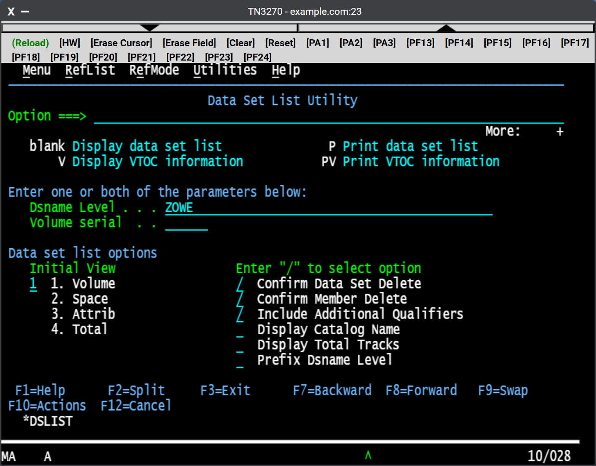

# Using the 3270 Terminal
The 3270 Terminal Display Emulator plug-in provides a user interface that emulates the basic functions of IBM 3270 family terminals. On the back end, the plug-in and the Zowe Application Server connect to any standard TN3270/E server.

This terminal display emulator operates as a three tier program. Due to web browsers being unable to supply TCP networking that terminals require, this terminal display emulator does not connect directly to your TN3270 server. Instead, the Zowe Application Server acts as a bridge, and uses websockets between the server and the browser for terminal communication. As a result, terminal connections only work when the stack of network programs supports websockets and the TN3270 server destination is visible to the Zowe Application Server.

The terminal connection can be customized per user and saved for future sessions using the connection toolbar of the application. The preferences are stored within [the configuration dataservice storage](../extend/extend-desktop/mvd-configdataservice.md), which can also be used to set instance-wide defaults for multiple users.

You can customize the preferences in the yaml configuration via environment variables:
* `ZWED_TN3270_PORT`: port number
* `ZWED_TN3270_SECURITY`: `telnet` or `tls`
* `ZWED_TN3270_HOST`: host name 
* `ZWED_TN3270_ROW`: alternate rows
* `ZWED_TN3270_COL`: alternate columns  
* `ZWED_TN3270_MOD`: screen mode, following values are supported
  * `1`: 24x80
  * `2`: 32x80
  * `3`: 43x80
  * `4`: 27x132
  * `5`: Dynamic    
* `ZWED_TN3270_CODEPAGE`: CCSID, following values are supported
  * `037`, `1047`, `273`, `277`, `278`, `280`, `284`, `290`, `297`, `420`, `424`, `500`, `838`, `870`, `875`, `918`, `924`, `937`, ` 935`, `930`

Example of environment variables:
```yaml
zowe:
  environments:
    ZWED_TN3270_PORT: "23"
    ZWED_TN3270_SECURITY: "telnet"
    ZWED_TN3270_HOST: "lpar1.example.com"
    ZWED_TN3270_ROW: "24"
    ZWED_TN3270_COL: "80"
    ZWED_TN3270_MOD: "5"
    ZWED_TN3270_CODEPAGE: "1047"
```

## Keyboard shortcuts
The terminal bundle that is used by tn3270-ng2 has several keyboard shortcuts to execute common TN3270 emulator functionality. The following Action and shortcut table presents the current list of what function is mapped to which key combination. 

Be aware that some browsers intercept key combinations that are common to browsers, such as `Ctrl`+`R` or `Ctrl`+`T`, and that the operating system may also intercept certain combinations such as `Windows`+`R` or `Alt`+`F4`. 

Also, be aware that the key combinations listed are only be handled by the terminal if the terminal has focus, which you can determine if the terminal's cursor is visible and blinking or not. To gain focus on the terminal, it is sufficient to click on the terminal's contents. The difference between focus and not focus may be the difference between `F5` being interpreted as terminal `PF5`, or the browser reloading the page.

**Action and Shortcut table**

Action | Keyboard Shortcut | Note
-------|-------------------|------
Attention | `Ctrl`+`a` | ATTN - Attention key | 
Back Tab | `Shift`+`Tab` |
Backspace | `Backspace` |
Cent Sign | `Ctrl`+`[` | &cent;
Clear | `Ctrl`+`Shift`+`z` |
Cursor Down | `ArrowDown`, `NumpadArrowDown` |
Cursor Left| `ArrowLeft`, `NumpadArrowLeft` |
Cursor Right| `ArrowRight`, `NumpadArrowRight` |
Cursor Up| `ArrowUp`, `NumpadArrowUp` |
Delete | `Delete`, `NumpadDelete` |
Dup | `Ctrl`+`d` | DUP
End | `End`, `NumpadEnd` |
Enter | `Enter`, `NumpadEnter` |
Erase End of Field (EOF) | `Ctrl`+`e` | Erases from cursor position to end of field
Erase Field | `Ctrl`+`l` | Erases entire field
Erase Input | `Ctrl`+`i` | Erases contents of all input fields
Erase Word | `Ctrl`+`w`| Erases until next word, including whitespace
Home | `Home`, `NumpadHome` |
Insert | `Insert`, `NumpadInsert` | Toggles insert text mode
New Line | `Ctrl`+`Enter`, `Ctrl`+`NumpadEnter` | Moves cursor to field on next row
Null | `Alt`+`n` | Deletes one character
Not Sign | `Ctrl`+`6` | &not;
PA1 | `Alt`+`1` |
PA2 | `Alt`+`2` |
PA3 | `Alt`+`3` |
PF01 | `F1` | 
PF02 | `F2` | 
PF03 | `F3` | 
PF04 | `F4` | 
PF05 | `F5` | 
PF06 | `F6` | 
PF07 | `F7` | 
PF08 | `F8` | 
PF09 | `F9` | 
PF10 | `F10` | 
PF11 | `F11` | 
PF12 | `F12` | 
PF13 | `Shift`+`F1` | 
PF14 | `Shift`+`F2` | 
PF15 | `Shift`+`F3` | 
PF16 | `Shift`+`F4` | 
PF17 | `Shift`+`F5` | 
PF18 | `Shift`+`F6` | 
PF19 | `Shift`+`F7` | 
PF20 | `Shift`+`F8` | 
PF21 | `Shift`+`F9` | 
PF22 | `Shift`+`F10` | 
PF23 | `Shift`+`F11` | 
PF24 | `Shift`+`F12` |
Rapid Left | `Ctrl`+`ArrowLeft` | Move cursor left by 2 positions
Rapid Right | `Ctrl`+`ArrowRight` | Move cursor right by 2 positions
Reset | `Alt`+`r` | Terminal does not lock on bad input, but rejects and auto resets. No use for reset button currently.
Vertical Bar | `Ctrl`+`1` | &VerticalSeparator;
Tab | `Tab`

## Key sequences
Key sequences allow users to define their own key sequences. Each key sequence is a recorded set of keys with the possibility of using the key modifiers (Ctrl, Alt, Shift), function keys (F1, F2, ...) and the combinations (such as Ctrl+E or Shift+F1). The definition is stored in the `_keySequences.json` file.

### Default key sequences
* There is a set of predefined key sequences
* Key sequences are accesible via top right menu:
  


### Syntax of the JSON
* All key sequences can be redefined by the user
* Following syntax is required:
  * `keySequences` is an array of individual key sequences
  * `title` displayed in the key sequences menu
  * `description` is hover help for each item in the key sequences menu
  * `keys` is an array of the key strokes
    * `normal` for the "typewriter" keys
    * `special` for the function, modifiers and other special keys
      * The value corresponds to the javascript key code
    * `prompt` is used for user input and this input is pasted on the current cursor position
   * `ctrl`, `alt` and `shift` are key modifiers
  * If you combine `normal`, `special` or `prompt` in one array item, only one action will be made in the order of `normal`, `special` and `prompt`

### Example

Review the following demonstration on two simple key sequences: 

* **Hello, world**
  * Types `Hello, world` only
* **ISPF command SWAP NEXT**
  * Presses `Home` to get on the command line/input field
  * `Ctrl+E` deletes the input field
    * `Ctrl+E` is predefined in the TN3270 as "EOF - Erase end of field"
  * Types `SWAP NEXT`
  * Hits `Enter`

The corresponding file `_keySequences.json` appears as the following:

```
{ "keySequences":
  [
    { "title": "Hello, world",
      "description": "Types Hello, world",
       "keys": [ { "normal":  "Hello, world" } ]
    },
    { "title": "SWAP NEXT",
      "description": "ISPF: Swap next command",
       "keys": [ { "special": "Home" },
                 { "normal":  "E", "ctrl": "true" },
                 { "normal":  "SWAP NEXT" },
                 { "special": "Enter" } 
               ]
    }
  ]
}
```
