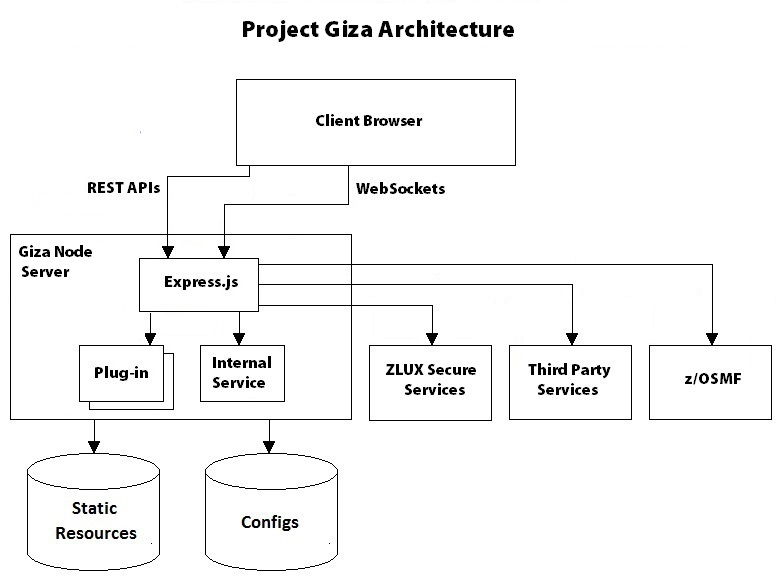

# Project Giza overview

Project Giza is a virtual desktop system that allows a rich and open platform for a web-based mainframe user experience.

Understanding a little bit about the Project Giza architecture might be helpful as you work through the installation and configuration process.

 

