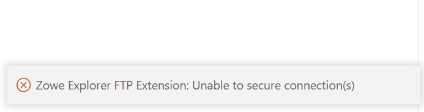

# Providing feedback and contributing

To help make Zowe client-side components better, you are welcome to contribute in different ways.

## Zowe CLI

### Chatting with the Zowe CLI community

Chat with the community on [Slack](https://openmainframeproject.slack.com/archives/CC8AALGN6).

### Filing an issue for Zowe CLI

Go to the [Zowe CLI issue list](https://github.com/zowe/zowe-cli/issues) to file an issue. Include all relevant information.

## Zowe Explorer

### Chatting with the Zowe Explorer community

Chat with the community on [Slack](https://openmainframeproject.slack.com/archives/CUVE37Z5F) by indicating whether the message about Zowe Explorer, Zowe Explorer for IBM CICS extension, or the Zowe Explorer FTP Extension.

### Filing an issue for Zowe Explorer and Zowe Explorer extensions

Before filing an issue, check if the error stems from either Zowe Explorer, the Zowe Explorer for IBM CICS extension or the Zowe Explorer FTP Extension.

To file an issue:

1. To check the error source, expand the error message that displays in VS Code and review the **Source** description:

    
    - Errors arising from Zowe Explorer identify the **Source** as *Zowe Explorer (Extension)*.
    - Errors arising from the Zowe Explorer CICS extension identify the **Source** as *Zowe Explorer for IBM CICS (Extension)*.
    - Errors arising from the Zowe Explorer FTP extension identify the **Source** as *Zowe Explorer Extension for FTP (Extension)*.

2. Go to the extension repository to file an issue. Include all relevant information.
    - [Zowe Explorer issue list](https://github.com/zowe/zowe-explorer-vscode/issues)
    - [Zowe Explorer for IBM CICS issue list](https://github.com/zowe/cics-for-zowe-client/issues)
    - [Zowe Explorer FTP Extension issue list](https://github.com/zowe/zowe-explorer-vscode/issues)
        - Add the label `zFTP` to indicate the extension.

## Zowe Explorer plug-in for IntelliJ IDEA

### Chatting with the Zowe Explorer plug-in for IntelliJ IDEA community

Chat with the community in [Slack](https://openmainframeproject.slack.com/archives/C020BGPSU0M).

### Filing an issue for Zowe Explorer plug-in for IntelliJ IDEA

Go to the [Zowe Explorer plug-in for IntelliJ IDEA issue list](https://github.com/zowe/zowe-explorer-intellij/issues) to file an issue. Include all relevant information.

## Zowe Client SDKs

### Chatting with the Zowe Client SDKs community

Chat with the community on [Slack](https://openmainframeproject.slack.com/archives/C010AUS5MK5) by indicating whether the message is about Zowe Client Node.js SDK, Zowe Client Python SDK, Zowe Client Kotlin SDK, or Zowe Client Java SDK.

### Filing an issue for Zowe Client Java SDK

Go to the [Zowe Client Java SDK issue list](https://github.com/zowe/zowe-client-java-sdk/issues) to file an issue. Include all relevant information.

### Filing an issue for Zowe Client Kotlin SDK

Go to the [Zowe Client Kotlin SDK issue list](https://github.com/zowe/zowe-client-kotlin-sdk/issues) to file an issue. Include all relevant information.

### Filing an issue for Zowe Client Node.js SDK

Go to the [Zowe Client Node.js SDK issue list](https://github.com/zowe/zowe-cli/issues) to file an issue. Include all relevant information.

### Filing an issue for Zowe Client Python SDK *technical preview*

Go to the [Zowe Client Python SDK issue list](https://github.com/zowe/zowe-client-python-sdk/issues) to file an issue. Include all relevant information.

## Zowe Chat *technical preview*

### Chatting with the Zowe Chat community

Chat with the community on [Slack](https://openmainframeproject.slack.com/archives/C03NNABMN0J).

### Filing an issue for Zowe Chat

Go to the [Zowe Chat issue list](https://github.com/zowe/zowe-chat/issues) to file an issue. Include all relevant information.
