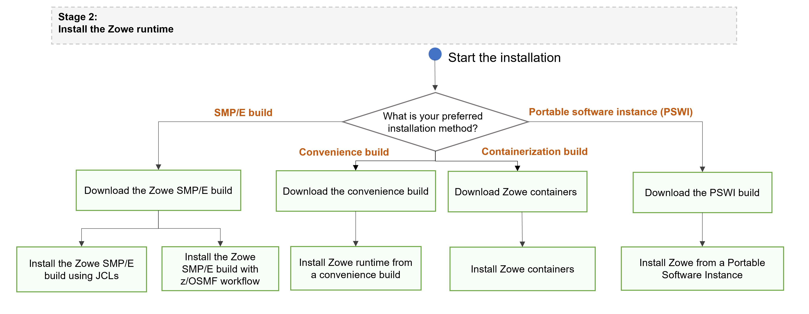

# Server-side installation overview

Review this article to learn about the options to install, deploy and configure Zowe server-side components, and the roles and responsibilities to perform this installation.

* [Zowe server-side components in the installation](#zowe-server-side-components-in-the-installation)
* [Parts of the server-side installation](#parts-of-the-server-side-installation)
* [Zowe runtime installation methods and roadmap](#zowe-runtime-installation-methods-and-roadmap)
    * [Runtime installation methods details](#runtime-installation-methods-details)
* [Roles and responosibilities in server-side component installation process](#roles-and-responosibilities-in-server-side-component-installation-process)
    * [Tasks performed by the security administrator](#tasks-performed-by-the-security-administrator)
    * [Tasks performed by the storage administrator](#tasks-performed-by-the-storage-administrator)
    * [Tasks performed by the network administrator](#tasks-performed-by-the-network-administrator)
    * [Tasks performed by the system programmar](#tasks-performed-by-the-system-programmar)

## Zowe server-side components in the installation

The following Zowe server-side components are included in this installation: 

* **Zowe Application Framework**  
A web user interface (UI) that provides a virtual desktop containing several apps allowing access to z/OS function.  

Click here for more information about Zowe Application Framework
 Zowe™ Application Framework is a  Base Zowe includes apps for traditional access such as a 3270 terminal and a VT Terminal, as well as an editor and explorers for working with JES, MVS Data Sets and Unix System Services

*  **Zowe API Mediation Layer (API ML)**  
Zowe API Mediation Layer provides a reverse proxy and enables REST APIs by providing a single point of access for mainframe service REST APIs.

Click here for more information about API Mediation Layer
 Such APIs include MVS Data Sets, JES, as well as working with z/OSMF. The API ML has dynamic discovery capability for these services and Gateway is also responsible for generating the authentication token used to provide single sign-on (SSO) functionality.

* **Zowe System Services (ZSS)**  
Working closely with ZIS, ZSS serves as one of the primary, authenticated back-ends that communicates with z/OS and provides Zowe with a number of APIs including z/OS Unix files and data sets, control of the plug-ins and services lifecycle, and security management.

Click here for more information about Zowe System Services
 The Zowe Desktop delegates a number of its services to ZSS which it accesses through the default http port `7557`. ZSS is written in C and uses native calls to z/OS to provide its services.

* **Zowe Cross Memory Server (ZIS)**  
The Zowe cross memory server (ZIS) provides privileged cross-memory services to the Zowe Desktop and runs as an APF-authorized program.

 Click here for more information about ZIS
The same cross memory server can be used by multiple Zowe desktops. The cross memory server is needed to be able to log on to the Zowe desktop and operate its apps such as the Code Editor.

## Parts of the server-side installation

Installation of Zowe server-side components consists of two parts:

* **Installation of Zowe runtime**  

    Zowe runtime refers to the full, unarchived set of binaries, executable files, scripts, and other elements that are run when Zowe is started.
    Runtime installation includes the following components:  
    * Zowe Application Framework
    * Zowe API Mediation Layer
    * Z Secure Services (ZSS)
* **Installation of the Zowe Cross-memory server**  
The cross-memory server is an APF authorized server application that provides privileged services to Zowe in a secure manner.
## Zowe runtime installation methods and roadmap

To get started with installing Zowe runtime, select your installation method from the following options (Details of each installation method are described later in this article):

* SMP/E build
* Convenience build
* Portable software instance (PSWI)
* Containerization build  
    **Note:** The containerization build makes it possible for some UNIX components to run in a container rather than under USS. For more information about this build method, see [Installing Zowe Containers](k8s-introduction.md).

Zowe server-side components can be installed either on z/OS only, or both on z/OS and on Docker.
<!-- Where does this next paragraph belong? -->
The Zowe server components also includes a web desktop that runs a number of applications including API Mediation Layer that includes the Single Sign-on (SSO) capability, organization of multiple Zowe servers under a single website, and other useful features for z/OS developers.

The following diagram provides a roadmap for installation using the three primary installation methods. If you plan to install these components using a container build, see [Installing Zowe Containers](k8s-introduction.md).

The Zowe z/OS binaries are distributed in the following installation formats. They contain the same contents but you install them by using different methods. You can choose which method to use depending on your needs.
### Runtime installation methods details

Choose one of the following methods to install the Zowe server-side components on z/OS. 
<!-- Add the advantages and disadvantanges to each method -->

   - **Convenience build**

     Zowe z/OS binaries are packaged as a PAX file which is a full product install.  Transfer this to a USS directory and expand its contents.  Using the [zwe](installandconfig.md#zwe-server-command) command `zwe install` will extract a number of PDS members contain load modules, JCL scripts, and PARMLIB entries. 

     To obtain and install the convenience build, see [Installing Zowe runtime from a convenience build](install-zowe-zos-convenience-build.md).

   - **SMP/E build**

     The Zowe z/OS binaries are packaged as the following files that you can download. You install this build through SMP/E.  
     - A pax.Z file, which contains an archive (compressed copy) of the FMIDs to be installed.
     - A readme file, which contains a sample job to decompress the pax.Z file, transform it into a format that SMP/E can process, and invoke SMP/E to extract and expand the compressed SMP/E input data sets.

     To obtain the and install the SMP/E build, see [Installing Zowe SMP/E](install-zowe-smpe.md).

   - **Portable Software Instance (PSWI)**

     You can acquire and install the Zowe z/OS PAX file as a portable software instance (PSWI) using z/OSMF.

     To obtain and install the PSWI, see [Installing Zowe from a Portable Software Instance](install-zowe-pswi.md).

   While the procedures to obtain and install the convenience build, SMP/E build or PSWI are different, the procedure to configure a Zowe runtime is the same irrespective of how the build is obtained and installed.

Successful installation of either a convenience build or an SMP/E build, creates the following artifacts:
* A zFS folder that contains the unconfigured Zowe runtime directory
* A utility library `SZWEEXEC` that contains utilities
* A SAMPLIB library `SZWESAMP` that contains sample members
* A load library `SZWEAUTH` that contains load modules. 

The steps to prepare the z/OS environment to launch Zowe are the same for all installation methods.

## Roles and responosibilities in server-side component installation process

### Tasks performed by the security administrator

To configure Zowe security for production environments, it is likely that your organization's security administrator will be required to perform various tasks. See details in the [Address ecurity requirements](./address-security-requirements#tasks-performed-by-your-security-administrator)

### Tasks performed by the storage administrator

Before installing, the storage administrator will reserve enough space including for USS, directory storage space, etc to install Zowe.

### Tasks performed by the network administrator

When you are installing Zowe, it is likely that your network administrato will assign port numbers, reserve them, and arrange them for you.

### Tasks performed by the system programmar

The system programmar will install and configure Zowe and start Zowe. They are skilled to SMP/E or z/OSMF workflow and regular maintanance. They also prepare jobs for other administrators.

## Next steps

Once you successfully install Zowe server-side components, you are ready to configure z/OS components. Use one of the following options to initialize Zowe z/OS runtime:

* [Initialize Zowe manually using init command group](../user-guide/initialize-zos-system.md)
* [Configure Zowe with z/OSMF workflows](../user-guide/configure-zowe-zosmf-workflow.md)

