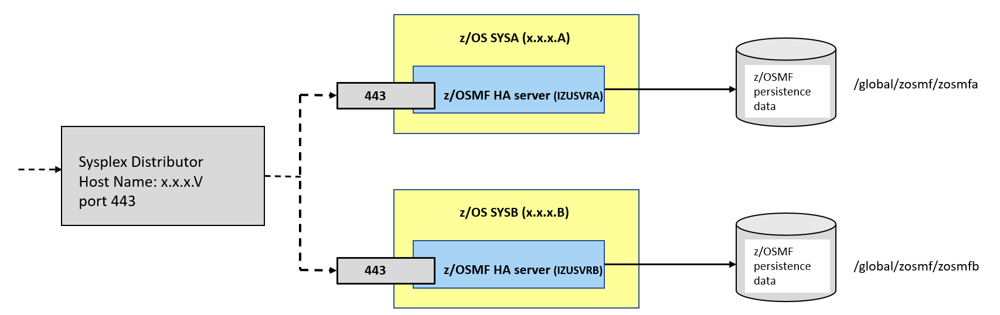

# Configuring z/OSMF high availability in Sysplex

z/OSMF HA should be configured in Hot Standby mode to ensure availability of REST services. The goal of this configuration is to ensure that one z/OSMF server is always available to provide the REST services.
It means that there should be at least one backup (hot-standby) server and a preferred target server. Both targets are active, and both z/OSMF servers are bound to the DVIPA.
So, preferred z/OSMF server receives all new incoming requests. If it fails or the system becomes down, new requests are routed to the backup (hot-standby) server.
In this mode, the distributing DVIPA does not perform load balancing of requests across multiple systems.

For complete information, go to IBM Documentation and read the following documents:

- [Configuring z/OSMF for availability](https://www.ibm.com/docs/en/zos/2.2.0?topic=environment-configuring-zosmf-availability)
- [Configuring z/OSMF for high availability](https://www.ibm.com/docs/en/zos/2.4.0?topic=configurations-configuring-zosmf-high-availability)

## Sysplex environment requirements for z/OSMF REST Services
Ensure that the Sysplex environment meets the following requirements:

- Shared SAF database, see [Sharing a database with sysplex communication in data sharing mode](https://www.ibm.com/docs/en/zos/2.1.0?topic=sd-sharing-database-sysplex-communication-in-data-sharing-mode)

- USS Shared file system, see [How to share file systems in a Sysplex](https://www.ibm.com/docs/en/zos/2.4.0?topic=planning-sharing-file-systems-in-sysplex)

- JESPlex/JES2 Multi-Access Spool (MAS) environment

- Sysplex distributor, configured Dynamic VIPA TCP/IP address

- Extended MCS console (EMCS)

## Setting up z/OSMF nucleus

**Follow these steps if it is a first-time z/OSMF setup:**

1. Create security configuration by sample JCL **SYS1.SAMPLIB(IZUSEC)**
   - z/OSMF security authorizations will be used by all z/OSMF servers across multiple systems

2. Create a shared file system per z/OSMF server by sample JCL **SYS1.SAMPLIB(IZUMKFS)**. It holds configuration settings and persist data

3. Sample Parmlib Member, **SYS1.SAMPLIB(IZUPRM00)** must be copied to PARMLIB and modified according to [The requirements of z/OSMF HA parmlib member in Sysplex](#the-requirements-of-zosmf-ha-parmlib-member-in-sysplex)
   - Each system uses a different IZUPRMxx member. For example IZUPRM0A and IZUPRM0B

4. Copy the following procedures from **SYS1.PROCLIB** into your JES concatenation:
   - IZUSVR1  (each z/OSMF server should use the different started procedure. For example IZUSVRA and IZUSVRB)
   - IZUANG1
   - IZUFPROC

5. The different STARTED profiles should be defined for z/OSMF servers. 

For complete information, go to IBM Documentation and read the following document:

[Create a z/OSMF nucleus on your system](https://www.ibm.com/support/knowledgecenter/SSLTBW_2.4.0/com.ibm.zos.v2r4.izua300/izulite_CreateTheNucleus.htm)

## The requirements of z/OSMF HA parmlib member in Sysplex

- _AUTOSTART_GROUP_, more than one z/OSMF server (independent z/OSMF instances) is to be autostarted in a Sysplex. For instance, System A will autostart a server and similarly, System B will autostart the second z/OSMF server.
  - z/OSMF has a default autostart group (IZUDFLT) which is used in monoplex or single z/OS image. To have more z/OSMF servers autostarted in a Sysplex, you must associate each server and the systems it serves with a unique autostart group name. For example, AUTOSTART_GROUP('IZUDFLA') for System A and AUTOSTART_GROUP('IZUDFLB') for System B

- _AUTOSTART(LOCAL)_ should be used by all z/OSMF instances.

- _HOSTNAME_, the DVIPA address will be used as the z/OSMF host name for all instances.

- _HTTP_SSL_PORT_, all servers are listening on the same port.

- _KEYRING_NAME_, all servers should use the same key ring such as IZUKeyring.IZUDFLT.

- _SERVER_PROC_, each z/OSMF server should use the different started procedure. For example IZUSVRA and IZUSVRB.

- _ANGEL_PROC_, all z/OSMF servers can connect to the same z/OSMF angel process such as IZUANG1.

- _SAF_PREFIX_, they should use the same SAF profile prefix such as IZUDFLT.

- _USER_DIR_, each instance uses a shared file system with a unique mount point for each AUTOSTART group that be automatically started. For example, /global/zosmf/zosmfa and /global/zosmf/zosmfb

## TCP/IP definitions for Sysplex Distributor

The following DVIPA configuration ensures the availability of z/OSMF for Hot-Standby. For example, suppose that you have a Sysplex of two systems: A, B:

1. Enable dynamic XCF on each host:
- `IPCONFIG SYSPLEXROUTING DYNAMICXCF x.x.x.A 255.255.255.0 1` for SYSA
- `IPCONFIG SYSPLEXROUTING DYNAMICXCF x.x.x.B 255.255.255.0 1` for SYSB

2. Define a dynamic VIPA (DVIPA) for both systems:
```
 VIPADYNAMIC                                                      
  VIPADEFINE  255.255.255.0 x.x.x.V
  VIPADISTRIBUTE DEFINE DISTM HOTSTANDBY x.x.x.V 
    PORT 443 DESTIP
     x.x.x.A  PREFERRED 
     x.x.x.B  BACKUP                                         
 ENDVIPADYNAMIC
```

**Note:**
- x.x.x.A , the home address for SYSA
- x.x.x.B , the home address for SYSB
- x.x.x.V , Dynamic VIP Address



The VIPADISTRIBUTE statement with PREFERRED and BACKUP settings is used to enable automatic dynamic VIPA takeover to occur, if needed.
Both z/OSMF servers are bound to the DVIPA x.x.x.V. With both z/OS systems active in the Sysplex, the preferred z/OSMF server, SYSA receives all new incoming requests.
If the SYSA fails, new work requests for z/OSMF are routed to the server on SYSB. When SYSA resumes normal operations, new work requests for z/OSMF are routed to SYSA again.
This behavior occurs because AUTOSWITCHBACK option of VIPADISTRIBUTE statement is in effect by default.

Coding NOAUTOSWITCHBACK specifies that you do not want the distributor to switch back to the preferred target when it becomes available.
```
VIPADYNAMIC                                                      
  VIPADEFINE  255.255.255.0 x.x.x.V
  VIPADISTRIBUTE DEFINE DISTM HOTSTANDBY NOAUTOSWITCHBACK x.x.x.V 
     PORT 443 DESTIP
        x.x.x.A  PREFERRED 
        x.x.x.B  BACKUP                                         
ENDVIPADYNAMIC
```