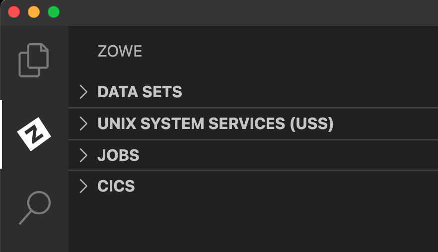

# CICS Extension Installation

## Requirements

- Visual Studio Code - if you have not installed VS Code, visit the [download site](https://code.visualstudio.com/download) and install VS Code on your PC.
- Zowe Explorer (optional) - the Zowe Explorer will be added as part of the install if it isn't already present in VS Code.

## Installation

### From VSIX File

1. Visit the [download site](https://github.com/zowe/vscode-extension-for-cics). Select the **Latest** button which directs to a page that includes the latest version of `.vsix` file. Download it to your PC that has VS Code already installed.

2. Open the Extensions icon in the side bar, navigate to the ... menu, press **Install from VSIX ...** and select the downloaded `cics-extension-for-zowe-0.0.1.vsix` file.

3. After installation

The successfull install message should be shown in the bottom right

The Zowe Explorer pane will still show tree views for `Data Sets`, `Unit System Services (USS)` and `Jobs`, but in addition a new view `CICS` will be included.

