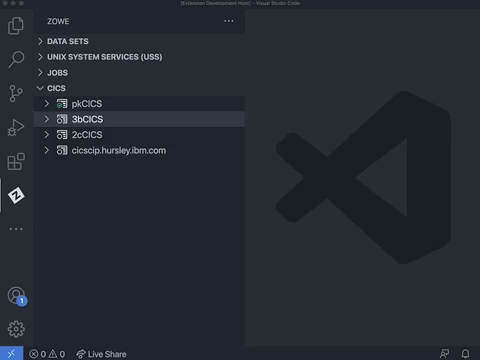
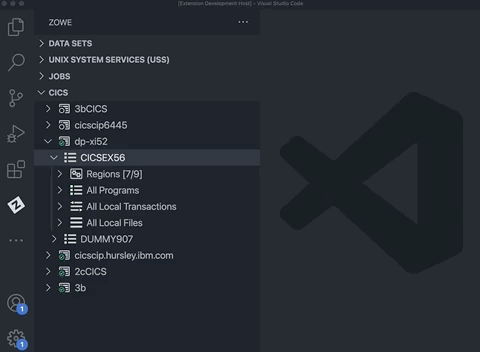
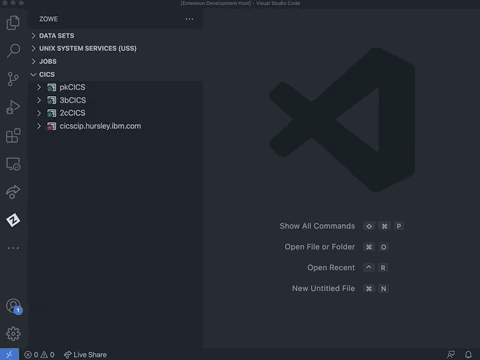

# Using Zowe Explorer CICS Extension

The CICS Extension for Zowe Explorer adds additional functionality to the popular Visual Studio Code extension, [Zowe Explorer](https://github.com/zowe/vscode-extension-for-zowe). This extension allows interactions with CICS regions and programs, and the ability to run commands against them.

## Contents

- [Features](#features)
- [System requirements](#system-requirements)
- [Installation](#installation)
- [Getting started](#getting-started)
  - [Create profile](#create-profile)
  - [Update profile](#update-profile)
  - [Hiding profiles](#hiding-profiles)
  - [Deleting profiles](#deleting-profiles)
- [CICS Resources](#cics-resources)
  - [Show and filter resources in a region](#show-and-filter-resources-in-a-region)
  - [Show and filter resources in a plex](#show-and-filter-resources-in-a-plex)
  - [Show and filter resources in an 'All' resource tree](#show-and-filter-resources-in-an-all-resource-tree)
  - [Show attributes](#show-attributes)
  - [Enable and disable](#enable-and-disable)
  - [New copy and phase In](#new-copy-and-phase-in)
  - [Open and close local files](#open-and-close-local-files)
- [Untrusted TLS certificates](#untrusted-tls-certificates)
- [Usage tips](#usage-tips)
- [Providing feedback or help contributing](#providing-feedback-or-help-contributing)
  - [Checking the source of an error](#checking-the-source-of-an-error)
  - [Filing an issue](#filing-an-issue)

## Features

- **Load profiles** directly from Zowe instance locally installed.
- Create new Zowe CICS profiles and connect to them.
- **Update** session details, and **delete** profiles using the user-friendly interface.
- **Work with multiple regions** containing programs, local transactions and local files within a plex in a comprehensible tree-like format.
- Perform actions such as **Enable**, **Disable**, **New Copy** and **Phase In** directly from the UI.
- Perform additional actions on local files including **Open** and **Close** directly from the UI.
- View and search attributes of resources and regions by right-clicking and using the dynamic filtering feature.
- **Apply multiple filters** to regions, programs, local transactions and/or local files.
- View and interact with all resources under a plex.

To install CICS Extension for Zowe Explorer see [Installation](ze-cics-installation.md).

## System requirements

- Visual Studio Code - if you have not installed VS Code, visit the [download site](https://code.visualstudio.com/download), select yout operating system, and install VS Code on your PC.
- Zowe Explorer (optional) - the Zowe Explorer will be added as part of the installation if it isn't already present in VS Code.

## Installation

### From VSIX File

1. Visit the [download site](https://github.com/zowe/vscode-extension-for-cics). Select the **Latest** button which directs to a page that includes the latest version of `.vsix` file. Download it to your PC that has VS Code already installed.

2. Open the Extensions icon in the side bar, navigate to the **...** menu, press **Install from VSIX ...** and select the downloaded `cics-extension-for-zowe-0.0.1.vsix` file.

3. After installation

The successfull installation message should be shown on the bottom right.

The Zowe Explorer pane will still show tree views for **Data Sets**, **Unit System Services (USS)** and **Jobs**, but in addition a new view **CICS** will be included.

## Getting started

### Create profile

If you already have a Zowe CICS CLI profile, the CICS tree will load the default profile on startup.  

If you don't have an existing CICS profile, follow these steps:

1. Add one by selecting the **+** button in the CICS tree.

2. Select the **Create a CICS profile** option to open a panel allowing connection details to be defined.

**Note**: The connection must point to a CICS region's CICS Management Client Interface (CMCI) TCP/IP host name and port number. The region can be a WUI server in a CICSPlex, or else a stand-alone Single Management Application Programming (SMSS) region.  

Configuring a CICS region to have a connection is a system programmer task and more details can be found in [Setting up CMCI with CICSPlex SM](https://www.ibm.com/docs/en/cics-ts/5.3?topic=explorer-setting-up-cmci-cicsplex-sm) or [Setting up CMCI in a stand-alone CICS region](https://www.ibm.com/docs/en/cics-ts/5.3?topic=suace-setting-up-cmci-in-stand-alone-cics-region). If your CMCI connection is configured to use a self-signed certificate that your PC's trust store doesn't recognize, see [Untrusted TLS certificates](#untrusted-tls-certificates).

To show more than one CICS profiles in the tree, select the **+** button and choose from the list of profiles. Only profiles which not already included in the CICS tree will be shown. To view all Zowe CICS CLI profiles, issue the command `zowe profiles list cics` from a terminal.  

### Update Profile

1. Right-click a profile to open up the profile menu actions.

2. Select the **Update Profile** button to update the session details.

    This will open a panel with fields containing the details used to create the connection. All fields apart from the **Profile Name** can be modified.

3. Once the details have been updated, click the **Update Profile** button to apply the changes to the profile.

### Hiding Profiles

1. Right-click a chosen profile to open the menu actions.

2. Select **Hide Profile** to hide it from the CICS view.

3. To add the profile back, click the **+** button and select the profile from the quick pick list.

### Deleting Profiles

1. Right-click a chosen profile.

2. Select **Delete Profile** and click the **Yes** button when prompted to confirm the action of permanently deleting the profile. The functionality deletes the CICS profile from the persistant storage directory `~/.zowe/profiles/cics`.

## CICS resources

Expand a CICS profile to see the region name, and expand the region to view its resources.

- If the CICS profile is connected to a CMAS region that is part of a CICSPlex, the tree will show all of the regions managed by the CICSPlex.

- If the CICS profile is for an SMSS region then just one region will be shown. Inactive regions in a plex are shown with an empty icon.

### Show and filter resources in a region

Expand a CICS region to show folders for the resource types **Programs**  , **Transactions** , and **Local Files** . Expand each type to show the resources. The number of resources in a resource tree will appear in square brackets next to the tree name.

The list of resources are pre-filtered to exclude many of the IBM supplied ones to narrow the contents to just include user programs.

- Use the search icon  against a resource type to apply a filter. This can be an exact resource name or else you can use wildcards. The search history is saved so you can recall previous searches.  

- To reset the filter to its initial criteria use the clear filter icon  against the resource type.  If you wish to see all resources in a region (including IBM supplied ones) you can use __*__ as a filter.

**Tip:** To apply multiple filters, separate entries with a comma. You can append any filter with an __*__, which indicates wildcard searching.

### Show and filter resources in a plex

Similar to filtering resources in a region, it is also possible to apply a filter on a all region resources in a plex.
- Use the search icon  inline with the **Regions** tree and then select either **Regions**,  **Programs**, **Local Transactions** or **Local Files** from the drop-down menu to specify which resource type the filter should be applied to for all regions in the plex.

To reset the filter to its initial criteria use the clear filter icon  against the **Regions** tree. This will open a drop-down menu which gives the option to clear the filter for all the **Regions**, **Programs**, **Local Transactions** or **Local Files** in the plex, and the option **All** to otherwise clear all filters within the plex.

**Tip:** To apply multiple filters, separate entries with a comma. You can append any filter with an __*__, which indicates wildcard searching.

### Show and filter resources in an 'All' resource tree

Plexes contain an **All Programs**, **All Local Transactions** and **All Local Files** trees which contain all the corresponding resources from all regions in the plex.

- To view resources under these trees, use the search icon  inline with the tree and apply a filter.

- If the applied filter results in over 500 records, either change the filter to narrow down the search, or click the **view X more ...** item to retrieve 'X' more resources.

### Show attributes

Right-click and use the pop-up menu against a program to list the available actions that can be performed.

For every resource, including a CICS region, the **Show Attributes** option opens a viewer listing all attributes and their values. The attributes page has a filter box at the top that lets you search for attributes matching the criteria.  

### Enable and disable

1. Right-click against a program, local transaction or local file to open up the pop-up menu.

2. Click **Disable [CICS resource]** to disable the resource.

When a resource is already disabled the first option in the pop-up menu becomes **Enable [CICS resource]** to allow its enablement state to be toggled. A disabled resource is identified by a `(Disabled)` text next to its name.

### New copy and phase in

Use the new copy icon  and the phase in icon  actions against a CICS program to get the CICS region to load a fresh of the selected program into memory. This could be after you've edited a COBOL program source and successfully compiled it into a load library and now want to test your change.

The `New copy count` for a program which is greater than zero is shown next to the program item in the CICS resource tree.

### Open and close local files

**Open a local file**: Right-click against a closed local file and perform the **Open Local File** menu action to toggle the `openstatus` attribute to 'OPEN'.

*screenshot needed here*

**Close a local file**: Right-click against an open local file and perform the **Close Local File** menu action. In this file busy condition, this will bring up a prompt on the bottom right corner requesting to choose one option: **Wait**, **No Wait** or **Force**. Once an option has been selected, the local file name will be appended with a `(Closed)` label upon success.

## Untrusted TLS certificates

If the CMCI connection is using a TLS certificate that your PC doesn't have in its trust store, then by default the connection will be rejected as potentially this could be from an unsafe site.

To override this behavior, either set the `Only accept trusted TLS certificates` field on the form when creating/updating the profile to `False`. This is the same as setting `rejectUnauthorized=false` on the Zowe CICS CLI profile.

If you define a profile as only accepting trusted TLS certificates when the Zowe Explorer first connects it will detect the mismatch and allow you to override the setting and proceed. This is done through a pop-up message with the **Yes** button to accept the untrusted certificate authority, which changes the profile's setting.  

## Usage tips

- All menu action commands available via right-clicking a profile/resource (excluding **Show Attributes**) can be applied on multiple items. To apply the commands to multiple items, you can multi-select the nodes of the same type before right-clicking and selecting the command.

- To multi-select, either hold Ctrl/Cmd key while clicking resources. Or you can select the first item in a list of nodes then hold Shift and click both the last item to select a consecutive list of nodes.

- Click the refresh icon  at the top of the CICS view to reload the resources in every region.

## Providing feedback or help contributing

### Checking the source of an error

Before filing an issue, check if an error is arising from the Zowe Explorer for IBM CICS extension and not the Zowe Explorer extension. You can check it by expanding the error message and checking if the `Source` is `Zowe Explorer for IBM CICS (Extension)`.

Error messages arising from the Zowe Explorer extension will have the `Source` as `Zowe Explorer(Extension)`.

### Filing an issue

To file issues, use the [Zowe Explorer for IBM CICS issue list](https://github.com/zowe/vscode-extension-for-cics/issues), or chat with use on [Slack](https://openmainframeproject.slack.com/archives/CUVE37Z5F) by indicating the message is for the Zowe Explorer for IBM CICS extension.

## CICS Extension Uninstallation

### From VS Code Extensions Tab

1. Navigate to Extensions tab of the VS Code application.

2. Find `Zowe Explorer Extension For CICS` and click it.

3. A panel should open. Click `Uninstall at the top of the screen`.

4. A reload may be required. If a button appears saying such, click it and the extension will no longer be installed.
