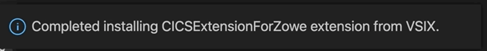

# Installing Zowe Explorer CICS Extension
## Installation methods

Install or update the Zowe Explorer CICS Extension from Visual Studio Code Extensions or from a `VSIX` file.

### Installing from Visual Studio Code Extensions

1. Select the **Extensions** tab on the **Side Bar** of the VS Code application.

2. Search for `Zowe Explorer for IBM CICS` and select the matching search result.

3. Click the **Install** button at the top of the **Editor** page.

   The extension is installed. If Zowe Explorer is not already installed, it also installs automatically.

### Installing from a `VSIX` file

Before you install Zowe Explorer CICS Extension from a `VSIX` file, ensure that Zowe Explorer is installed. Zowe Explorer is a required dependency. See [Installing Zowe Explorer](../user-guide/ze-install.md#installing-zowe-explorer) for instructions..

If Zowe Explorer is installed, you can install Zowe Explorer CICS Extension from a `VSIX` file.

1. Go to the [Zowe Explorer for IBM CICS Extension download](https://github.com/zowe/cics-for-zowe-client) site. Select the **Latest** button, which directs to a page that includes the latest version of the `.vsix` file. Download it to your PC.

   

2. Open the Extensions icon in the **Side Bar**, navigate to the **...** menu, select **Install from VSIX ...** and select the downloaded `Zowe.cics-extension-for-zowe-3.x.x.vsix` file.

   

   The following message indicates that the extension is installed successfully.

   

   The Zowe Explorer pane shows tree views for **Data Sets**, **Unit System Services (USS)** and **Jobs**, and a new view for **CICS**.

   
