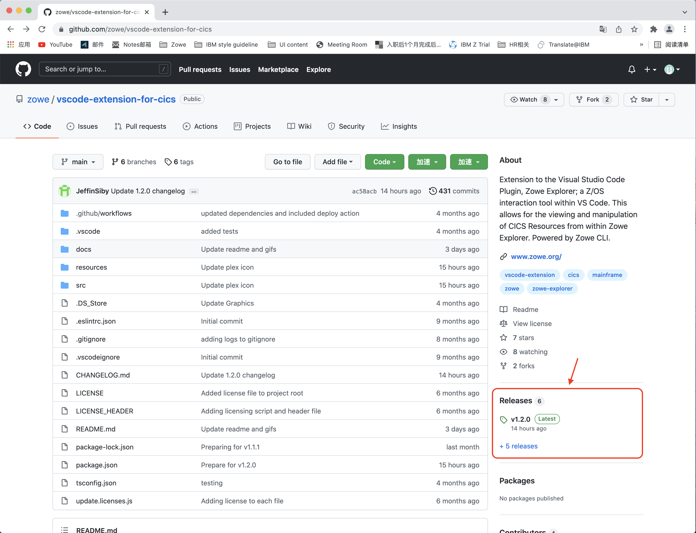

# Installing Zowe Explorer CICS Extension

You can install or update the extension from Visual Studio Code Extensions or from a VSIX file.

- [Installing from Visual Studio Code Extensions](#installing-from-visual-studio-code-extensions)
- [Installing from a VSIX file](#installing-from-a-vsix-file)

## Installing from Visual Studio Code Extensions

1. Navigate to the **Extensions** tab of your VS Code application.

2. Search for `Zowe Explorer for IBM CICS` and click the corresponding result list item. A panel will open.

3. Click the **Install** button at the top of the page.

   If you do not have Zowe Explorer installed, it will automatically install it for you as part of the installation.

## Installing from a VSIX file

Before you perform the following steps, ensure that you have installed Zowe Explorer which is a required dependency. For more information, see [Installing Zowe Explorer](https://docs.zowe.org/stable/user-guide/ze-install#installing).

If your Zowe Explorer is installed, please follow the steps below to install Zowe Explorer CICS Extension from a VSIX file.

1. Visit the [download site](https://github.com/zowe/vscode-extension-for-cics). Select the **Latest** button which directs to a page that includes the latest version of the `.vsix` file. Download it to your PC.

   

2. Open the Extensions icon in the side bar, navigate to the **...** menu, press **Install from VSIX ...** and select the downloaded `Zowe.cics-extension-for-zowe-2.x.x.vsix` file.

   

The following message indicates that the extension is installed successfully:

The Zowe Explorer pane will show tree views for **Data Sets**, **Unit System Services (USS)** and **Jobs**, and a new view for **CICS**.

