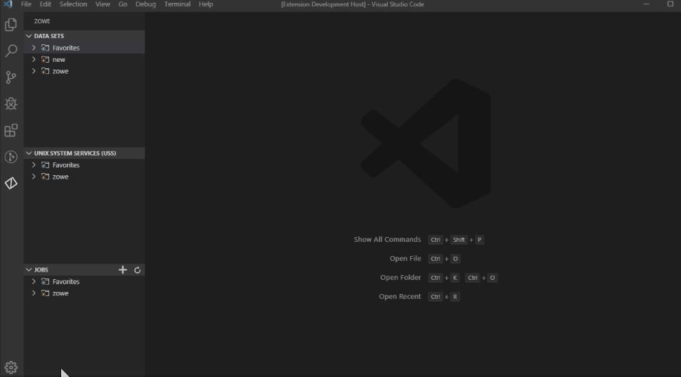

# Visual Studio Code (VS Code) Extension for Zowe


The Zowe Explorer extension for Visual Studio Code (VS Code) modernizes the way developers and system administrators interact with z/OS mainframes, and lets you interact with data sets, USS files, and jobs.

Install the extension directly to [VSCode](https://code.visualstudio.com/) to enable the extension within the GUI. Working with data sets and USS files from VSCode can be more convenient than using 3270 emulators, and complements your Zowe CLI experience. The extension provides the following benefits:

- Enables you to create, modify, rename, copy, and upload data sets directly to a z/OS mainframe.
- Enables you to create, modify, rename, and upload USS files directly to a z/OS mainframe.
- Provides a more streamlined way to access data sets, USS files, and jobs.
- Lets you create, edit, and delete Zowe CLI `zosmf` compatible profiles.

**Note:** Zowe Explorer is a subcomponent of [Zowe](https://zowe.org/home/). The extension demonstrates the potential for plug-ins powered by Zowe.

## Software Requirements

Ensure that you meet the following prerequisites before you use the extension:

- Get access to z/OSMF.
- Install [Node.js](https://nodejs.org/en/download/) v8.0 or later.
- Install [Visual Studio Code](https://code.visualstudio.com/).
- Configure TSO/E address space services, z/OS data set, file REST interface, and z/OS jobs REST interface. For more information, see [z/OS Requirements](https://docs.zowe.org/stable/user-guide/systemrequirements-zosmf#z-os-requirements).
- Create a Zowe CLI `zosmf` profile so that the extension can communicate with the mainframe.

### Profile notes:

- Use existing Zowe CLI `zosmf` profiles created with Zowe CLI v.2.0.0 or later.

- Zowe CLI `zosmf` profiles that are created in Zowe Explorer can be interchangeably used in Zowe CLI.

- *Optionally*, you can continue using Zowe CLI V1 profiles with Zowe Explorer. For more information, see [Working with Zowe Explorer profiles](https://docs.zowe.org/stable/user-guide/ze-profiles#working-with-zowe-explorer-profiles).

## Installing Zowe Explorer

Use the following steps to install Zowe Explorer:

1. Address [the software requirements](#software-requirements).
2. Open Visual Studio Code, and navigate to the **Extensions** tab on the **Activity Bar**.
3. Type `Zowe Explorer` in the **Search** field.
  
   Zowe Explorer appears in the list of extensions in the **Side Bar**.

4. Click the green **Install** button to install the extension.
5. Restart Visual Studio Code.

The extension is now installed and available for use.

* **Note:** For information about how to install the extension from a `VSIX` file and run system tests on the extension, see the [Developer README](https://github.com/zowe/vscode-extension-for-zowe/blob/main/docs/README.md).

You can also watch the following videos to learn how to get started with Zowe Explorer, and work with data sets.

<iframe class="embed-responsive-item" id="youtubeplayer" title="Getting Started with Zowe" type="text/html" width="100%" height="365" src="https://www.youtube.com/embed/G_WCsFZIWt4" frameborder="0" webkitallowfullscreen="true" mozallowfullscreen="true" allowfullscreen="true"> </iframe>

<iframe class="embed-responsive-item" id="youtubeplayer2" title="How to Work with Data Sets" type="text/html" width="100%" height="365" src="https://www.youtube.com/embed/X4oSHrI4oN4" frameborder="0" webkitallowfullscreen="true" mozallowfullscreen="true" allowfullscreen="true"> </iframe>

## Configuring Zowe Explorer

Configure Zowe Explorer in the settings file of the extension.

To access the extension settings, follow these steps:

1. Click the **Settings** icon at the bottom of the **Activity Bar**.

2. Select the **Settings** option.
3. Open the **Extension** option listed in the **Commonly Used** menu.
4. Select **Zowe Explorer** to access its settings.
5. Scroll the list to find the setting that needs modification.

### Modifying creation settings for data sets, USS files, and jobs

Follow these steps:

1. In Zowe Explorer settings, scroll to a data set, USS file, or job setting type.
2. Click the setting's corresponding **Edit in settings.json** link.

    This opens the `settings.json` file in an **Editor** tab.

3. Edit the settings in the file as needed.
4. Save the file to keep changes.

    

### Modifying temporary file location settings

Change the default folder location where temporary files are stored with the following steps:

   1. Navigate to Zowe Explorer settings.
   2. Under the data set, USS, or jobs settings that you want to edit, click the **Edit in settings.json** link.
   3. Modify the following definition in the file:

      ```json
      "Zowe-Temp-Folder-Location": {
          "folderPath": "/path/to/directory"
        }
      ```

      Replace **/path/to/directory** with the new folder location.
    
    
  3. Save the file to keep the change.

### Modifying the `Secure Credentials Enabled` setting

When environment conditions do not support the Zowe CLI built-in Credential Manager, change the `Secure Credentials Enabled` setting with the following steps:

 1. Navigate to Zowe Explorer settings.
 2. Scroll to **Security: Secure Credentials Enabled**.
 3. Deselect the checkbox to disable secure credentials.

    When disabled, if the `autoStore` setting in the `zowe.config.json` file is set to *true*, z/OS credentials are stored as text in the file.

    If the `autoStore` setting is set to *false*, you are prompted for the missing credentials in Visual Studio Code. These are stored and used for the duration of the session.

## Relevant Information

In this section you can find useful links and other information relevant to Zowe Explorer that can improve your experience with the extension.

- For information about how to develop for Eclipse Theia, see [Theia README](https://github.com/zowe/vscode-extension-for-zowe/blob/main/docs/README-Theia.md).
- For information about how to create a VSCode extension for Zowe Explorer, see [VSCode extensions for Zowe Explorer](https://github.com/zowe/vscode-extension-for-zowe/blob/main/docs/README-Extending.md).

- Visit the **#zowe-explorer** channel on [Slack](https://openmainframeproject.slack.com/) for questions and general guidance.
