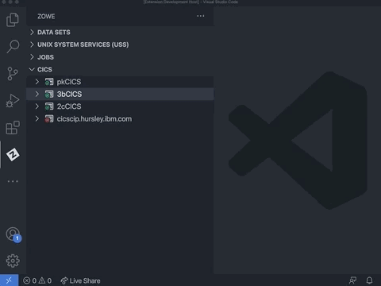

# Overriding untrusted TLS certificates

If the CMCI connection uses a TLS certificate that does not exist in your PC's trust store, then by default the connection will be rejected because potentially this could be from an unsafe site.

To override this behavior, you can set the `Only accept trusted TLS certificates` field to `False` on the form when creating or updating the profile. This is the same as setting `rejectUnauthorized=false` on the Zowe CICS CLI profile.

If you define a profile as only accepting trusted TLS certificates when the Zowe Explorer first connects, it will detect the mismatch and pop up a message. You can select **Yes** to override the profile's setting to accept the untrusted certificate authority.  

# Usage tips

- All menu action commands available via right-clicking a profile or resource (excluding **Show Attributes**) can be applied to multiple items. To do this, you can multi-select the nodes of the same type before right-clicking and selecting the command.

- To multi-select, you can hold Ctrl/Cmd key while clicking resources. Or you can select the first item in a list of nodes then hold Shift and click both the last item to select a consecutive list of nodes.

- Click the refresh icon at the top of the CICS view to reload the resources in every region.