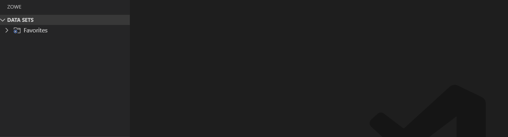
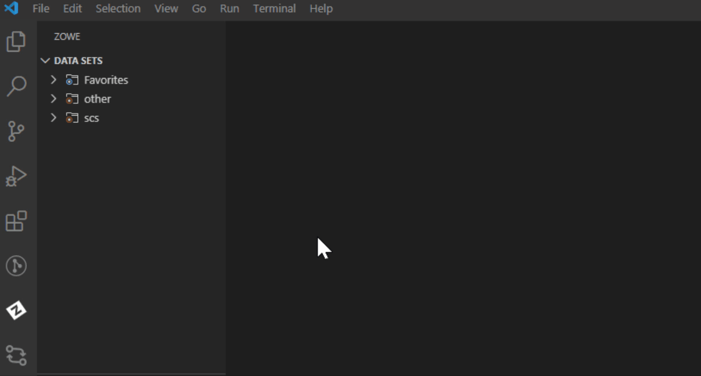
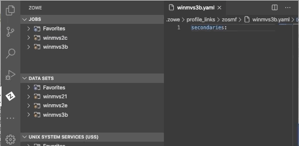

# Zowe Explorer Profiles

After you install Zowe Explorer, you need to have a Zowe Explorer profile to use all functions of the extension. You can optionally activate the Secure Credential Store plug-in to securely store your credentials.

## Working with Zowe Explorer profiles

You must have a `zosmf` compatible profile before you can use Zowe Explorer. You can set up a profile to retain your credentials, host, and port name. In addition, you can create multiple profiles and use them simultaneously.

**Follow these steps:**

1. Navigate to the explorer tree.
2. Click the **+** button next to the **DATA SETS**, **USS** or **JOBS** bar.

   **Note:** If you already have a profile, select it from the drop-down menu.

3. Select the **Create a New Connection to z/OS** option.

   **Note:** When you create a new profile, user name and password fields are optional. However, the system will prompt you to specify your credentials when you use the new profile for the first time.

4. Follow the instructions, and enter all required information to complete the profile creation.



You successfully created a Zowe CLI `zosmf` profile. Now you can use all the functionalities of the extension.

If you need to edit a profile, click the **Update Profile** button next to the corresponding profile.



In addition, you can hide a profile from the explorer tree, and permanently delete a profile. When you delete your profile permanently, the extension erases the profile from the `.zowe` folder. To hide or delete a profile, right-click the profile and choose one of the respective options from the list.

### Associate Profile

Extensions built on Zowe Explorer provide users with additional functionality through unique profile types, such as RSE or FTP. The "associate profiles" function allows users to link, or associate, these extension profile types with an existing zOSMF profile. Every Zowe Explorer profile has two types of association: primary and secondary. While the primary association is `zosmf`, the secondary association includes Zowe CLI plug-ins or other services you might have. Within the scope of their own extender package, associated profiles can be used to access a relevant REST API that is available to the extender.

Create a secondary association for your Zowe Explorer profiles.

**Follow these steps:**

1. Navigate to the explorer tree.
2. Click the associate profiles button.
3. Select a secondary profile type.
4. Select a file name you want to create an association for.



You have successfully created the secondary association for your Zowe Explorer profile.

For more information, see [Associating Zowe CLI Profiles](https://github.com/zowe/vscode-extension-for-zowe/blob/master/docs/README-Extending.md#associating-zowe-cli-profiles).

## Enabling Secure Credential Store with Zowe Explorer

Store your credentials securely by using the Secure Credential Store (SCS) plug-in in Zowe Explorer. By default, your credentials are stored in plain text.

Activate the SCS plug-in in Zowe Explorer.

**Follow these steps:**

1. Open Zowe Explorer.
2. Navigate to the VSCode settings.
3. Open Zowe Explorer Settings.
4. Add the **Zowe-Plugin** value to the `Zowe Security: Credential Key` entry field.
5. Restart VSCode.
6. Create a profile.

Your Zowe Explorer credentials are now stored securely.

### For Zowe CLI users

Ensure that you install the SCS plug-in for Zowe CLI before activating SCS in Zowe Explorer. For more information about the SCS plug-in for Zowe CLI, see [Secure Credential Store plug-in for Zowe Explorer](cli-scsplugin.md).

**Important:** If you did not install the SCS plug-in for Zowe CLI and try to activate SCS in the extension, you will not be able to use your existing profiles, and will have to recreate them.

Activate the SCS plug-in in Zowe Explorer.

1. Open Zowe CLI and issue the following command:

   ```shell
   zowe scs u
   ```

2. Open Zowe Explorer.
3. Navigate to the VSCode settings.
4. Open Zowe Explorer Settings.
5. Add the **Zowe-Plugin** value to the `Zowe Security: Credential Key` entry field.
6. Restart VSCode.

The credentials of your newly created or existing profiles are now stored securely.

## Use Base Profile and Token with Existing Profiles

As a Zowe user, you can leverage the base profile functionality to access multiple services through Single Sign-on. Base profiles enable you to authenticate via Zowe API Mediation Layer. You can use base profiles with more than one service profile. For more information, see [Base Profiles](https://docs.zowe.org/stable/user-guide/cli-usingcli.html#base-profiles).

Before you log in and connect your service profile, ensure that you have [Zowe CLI](https://docs.zowe.org/stable/user-guide/cli-installcli.html) v6.16 or higher installed. 

### Access services through API ML with SSO

Connect your service profile with a base profile and token.

**Follow these steps:**

1. Open Zowe CLI and run the following command: `zowe auth login apiml`.

2. Follow the instructions to complete the login.

   A local base profile is created that contains your token. For more information about the process, see [Token Management](https://docs.zowe.org/stable/user-guide/cli-usingcli.html#how-token-management-works).
  
3. Run Zowe Explorer and click the **+** icon.  

4. Select the profile you use with your base profile with the token.

   The profile appears in the tree and you can now use this profile to access z/OSMF via the API Mediation Layer.

For more information, see [Integrating with API Mediation Layer](https://docs.zowe.org/stable/user-guide/cli-usingcli.html#integrating-with-api-mediation-layer).