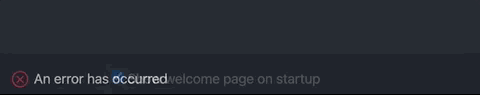

# Providing feedback and contributing

To help make Zowe® Explorer for IBM® CICS® Transaction Server better, you are welcome to contribute in different ways.

## Filing an issue

Before filing an issue, check if the error stems from either Zowe Explorer for IBM CICS Transaction Server or Zowe Explorer.

1. To check the error source, expand the error message that displays in VS Code and review the **Source** description:

    
    - Errors arising from the Zowe Explorer for IBM CICS Transaction Server identify the **Source** as *Zowe Explorer for IBM CICS (Extension)*.
    - Errors arising from Zowe Explorer identify the **Source** as *Zowe Explorer (Extension)*.

2. File issues with Zowe Explorer for IBM CICS Transaction Server to the [Zowe Explorer for IBM CICS Transaction Server issue list](https://github.com/zowe/cics-for-zowe-client/issues) and include all relevant information.

## Chatting with the community

Chat with the community on [Slack](https://openmainframeproject.slack.com/archives/CUVE37Z5F) by indicating the message is about Zowe Explorer for IBM CICS Transaction Server.
