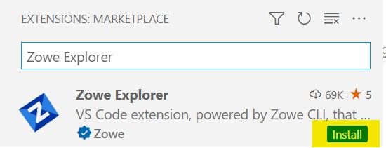

# Using Zowe Explorer

Review this section to familiarize yourself with Zowe Explorer and make the best use of its available options and features.

## Supported operating systems, environments, and platforms

### Operating systems

- Windows 10+
- MacOS 10.15 (Catalina), 11 (Big Sur), 12 (Monterey)
- Unix-like:
   - [CentOS](https://www.centos.org/) 8+
   - [RHEL](https://www.redhat.com/en/technologies/linux-platforms/enterprise-linux) 8+
   - [Ubuntu](https://ubuntu.com/) 20.04+

### Integrated development environments:

- [Theia](https://theia-ide.org/) 18+
- [Red Hat CodeReady Workspaces](https://www.redhat.com/en/technologies/jboss-middleware/codeready-workspaces)
- [Eclipse Che](https://www.eclipse.org/che/)

### Platform versions:

- [VS Code](https://code.visualstudio.com/) 1.53.2+
- [NodeJS](https://nodejs.org/en/) (all LTS versions)
- [Yarn](https://yarnpkg.com/) 1.22+

## Usage Tips

Make the best use of the extension with the following tips:

- **Data sets, USS, and jobs persistence settings:** You can store any data sets, USS files, or jobs permanently in the **Favorites** tab. Right-click on a data set, USS file, or job and click **Add Favorite**.

- **Identify syntax errors with a syntax highlighter:** Zowe Explorer supports a syntax hightlighter for data sets. To enhance the experience of using the extension, you can download an extension that highlights syntax.

- **Edit a profile**: You can edit existing profiles listed in the **Side Bar** by clicking the profile's **Edit** icon (next to the **Search** icon). The feature lets you modify the information inside your profile.

- **Delete a profile**: You can permanently delete profiles by right-clicking the profile and selecting the **Delete Profile** option. The feature deletes the profile from your `.zowe` folder. 

   **Tip:** Alternatively, you can delete a profile by using the VS Code **Command Palette**. Press `F1` on your keyboard, then select the **Zowe Explorer: Delete a Profile Permanently** option.

- **Hide a profile**: You can hide a profile from the **Side Bar** by right-clicking the profile and selecting the **Hide Profile** option. If necessary, add the profile back by clicking the **+** icon on the **DATA SETS**, **UNIX SYSTEM SERVICES (USS)**, or **JOBS** bar.

- **Open recent members**: Zowe Explorer lets you open a list of members you have previously worked on. You can access the list by pressing `Ctrl`+`Alt`+`R` or `Command`+`Alt`+`R`.

## Using a specific version of Zowe Explorer

Depending on their circumstances, developers might want to keep using a specific version of Zowe Explorer. To ensure that a particular version remains installed on VS Code, refer to the procedure for one of the following scenarios:

### Zowe Explorer is installed

#### **Preventing automatic version updates**

By default, VS Code automatically updates extensions as new versions are released. Refer to the following steps to prevent automatic updates:

1. On the VS Code menu bar, click **File**, **Preferences**, and click **Settings** to display the Settings editor.

2. Select the **User** or **Workspace** tab, depending on which settings you want to update.
3. In the Settings navigation menu, click **Features** and click **Extensions**.
4. In the **Auto Update** dropdown menu, select **None**. This prevents VS Code from updating your extensions automatically.

#### **Installing a specific previous version**

1. Select the **Extensions** tab on the **Activities Bar** to display a list of installed extensions.

2. In the **Side Bar**, click the **Gear** icon next to Zowe Explorer to open a dropdown menu that lists available options.
3. Select **Install Another Version…** to open a dropdown menu that lists previous versions of Zowe Explorer.
4. Click the version of Zowe Explorer you want to install.

### Zowe Explorer is not installed

If Zowe Explorer is not installed, you can install the current release of the extension and then revert to a previous version.

#### **Installing a previous version of Zowe Explorer**

1. Select the **Extensions** tab on the **Activities Bar** to display the **Search Extensions in Marketplace** field.
2. In the **Side Bar**, search for `Zowe Explorer`. Click the **Install** button on the Zowe Explorer search result item. This opens a Zowe Explorer tab in the **Editor** area.

   
  

3. Click the **Down** arrow next to the **Uninstall** button. Select **Install Another Version…** to open a dropdown menu that lists previous versions of Zowe Explorer.
4. Search for and click the version of Zowe Explorer you want to install.
