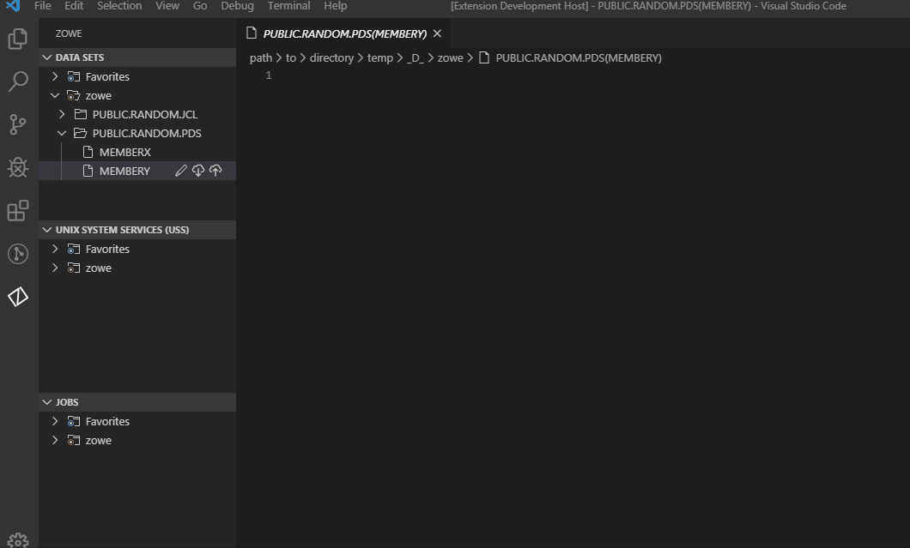
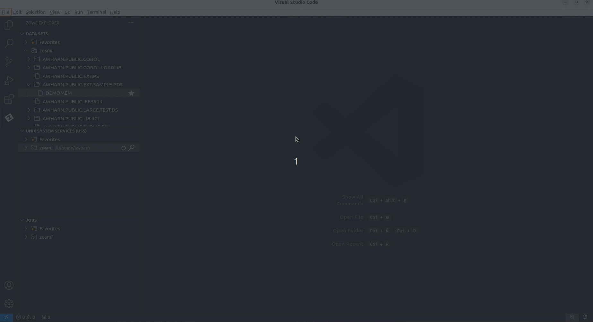
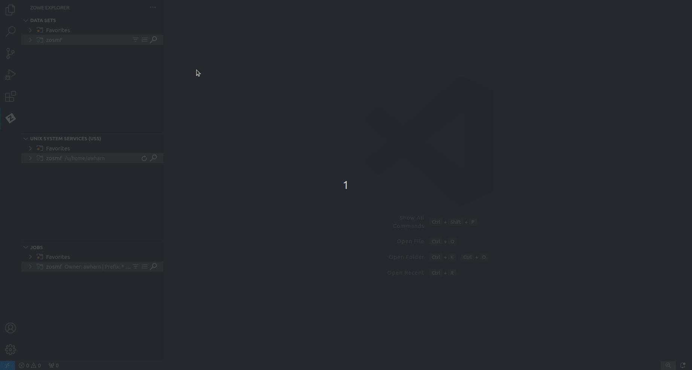
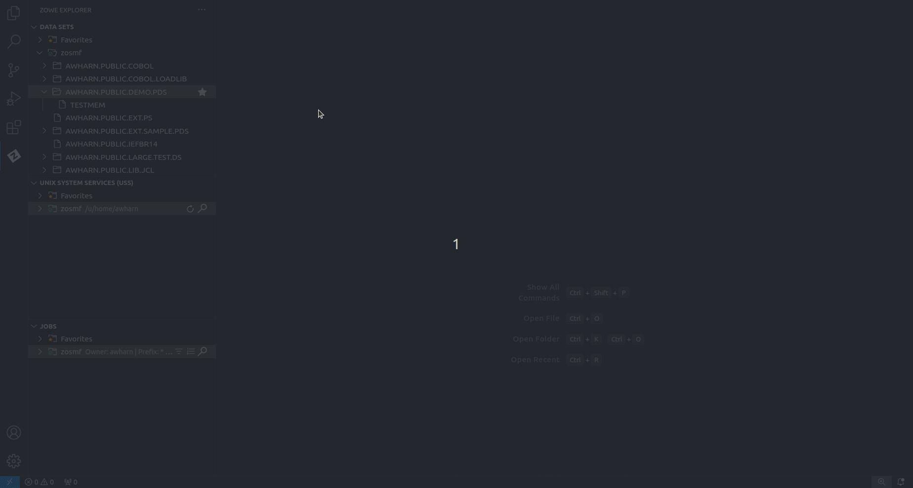
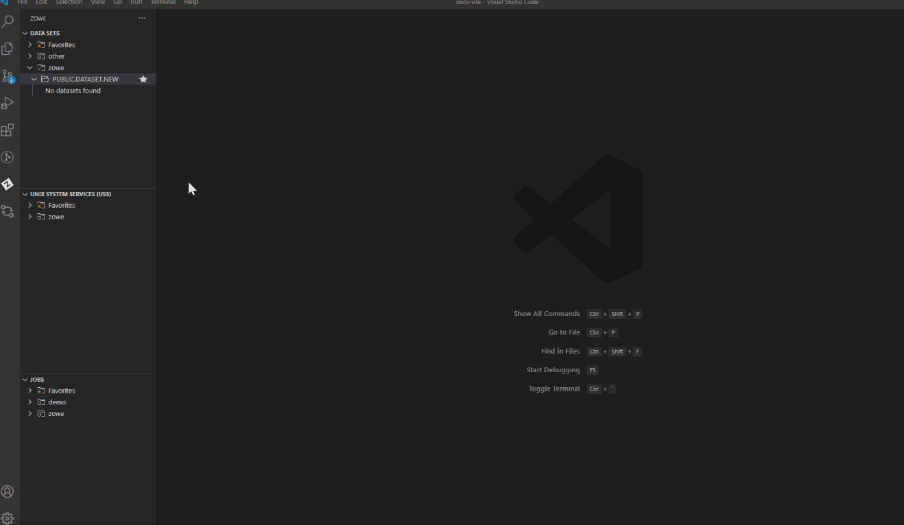

# Using Zowe Explorer

Review this section to familiarize yourself with the extension and make the best use of available options and features. The section contains usage tips and sample use cases for data sets, USS files, JOBs, and TSO commands.

## Usage Tips

Make the best use of the extension with the following tips:

* **Data set, USS and jobs persistence settings:** You can store any of data sets, USS files, or jobs permanently in the **Favorites** tab. Right-click on a data set, USS file, or job and click **Add Favorite**.

* **Identify syntax errors with a syntax highlighter:** Zowe Explorer supports a syntax hightlighter for data sets. To enhance the experience of using the extension, download an extension that highlights syntax, such as [COBOL Language Support](https://marketplace.visualstudio.com/items?itemName=broadcomMFD.cobol-language-support) or [HLASM Language Support](https://marketplace.visualstudio.com/items?itemName=broadcomMFD.hlasm-language-support).

* **Edit a profile**: You can edit existing profiles by clicking the **pencil** button next to the **magnifying glass** button in the explorer tree. The feature lets you modify the information inside your profile.

* **Delete a profile**: You can permanently delete profiles by right-clicking the profile and selecting the **Delete Profile** option. The feature deletes a profile from your `.zowe` folder. Alternatively, you can delete a profile from the VSCode Command Palette.

  **Follow these steps:**

   1. Press **F1** on your keyboard.
   2. Select the **Zowe: Delete a Profile Permanently** option.

* **Hide a profile**: You can hide a profile from profile tree by right-clicking the profile and selecting the **Hide Profile** option. If necessary, add the profile back by clicking the **+** button from the explorer tree.

## Sample Use Cases

Review the following use cases to understand how to use Zowe Explorer.

* [Work with Data Sets](#work-with-data-sets)
* [Work with USS Files](#work-with-uss-files)
* [Work with jobs](#work-with-jobs)
* [MVS/TSO Commands](#mvs/tso-commands)

### Work with Data Sets

You can use the following functionalities when interacting with data sets:

* **View data sets and use multiple filters**: You can view multiple data sets simultaneously and apply filters to show specified data sets.
* **Rename data sets**: You can rename specified data sets.
* **Copy data sets**: You can copy a specified data sets and memebers.
* **Download, edit, and upload existing PDS members**: You can instantly pull data sets and data set members from the mainframe, edit them and upload back.
* **Create and delete data sets and data set members**: Enables you to easily create and delete both data sets and their members.
* **View and access multiple profiles simultaneously**: Enables you to work with data sets from multiple profiles.
* **Submit a JCL**: You can submit a jcl from a chosen data set.
* **Allocate Like:** You can create a copy of a chosen data set with the same parameters.

#### View data sets and use multiple filters

1. Navigate to the explorer tree.
2. Open the **DATA SETS** bar.
3. Select the profile that you want to filter.
4. Click the **Search Data Sets by Entering Patterns** magnifying glass.
5. From the drop-down, enter the patterns that you want to filter.  
  The data sets that match your pattern(s) display in the explorer tree.

**Tip:** To provide multiple filters, separate entries with a comma. You can append or postpend any filter with an \*, which indicates wildcard searching. You cannot enter an \* as the entire pattern.

#### Refresh the list of data sets

1. Navigate to the explorer tree.
2. Click **Refresh All** button on the right of the **DATA SETS** explorer bar.

#### Rename data sets

1. Navigate to the explorer tree.
2. Open the **DATA SETS** bar.
3. Select a data set you want to rename.
4. Right-click the data set and select the **Rename Data Set** option.
5. Change the name of the data set.

#### Copy data sets

1. Navigate to the explorer tree.
2. Open the **DATA SETS** bar.
3. Select a member you want to copy.
4. Right-click the member and select the **Copy Data Set** option.
5. Right-click the data set where the member belongs and select the **Paste Data Set** option.
6. Enter the name of the copied member.

#### Download, edit, and upload existing PDS members

1. Navigate to the explorer tree.
2. Open the **DATA SETS** bar.
3. Open a profile.  
4. Select the PDS member (or PS) that you want to download.

    **Note:** To view the members of a PDS, click on the PDS to expand the tree.

    The PDS member displays in the text editor window of VSC.
5. Edit the document.
6. Navigate back to the PDS member (or PS) in the explorer tree, and click the **Save** button.

Your PDS member (or PS) is uploaded.  

**Note:** If someone else has made changes to the PDS member (or PS) while you were editing it, you can merge your conflicts before uploading to the mainframe.

#### Use the save option to prevent merge conflicts

1. Navigate to the explorer tree.
2. Open the **DATA SETS** bar.
3. Open a member of a data set you want to edit.
4. Edit the member.
5. Press Ctrl+S or Command+S (OSx) to save you changes.
6. (Optional) Resolve merge conflicts if necessary.

#### Create a new PDS and a PDS member

1. Navigate to the explorer tree.
2. Open the **DATA SETS** bar.
3. Click the **Create New Data Set** button to specify the profile that you want to create the data set with.
4. From the drop-down menu, select the type of PDS that you want to create.
5. Enter a name for the PDS.
   The PDS is created.
6. To create a member, right-click the PDS and select **Create New Member**.
7. Enter a name for the member.
   The member is created.

#### Delete a PDS member and PDS

1. Navigate to the explorer tree.
2. Open the **DATA SETS** bar.
3. Open the profile and PDS containing the member.
4. Right-click on the PDS member that you want to delete and select **Delete Member**.
5. Confirm the deletion by clicking **Yes** on the drop-down menu.

    **Note:** Alternatively, you can select 'No' to cancel the deletion.
6. To delete a PDS, right-click the PDS and click **Delete PDS**, then confirm the deletion.

    **Note:** You can delete a PDS before you delete its members.

#### View and access multiple profiles simultaneously

1. Navigate to the explorer tree.
2. Open the **DATA SETS** bar.
3. Click the **Add Profile** button on the right of the **DATA SET** explorer bar.
4. Select the profile that you want to add to the view as illustrated by the following screen.

#### Allocate Like

1. Navigate to the explorer tree.
2. Open the **DATA SETS** bar.
3. Right-click the data set and select the **Allocate Like (New File with Same Attributes)** option.
4. Enter the new data set name.

### Work with USS Files

You can use the following functionalities when interacting with USS files:

* **View Unix System Services (USS) files**: You can view multiple USS files simultaneously.
* **Rename USS files**: You can rename specified USS files.
* **Download, edit, and upload existing USS files**: You can instantly pull USS files from the mainframe, edit them and upload back.
* **Create and delete USS files and directories**: Enables you to easily create and delete both USS files and directories.
* **View and access multiple profiles simultaneously**: Enables you to work with USS files from multiple profiles.

#### View Unix System Services (USS) files

1. Navigate to the explorer tree.
2. Open the **Unix System Services (USS)** bar.
3. Select the profile that you want to filter.
4. Click the **Search Unix System Services (USS) by Entering a Path** magnifying glass.
5. From the drop-down, enter the path that you want as the root of your displayed tree.  
  All child files and directories of that root file are displayed in the explorer tree.

  **Note:** You will not be able to expand directories or files that you are not authorised for.

   

#### Refresh the list of files

1. Navigate to the explorer tree.
2. Click **Refresh All** button on the right of the **Unix System Services (USS)** explorer bar as illustrated by the following screen:

#### Rename USS files

1. Navigate to the explorer tree.
2. Open the **USS** bar.
3. Select a USS file you want to rename.
4. Right-click the USS file and select the **Rename USS file** option.
5. Change the name of the USS file.

#### Download, edit, and upload an existing file

1. Click the file that you want to download.

    **Note:** To view the files within a directory, click the directory to expand the tree.

    The file is displayed in the text editor window of VSC.

    **Note:** If you define file associations with syntax coloring, the suffix of your file will be marked up.

2. Edit the document.
3. Press Ctrl+S or Command+S (OSx) to save the file

Your file is uploaded.  

#### Creating and deleting files and directories

#### Create a directory

1. Navigate to the explorer tree.
2. Open the **Unix System Services (USS)** bar.
3. Select a directory where you want to add the new directory.
4. Select the **Create directory** button and specify the directory name.
   The directory is created.

#### Create a file

1. Navigate to the explorer tree.
2. Open the **Unix System Services (USS)** bar.
3. Select a directory where you want to add the new file to.
4. Select the **Create file** button and specify the file name.
   The file is created.

#### Delete a file

1. Navigate to the explorer tree.
2. Open the **Unix System Services (USS)** bar.
3. Select a file you want to remove.
4. Select the **Delete** button and click *Yes** to confirm.
   The file is deleted.

#### Delete a directory

1. Navigate to the explorer tree.
2. Open the **Unix System Services (USS)** bar.
3. Select a directory you want to remove.
4. Select the **Delete** button and click **Yes** to confirm.
   The directory and all child files and directories are deleted.

#### View and access multiple USS profiles simultaneously

1. Navigate to the explorer tree.
2. Open the **Unix System Services (USS)** bar.
3. Click the **Add Session** button on the right of the **Unix System Services (USS)** explorer bar.
4. Select the profile that you want to add to the view as illustrated by the following screen.

### Work with jobs

You can use the following functionalities when interacting with jobs:

* **View a job**: You can view multiple jobs simultaneously.
* **Download spool content**: You can download spool content on your computer.

#### View a job

1. Navigate to the explorer tree.
2. Open the **JOBS** bar.
3. Select a directory with JCL files.
4. Right-click on the JCL you want to view, and click **Get JCL**.

#### Download spool content

1. Navigate to the explorer tree.
2. Open the **JOBS** bar.
3. Select a directory with JCL files.
4. Click the **Download** icon next to a folder with the spool content.
5. Save the file on your computer.

### MVS/TSO Commands

#### Issue MVS commands

Zowe Explorer also enables you to issue MVS commands. You can issue such commands as Allocate or Exec against a profile.

1. Press the **F1** key on your keyboard.
2. Select the **Zowe:Issue MVS Command** option.
3. Select your profile.
4. Issue an MVS command.

