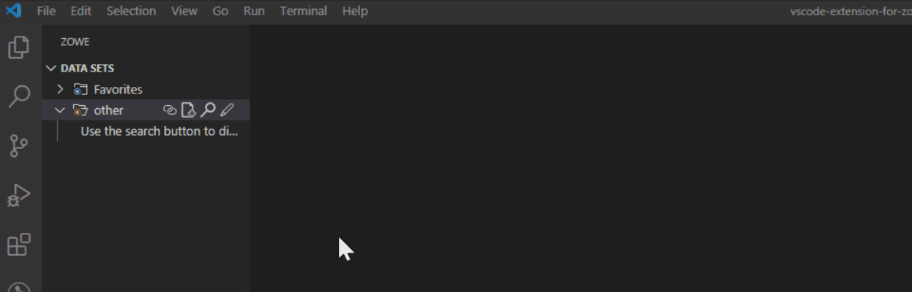
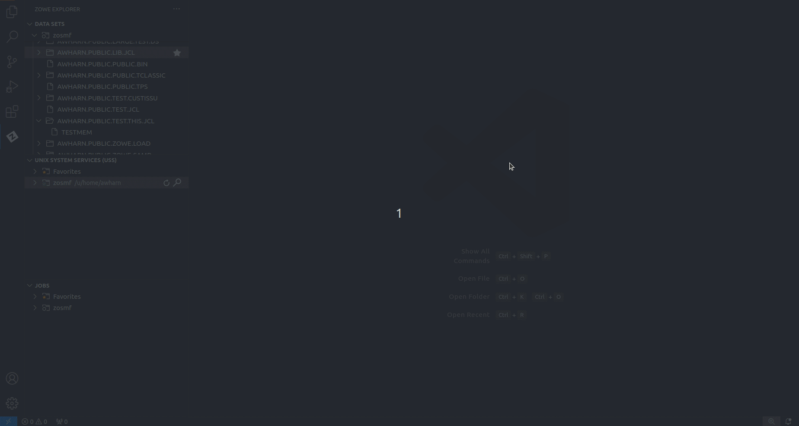
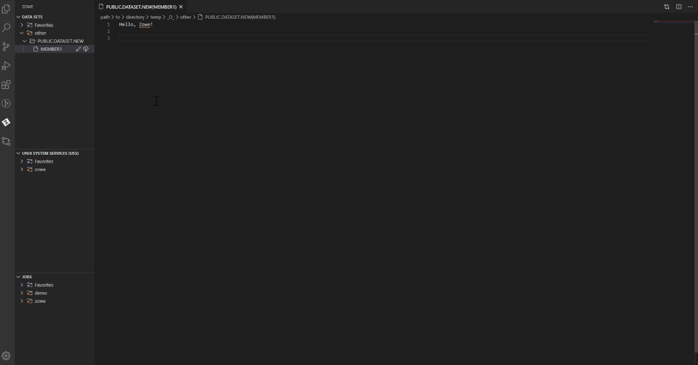

# Sample Use Cases

The following use cases demonstrate the various functionalities available in Zowe Explorer.

## Working with Data Sets

### Viewing data sets and using multiple filters

1. Expand **DATA SETS** in the **Side Bar**, and hover over the profile you want to filter.
2. Click the **Search** icon.
3. Use the **picker** field to select or enter the patterns you want to apply as filters.  
   
   The data sets that match your pattern(s) display in the **Side Bar**.

   **Tip:** To use multiple filters, separate individual entries with a comma. You can append or postpend any filter with an \* to indicate a wildcard search. You cannot enter an \* as the entire pattern.

   

### Viewing data sets with member filters

1. Expand **DATA SETS** in the **Side Bar**, and hover over the profile you want to filter.
2. Click the **Search** icon.
3. In the **picker** field, enter or select a search pattern in the `HLQ.ZZZ.SSS(MEMBERNAME)` format to filter out and display the specified member in the **Side Bar**.

   

### Refreshing the list of data sets

1. Hover over  **DATA SETS** in the **Side Bar**.
2. Click the **Refresh All** icon.

### Renaming data sets

1. Expand **DATA SETS** in the **Side Bar**, and select the data set you want to rename.
2. Right-click the data set and select the **Rename Data Set** option.
3. Enter the new name of the data set in the **picker** field.

   

### Copying data set members

1. Expand **DATA SETS** in the **Side Bar**, and select the member you want to copy.
2. Right-click the member and select the **Copy Member** option.
3. Right-click the data set where the member is to be contained and select the **Paste Member** option.
4. In the **picker** field, enter the name of the copied member.

   

### Editing and uploading a data set member

1. Expand **DATA SETS** in the **Side Bar**, and select a profile to open it.
2. Open the data set with the member you want to edit.
3. Click on the member name to display it in an **Editor** tab.
4. Edit the document.
5. Press `Ctrl`+`S` or `Command`+`S` to save the changes and upload the data set to the mainframe.

   **Note:** If someone else has made changes to the data set member while you were editing, you can merge your changes before uploading to the mainframe. See [Preventing merge conflicts](#preventing-merge-conflicts) for more information.

   

### Preventing merge conflicts

1. Expand **DATA SETS** in the **Side Bar**, and navigate to the member you want to edit.
2. Edit the document in the **Editor** tab.
3. Press `Ctrl`+`S` or `Command`+`S` to save the changes.

   If the original content in your local version no longer matches the same file in the mainframe, a warning message displays advising the user to compare both versions.
4. If necessary, use the editor tool bar to resolve merge conflicts.

   

### Creating data sets and specifying parameters

1. Expand **DATA SETS** in the **Side Bar**.
2. Right-click the profile you want to create a data set with and select **Create New Data Set**.
3. Enter a name for your data set in the **picker** field and press `Enter`.
4. From the **picker** drop-down menu, select the data set type that you want to create and press `Enter`.
5. Select **Edit Attributes** in the **picker** drop-down menu and press `Enter`.

   The attributes list for the data set displays. You can edit the following attributes:

   - Allocation Unit

   - Average Block Length

   - Block Size

   - Data Class

   - Device Type

   - Directory Block

   - Data Set Type

   - Management Class

   - Data Set Name

   - Data Set Organization

   - Primary Space

   - Record Format

   - Record Length

   - Secondary Space

   - Size

   - Storage Class

   - Volume Serial

6. Select the attribute you want to edit, provide the value in the **picker** field, and press `Enter`.
7. (Optional) Edit the parameters of your data set.
8. Select the **+ Allocate Data Set** option to create the data set and list it in the **Side Bar**.

   

### Creating data sets and data set members

1. Expand **DATA SETS** in the **Side Bar**.

2. Right-click on the profile where you want to create a data set and select **Create New Data Set**.
3. Enter a name for your data set in the **picker** field and press `Enter`.
4. From the **picker** drop-down menu, select the data set type that you want to create.
5. Select **+Allocate Data Set** to create your data set.
6. In the **Side Bar**, right-click your newly-created data set and select **Create New Member**.
7. Enter a name for your new data set member in the **picker** field and press **Enter**.
   The member is created and opened in an **Editor** tab.

### Deleting a data set member and a data set

1. Expand **DATA SETS** in the **Side Bar**.
2. Open the profile and data set containing the member you want to delete.
3. Right-click the member and select **Delete Member**.
4. Confirm the deletion by selecting **Delete** on the **picker** drop-down menu.
5. To delete a data set, right-click the data set and select **Delete Data Set**, then confirm the deletion.

   **Note:** You can delete a data set before you delete its members.

   

### Viewing and accessing multiple profiles simultaneously

1. Expand **DATA SETS** in the **Side Bar**, and click the **+** icon.
2. Select the profiles from the **picker** drop-down to add them to the **Side Bar**.
3. Click the **Search** icon for each profile to search and select associated data sets.

   

### Submiting a JCL

1. Expand **DATA SETS** in the **Side Bar**.
2. Select the data set or data set member you want to submit.
3. Right-click the data set or member and select the **Submit Job** option.

   **Note:** Click on the hyperlink on the notification pop-up message to view the job.

   

### Allocate like

1. Expand **DATA SETS** in the **Side Bar**.
2. Right-click a data set and select the **Allocate Like (New File with Same Attributes)** option.
3. Enter the new data set name in the **picker** field and press `Enter`.

   

## Working with USS files

### Viewing Unix System Services (USS) files

1. Expand **UNIX SYSTEM SERVICES (USS)** in the **Side Bar**.
2. Hover over the profile you want to search and click the **Search** icon.
3. In the **picker** field, enter or select the path that you want as the root of your displayed tree and press `Enter`.
   
   All child files and directories of that path display in the **Side Bar**.

   **Note:** You will not be able to expand directories or files to which you are not authorized.

    

### Refreshing the list of files

1. Hover over **UNIX SYSTEM SERVICES (USS)** in the **Side Bar**.
2. Click the **Refresh All** button.

   

### Renaming USS files

1. Expand **UNIX SYSTEM SERVICES (USS)** in the **Side Bar**.

2. Select a USS file you want to rename.
3. Right-click the USS file and select the **Rename USS file** option.
4. In the **picker** field, change the name of the USS file and press `Enter`.

### Downloading, editing, and uploading existing USS files

1. Expand **UNIX SYSTEM SERVICES (USS)** in the **Side Bar**.
2. Navigate to the file you want to download and click on the file name.

   This displays the file in an **Editor** tab.

   **Note:** If you define file associations with syntax coloring, the suffix of your file will be marked up.

3. Edit the document.
4. Press `Ctrl`+`S` or `Command`+`S` to save the changes and upload the USS file to the mainframe.

   

### Creating and deleting USS files and directories

#### Creating a directory

1. Expand **UNIX SYSTEM SERVICES (USS)** in the **Side Bar**.

2. Right-click the directory where you want to add the new directory.
3. Select the **Create Directory** option and enter the directory name in the **picker** field.
4. Press `Enter` to create the directory.

#### Creating a file

1. Expand **UNIX SYSTEM SERVICES (USS)** in the **Side Bar**.

2. Right-click the directory to which you want to add the new file.
3. Select the **Create File** option and enter the file name in the **picker** field.
4. Press `Enter` to create the file.

#### Deleting a file

1. Expand **UNIX SYSTEM SERVICES (USS)** in the **Side Bar**.

2. Right-click the file you want to remove.
3. Select the **Delete** option and click **Delete** again to confirm and delete the file.

#### Deleting a directory

1. Expand **UNIX SYSTEM SERVICES (USS)** in the **Side Bar**.
2. Right-click the directory you want to remove.
3. Select the **Delete** button and click **Delete** again to confirm and delete the directory and all its child files and directories.

   

### Viewing and accessing multiple USS profiles simultaneously

1. Expand **UNIX SYSTEM SERVICES (USS)** in the **Side Bar**, and click the **+** icon.
2. Select or enter a profile in the **picker** drop-down menu to add it to the **Side Bar**.

   

## Working with jobs

### Viewing a job

1. Expand **JOBS** in the **Side Bar**.
2. Open a directory with JCL files.
3. Right-click on the JCL file you want to view, and select the **Get JCL** option.

   

### Downloading spool content

1. Expand **JOBS** in the **Side Bar**.
2. Open a directory with JCL files.
3. Click the **Download** icon next to a folder with the spool content.
4. Save the file on your computer.

   

### Issuing MVS commands

1. Expand **JOBS** in the **Side Bar**.
2. Right-click on your profile and select the **Issue MVS Command** option.

   Alternatively, press the `F1` key to open the **Command Pallette**, then select the **Zowe Expolorer: Issue MVS Command** option.

3. In the **picker** field, enter a new command or select a saved command.
4. Press `Enter` to execute the command.

   

### Issuing TSO commands

1. Expand **JOBS** in the **Side Bar**.
2. Right-click on your profile and select the **Issue TSO Command** option.

   Alternatively, press the `F1` key to open the **Command Pallette**, then select the **Zowe Explorer: Issue TSO Command** option.

3. In the **picker** field, enter a new command or select a saved command.
4. Press `Enter` to execute the command.

   The output displays in the **Output** panel.

   
