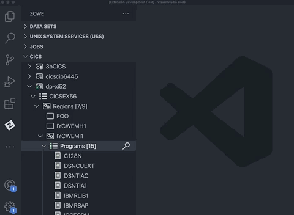
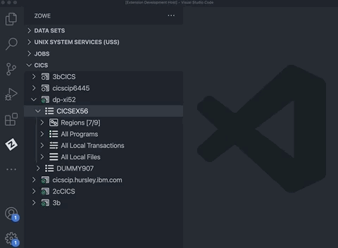
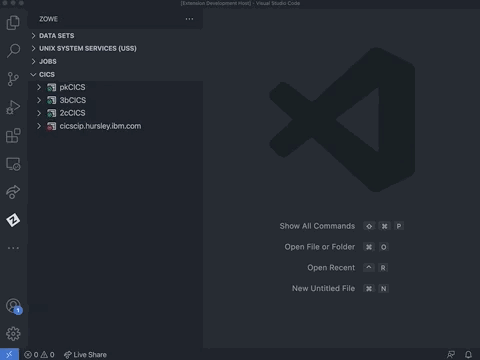
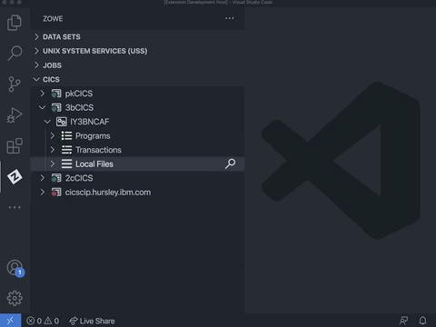

# Using CICS resources

Expand a CICS profile to see the region name, and expand the region to view its resources.

- If the CICS profile is connected to a CMAS region that is part of a CICSPlex, the tree shows all of the regions managed by the CICSPlex.
- If the CICS profile is for an SMSS region, then only one region displays. Inactive regions in a plex display with an empty icon.

## Showing and filtering resources in a region

1. Expand the **CICS** tree in the **Side Bar** and navigate to a CICS region.

2. Expand the CICS region to show folders for the **Programs**, **Transactions**, and **Local Files** resource types.

3. Expand each resource type to view their resources. (The number of resources in a resource tree displays in square brackets next to the tree name.)

   The list of resources is pre-filtered to exclude many of the IBM-supplied resources. This narrows the contents to include only user programs.

4. Use the **Search** icon in a resource type to apply a filter.

   Enter an exact resource name or use wildcards. The search history is saved so you can recall previous searches.
   
   To reset the filter to its initial criteria, use the **Clear** filter icon in the resource type. To see all resources in a region (including those supplied by IBM), use an `*` as a filter.

   

   ::: Tip

   To apply multiple filters, separate entries with a comma. Append a filter with an `*` to indicate wildcard searching.

   :::

## Showing and filtering resources in a plex

Apply a filter on all region resources in a plex.

1. Expand the **CICS** tree in the **Side Bar** and navigate to the **Regions** tree.

2. In the **Quick Pick**, select **Regions**, **Programs**, **Local Transactions**, or **Local Files**.

   This specifies the resource type to apply as the filter for all regions in the plex.

3. To reset the filter to its initial criteria, select the **Clear** filter icon on the **Regions** tree.

   This displays a **Quick Pick** menu that gives the option to clear the filter for all the **Regions**, **Programs**, **Local Transactions** or **Local Files** in the plex, and the option **All** to clear all filters in the plex.

   

::: Tip

To apply multiple filters, separate entries with a comma. Append a filter with an`*` to indicate wildcard searching.

:::

## Showing and filtering resources in an 'All' resource tree

Plexes includes **All Programs**, **All Local Transactions** and **All Local Files** trees that contain all the corresponding resources from all regions in the plex.

To view resources under these trees:

1. Expand the **CICS** tree in the **Side Bar** and navigate to the desired tree.

2. Select the **Search** icon in the desired tree and apply a filter from the **Quick Pick**.

   

   If the applied filter results in more than 500 records, change the filter to narrow the search, or click the **view X more ...** option to retrieve the specified quantity of resources.

## Showing attributes

1. Expand the **CICS** tree in the **Side Bar** and navigate to a program.

2. Right-click the program.

   A context menu lists the available actions that can be performed.

3. Select the **Show Attributes** option.

   All attributes and their values open in an **Editor**. Use the filter box at the top of the **Editor** to search for attributes matching the search criteria.  

## Enabling and disabling

1. Expand the **CICS** tree in the **Side Bar** and navigate to a program, local transaction, or local file.

2. Right-click a program, local transaction, or local file.

   A context menu lists the available actions that can be performed.

3. Select the **Disable [CICS resource]** option.

   The resource is disabled. A disabled resource is identified by a `(Disabled)` indicator next to its name.

4. To enable resource, right-click a disabled program, local transaction, or local file and select the **Enable [CICS resource]** option from the context menu to re-enable it.

## New copy and phase in

Use the **New Copy** and the **Phase In** actions against a CICS program to get the CICS region to load a fresh copy of the selected program into memory. This could be useful after you edited a COBOL program source and successfully compiled it into a load library and now want to test your change.

1. Expand the **CICS** tree in the **Side Bar** and navigate to a program.

2. Select the program and click on the **New Copy** icon next to it, or right-click a program and select the **New Copy** option from the context menu.

   The program is applied to the CICS region to use it on the associated transaction, and a pop-up message displays the status of the operation.

   The `New copy count` for a program is shown next to the program in the **CICS** tree.

3. Select the program and click on the **Phase In** icon next to it, or right-click a program and select the **Phase In** option from the context menu.

   The program is applied to the CICS region whether or not the program is actively running, and a pop-up message displays the status of the operation.

## Opening and closing local files

To open a local file:

1. Right-click a closed local file.
2. Select the **Open Local File** option from the context menu.

   The `openstatus` attribute for the file is set to `OPEN`.

To close a local file:

1. Right-click an open local file.
2. Select the **Close Local File** option from the context menu.
3. When prompted, choose one of the following options from the pop-up window:
   - **Wait** for the file/resource to not be in use.
   - **No Wait** to close the file/resource without waiting.
   - **Force** to abort any process that was using the file/resource.

   After an option is selected, the local file name is appended with a `(Closed)` label.

   
