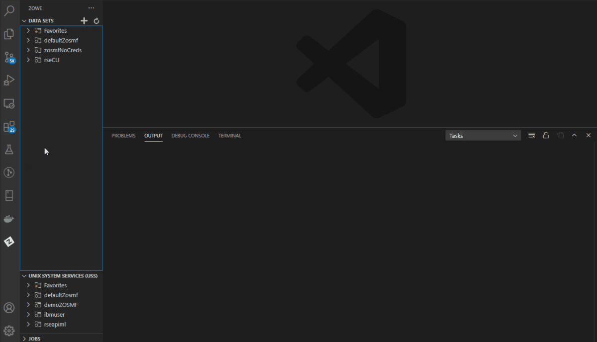

# Working with commands

You can issue the same commands used in ISPF with Zowe Explorer.

MVS commands can be used to obtain information from the zOS console, while SSH commands can be used to issue shell commands to Unix System Services (USS). TSO commands can be used to invoke mainframe scripts in a zOS terminal session.

## Issuing MVS commands

1. Expand **DATA SETS**, **UNIX SYSTEM SERVICES (USS)**, or **JOBS** in the **Side Bar**.
2. Right-click on your profile and select the **Issue MVS Command** option.

   Alternatively, press the `F1` key to open the **Command Palette**, and then select the **Zowe Expolorer: Issue MVS Command** option.

3. In the **Quick Pick**, enter a new command or select a saved command.
4. Press the `Enter` key to execute the command.

    The output displays in the **Output** panel.

> Example command: Issue `D T` to get the system time.

## Issuing SSH commands

1. Expand **DATA SETS**, **UNIX SYSTEM SERVICES (USS)**, or **JOBS** in the **Side Bar**.
2. Right-click on your profile and select the **Issue Unix Command** option.

   Alternatively, press the `F1` key to open the **Command Palette**, then select the **Zowe Explorer: Issue Unix Command** option.

3. In the **Quick Pick**, enter a new command or select a saved command.
4. Press the `Enter` key to execute the command.

   The output displays in the **Output** panel.

> Example command: Issue `ls` to list the contents of the current directory.

## Issuing TSO commands

1. Expand **DATA SETS**, **UNIX SYSTEM SERVICES (USS)**, or **JOBS** in the **Side Bar**.
2. Right-click on your profile and select the **Issue TSO Command** option.

   Alternatively, press the `F1` key to open the **Command Palette**, then select the **Zowe Explorer: Issue TSO Command** option.

3. In the **Quick Pick**, enter a new command or select a saved command.
4. Press the `Enter` key to execute the command.

   The output displays in the **Output** panel.

   

> Example command: Issue `profile` to get information on your zOS system user profile.
