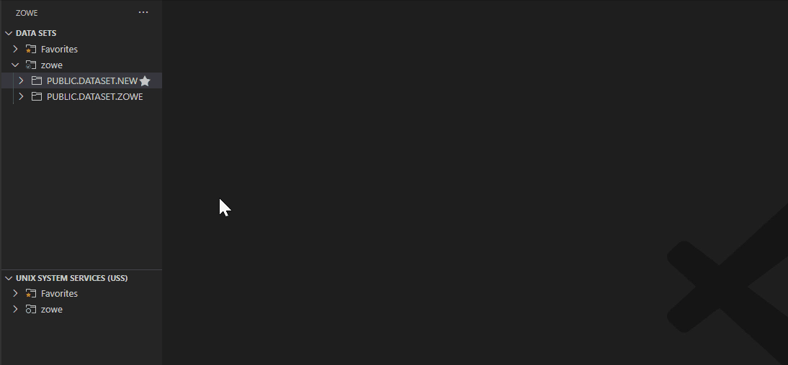
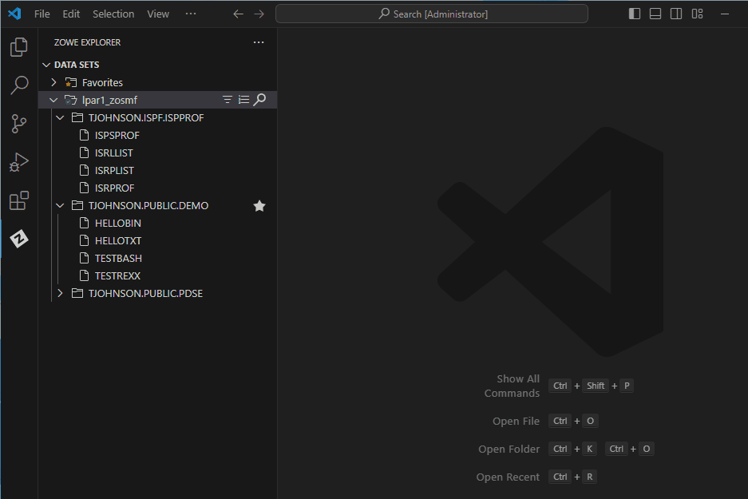

# Working with data sets

## Viewing and accessing multiple profiles simultaneously 

1. Expand the **DATA SETS** tree in the **Side Bar**, and click the **+** icon.
2. Select the profiles from the **Quick Pick** menu to add them to the **Side Bar**.
3. Click the **Search** icon for each profile to search and select associated data sets.

   

## Viewing data sets and using multiple filters

1. Expand the **DATA SETS** tree in the **Side Bar**.

2. Click on the **Search** icon next to a profile to search for a pattern that matches the data set that you want to view.

   Search results display under the profile in the **Side Bar**.

   :::tip

   To use multiple filters, separate individual entries with a comma. You can append or postpend any filter with an `*` to indicate a wildcard search. You cannot enter an `*` as the entire pattern.

   :::
   

## Viewing data sets with member filters

1. Expand the **DATA SETS** tree in the **Side Bar**.

2. Click on the **Search** icon next to a profile.

3. In the **Quick Pick**, enter or select a search pattern in the `HLQ.ZZZ.SSS(MEMBERNAME)` format to filter search results.

   The specified member displays under the profile in the **Side Bar**. 

   

## Refreshing the list of data sets

1. Hover over  **DATA SETS** in the **Side Bar**.
2. Click the **Refresh All** icon.

   The list of data sets is updated to reflect the latest changes. 

## Renaming data sets

1. Expand the **DATA SETS** tree in the **Side Bar**.

2. Click on the **Search** icon next to a profile to search for a pattern that matches the data set that you want to view.

   Search results display under the profile in the **Side Bar**.

3. Right-click the desired data set and select the **Rename Data Set** option.
4. Enter the new name of the data set in the **input box**.

   The data set is renamed and displays the new name in the **Side Bar**.

   

## Copying data set members

1. Expand the **DATA SETS** tree in the **Side Bar**.

2. Click on the **Search** icon next to a profile to search for a pattern that matches the data set that you want to view.

   Search results display under the profile in the **Side Bar**.
3. Right-click the desired member and select the **Copy** option.
4. Right-click the data set where the member is to be contained and select the **Paste** option.
5. In the **Quick Pick**, enter the name of the copied member.

   

## Editing and uploading a data set member

1. Expand the **DATA SETS** tree in the **Side Bar**.

2. Click on the **Search** icon next to a profile to search for a pattern that matches the data set that you want to view.

   Search results display under the profile in the **Side Bar**.
3. Open the data set with the member you want to edit.
4. Click on the member name to display it in an **Editor**.
5. Edit the document in the **Editor**.
6. Press the `Ctrl`+`S` or `Command`+`S` keys to save the changes.

   The changes are saved and the edited data set is uploaded to the mainframe.

   :::note 
   
   If someone else has made changes to the data set member while you were editing, you can merge your changes before uploading to the mainframe. See [Preventing merge conflicts](#preventing-merge-conflicts) for more information.

   :::

   

## Uploading a local file to a data set

1. Expand the **DATA SETS** tree in the **Side Bar**.

2. Click on the **Search** icon next to a profile to search for a pattern that matches the desired data set.

   Search results display under the profile in the **Side Bar**.

3. Right-click on the desired PDS and select the **Upload Member...** option to upload a local file as a member of that data set.

   A file explorer window opens.
4. In the file explorer, select the desired file and click **Upload File**.

   The selected file is uploaded as a member of the data set and appears as a new member in the **DATA SETS** tree after the upload is complete.

## Comparing data set members

1. Expand the **DATA SETS** tree in the **Side Bar**.

2. Click on the **Search** icon next to a profile to search for a pattern that matches the desired data set.

   Search results display under the profile in the **Side Bar**.
3. Right-click on the desired member and select the **Select for Compare** option.
4. Right-click a second member and select the **Compare with Selected** option.

   The first selected member displays in an **Editor** on the left; the second member displays on the right.

## Preventing merge conflicts

1. Expand the **DATA SETS** tree in the **Side Bar**.
2. Click on the **Search** icon next to a profile to search for a pattern that matches the desired data set.

   Search results display under the profile in the **Side Bar**.
3. Select the member to open the file in an **Editor**.
4. Edit the document in the **Editor**.
5. Press the `Ctrl`+`S` or `Command`+`S` keys to save the changes.

   If the original content in your local version no longer matches the same file in the mainframe, a warning message displays advising the user to compare both versions.
6. If necessary, use the editor tool bar to resolve merge conflicts.

   

## Creating data sets and specifying parameters

1. Expand the **DATA SETS** tree in the **Side Bar**.
2. Right-click on the profile you want to create a data set with and select **Create New Data Set**.
3. Enter a name for your data set in the **input box** and press the `Enter` key.
4. From the **Quick Pick** menu, select the data set type that you want to create and press the `Enter` key.
5. Select **Edit Attributes** in the **Quick Pick** menu and press the `Enter` key.

   The attributes list for the data set displays. You can edit the following attributes:

   - Allocation Unit

   - Average Block Length

   - Block Size

   - Data Class

   - Device Type

   - Directory Block

   - Data Set Type

   - Management Class

   - Data Set Name

   - Data Set Organization

   - Primary Space

   - Record Format

   - Record Length

   - Secondary Space

   - Size

   - Storage Class

   - Volume Serial

6. Select the attribute you want to edit, provide the value in the **input box**, and press the `Enter` key.
7. (Optional) Edit the parameters of your data set.
8. Select the **+ Allocate Data Set** option.
   
   The data set is created and listed under the profile in the **Side Bar**.

   

## Creating data sets and data set members

1. Expand the **DATA SETS** tree in the **Side Bar**.
2. In the **Side Bar**, right-click on a partitioned data set and select **Create New Member**.
3. Enter a name for your new data set member in the **input box** and press the `Enter` key.

   The member is created and opened in an **Editor**.

## Deleting a data set member and a data set

1. Expand the **DATA SETS** tree in the **Side Bar**.
2. Open the profile and data set containing the member you want to delete.
3. Right-click the member and select **Delete Member**.
4. Confirm the deletion by selecting **Delete** on the **Quick Pick** menu.
5. To delete a data set, right-click the data set and select **Delete Data Set**, then confirm the deletion.

   

## Viewing data set, member attributes

1. Expand the **DATA SETS** tree in the **Side Bar**.
2. Click on the **Search** icon next to a profile to search for a pattern that matches the data set that you want to upload to.

   Search results display under the profile in the **Side Bar**.
3. Right-click a data set or member and select the **Show Attributes** option.

   The attributes display in an **Editor**.

    

## Filtering partitioned data set members

Filter partitioned data set members in the **DATA SETS** tree view by **Date Modified** or **User ID**.

### Filtering all partitioned data set members under a specific profile

1. Expand the **DATA SETS** tree in the **Side Bar**.
2. Navigate to a profile and click on the **Filter** icon to the right of the profile.

   The filter selection menu appears in the **Quick Pick**.
3. Select a filter type from the list of available options:
   - **Date Modified**
   - **User ID**
4. In the **Quick Pick**, enter a valid value for the selected filter.
5. Press the `Enter` key to confirm the filter.

   Expanded data sets display a filtered list of members under the selected profile in the **DATA SETS** tree.

   

### Filtering members for a single partitioned data set

1. Expand the **DATA SETS** tree in the **Side Bar**.
2. Click on the **Search** icon next to a profile to search for a pattern that matches the data set that you want to filter.

   Search results display under the profile in the **Side Bar**.
3. In the **DATA SETS** tree, right-click on a data set and select the **Filter PDS members…** option.

   The filter selection menu appears in the **Quick Pick**.
4. Select a filter type from the list of available options:
   - **Date Modified**
   - **User ID**
5. In the **Quick Pick**, enter a valid value for the selected filter.
6. Press the `Enter` key to confirm the filter. This overrides any *profile* filter preferences that might be in effect for the single data set.

   The selected data set displays a filtered list of members in the **DATA SETS** tree.

   

## Sorting partitioned data set members

Sort partitioned data set members in the **DATA SETS** tree view by member **Name**, **Date Modified**, or **User ID**.

### Sorting all partitioned data set members under a specific profile

1. Expand the **DATA SETS** tree in the **Side Bar**.
2. Click on the **Sort** icon to the right of a profile.

   The sorting selection menu appears in the **Quick Pick**.
3. To change the sorting direction, select the **Sort Direction** option and select a direction type from the **Quick Pick** menu.
4. Select a sort type from the list of available options:
   - **Name**
   - **Date Created**
   - **Date Modified**
   - **User ID**

   Expanded data sets display a sorted list of members under the selected profile in the **DATA SETS** tree.

   

### Sorting members for a single partitioned data set

1. Expand the **DATA SETS** tree in the **Side Bar**.
2. Click on the **Search** icon next to a profile to search for a pattern that matches the data set that you want to sort.

   Search results display under the profile in the **Side Bar**.

3. Right-click on a data set and select the **Sort PDS members…** option.

   The sort selection menu appears in the **Quick Pick**.
4. To change the sorting direction, select the **Sort Direction** option and select a direction type from the **Quick Pick** menu.
5. Select a sort type from the list of available options:
   - **Name**
   - **Date Created**
   - **Date Modified**
   - **User ID**

   This overrides any *profile* sort preferences that might be in effect for the single PDS. The selected data set displays a sorted list of members in the **DATA SETS** tree.

   

## Submitting a JCL

1. Expand the **DATA SETS** tree in the **Side Bar**.
2. Click on the **Search** icon next to a profile to search for a pattern that matches the desired data set.

   Search results display under the profile in the **Side Bar**.
3. Right-click the desired data set or data set member and select the **Submit Job** option.

   The job is submitted and runs on the mainframe.

   :::note

   To view the status of the job, click on the hyperlink on the notification pop-up message.

   :::

   

## Submitting a local file as JCL

1. Go to the **File** menu and select the **Open File...** option.
2. Select the desired file on your personal computer.

   The file opens as an **Editor** in VS Code.
3. Right-click on the file's **Editor** and select the option **Submit as JCL**.

   A dialog window opens to ask confirmation, then the **Quick Pick** displays a list of profiles to use for the submit action. Respond to the prompt(s) as necessary.

   The job is submitted and runs on the mainframe.

   :::note

   To view the status of the job, click on the hyperlink on the notification pop-up message.

   :::

## Allocate like

1. Expand the **DATA SETS** tree in the **Side Bar**.
2. Click on the **Search** icon next to a profile to search for a pattern that matches the desired data set.

   Search results display under the profile in the **Side Bar**.
3. Right-click a data set and select the **Allocate Like (New File with Same Attributes)** option.
4. Enter the new data set name in the **input box** and press the `Enter` key.

   The new data set displays under the selected profile.

   