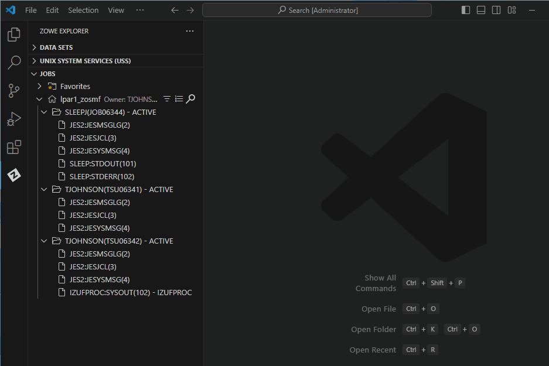
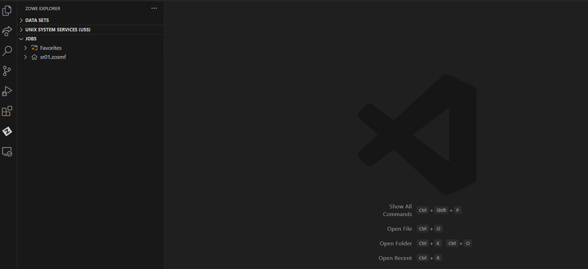

# Working with jobs

## Viewing job spool output

1. Expand the **JOBS** tree in the **Side Bar**.
2. Click on the **Search** icon next to a profile and enter search criteria.

   Search results display under the profile in the **Side Bar**.

3. Expand a job to view its spool files.

## Viewing job contents

1. Expand the **JOBS** tree in the **Side Bar**.
2. Click on the **Search** icon next to a profile and enter search criteria.

   Search results display under the profile in the **Side Bar**.
3. Right-click on the job you want to view, and select the **Get JCL** option.

   Job contents display in an **Editor**.

   :::note

   To edit the job and run it again, make the changes in the **Editor**, right click the **Editor**, and select the **Submit as JCL** option. For instructions, see Step 3 in [Submitting a local file as JCL](../user-guide/ze-working-with-data-sets.md#submitting-a-local-file-as-jcl).

   :::

   

## Creating a job search filter

1. Expand the **JOBS** tree in the **Side Bar**.
2. Click on the **Search** icon next to a profile and enter search criteria.
3. In the **Quick Pick**, select the **Create job search filter** option.
4. Select a **Quick Pick** option to submit its respective value.

   The entered value displays next to the **Quick Pick** option.
5. Select the **Submit this query** option in the **Quick Pick** to create the filter.

   The filter is saved as a **Quick Pick** option that displays when the **Search** icon is clicked. Remove the filter with Zowe Explorer's Edit History feature.

## Downloading spool content

### Downloading spool files from a job

1. Expand the **JOBS** tree in the **Side Bar**.
2. Click on the **Search** icon next to a profile and enter search criteria.

   Search results display under the profile in the **Side Bar**.
3. Right-click on the desired job and select either:

   - **Download All** to download all the spool files to a folder on your local disk.
   - **Download All (Binary)** to download all the spool files in binary format on your local disk.

   The selected files are saved in a folder that is the job name in the specified location.

   

### Downloading a single spool file

1. Expand the **JOBS** tree in the **Side Bar**.
2. Click on the **Search** icon next to a profile and enter search criteria.

   Search results display under the profile in the **Side Bar**.
3. Expand the job containing the desired spool file.
4. Right-click on the spool file and select either:

   - **Download All** to download all the spool file contents to a folder on your local disk.
   - **Download All (Binary)** to download all the spool file contents in binary format on your local disk.

   The selected file is saved in the specified location.

## Sorting jobs

1. Expand **JOBS** in the **Side Bar**.
2. Click on the **Sort** icon to the right of a profile.
3. In the **Quick Pick**, select the **Sort Direction** option and select either **Ascending** or **Descending**.
4. Select a sort type from the list of available options:
   - **Job ID (default)**
   - **Date Submitted**
   - **Date Completed**
   - **Job Name**
   - **Return Code**

:::note

To change the default sort order for jobs, see [Modifying the default sort order for data sets and jobs](ze-install-configuring-ze.md#modifying-the-default-sort-order-for-data-sets-and-jobs).

:::

   

## Polling active jobs

Users can periodically refresh the currently filtered jobs profile to get latest job statuses. Jobs that complete during polling also show a notification and return code for poll completion. This avoids having to manually refresh the **JOBS** tree until the filtered jobs complete.

**This option does not poll the spool files**, however it can be combined with [polling individual spool files](#polling-a-spool-file) within the filtered jobs.

### Polling active jobs at a set interval

1. Expand the **JOBS** tree in the **Side Bar**.
2. Click on the **Search** icon next to a profile and enter search criteria.

   Search results display under the profile in the **Side Bar**.
3. Right click on the profile and select the **Start Polling Active Jobs** option.
The **Poll interval (in ms) for: &lt;profile name&gt;** field displays the current interval value.
    - The default value is set to 5000 ms.
    - See [Defining a default interval for polling jobs and spool files](#defining-a-default-interval-for-polling-jobs-and-spool-files) to change the default value.
    - Change the value by entering a different number (must be greater than or equal to 1000 ms).
5. Press the `Enter` key to confirm the interval time and start the polling action.

   The poll request is added to the poller and will show how many active jobs there are in the current filter.

Any new jobs matching the filter during polling will automatically appear in the **JOBS** tree.

Jobs that complete during polling will show a notification and return code for poll completetion.

### Stopping active jobs polling

In the **Side Bar**, right click on the profile and select the **Stop Polling Active Jobs** option.

Alternatively, if all the jobs in the current filter have completed, polling will automatically be stopped.

## Polling a spool file

Users can periodically refresh a spool file during long-running jobs to get the latest job outputs. This avoids having to close and reopen a spool file to get the latest job outputs.

This can be combined with polling jobs without conflicts.

There are two ways to poll a spool file: automatically at set intervals or manually on demand.

### Polling a spool file at set intervals
 

1. Expand the **JOBS** tree in the **Side Bar**.
2. Click on the **Search** icon next to a profile and enter search criteria.

   Search results display under the profile in the **Side Bar**.
3. Right click on the desired spool file and select the **Start Polling** option.
    - Repeat this step with additional spool files to poll multiple files simultaneously.
4. The **Poll interval (in ms) for: &lt;spoolfilename&gt;** field displays the current interval value.
    - The default value is set to 5000 ms.
    - See [Defining a default interval for polling jobs and spool files](#defining-a-default-interval-for-polling-jobs-and-spool-files) to change the default value
    - Change the value by entering a different number (must be greater than or equal to 1000 ms).
5. Press the `Enter` key to confirm the interval time and start the polling action.

   The poll request is added to the poller, and the selected spool file is marked with a "**P**" in the **Side Bar** and any corresponding **Editor** tabs.

   

 

### Stopping spool file polling
 

1. In the **Side Bar**, select a spool file that is being polled.

   Spool files being polled are marked with a "**P**" in the **Side Bar**.

2. Right click the spool file and select the **Stop Polling** option.

   The poll request is removed from the poller, and the selected spool file is no longer marked with a "**P**" in the **Side Bar** and any corresponding **Editor** tabs.

### Polling a spool file manually

 A spool file can be polled on demand by using a designated keyboard shortcut.

To manually poll a spool file:

1. In the **Side Bar**, double click a spool file to open it in an **Editor**.
2. With the spool file in an active tab, press the keyboard shortcut.
    - See [Configuring the keyboard shortcut for manual polling](#configuring-the-keyboard-shortcut-for-manual-polling) to set the keyboard shortcut.

    
   
   The spool file is updated and "**Polling...**" displays in the bottom status bar.

### Configuring the keyboard shortcut for manual polling
 

1. Click on the **Settings** icon on the **Activity Bar** and select **Keyboard Shortcuts**.

2. Navigate to **Zowe Explorer: Poll Content in Active Editor**.
3. Select the **Edit** icon to designate a different keyboard shortcut.
    - The default shortcut is the `F5` key.
     

    The entered key(s) can be used to activate polling.

## Defining a default interval for polling jobs and spool files
 

1. Click on the **Manage** icon on the **Activity Bar** and select **Settings**.
2. In either the **User** or **Workspace** tab, click on the **Extensions** option to open the menu.
3. Select **Zowe Explorer**.
4. In the **Jobs: Poll Interval** field, enter a valid time interval, in milliseconds.
 	- Value must be greater than or equal to 1000 ms (or 1 second).
5. Press the `Enter` key to start the polling action.
