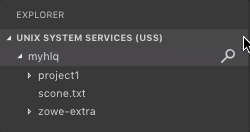

# Working with USS files

## Viewing Unix System Services (USS) files

1. Expand **UNIX SYSTEM SERVICES (USS)** in the **Side Bar**.
2. Hover over the profile you want to search and click the **Search** icon.
3. In the **Quick Pick** field, enter or select the path that you want as the root of your displayed tree and press `Enter`.
   
   All child files and directories of that path display in the **Side Bar**.

   :::note
  
   You cannot expand directories or files to which you are not authorized.

   :::

   

## Dragging and dropping USS files

To select one or more files or folders in the tree and drag them to a folder or session to relocate them:

1. Expand **UNIX SYSTEM SERVICES (USS)** in the **Side Bar**.
2. Select the files or folders you want to move.
   - Select multiple items by pressing the `Ctrl` key as you select each item.
   - Select a continuous range of items by selecting the first item in the range. Then hold down the `Shift` key until selecting the last item in the range.
3. Click and hold the region containing the selected items to start the drag process.
4. As the items are selected, move your cursor to the desired folder or session. Release the mouse button to start the move operation.
   - If the move operation might overwrite one or more files, an “overwrite confirmation" message displays. Select **Confirm** to relocate these items. Select **Cancel** to stop the move operation.
5. When items are moved, the tree view refreshes and the moved items appear in the destination folder.

   

## Refreshing the list of files

1. Hover over **UNIX SYSTEM SERVICES (USS)** in the **Side Bar**.
2. Click the **Refresh All** button.

   

## Renaming USS files

1. Expand **UNIX SYSTEM SERVICES (USS)** in the **Side Bar**.

2. Select a USS file you want to rename.
3. Right-click the USS file and select the **Rename USS file** option.
4. In the **input box**, change the name of the USS file and press `Enter`.

## Downloading, editing, and uploading existing USS files

1. Expand **UNIX SYSTEM SERVICES (USS)** in the **Side Bar**.
2. Navigate to the file you want to download and click on the file name.

   This displays the file in an **Editor** tab.

   :::note

   If you define file associations with syntax coloring, the suffix of your file is marked up.

   :::

3. Edit the document.
4. Press `Ctrl`+`S` or `Command`+`S` to save the changes and upload the USS file to the mainframe.

   

## Creating and deleting USS files and directories

### Creating a directory

1. Expand **UNIX SYSTEM SERVICES (USS)** in the **Side Bar**.

2. Right-click the directory where you want to add the new directory.
3. Select the **Create Directory** option and enter the directory name in the **input box**.
4. Press `Enter` to create the directory.

### Creating a file

1. Expand **UNIX SYSTEM SERVICES (USS)** in the **Side Bar**.

2. Right-click the directory to which you want to add the new file.
3. Select the **Create File** option and enter the file name in the **input box**.
4. Press `Enter` to create the file.

### Deleting a file

1. Expand **UNIX SYSTEM SERVICES (USS)** in the **Side Bar**.

2. Right-click the file you want to remove.
3. Select the **Delete** option and click **Delete** again to confirm and delete the file.

### Deleting a directory

1. Expand **UNIX SYSTEM SERVICES (USS)** in the **Side Bar**.
2. Right-click the directory you want to remove.
3. Select the **Delete** button and click **Delete** again to confirm and delete the directory and all its child files and directories.

   

## Viewing and accessing multiple USS profiles simultaneously

1. Expand **UNIX SYSTEM SERVICES (USS)** in the **Side Bar**, and click the **+** icon.
2. Select or enter a profile in the **Quick Pick** menu to add it to the **Side Bar**.

   