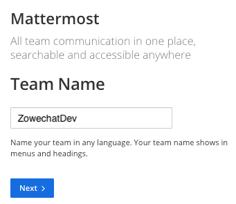
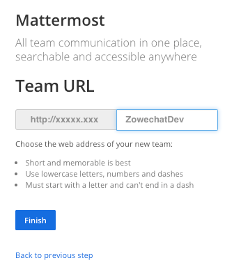
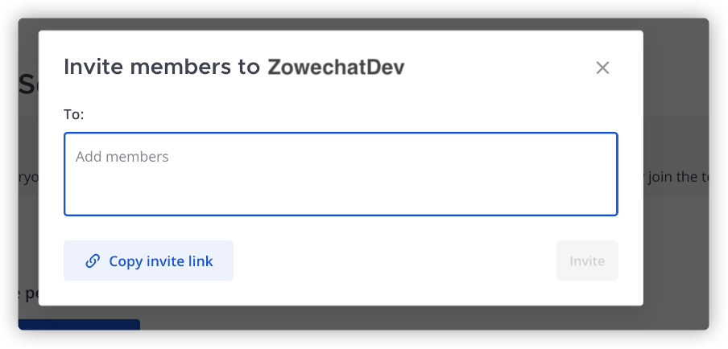

# Creating administrator account and Mattermost team

After you start the Mattermost container, you can create an administrator account and a team in Mattermost, and invite your colleagues to join the team.

1.  Open `http://YOUR\_MATTERMOST\_SERVER:8065/` in your browser.

2.  Create an administrator account.

    1.  Specify your email address, username, and password.

        

    2.  Click **Create Account**, and your administrator account is created.

3.  Create a team.

    1.  Click **Create a new team**.

        

    2.  Specify your **Team name**, for example, BnzDev. Click **Next**.

        

    3.  Specify your **Team URL**, for example, bnzdev. Click **Finish**.

        

        :::note
        
        Remember your Team URL, it will be used when you configure Mattermost.

        :::

4.  Invite people to your team.

    1.  In the chat window, click the Main Menu icon, then click **Invite People**.

        

    2.  If your team member does not have an account yet, click **Copy invite link** and send the invitation link to them so that they can join by themselves. If your team members have their accounts, you can specify their account information in the **Invite members to BnzDev** field, select their accounts, and click **Invite** to add them to the team.

        

5.  Optional: If you want to enable TLS on Mattermost Server, you can refer to [Configuring TLS on Mattermost Server](https://docs.mattermost.com/install/config-tls-mattermost.html) for specific steps.

Now you have your administrator account and team chat group. You can invite other people to join.
