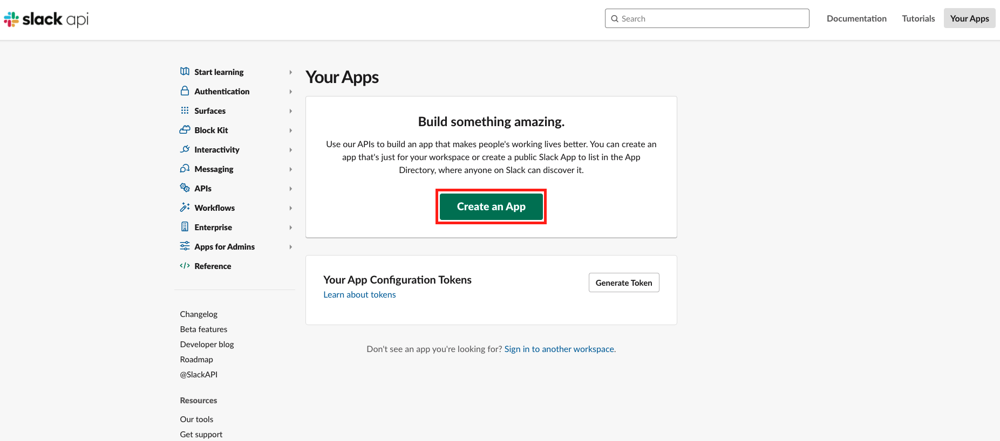
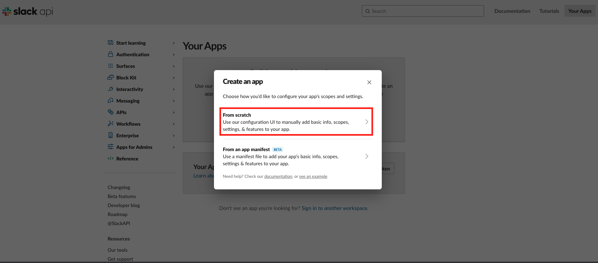

# Creating a new Slack App

To create a bot app for Slack, you need to use the Slack app dashboard to create a new app and specify app details.

1. Open Slack app dashboard at [Slack API](https://www.ibm.com/links?url=https%3A%2F%2Fapi.slack.com%2Fapps).

2. Click **Create App** button.
   
    
3. Choose **From scratch**.
   
   

4. In the prompted dialog, specify values for the following fields:
    
    - **App Name**: input your App name, for example, Zowe Chat.
    - **Development Slack Workspace**: input any one of your Slack Workspace.

    :::tip
    
    You can change the App name at any time.

    :::

    :::note
    
    Your workspace may require apps to be approved by admins. You will need to request approval to install it to the workspace or sign into a different workspace.

    ::: 

5. Click the **Create App** button.

Your Slack App is successfully created.