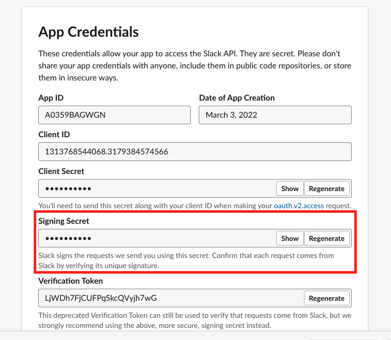
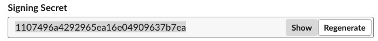

# Installing the Slack App

You must install the Slack App to your workspace before you can talk with your chat bot in Slack client.

1.  Install the Slack App.

    1. Request to install the App.

        1. In the left sidebar, click **Settings** > **Install App**.
        2. Click **Request to Install** and you will be prompted with a dialog asking you to add an optional note to the administrator to request an approval. You can add an optional note to the administrator and then wait for the administrator of your workspace to approve. You will receive an email notice as well as a notice from the Slackbot of your Workspace when the approval is done.

          :::note
          After you receive a notice, you can refresh your web page. Now you can install your app to your workspace.
          :::

    2.  Install the App to Workspace.

        1. Open Slack app dashboard at [Slack API](https://api.slack.com/apps) when you get the approval.
        2. Click the App name that you created.
        3. In the left sidebar, click **Settings** > **Install APP**.
        4. Click **Install to Workspace** button and you will be switch to a new page.
        5. Click **Allow** button.
    
    Your Slack App is installed.

2.  Get the bot user OAuth token.

    1. In the left sidebar, click **Settings** > **Install App**.

    2. Find the **Bot User OAuth Token** and click **Copy**.

    Save this token. You will need it to configure your Slack in later steps. <!--See [Configuring the chat tool-Slack](configuring_the_chat_tool_slack.md) for details.-->

3.  Get the signing secret.

    1. In the left sidebar, click **Settings** \> **Basic information**.

    2. Find the **Signing Secret** in **App Credentials** section and click **show**.

        

    3.  Copy this signing secret.

        

    Save this signing secret. You will need it to configure your Slack in later steps. <!--See [Configuring the chat tool-Slack](configuring_the_chat_tool_slack.md) for details.-->

