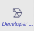
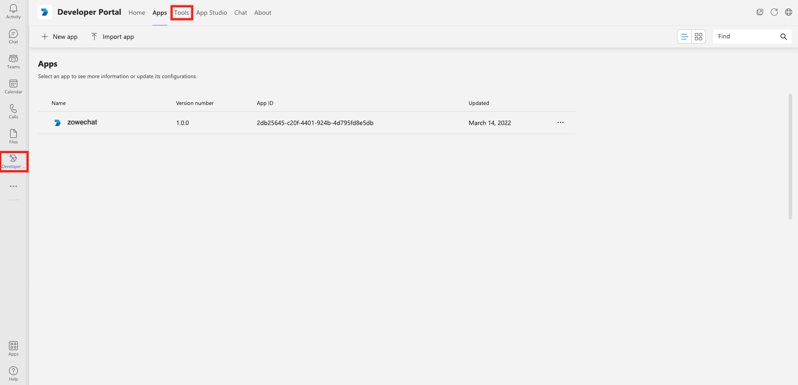
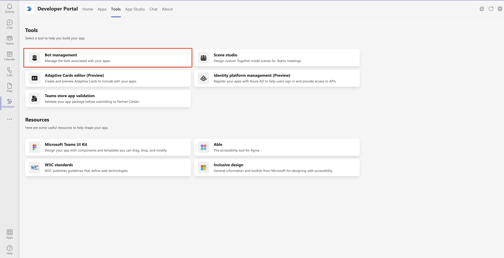
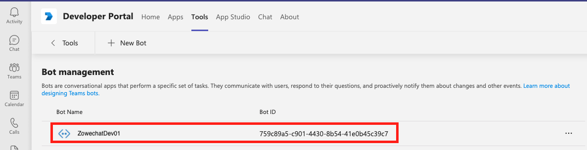
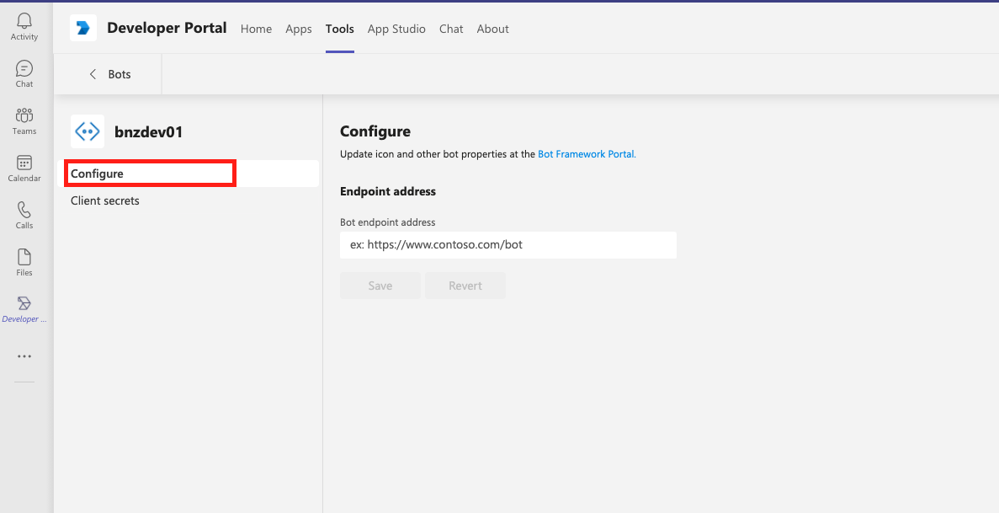

# Configuring messaging endpoint for the Microsoft Bot Framework bot

If you create your bot with Microsoft™ Bot Framework, you need to specify the bot endpoint address in Developer Portal to configure the messaging endpoint.

1.  Launch and log in your Microsoft Teams client.

2.  Click the **Developer Portal** icon  and select **Tools**.

    

3.  Click the **Bot management**. Choose the bot that you created and start editing your bot app.

    

    

4.  Click **Configure** to configure the messaging endpoint.

    

5.  Specify the **Bot endpoint address** input box under **Endpoint address** with the Zowe Chat web hook URL if it is publicly accessible. Otherwise, you must fill in with your public proxy URL that transmits network payload to Zowe Chat web hook URL.

Your messaging endpoint for Microsoft Bot Framework bot is successfully configured.
